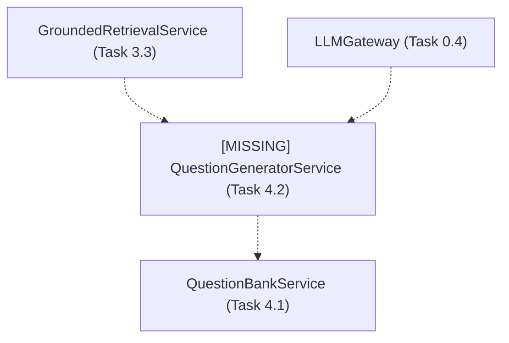
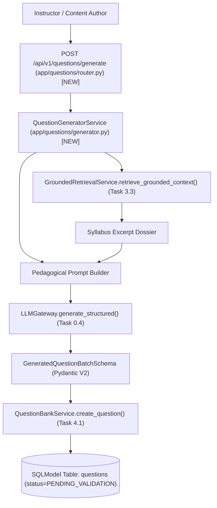
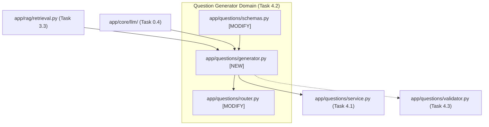

# Task 4.2: LLM Question & Distractor Generator with Pydantic Validation — Codebase Design (Stage 2)

## 1. Current State Snapshot

Prior to Task 4.2:
- `backend/app/questions/models.py`, `schemas.py`, and `service.py` (Task 4.1) provide relational storage for questions, choices, distractor rationales, and analytical rubrics.
- `backend/app/rag/retrieval.py` (Task 3.3) provides grounded context retrieval.
- `backend/app/core/llm/` (Task 0.4, ADR-006) provides the multi-provider LLM gateway and structured JSON validator.
- There is currently no orchestration service to synthesize RAG context, prompt the LLM, validate structured question outputs, and deposit them into the question bank.

### Before Architecture Diagram

---

## 2. Proposed State

Task 4.2 introduces the automated question generation engine in the FastAPI backend:
1. `backend/app/questions/generator.py`: `QuestionGeneratorService` orchestrating grounded retrieval, prompt construction with Bloom's Taxonomy directives, structured LLM generation, and atomic persistence.
2. `backend/app/questions/schemas.py`: Pydantic V2 schemas for `QuestionGenerateRequest`, `GeneratedQuestionSchema`, and `GeneratedQuestionBatchResponse`.
3. `backend/app/questions/router.py`: `POST /api/v1/questions/generate` endpoint protected by `require_role([UserRole.INSTRUCTOR, UserRole.ADMIN])`.

### After Architecture Diagram

---

## 3. File-Level Impact Analysis

### [NEW] `backend/app/questions/generator.py`
- **Purpose:** Question generation orchestration service.
- **Exports:**
  - `QuestionGeneratorService`:
    - `generate_questions(session: AsyncSession, request: QuestionGenerateRequest, author_id: Optional[str] = None) -> GeneratedQuestionBatchResponse`
    - `_build_prompt(topic_id, question_type, difficulty, bloom_level, count, grounded_context) -> Tuple[str, str]`

### [MODIFY] `backend/app/questions/schemas.py`
- **What changes:** Add schemas:
  - `GeneratedOptionSchema`: Choice representation with `distractor_rationale`.
  - `GeneratedRubricSchema`: Scoring criterion with points.
  - `GeneratedQuestionSchema`: Prompt, explanation, hint, options, rubric items.
  - `GeneratedQuestionBatchSchema`: Batch container with `questions: List[GeneratedQuestionSchema]`.
  - `QuestionGenerateRequest`: Request schema (`exam_template_id`, `topic_id`, `question_type`, `difficulty`, `bloom_level`, `count`, `custom_prompt_guidance`).
  - `GeneratedQuestionBatchResponse`: Response schema (`generated_count`, `questions: List[QuestionDetailResponse]`, `grounded_sources_used: int`).

### [MODIFY] `backend/app/questions/router.py`
- **What changes:** Add endpoint:
  - `POST /api/v1/questions/generate`: Dynamic question generation endpoint (Instructor/Admin only).

### [MODIFY] `backend/app/questions/__init__.py`
- **What changes:** Export `QuestionGeneratorService`, `QuestionGenerateRequest`, and `GeneratedQuestionBatchResponse`.

### [NEW] `backend/tests/test_question_generator.py`
- **Purpose:** Comprehensive test suite for question generation pipeline, RAG grounding, prompt assembly, structured output validation, distractor rationales, and database staging.

---

## 4. Dependency Graph / Blast Radius

---

## 5. Regression Risk Matrix

| Risk ID | Risk Description | Severity | Affected Area | Mitigation Strategy |
|:---|:---|:---:|:---|:---|
| **R-01** | LLM outputs invalid JSON or missing options | 🟡 Medium | Schema Validation | Use `LLMGateway.generate_structured()` with Pydantic V2 repair and retry logic. |
| **R-02** | Unvalidated AI questions exposed to students | 🔴 High | Pedagogical Quality (Constraint #4) | Hardcode `validation_status = ValidationStatus.PENDING_VALIDATION` on all generated items. |
| **R-03** | RAG retrieval failure when topic has no documents | 🟢 Low | Generation Grounding | Gracefully fall back to generating from topic titles and curriculum metadata if no source chunks exist. |

---

## 6. Contract Stability Check

| Contract / Endpoint | Status | Request Body | Response Shape | Breaking? |
|:---|:---:|:---:|:---|:---:|
| `POST /api/v1/questions/generate` | **NEW** | `QuestionGenerateRequest` | `GeneratedQuestionBatchResponse` | No |
| Existing `/api/v1/questions/*` | Preserved | Preserved | Preserved | No |

---

## 7. Rollback Plan

### If Changes Are Uncommitted
1. `git restore backend/app/questions/schemas.py backend/app/questions/router.py backend/app/questions/__init__.py`
2. `Remove-Item -Force backend/app/questions/generator.py backend/tests/test_question_generator.py`

### If Changes Are Committed
1. `git revert HEAD`
2. `py -3.14 -m pytest backend/tests/`

---

## Workflow Checklist
- [x] Current-state snapshot documented.
- [x] Proposed-state description and After architecture diagram included.
- [x] Every affected file listed with impact analysis.
- [x] Blast-radius graph included.
- [x] Regression risks scored as 🔴 / 🟡 / 🟢.
- [x] Contract stability checked.
- [x] Rollback plan provided.
- [x] No code written.
