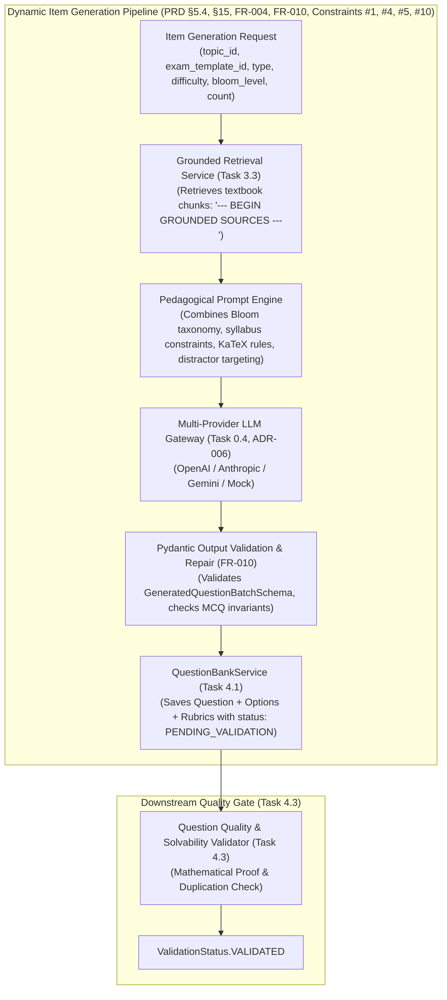
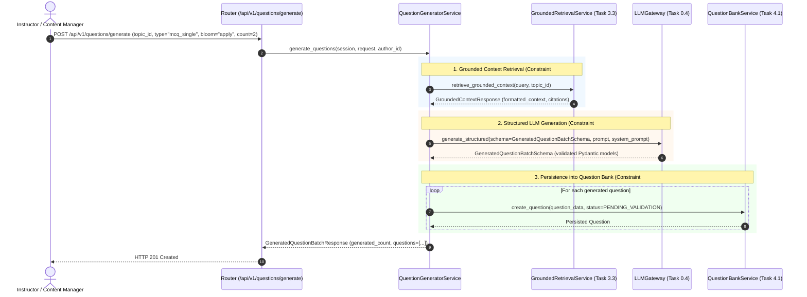

# Task 4.2: LLM Question & Distractor Generator with Pydantic Validation — Conceptual Understanding (Stage 1)

## 1. Visual Architecture

---

## 2. The Physical Analogy

The LLM Question & Distractor Generator is like a **Senior Standardized Item Writer working with an Open Textbook**:
> When a senior exam author writes a new problem for the Cambridge Physics exam, they never sit in a sensory deprivation chamber inventing physics equations (*Unassisted LLM generation*). First, they pull the official curriculum textbook and open it to the exact chapter on Circular Motion (*Grounded Context Retrieval*). Next, they review their pedagogical brief: *"Create a Level-3 Application question on banked curves where the student must calculate the minimum friction coefficient"* (*Bloom Taxonomy & Difficulty Spec*). They deliberately write 3 realistic wrong answers based on common student algebra errors (*Distractor Rationales*). Before submitting the draft to the exam bank, a strict psychometrics clerk checks that there is exactly one correct answer and that all formulas are rendered in standard LaTeX notation (*Pydantic Schema Validation*). The problem is deposited into the review vault stamped `PENDING_VALIDATION` (*Constraint #4*).

---

## 3. Why & What

### Why Are We Doing This Task?
Creating hundreds of high-quality STEM questions across various topics and difficulty levels manually is extremely time-consuming and expensive. PRD §5.4, §15, and FR-004 specify an automated **Question & Distractor Generator** capable of dynamically producing diverse, pedagogically sound questions.
Key Product Constraints:
- **Constraint #1:** *"LLM output must not directly become official learning state."*
- **Constraint #4:** *"Generated questions must be validated before student use."*
- **Constraint #5:** *"Source-grounded answers must use retrieval before generation."*
- **Constraint #10:** *"Provider-specific logic must not be embedded in core learning logic."*

### What Is the Concept?
1. **Retrieval-Augmented Item Synthesis:** Before prompting the LLM, the generator queries `GroundedRetrievalService` (Task 3.3) for the relevant topic's syllabus excerpts, ensuring generated questions reflect real textbook concepts.
2. **Pedagogical Distractor Engineering:** Prompts require the LLM to provide a specific `distractor_rationale` for each incorrect option, explaining the exact conceptual flaw or mathematical error (linking to Epic 5 Error Bank).
3. **Structured Pydantic Enforcement (FR-010):** Output is guaranteed to conform to `GeneratedQuestionBatchSchema` via the LLM Gateway's structured output validator.
4. **Safety Staging (Constraint #4):** All generated questions are inserted with `validation_status = ValidationStatus.PENDING_VALIDATION` and `is_generated_by_ai = True`.

### What Breaks If We Skip It?
1. **Hallucinated Physics/Math:** Un-grounded LLM questions invent non-existent physics formulas or unsolvable geometry.
2. **Generic, Uninformative Wrong Answers:** Distractors lack diagnostic rationales, rendering the Error Bank useless.
3. **Schema Corruption:** Raw LLM outputs with missing keys or invalid markdown fences crash downstream parsers.

---

## 4. Abstraction Level Map

| Level | What Lives Here | Current Project Implementation |
|:---|:---|:---|
| **Product / UX** | "Generate Questions" button in Question Lab UI | Frontend Question Lab |
| **Application** | Pipeline orchestration (Retrieval $\to$ Prompt $\to$ LLM $\to$ Pydantic $\to$ DB) | `QuestionGeneratorService` (`backend/app/questions/generator.py`) |
| **Gateway / LLM** | Provider routing, structured JSON parsing, retry/fallback | `LLMGateway` (`backend/app/core/llm/`) |
| **Domain** | Relational question models, validation states | `backend/app/questions/models.py` |
| **RAG / Vector** | Topic-filtered syllabus excerpts | `backend/app/rag/retrieval.py` |

---

## 5. Mermaid Sequence Diagram

---

## 6. Data Flow Trace-Through

1. **Generation Trigger:** An instructor requests 2 single-choice MCQs on "Work-Energy Theorem" at the `APPLY` Bloom level for exam template `physics_9702`.
2. **Syllabus Retrieval:** `GroundedRetrievalService` retrieves the top 3 textbook chunks for "Work-Energy Theorem", yielding formatted Markdown context.
3. **Prompt Composition:** The system prompt instructs the LLM:
   - Use only concepts from the grounded context.
   - Format equations in standard KaTeX delimiters (`$...$` and `$$...$$`).
   - For each incorrect option, provide a detailed `distractor_rationale`.
   - Provide a step-by-step derivation in `explanation`.
4. **LLM Gateway Call:** `LLMGateway.generate_structured()` prompts the active provider (e.g. Gemini 1.5 Pro, Claude 3.5 Sonnet, or Mock Provider).
5. **Schema Validation:** The LLM output is parsed against `GeneratedQuestionBatchSchema`. If any option invariant is violated, validation fails cleanly.
6. **Database Persistence:** Validated items are saved with `validation_status = PENDING_VALIDATION` and `is_generated_by_ai = True`.

---

## 7. Cognitive Model → Code Mapping

| Cognitive Concept | Mental Model | Code Implementation in This Project | Enforcement / Guardrail |
|:---|:---|:---|:---|
| **Syllabus Grounding** | "Teach what is in the curriculum" | `GroundedRetrievalService.retrieve_grounded_context()` | Enforces Constraint #5 |
| **Diagnostic Distractors** | "Target specific student misconceptions" | `GeneratedOptionSchema.distractor_rationale` | Feeds Error Bank (Epic 5) |
| **Structured Output** | "Strict typed JSON, zero freeform drift" | `LLMGateway.generate_structured()` | Enforces FR-010 |
| **Validation Staging** | "Quarantine before student exposure" | `ValidationStatus.PENDING_VALIDATION` | Enforces Constraint #4 |

---

## 8. Five Alternative Approaches Compared

| # | Approach | Pros | Cons | Why Option 1 Was Chosen |
|:---|:---|:---|:---|:---|
| **1** | **RAG-Grounded Structured Pipeline with Pydantic Invariants (Chosen)** | Zero hallucination, KaTeX preservation, diagnostic distractor rationales, staged validation | Requires multi-service orchestration | Fulfills PRD §5.4, §15, FR-004, FR-010, Constraints #1, #4, #5, #10 |
| **2** | Direct Freeform LLM Text Prompting | Trivial implementation | Output parsing fails on Markdown fences, no type safety | Disqualified: Fragile and error-prone |
| **3** | Un-grounded Direct LLM Generation | Simpler prompt | Hallucinates physics constants, invents non-syllabus topics | Disqualified: Violates Constraint #5 |
| **4** | Immediate Auto-Publishing to Students | Zero human review | Dangerous if LLM generates unsolvable questions | Disqualified: Violates Constraint #4 |
| **5** | Vendor-Locked Provider SDK Calls (`openai.chat.completions`) | Fast prototyping | Hardcodes vendor dependencies in learning logic | Disqualified: Violates Constraint #10 |

---

## 9. Production Rationale & Disaster Scenarios

### Disaster 1: The Broken LaTeX Formula Disaster
> An LLM outputs unescaped LaTeX like `\frac{a}{b}` inside JSON strings without proper string escaping, causing JSON deserialization errors. `LLMGateway` and Pydantic V2 schema sanitizers sanitize and repair JSON escape sequences before instantiation.

### Disaster 2: The Ambiguous Answer Disaster
> An LLM produces a question asking "Which of the following is a unit of energy?" and includes both `Joule` and `Electron-volt` as options without specifying units. The Pydantic validator checks MCQ invariants and downstream Task 4.3 validates solvability before the question can ever reach a student.

---

## Workflow Checklist
- [x] Item generation architecture diagram included.
- [x] Standardized item authoring physical analogy included.
- [x] Why/what/what-breaks explained thoroughly.
- [x] Abstraction level table filled with current project stack.
- [x] Sequence diagram for dynamic item generation included.
- [x] Data-flow trace-through completed step-by-step.
- [x] Cognitive model to code mapping table completed.
- [x] 5 alternatives compared.
- [x] 2 concrete disaster scenarios described.
