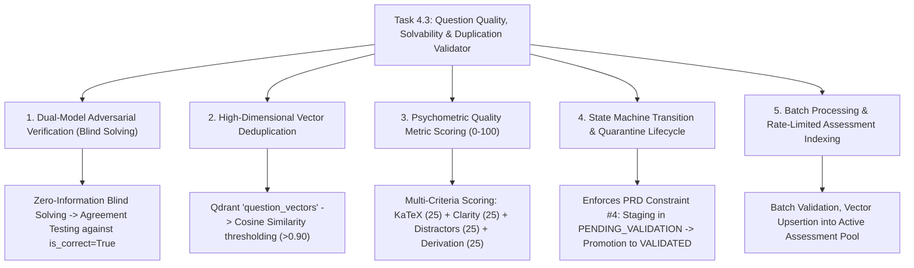

# Task 4.3: Question Quality, Solvability & Duplication Validator — CS Domain Learning (Stage 3)

## 1. Domain Discovery Map

Task 4.3 touches five core Computer Science, AI Engineering, and Psychometric Verification domains:



---

## 2. Domain Deep Dives

### Domain 1: Dual-Model Adversarial Verification (Blind Solving)

**What Is It (Plain English):**  
When an AI generates both the question and the answer at the same time, it can make a mathematical mistake in the prompt and replicate that exact same mistake in its answer key (self-reinforcing hallucination).  
**Blind Verification** breaks this cycle: We take ONLY the question prompt (with zero knowledge of the declared answer key or options) and feed it to a second LLM reasoning pass. The solver must independently derive the solution from first principles. If the solver's derived answer matches the author's declared correct option, we have high mathematical confidence. If it differs, the question is flagged or rejected.

**Physical Analogy:**  
A double-blind laboratory assay: To verify whether a water sample is contaminated, a secondary independent lab receives a blind, unmarked vial. Only if both independent labs arrive at the exact same conclusion is the water certified safe for drinking.

---

### Domain 2: High-Dimensional Vector Deduplication

**What Is It (Plain English):**  
In large-scale question banks, generating hundreds of items across similar topics can produce near-duplicate questions (e.g. asking the exact same question with trivial word substitutions).  
By projecting question prompts into a 768-dimensional semantic embedding space and performing a $k$-NN cosine similarity search against previously validated questions, we detect near-duplicates where:
$$\text{Cosine Similarity}(\vec{u}, \vec{v}) = \frac{\vec{u} \cdot \vec{v}}{\|\vec{u}\| \|\vec{v}\|} > 0.90$$
Items exceeding $0.90$ are flagged as near-duplicates to prevent question bank redundancy.

---

### Domain 3: Psychometric Quality Metric Scoring (0-100)

**What Is It (Plain English):**  
An automated multi-criteria rubric that inspects four orthogonal dimensions of test item quality:
1. **Mathematical & KaTeX Integrity (0-25):** Ensures equations are well-formed, variables are defined, and delimiters match.
2. **Pedagogical Clarity & Bloom Alignment (0-25):** Ensures unambiguous language targeting the stated cognitive level.
3. **Distractor Diagnostic Depth (0-25):** Verifies that incorrect choices have plausible, misconception-targeting rationales.
4. **Step-by-Step Derivation Completeness (0-25):** Ensures full pedagogical explanations for post-exam review.
Composite Score $\ge 80/100$ is required for automatic promotion to `VALIDATED`.

---

### Domain 4: State Machine Transition & Quarantine Lifecycle

**What Is It (Plain English):**  
In accordance with **PRD Non-Negotiable Constraint #4**, AI-generated content is never trusted by default. Questions remain in `PENDING_VALIDATION` (quarantine) until verified by the validator. Only items in `VALIDATED` state are admitted into student exam pools (Epic 7).

---

## 3. Cross-Domain Connections

| Concept A | Concept B | Architectural Connection |
|:---|:---|:---|
| **`question_vectors`** | **Vector Store (Task 3.2)** | Stores validated question embeddings for adaptive retrieval and deduplication. |
| **`ValidationStatus.VALIDATED`** | **Adaptive Testing Engine (Epic 7)** | Student test generation queries filter exclusively on `validation_status == VALIDATED`. |
| **Blind Solver** | **Multi-Provider LLM Gateway (Task 0.4)** | Utilizes Reasoning tier LLM models for rigorous proof verification. |
| **Distractor Quality Audit** | **Error Bank (Epic 5)** | Ensures distractor rationales contain actionable cognitive feedback before entering the bank. |

---

## 4. Concept Evolution Timeline

```markdown
| Level | What You Might Think | Deeper Reality |
|:---|:---|:---|
| **Beginner** | "If the LLM generated it, the answer must be right." | LLMs have 10-15% arithmetic error rates in complex multi-step physics. |
| **Intermediate** | "Ask the LLM 'is this question correct?'" | Same LLM confirms its own hallucinations due to confirmation bias. |
| **Advanced** | "Use a separate blind solver prompt." | Catches mathematical errors, but misses duplicate questions and broken KaTeX formatting. |
| **Expert** | "Multi-gate pipeline: Blind independent solve + 768-dim vector deduplication + 4-axis pedagogical quality audit + finite state quarantine." | Production-grade automated psychometric quality assurance engine. |
```

---

## 5. Vocabulary Reference

| Term | Definition | Codebase Example |
|:---|:---|:---|
| **Blind Solver** | Solving an item without access to the declared answer key. | `QuestionValidationService._run_blind_solver()` |
| **Semantic Deduplication** | Detecting paraphrased duplicates via vector similarity. | `_check_duplicates()` |
| **Quality Audit** | Multi-axis scoring of clarity, math, distractors, and derivation. | `_audit_pedagogical_quality()` |
| **Quarantine Promotion** | Transitioning an item from `PENDING_VALIDATION` to `VALIDATED`. | `ValidationStatus.VALIDATED` |

---

## 6. "What If" Thought Experiments

### Q1: What if the blind solver is unable to solve a question because the question is mathematically incomplete?
> **Answer:** The solver emits `is_solvable=False` and a critique explaining the missing parameter. The validator automatically sets `validation_status = ValidationStatus.REJECTED` and records the critique.

### Q2: What if two different exam templates contain the same fundamental physics question?
> **Answer:** The vector deduplication check scopes its search within the same exam template and topic, allowing legitimate shared fundamentals across different curricula if desired.

### Q3: What happens if an item gets a quality score of 72 (between 60 and 79)?
> **Answer:** It is marked as `ValidationStatus.FLAGGED` for instructor review rather than rejected, allowing minor phrasing edits by an educator.

### Q4: How are validated questions made searchable for adaptive test assembly?
> **Answer:** Upon reaching `VALIDATED` status, `QuestionValidationService` automatically indexes the question prompt into the `question_vectors` Qdrant collection.

---

## Workflow Checklist
- [x] Multi-gate validation architecture diagram included.
- [x] Blind peer-review physical analogy included.
- [x] Deep dives for 5 key CS/AI domains with formulas, analogies, code links, misconceptions, and numbers.
- [x] Cross-domain connection matrix filled.
- [x] Concept evolution timeline documented.
- [x] Vocabulary reference table created.
- [x] 4 comprehensive "What If" scenarios analyzed.
