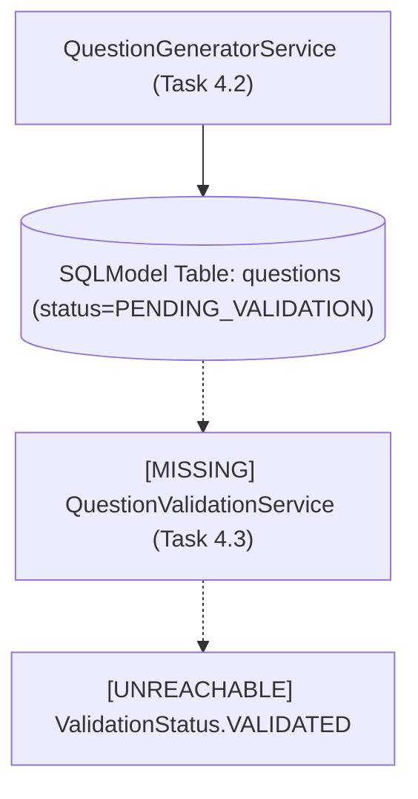
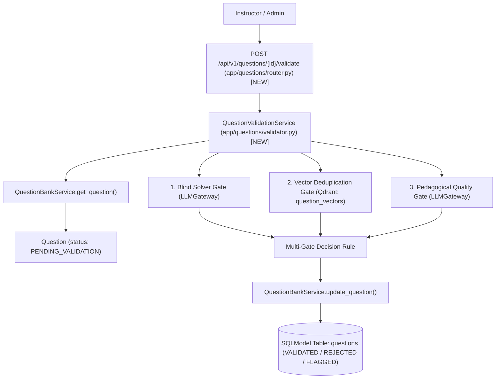
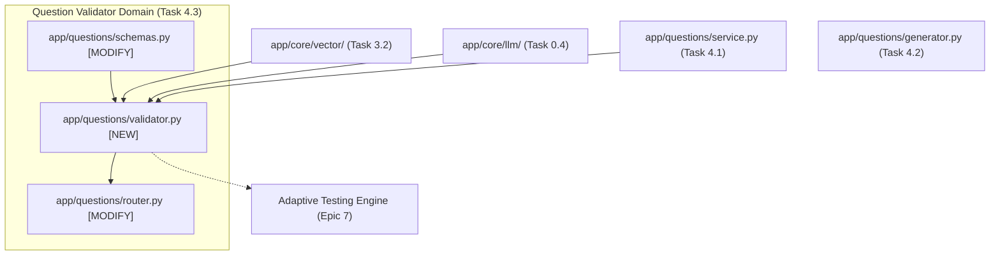

# Task 4.3: Question Quality, Solvability & Duplication Validator — Codebase Design (Stage 2)

## 1. Current State Snapshot

Prior to Task 4.3:
- `backend/app/questions/models.py`, `schemas.py`, and `service.py` (Task 4.1) store question items with `ValidationStatus` (`DRAFT`, `PENDING_VALIDATION`, `VALIDATED`, `REJECTED`, `FLAGGED`).
- `backend/app/questions/generator.py` (Task 4.2) automatically stages all AI-generated questions in `PENDING_VALIDATION`.
- There is currently no automated validator service to execute blind solving, semantic deduplication, and quality scoring to safely promote questions to `VALIDATED`.

### Before Architecture Diagram

---

## 2. Proposed State

Task 4.3 introduces the automated multi-gate question validation engine in the FastAPI backend:
1. `backend/app/questions/validator.py`: `QuestionValidationService` implementing blind LLM solving, vector deduplication against `question_vectors`, quality rubric evaluation, and atomic state transitions.
2. `backend/app/questions/schemas.py`: Validation schemas (`BlindSolveSchema`, `QualityAuditSchema`, `QuestionValidationReportResponse`, `BatchValidationResponse`).
3. `backend/app/questions/router.py`: Endpoints for single item validation (`POST /api/v1/questions/{id}/validate`) and batch validation (`POST /api/v1/questions/batch-validate`).

### After Architecture Diagram

---

## 3. File-Level Impact Analysis

### [NEW] `backend/app/questions/validator.py`
- **Purpose:** Question quality, solvability, and deduplication validation service.
- **Exports:**
  - `QuestionValidationService`:
    - `validate_question(session, question_id) -> QuestionValidationReportResponse`
    - `batch_validate(session, topic_id=None, exam_template_id=None, limit=20) -> BatchValidationResponse`
    - `_run_blind_solver(question) -> Tuple[bool, str, Optional[str]]`
    - `_check_duplicates(question) -> Tuple[bool, float, Optional[str]]`
    - `_audit_pedagogical_quality(question) -> Tuple[int, Dict[str, Any], str]`

### [MODIFY] `backend/app/questions/schemas.py`
- **What changes:** Add schemas:
  - `BlindSolveSchema`: Structured output schema for blind solving.
  - `QualityAuditSchema`: Structured output schema for pedagogical rubric audit.
  - `QuestionValidationReportResponse`: Comprehensive audit report with scores, duplicate similarity, solver verdict, and new `validation_status`.
  - `BatchValidationRequest`: Request body for batch validation.
  - `BatchValidationResponse`: Summary of processed items, validated count, rejected count, and flagged count.

### [MODIFY] `backend/app/questions/router.py`
- **What changes:** Add endpoints:
  - `POST /api/v1/questions/{id}/validate`: Run audit on single question item.
  - `POST /api/v1/questions/batch-validate`: Run batch audit on questions in `PENDING_VALIDATION`.

### [MODIFY] `backend/app/questions/__init__.py`
- **What changes:** Export `QuestionValidationService` and validation schemas.

### [NEW] `backend/tests/test_question_validator.py`
- **Purpose:** Comprehensive test suite for blind solving, mathematical error rejection, duplicate detection, quality score grading, and status transitions.

---

## 4. Dependency Graph / Blast Radius

---

## 5. Regression Risk Matrix

| Risk ID | Risk Description | Severity | Affected Area | Mitigation Strategy |
|:---|:---|:---:|:---|:---|
| **R-01** | Blind solver fails on open-response question formats | 🟡 Medium | Solvability Checking | Restrict blind solving comparison to MCQs; for free-response/derivation, audit rubric completeness and algebraic consistency. |
| **R-02** | Deduplication index not initialized | 🟢 Low | Vector Lookup | Ensure `question_vectors` collection is created on first lookup if not already present. |
| **R-03** | False positive rejection due to solver hallucination | 🟡 Medium | Question Bank Throughput | Set status to `FLAGGED` if solver is uncertain rather than outright `REJECTED`, allowing instructor review. |

---

## 6. Contract Stability Check

| Contract / Endpoint | Status | Request Body | Response Shape | Breaking? |
|:---|:---:|:---:|:---|:---:|
| `POST /api/v1/questions/{id}/validate` | **NEW** | None | `QuestionValidationReportResponse` | No |
| `POST /api/v1/questions/batch-validate` | **NEW** | `BatchValidationRequest` | `BatchValidationResponse` | No |
| Existing `/api/v1/questions/*` | Preserved | Preserved | Preserved | No |

---

## 7. Rollback Plan

### If Changes Are Uncommitted
1. `git restore backend/app/questions/schemas.py backend/app/questions/router.py backend/app/questions/__init__.py`
2. `Remove-Item -Force backend/app/questions/validator.py backend/tests/test_question_validator.py`

### If Changes Are Committed
1. `git revert HEAD`
2. `py -3.14 -m pytest backend/tests/`

---

## Workflow Checklist
- [x] Current-state snapshot documented.
- [x] Proposed-state description and After architecture diagram included.
- [x] Every affected file listed with impact analysis.
- [x] Blast-radius graph included.
- [x] Regression risks scored as 🔴 / 🟡 / 🟢.
- [x] Contract stability checked.
- [x] Rollback plan provided.
- [x] No code written.
