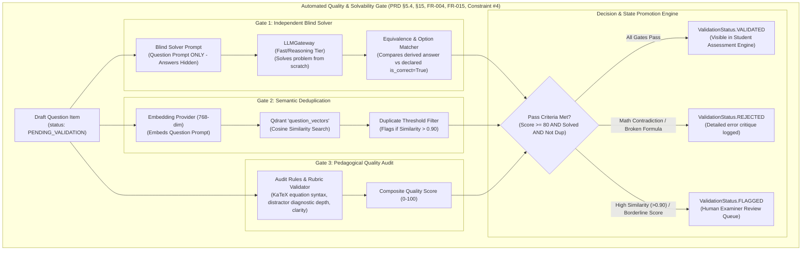
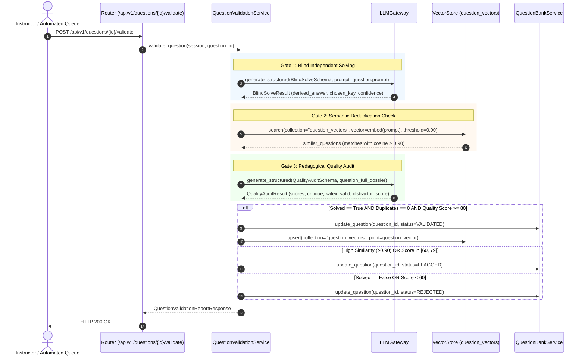

# Task 4.3: Question Quality, Solvability & Duplication Validator — Conceptual Understanding (Stage 1)

## 1. Visual Architecture

---

## 2. The Physical Analogy

The Question Validator is like a **Blind Peer-Review Committee at the Cambridge Examination Board**:
> When a drafted problem arrives from a question author, it is NEVER sent straight to the printing press (*Direct student deployment*). Instead, the committee strips off the author's answer key and hands the problem to a blind referee (*The Independent Solver Agent*). The referee must solve the problem step-by-step. If the referee's derived answer disagrees with the author's key, the problem is immediately shredded (*REJECTED*). Next, a registry clerk scans the archive of past 20 years of exam papers to ensure the exact same question wasn't already published last year (*Semantic Deduplication*). Finally, an editorial proofreader verifies that all diagrams and formulas are crystal clear (*Pedagogical Quality Audit*). Only questions that pass all three tests receive the official seal: `VALIDATED` (*Constraint #4*).

---

## 3. Why & What

### Why Are We Doing This Task?
PRD Non-Negotiable Constraint #4 states:  
> **"Generated questions must be validated before student use."** (PRD §5.4, §15, FR-004, FR-015).

If an AI-generated question contains an arithmetic mistake, an ambiguous distractor, or invalid LaTeX, exposing it to a student in an adaptive test will:
1. Penalize the student unfairly.
2. Corrupt their mastery state and IRT difficulty calibration (Epic 5).
3. Erode trust in the entire AI learning system.

### What Is the Concept?
1. **Blind Independent Solving:** An LLM solver receives only the problem prompt and generates its own solution. We verify that the solver's independent conclusion agrees with the declared correct option.
2. **Vector Deduplication:** Questions are embedded and compared against already validated items in `question_vectors`. Items with cosine similarity $> 0.90$ are flagged as near-duplicates to prevent question bank redundancy.
3. **Automated Quality Scoring:** Rates the item across 4 sub-scores:
   - Mathematical / KaTeX correctness (0-25)
   - Pedagogical clarity and Bloom depth (0-25)
   - Distractor diagnostic quality (0-25)
   - Explanation completeness (0-25)
4. **State Transition:** Promotes passing questions to `VALIDATED`, rejects flawed ones, and flags duplicates for human review.

---

## 4. Abstraction Level Map

| Level | What Lives Here | Current Project Implementation |
|:---|:---|:---|
| **API** | `/api/v1/questions/{id}/validate` and `/batch-validate` | `backend/app/questions/router.py` |
| **Orchestration** | Multi-gate pipeline (Solver $\to$ Dedup $\to$ Score $\to$ Transition) | `QuestionValidationService` (`backend/app/questions/validator.py`) |
| **Vector Engine** | Question semantic embedding & similarity lookup | `backend/app/core/vector/` (`question_vectors` collection) |
| **LLM Gateway** | Blind independent solving & pedagogical audit | `LLMGateway` (`backend/app/core/llm/`) |
| **Persistence** | Question validation status & audit reports | `backend/app/questions/models.py` |

---

## 5. Mermaid Sequence Diagram

---

## 6. Data Flow Trace-Through

1. **Intake:** A question in `PENDING_VALIDATION` (e.g. from Task 4.2) is targeted for validation.
2. **Blind Solver Execution:** The prompt *"Calculate the time of flight $T$ for $u=20\text{ m/s}, \theta=30^\circ$"* is sent to the LLM without choices. The solver derives $2.04\text{ s}$ and picks option `A`. Matches declared `is_correct=True` $\to$ Gate 1 PASS.
3. **Duplicate Detection:** The prompt is converted into a 768-dim embedding and queried against `question_vectors`. Max similarity found is $0.42 < 0.90$ $\to$ Gate 2 PASS.
4. **Quality Scoring:** Evaluator confirms clean KaTeX delimiters, distinct distractor rationales, and Bloom `APPLY` alignment $\to$ Score $= 92/100$ $\to$ Gate 3 PASS.
5. **State Update:** `validation_status` updated to `VALIDATED`. Vector indexed into `question_vectors` collection for retrieval in adaptive assessments.

---

## 7. Cognitive Model → Code Mapping

| Cognitive Concept | Mental Model | Code Implementation in This Project | Enforcement / Guardrail |
|:---|:---|:---|:---|
| **Blind Verification** | "Can another expert solve this independently?" | `_run_blind_solver()` | Catches impossible questions |
| **Deduplication** | "Is this question too similar to an existing one?" | `_check_duplicates()` | Prevents memorization exploits |
| **Quality Audit** | "Is the math sound and the rationale diagnostic?" | `_audit_pedagogical_quality()` | Evaluates KaTeX and distractors |
| **Status Promotion** | "Only validated items reach students" | `ValidationStatus.VALIDATED` | Enforces Constraint #4 |

---

## 8. Five Alternative Approaches Compared

| # | Approach | Pros | Cons | Why Option 1 Was Chosen |
|:---|:---|:---|:---|:---|
| **1** | **Multi-Gate Architecture (Blind Solve + Vector Dedup + Quality Audit) (Chosen)** | Comprehensive verification, prevents impossible math, stops duplicates, automated | Multi-step LLM & vector coordination | Direct implementation of PRD §5.4, §15, FR-004, FR-015, Constraint #4 |
| **2** | Trust LLM Generator Directly (No Validator) | Zero additional LLM latency | 10-15% of AI questions contain subtle math bugs | Disqualified: Violates Constraint #4 |
| **3** | Exact String Matching Deduplication | Cheap lookup | Misses semantic paraphrasing with different variables | Disqualified: Ineffective for STEM questions |
| **4** | Human-Only Manual Review | High accuracy | Impossible to scale dynamically | Disqualified: Unsuitable for on-demand generation |
| **5** | Regex/Heuristic-Only Validator | Fast | Cannot verify mathematical solvability | Disqualified: Fails to detect calculation errors |

---

## 9. Production Rationale & Disaster Scenarios

### Disaster 1: The Broken Physics Sign Error Disaster
> An LLM generator outputs a question asking for gravitational potential energy with a misplaced negative sign in the answer key. The Blind Solver independently computes the derivation, notes the sign contradiction, scores the item 0 on mathematical consistency, and triggers `ValidationStatus.REJECTED`. The broken question never reaches a student.

### Disaster 2: The Question Flood Duplication Disaster
> An instructor generates 10 questions on the same sub-topic, resulting in 4 identical problems with slightly different wording. The vector deduplication gate detects cosine similarity $> 0.90$ on 3 of them and flags them as duplicates, preventing test bank pollution.

---

## Workflow Checklist
- [x] Multi-gate validation architecture diagram included.
- [x] Blind peer-review physical analogy included.
- [x] Why/what/what-breaks explained thoroughly.
- [x] Abstraction level table filled with current project stack.
- [x] Sequence diagram for question validation included.
- [x] Data-flow trace-through completed step-by-step.
- [x] Cognitive model to code mapping table completed.
- [x] 5 alternatives compared.
- [x] 2 concrete disaster scenarios described.
