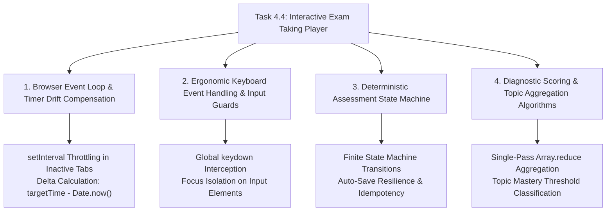
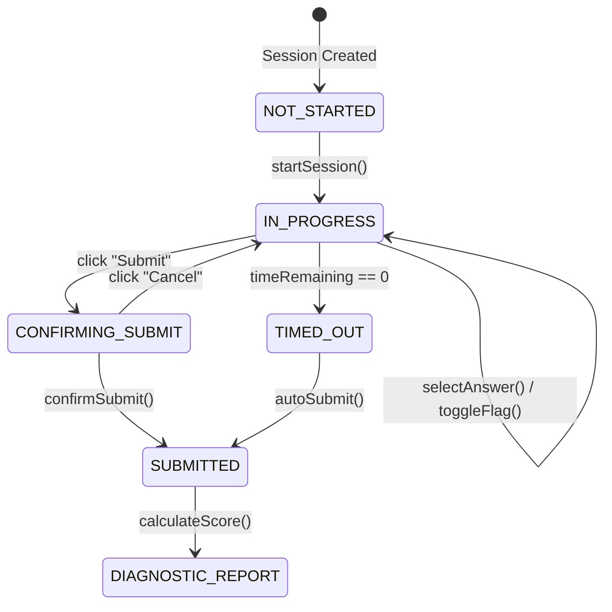

# Stage 3: CS Domain Learning Extraction
## Task 4.4: Interactive Exam Taking Player with KaTeX & Timed Session `[FRONTEND]`

**Task ID:** Task 4.4  
**Track:** Frontend Track (React 18+ / TypeScript / Vite / Zustand / KaTeX)  
**Epic:** Epic 4 — Dynamic Question Generation & Multi-Format Bank  
**Accepted Decision Basis:** [ADR-008: Frontend Framework & UI Ecosystem](file:///c:/Users/Muhammad/OneDrive%20-%20Higher%20Education%20Commission/Desktop/AI%20Tutor/Feynman_tutorAI/docs/adr/ADR-008-frontend-framework-and-ui-stack.md), [DESIGN_SYSTEM_TYPOGRAPHY.md](file:///c:/Users/Muhammad/OneDrive%20-%20Higher%20Education%20Commission/Desktop/AI%20Tutor/Feynman_tutorAI/docs/frontend_design/DESIGN_SYSTEM_TYPOGRAPHY.md)

---

## 1. Domain Discovery Map



---

## 2. Domain Deep Dives

### Domain 1: Browser Event Loop & Timer Drift Compensation

**What Is It (Plain English):**  
In JavaScript, `setInterval(() => time--, 1000)` does **NOT** run every exact 1000 milliseconds. If the CPU is busy rendering or the student switches to another browser tab, the browser intentionally throttles background timer intervals to save battery, causing the clock to tick once every 5–10 seconds instead of once every second. To achieve rock-solid countdown accuracy, an exam player must calculate remaining time against the **Wall-Clock Target Timestamp** (`Math.max(0, Math.floor((endTime - Date.now()) / 1000))`).

**Physical Analogy:**  
> A simple interval counter is like a person counting seconds in their head (*"one Mississippi, two Mississippi..."*); if they get distracted, their count slows down. A wall-clock delta calculation is like looking at a **Mechanical Wristwatch**; regardless of distractions, the hands always reflect true physical time.

**Mathematical / Code Implementation:**
```typescript
// Drift-Compensated Timer Tick Function
const calculateRemainingSeconds = (endTimeMs: number): number => {
  const diffMs = endTimeMs - Date.now();
  return Math.max(0, Math.floor(diffMs / 1000));
};
```

---

### Domain 2: Keyboard Event Handling & Form Input Guards

**What Is It (Plain English):**  
Keyboard accelerators (pressing `A`, `B`, `C`, `D` to select options, `ArrowRight` to go next, and `F` to flag) dramatically improve student ergonomics during high-speed timed exams. However, if a student is typing in a search bar or feedback input box, global key listeners could accidentally intercept the student typing the letter "f" and flag the question instead. An accessible keyboard hook must check `event.target.tagName` to ignore events originating from `<input>` or `<textarea>`.

**Where It Manifests in This Codebase:**
- [`frontend/src/components/exam/ExamPlayer.tsx`](file:///c:/Users/Muhammad/OneDrive%20-%20Higher%20Education%20Commission/Desktop/AI%20Tutor/Feynman_tutorAI/frontend/src/components/exam/ExamPlayer.tsx) — Global window keydown listener.

---

### Domain 3: Deterministic Assessment State Machine

**What Is It (Plain English):**  
An exam player lifecycle must be modeled as a strict **Finite State Machine (FSM)** with well-defined transitions:

This guarantees the student cannot modify answers after time expires or submit twice.

---

### Domain 4: Diagnostic Scoring & Topic Aggregation

**What Is It (Plain English):**  
Upon exam submission, the scoring engine calculates raw scores and groups questions by their pedagogical topic ID using a **single-pass hash map aggregation (`Array.reduce`)**, outputting topic-by-topic percentages (e.g. *Kinematics: 100% Mastered, Waves: 50% Developing*) to populate the mastery radar.

**Where It Manifests in This Codebase:**
- [`frontend/src/api/exam.ts`](file:///c:/Users/Muhammad/OneDrive%20-%20Higher%20Education%20Commission/Desktop/AI%20Tutor/Feynman_tutorAI/frontend/src/api/exam.ts) — `gradeExamSession()` scoring engine.

---

## 3. Vocabulary Reference

| Term | Definition | Codebase Location |
| :--- | :--- | :--- |
| **`ExamSession`** | Complete state container for an active or completed exam attempt. | `frontend/src/types/exam.ts` |
| **`QuestionPalette`** | Numbered grid matrix showing real-time answer & flag status. | `frontend/src/components/exam/QuestionPalette.tsx` |
| **`Wall-Clock Time`** | Absolute real-world timestamp (`Date.now()`) used for drift-free countdown. | `frontend/src/stores/examPlayerStore.ts` |
| **`ScoreSummary`** | Diagnostic report data with topic breakdown and mastery tier. | `frontend/src/types/exam.ts` |
