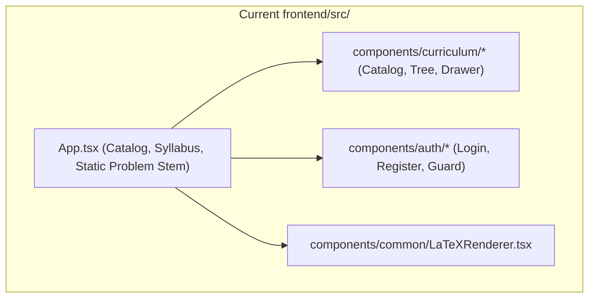
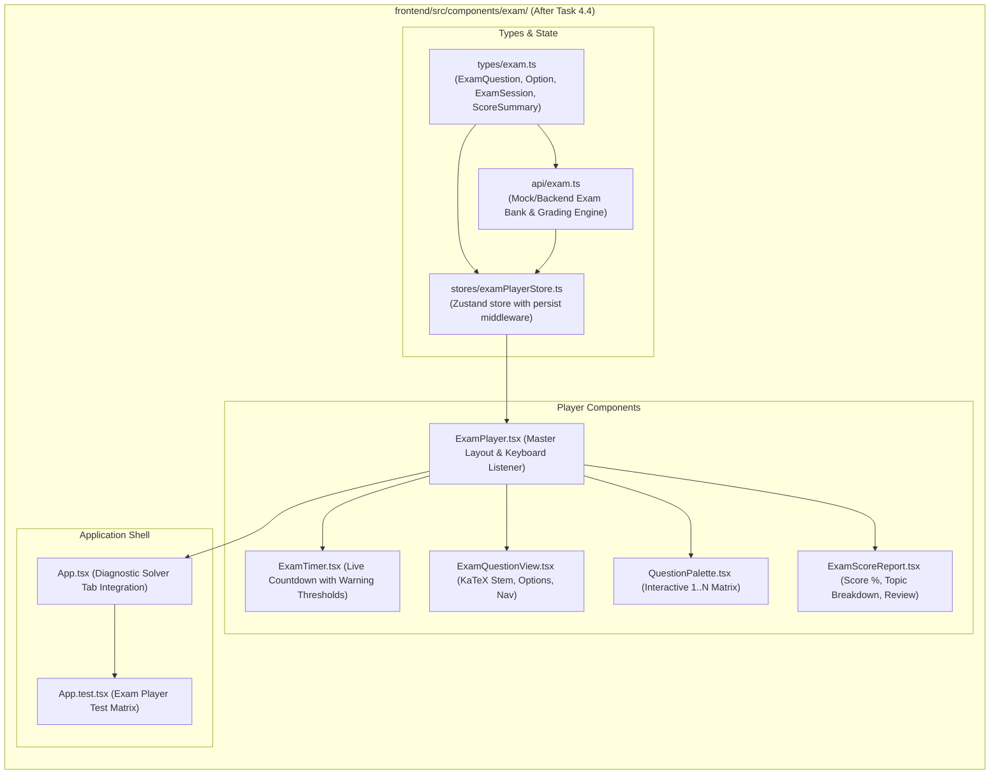

# Stage 2: Codebase Design Artifact
## Task 4.4: Interactive Exam Taking Player with KaTeX & Timed Session `[FRONTEND]`

**Task ID:** Task 4.4  
**Track:** Frontend Track (React 18+ / TypeScript / Vite / Zustand / KaTeX)  
**Epic:** Epic 4 — Dynamic Question Generation & Multi-Format Bank  
**Accepted Decision Basis:** [ADR-008: Frontend Framework & UI Ecosystem](file:///c:/Users/Muhammad/OneDrive%20-%20Higher%20Education%20Commission/Desktop/AI%20Tutor/Feynman_tutorAI/docs/adr/ADR-008-frontend-framework-and-ui-stack.md), [DESIGN_SYSTEM_TYPOGRAPHY.md](file:///c:/Users/Muhammad/OneDrive%20-%20Higher%20Education%20Commission/Desktop/AI%20Tutor/Feynman_tutorAI/docs/frontend_design/DESIGN_SYSTEM_TYPOGRAPHY.md)

---

## 1. Current State Snapshot

Currently, `frontend/src/` has core UI primitives, authentication store/forms, route guards, curriculum catalog/tree, and a static single-question mock in `App.tsx`. There is no multi-question exam taking player, countdown timer engine, question palette, keyboard navigation hook, or diagnostic score report generator.



* **Verified Fact:** `frontend/` has passing Vitest suite (11 of 11 passed).
* **Verified Fact:** `frontend/` is 100% directory-isolated from `backend/`.

---

## 2. Proposed State

After Task 4.4 execution, `frontend/src/` will feature a complete **Interactive Exam Taking Player Subsystem** with countdown timer, question palette grid, keyboard navigation accelerators, submission review dialog, and diagnostic score reports.



---

## 3. File-Level Impact Analysis

All files are `[NEW]` or `[MODIFY]` strictly inside `frontend/` (0 touches to `backend/`).

### 3.1 Data Structures & State Management
#### [NEW] `frontend/src/types/exam.ts`
* **Purpose:** TypeScript types defining exam questions, options, session state, and diagnostic scores:
  - `QuestionType`: `'single_choice' | 'multiple_choice' | 'numeric_input'`
  - `QuestionOption`: `{ id: string; label: string; textLatex: string; isCorrect?: boolean }`
  - `ExamQuestion`: `{ id, topicId, topicTitle, difficulty, stemLatex, options, explanationLatex, hintLatex? }`
  - `ExamSession`: `{ id, examTemplateId, title, durationMinutes, questions, startTime?, endTime? }`
  - `ExamScoreSummary`: `{ totalQuestions, answeredCount, correctCount, scorePercentage, topicBreakdown, completedAt }`

#### [NEW] `frontend/src/stores/examPlayerStore.ts`
* **Purpose:** Zustand store with `persist` middleware managing:
  - `session: ExamSession | null`
  - `currentQuestionIndex: number`
  - `answers: Record<string, string>` (questionId -> selectedOptionId)
  - `flaggedQuestionIds: string[]`
  - `timeRemainingSeconds: number`
  - `isSubmitted: boolean`
  - `scoreSummary: ExamScoreSummary | null`
  - **Actions:** `startSession()`, `selectAnswer()`, `toggleFlag()`, `nextQuestion()`, `prevQuestion()`, `goToQuestion()`, `submitExam()`, `resetSession()`, `tickTimer()`.

#### [NEW] `frontend/src/api/exam.ts`
* **Purpose:** API client providing complete exam question banks for:
  1. **Cambridge A-Level Physics Mechanics & Waves Practice (5 Comprehensive Multi-Concept Questions with KaTeX)**
  2. **AP Calculus BC Diagnostic Exam (5 Derivatives & Series Questions)**

---

### 3.2 UI Components
#### [NEW] `frontend/src/components/exam/ExamTimer.tsx`
* **Purpose:** Precision countdown timer display with color-coded warning thresholds:
  - Normal (> 5 mins): Slate / Indigo
  - Warning (1–5 mins): Amber
  - Critical (< 1 min): Pulsing Rose Red with audible tick icon

#### [NEW] `frontend/src/components/exam/QuestionPalette.tsx`
* **Purpose:** Interactive question matrix (1..N) displaying status:
  - 🟢 **Answered**
  - 🟡 **Flagged for Review**
  - 🔵 **Current Question**
  - ⚪ **Unanswered**

#### [NEW] `frontend/src/components/exam/ExamQuestionView.tsx`
* **Purpose:** Question stage rendering problem stems with `LaTeXRenderer`, option cards with keyboard shortcut badges (`[A]`, `[B]`, `[C]`, `[D]`), and navigation buttons.

#### [NEW] `frontend/src/components/exam/ExamScoreReport.tsx`
* **Purpose:** Comprehensive diagnostic score report featuring:
  - Overall Score percentage & Mastery tier badge.
  - Topic-by-topic performance bars.
  - Question-by-question review with detailed mathematical explanations and correct answer keys.
  - "Practice Again" and "Review with Socratic Tutor" action triggers.

#### [NEW] `frontend/src/components/exam/ExamPlayer.tsx`
* **Purpose:** Master full-bleed exam player orchestrator with keyboard navigation listener (`keydown` for A-D, J/K, Arrows, F), split-pane layout, submission confirmation modal, and score report view.

---

### 3.3 Root App & Tests
#### [MODIFY] `frontend/src/App.tsx`
* **Purpose:** Embed the full `ExamPlayer` inside the "Diagnostic Solver" tab.

#### [MODIFY] `frontend/src/App.test.tsx`
* **Purpose:** Vitest test suite verifying:
  - Exam player boot and countdown timer display.
  - Question selection and answer recording.
  - Flagging questions for review.
  - Question palette navigation (jumping to question 3).
  - Exam submission and score report generation.

---

## 4. Dependency Graph / Blast Radius

```mermaid
graph TD
    subgraph ExamPlayerSubsystem ["frontend/src/components/exam/ (Isolated)"]
        Types[types/exam.ts] --> Store[stores/examPlayerStore.ts]
        Types --> API[api/exam.ts]
        Store --> Timer[ExamTimer.tsx]
        Store --> Palette[QuestionPalette.tsx]
        Store --> QView[ExamQuestionView.tsx]
        Store --> Report[ExamScoreReport.tsx]
        Timer --> Player[ExamPlayer.tsx]
        Palette --> Player
        QView --> Player
        Report --> Player
        Player --> App[App.tsx]
        App --> Tests[App.test.tsx]
    end

    subgraph BackendAPI ["backend/ (Directory Isolation)"]
        BackendEndpoints["/api/v1/assessments/*"]
    end

    ExamPlayerSubsystem -.->|Zero Cross-Track Impact (Isolated)| BackendAPI
```

---

## 5. Regression Risk Matrix

| Risk ID | Risk Description | Severity | Affected Area | Mitigation Strategy |
| :--- | :--- | :---: | :--- | :--- |
| **R-01** | Timer drifting in background tabs | 🟡 Medium | Exam Timer | Calculate remaining time against target timestamp (`Date.now()`) rather than simple integer decrement. |
| **R-02** | Keyboard shortcuts firing while typing in search | 🟡 Medium | Keyboard Hook | Guard event listeners to ignore keydown if target is `<input>` or `<textarea>`. |
| **R-03** | LocalStorage state corruption on version bump | 🟢 Low | Store Hydration | Zustand `persist` handles JSON parse errors with fallback to empty state. |

---

## 6. Rollback Plan

```powershell
git checkout -- frontend/src/
Remove-Item -Recurse -Force frontend/src/components/exam/
Remove-Item -Force frontend/src/stores/examPlayerStore.ts
Remove-Item -Force frontend/src/types/exam.ts
Remove-Item -Force frontend/src/api/exam.ts
```
Estimated rollback time: < 1 minute.
