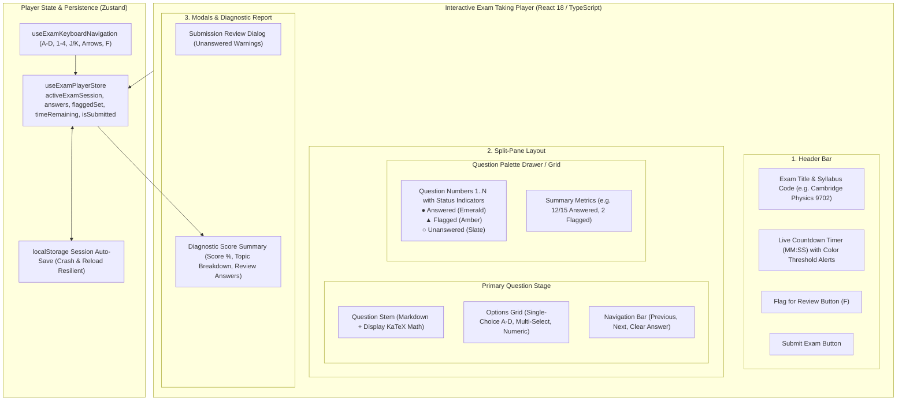
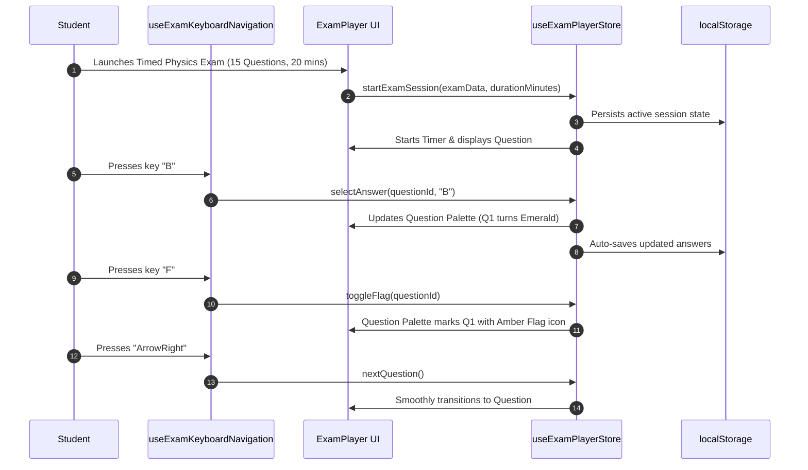
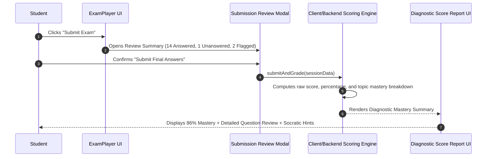

# Stage 1: Conceptual Understanding Artifact
## Task 4.4: Interactive Exam Taking Player with KaTeX & Timed Session `[FRONTEND]`

**Task ID:** Task 4.4  
**Track:** Frontend Track (React 18+ / TypeScript / Vite / Zustand / KaTeX)  
**Epic:** Epic 4 — Dynamic Question Generation & Multi-Format Bank  
**Accepted Decision Basis:** [ADR-008: Frontend Framework & UI Ecosystem](file:///c:/Users/Muhammad/OneDrive%20-%20Higher%20Education%20Commission/Desktop/AI%20Tutor/Feynman_tutorAI/docs/adr/ADR-008-frontend-framework-and-ui-stack.md), [DESIGN_SYSTEM_TYPOGRAPHY.md](file:///c:/Users/Muhammad/OneDrive%20-%20Higher%20Education%20Commission/Desktop/AI%20Tutor/Feynman_tutorAI/docs/frontend_design/DESIGN_SYSTEM_TYPOGRAPHY.md)

---

## 1. Visual Architecture

---

## 2. The Physical Analogy

> Think of the **Interactive Exam Taking Player** like a **High-Tech Digital Examination Carrel & Illuminated Optical Answer Sheet**. 
> When you sit at the test station:
> 1. In front of you is a clear, glare-free glass screen displaying the current question with crisp mathematical typesetting (**Question Stem**).
> 2. To your right is an illuminated matrix representing your test booklet (**Question Palette**). As you bubble in answers, the corresponding numbered tiles glow emerald green; if you hesitate and flag a tricky question for later, its tile turns amber.
> 3. Above the desk, a silent, accurate digital clock counts down the remaining seconds. If you accidentally bump the power cable or refresh your screen, the memory core instantly restores your exact question index and filled bubbles (**Session Persistence**).
> 4. When the timer hits zero or you press submit, the electronic proctor scores your paper on the spot, highlighting which topics you aced and which formulas need review with your AI tutor.

---

## 3. Why & What

### Why are we doing this task?
1. **Authentic Exam Practice (PRD Cap 4, FR-004, FR-015):** Students cannot prepare effectively for high-stakes exams (Cambridge A-Levels, AP, SAT, MCAT) without practicing in realistic, timed, distraction-free environments.
2. **STEM Mathematical Precision:** Physics and mathematics questions rely heavily on formulas, fractions, and calculus notation. These must render instantaneously with zero layout shift or font flickering.
3. **Session Resilience & Anti-Frustration:** A network interruption or accidental browser reload must never wipe out 45 minutes of a student's hard work.

### What is the concept?
A feature-rich **Interactive Exam Taking Player** featuring:
- Live, drift-compensated **Countdown Timer** with visual warning thresholds (< 5 mins = amber, < 1 min = pulsing red).
- **Question Palette Grid** tracking Answered, Unanswered, Flagged, and Active states.
- **Keyboard Shortcuts** (A-D / 1-4 for option selection, Left/Right for pagination, F for flag).
- **Dual Mode:** Timed Mock Exam Mode vs. Instant-Feedback Practice Mode.
- **Diagnostic Score Report:** Displays percentage score, topic-level mastery breakdown, detailed step-by-step explanations, and "Ask Socratic Tutor" shortcuts.

### What breaks if we skip this?
- Students cannot simulate real timed exams.
- Answer selections would be lost on page reload.
- The UI would lack essential exam tools (question palette, flagging, keyboard accelerators).

---

## 4. Abstraction Level Map

| Level | What Lives Here | Current Project Example | Touched by Task 4.4? |
| :--- | :--- | :--- | :---: |
| **Product / UX** | Exam Player Shell, Timer Display, Question Palette, Score Report | `/exam/session/:id`, Results screen | 🔵 **PRIMARY FOCUS** |
| **Application** | Exam Player Store, Answer recorder, Timer tick loop, Score grader | `src/stores/examPlayerStore.ts`, `src/components/exam/` | 🔵 **PRIMARY FOCUS** |
| **Framework** | Split-pane grid, Keyboard event hooks, Dialog review modal | `ExamPlayer.tsx`, `useKeyboardShortcuts.ts` | 🔵 **PRIMARY FOCUS** |
| **Library** | `KaTeX`, `lucide-react`, `zustand`, `clsx`, `tailwind-merge` | LaTeXRenderer, UI tokens | 🔵 Used heavily |
| **Runtime** | `window.setInterval` / `Date.now()` timer drift compensation | Timer engine | 🔵 Precision time sync |
| **Infrastructure** | Backend Question Bank & Assessment API | `/api/v1/assessments/submit` | ⚪ Backend Contract |

---

## 5. Sequence Diagrams

### Diagram 1: Active Exam Taking & Keyboard Shortcuts

### Diagram 2: Exam Submission & Diagnostic Score Generation

---

## 6. Data Flow Trace-Through

1. **Session Boot:** `startSession(examTemplate)` initializes questions, sets `timeRemaining = durationSeconds`, resets answer map, and writes to `localStorage`.
2. **Timer Engine:** A tick interval runs every second comparing `Date.now()` against `sessionEndTime` to prevent background tab clock drift.
3. **Answer Selection:** Clicking an option or pressing keys `A`, `B`, `C`, `D` dispatches `selectAnswer(questionId, optionId)`.
4. **Palette State:** The Question Palette re-renders dynamically:
   - 🟢 **Answered:** Option is selected.
   - 🟡 **Flagged:** Marked with `isFlagged === true` for revision.
   - ⚪ **Unanswered:** No option selected.
   - 🔵 **Active:** Currently focused question.
5. **Submission & Grading:** On submission, the grading engine compares student answers against answer keys, computes score by topic/subtopic, and transitions the player into the **Diagnostic Score Report**.

---

## 7. Cognitive Model → Code Mapping

| Cognitive Stage | Mental Model | Code Concept in Feynman Frontend | Concrete Guardrail |
| :--- | :--- | :--- | :--- |
| **1. Focus Stage** | "I am in the exam room; distraction-free focus" | Full-bleed clean `ExamPlayer` layout | Minimal headers, zero clutter |
| **2. Time Pacing** | "How much time do I have left?" | `ExamTimer` with color thresholds | Amber < 5m, Red pulse < 1m |
| **3. Answer Tracking** | "Which questions do I still need to answer?" | `QuestionPalette` grid | Visual status badges (1..N) |
| **4. Fast Input** | "Quickly select option without touching mouse" | Keyboard shortcuts (`A`-`D`, `1`-`4`, `F`) | Global window keydown listener |
| **5. Post-Exam Diagnostic** | "What were my mistakes and how do I improve?" | `ExamScoreReport` with KaTeX review | Step-by-step math explanations |

---

## 8. Five Alternative Approaches Evaluated

| # | Approach | Pros | Cons | Verdict |
|:---|:---|:---|:---|:---|
| **1** | **Zustand Store + KaTeX + Keyboard Nav + Palette (Approved)** | Ultra-fast client reactivity, offline resilience, ergonomic keyboard flow | Requires robust state machine | ✅ **RECOMMENDED (ADR-008)** |
| **2** | **Full Page Reload on Every Question** | Simple state | Slow, annoying layout flashes, destroys exam focus | ❌ Anti-pattern |
| **3** | **Third-Party Quiz Widget (Typeform/SurveyJS)** | Pre-built templates | Cannot render KaTeX LaTeX math cleanly; no custom pedagogical tokens | ❌ Incompatible with STEM |
| **4** | **Unpersisted React State** | Easy to code | Page reload wipes out answers and frustrates students | ❌ Prohibited |
| **5** | **Modal Dialog Quiz inside Main Page** | Fast integration | Cramped mobile screen space; feels informal | ❌ Full-screen player preferred |

---

## 9. Production Rationale & Disaster Scenarios

### Why This Is Standard:
All premier test-prep platforms (SAT Bluebook, MCAT Practice, UWorld) use dedicated distraction-free players with question palettes and review screens.

### Disaster Scenario: Browser Crash 1 Minute Before Submission
* *Without Session Persistence:* The student's laptop battery dies or the browser crashes. All 45 answers are lost forever.
* *With Session Persistence:* The store auto-persists to `localStorage` on every keystroke. Upon reopening the browser, the student resumes right where they left off with zero data loss.
