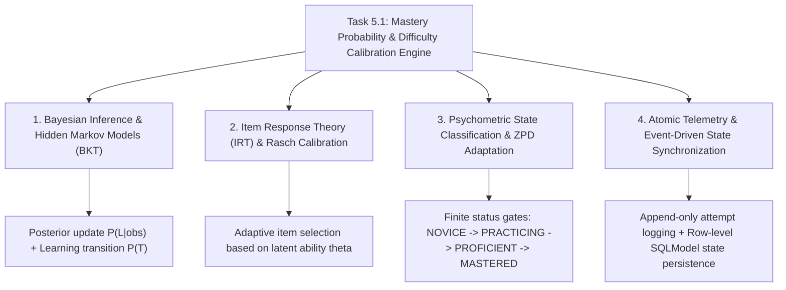

# Task 5.1: Mastery Probability & Difficulty Calibration Engine — CS Domain Learning (Stage 3)

## 1. Domain Discovery Map

Task 5.1 touches four core computer science, educational data mining, and statistical psychometric domains:



---

## 2. Domain Deep Dives

### Domain 1: Bayesian Knowledge Tracing (BKT) & Hidden Markov Models

**What Is It (Plain English):**  
Bayesian Knowledge Tracing (Corbett & Anderson, 1994) is a specialized 2-state Hidden Markov Model where the latent (hidden) variable represents whether the student truly knows a specific skill ($L=1$) or does not ($L=0$). We can never directly observe the student's brain; we only observe noisy binary emissions: correct ($1$) or incorrect ($0$) answers. BKT uses Bayes' Theorem to update our probabilistic belief after every observed question attempt.

**Mathematical Formulation:**
The model is defined by four parameters:
- $P(L_0)$: Initial prior probability that the student knows the skill.
- $P(T)$: Probability that the student learns the skill between attempt $t-1$ and attempt $t$.
- $P(G)$: Probability of a Guess (answering correctly despite $L=0$).
- $P(S)$: Probability of a Slip (answering incorrectly despite $L=1$).

**Step 1 — Bayesian Observation Update:**
- If the student answers **Correctly**:
  $$P(L_t | \text{Correct}) = \frac{P(L_{t-1}) \cdot (1 - P(S))}{P(L_{t-1}) \cdot (1 - P(S)) + (1 - P(L_{t-1})) \cdot P(G)}$$
- If the student answers **Incorrectly**:
  $$P(L_t | \text{Incorrect}) = \frac{P(L_{t-1}) \cdot P(S)}{P(L_{t-1}) \cdot P(S) + (1 - P(L_{t-1})) \cdot (1 - P(G))}$$

**Step 2 — Learning Transition Step:**
Regardless of the outcome, the student has engaged with the material and may have learned:
$$P(L_t) = P(L_t | \text{observation}) + (1 - P(L_t | \text{observation})) \cdot P(T)$$

---

### Domain 2: Item Response Theory (IRT) & Rasch 1PL Calibration

**What Is It (Plain English):**  
In psychometrics, Item Response Theory models the probability of a correct response as a logistic function of the student's latent ability ($\theta$) and the item's difficulty ($b$):
$$P(\text{Correct} | \theta, b) = \frac{1}{1 + e^{-(\theta - b)}}$$
When student ability matches item difficulty ($\theta = b$), the probability of success is $50\%$.  
To optimize learning (Vygotsky's *Zone of Proximal Development*), the system serves items where the student is challenged without being overwhelmed:
- $P(L_t) < 0.40 \implies \text{Target } \textbf{EASY} \text{ questions}$
- $0.40 \le P(L_t) < 0.70 \implies \text{Target } \textbf{MEDIUM} \text{ questions}$
- $0.70 \le P(L_t) < 0.90 \implies \text{Target } \textbf{HARD} \text{ questions}$
- $P(L_t) \ge 0.90 \implies \text{Target } \textbf{CHALLENGE} \text{ questions}$

---

### Domain 3: Psychometric State Transitions & Mastery Thresholds

**What Is It (Plain English):**  
The continuous probability $P(L_t) \in [0.0, 1.0]$ maps directly to discrete, pedagogical status tiers:
- **`NOVICE` ($P < 0.30$):** Student has not yet demonstrated consistent understanding.
- **`PRACTICING` ($0.30 \le P < 0.60$):** Student is actively building foundational competence.
- **`PROFICIENT` ($0.60 \le P < 0.85$):** Student reliably solves standard problems.
- **`MASTERED` ($P \ge 0.85$):** Student demonstrates high probabilistic certainty of competence ($Q \ge 85\%$), unlocking advanced downstream curriculum topics.

---

### Domain 4: Atomic Telemetry & Event-Driven State Synchronization

**What Is It (Plain English):**  
In modern cloud learning platforms, every question attempt is an immutable analytical event. We store both the current state snapshot (`StudentTopicMastery`) and the historical trace (`StudentQuestionAttempt`). When a topic crosses the mastery threshold ($P \ge 0.85$), an event is dispatched to the `LearningStateMachineService` (Task 1.2) to advance the student's formal stage.

---

## 3. Cross-Domain Connections

| Concept A | Concept B | Architectural Connection |
|:---|:---|:---|
| **`BKTEngine`** | **`QuestionBankService` (Task 4.1)** | Retrieves question metadata (type, difficulty, points) to tune guess/slip parameters. |
| **`StudentTopicMastery`** | **`Topic DAG` (Task 2.2)** | Prerequisite validation engine checks if upstream topics have `status == MASTERED`. |
| **`StudentQuestionAttempt`** | **`Error Bank` (Task 5.2)** | Feeds incorrect attempts with distractor rationales into the diagnostic error bank. |
| **Mastery Probability** | **`Learning State Machine` (Task 1.2)** | Supplies mathematical evidence payload for `StateTransitionLog`. |

---

## 4. Concept Evolution Timeline

```markdown
| Level | What You Might Think | Deeper Reality |
|:---|:---|:---|
| **Beginner** | "Mastery is just percentage correct (e.g. 8/10 = 80%)." | Ignores recency, lucky guesses, careless slips, and question difficulty. |
| **Intermediate** | "Award mastery after a 3-question streak." | 3 easy questions can be gamed and doesn't model true latent knowledge. |
| **Advanced** | "Use Bayesian updating after every question." | Accounts for guess and slip, but needs difficulty-aware item targeting. |
| **Expert** | "Hybrid BKT + 1PL IRT difficulty calibration with immutable attempt telemetry and DAG prerequisite unlocking." | Production-grade intelligent tutoring psychometric engine. |
```

---

## 5. Vocabulary Reference

| Term | Definition | Codebase Example |
|:---|:---|:---|
| **BKT** | Bayesian Knowledge Tracing | `BKTEngine.update_mastery()` |
| **Latent Knowledge ($P(L_t)$)** | Hidden probability that skill is mastered | `StudentTopicMastery.mastery_probability` |
| **Slip ($P(S)$)** | Probability of an error despite knowing the concept | `BKTParameters.p_slip` ($0.10$) |
| **Guess ($P(G)$)** | Probability of a correct answer by chance | `BKTParameters.p_guess` ($0.20$) |
| **Transition ($P(T)$)** | Probability of learning from the current attempt | `BKTParameters.p_transit` ($0.15$) |
| **ZPD** | Zone of Proximal Development | `BKTEngine.get_target_difficulty()` |

---

## 6. "What If" Thought Experiments

### Q1: What if a student answers 5 questions correctly in a row from an initial prior of 0.10?
> **Answer:** Starting at $0.10$:
> - Attempt 1: $P(L_1) \approx 0.433$ (`PRACTICING`)
> - Attempt 2: $P(L_2) \approx 0.741$ (`PROFICIENT`)
> - Attempt 3: $P(L_3) \approx 0.892$ (`MASTERED` reached!)
> - Attempt 4: $P(L_4) \approx 0.957$
> - Attempt 5: $P(L_5) \approx 0.983$
> The exponential convergence toward $1.0$ guarantees that genuine streaks quickly and reliably earn `MASTERED` status.

### Q2: What happens if a student with 0.95 mastery makes one careless arithmetic slip?
> **Answer:** Applying the incorrect formula with $P(S)=0.10, P(G)=0.20$:
> $$P(L | \text{Incorr}) = \frac{0.95 \times 0.10}{0.95 \times 0.10 + 0.05 \times 0.80} = \frac{0.095}{0.095 + 0.040} = 0.7037$$
> Adding transition $P(T)=0.15$:
> $$P(L_t) = 0.7037 + (1 - 0.7037) \times 0.15 = 0.7481$$
> Mastery drops from $95\%$ to $74.8\%$ (`PROFICIENT`), retaining confidence that the student is not a complete beginner while prompting one more question for verification before re-certifying `MASTERED`.

### Q3: How does question type affect the guess parameter $P(G)$?
> **Answer:** For 4-option MCQs, $P(G) = 0.20-0.25$. For numerical and derivation steps, guessing is virtually impossible, so $P(G) = 0.02-0.05$. A correct answer on a numerical question therefore yields a much larger Bayesian mastery boost than on an MCQ.

### Q4: What prevents division-by-zero if probability reaches exactly 0.0 or 1.0?
> **Answer:** `BKTEngine` applies mathematical clamping $[\epsilon, 1-\epsilon]$ with $\epsilon = 10^{-4}$, ensuring strict numerical stability across all floating-point calculations.

---

## Workflow Checklist
- [x] Domain discovery concept map included.
- [x] BKT mathematical derivation with exact KaTeX formulas provided.
- [x] IRT 1PL Rasch difficulty mapping explained.
- [x] Psychometric state threshold definitions included.
- [x] Cross-domain connection matrix filled.
- [x] Concept evolution timeline documented.
- [x] Vocabulary reference table created.
- [x] 4 comprehensive "What If" scenarios analyzed with step-by-step numbers.
