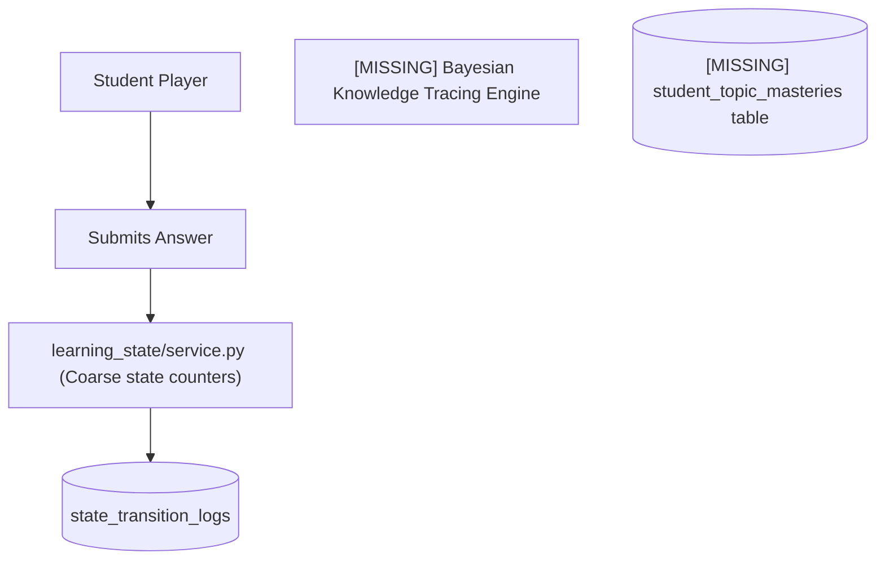
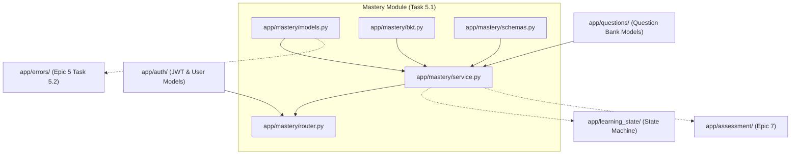

# Task 5.1: Mastery Probability & Difficulty Calibration Engine — Codebase Design (Stage 2)

## 1. Current State Snapshot

Prior to Task 5.1:
- `backend/app/learning_state/models.py` maintains coarse high-level `LearningState` transitions (`PRACTICING`, `ASSESSMENT`, `MASTERY`), but does not calculate Bayesian belief probabilities ($P(L_t)$), slip/guess parameters, or item-level difficulty adaptation.
- `backend/app/questions/models.py` and `service.py` store questions with difficulty levels (`EASY`, `MEDIUM`, `HARD`, `CHALLENGE`), but there is no mechanism linking student attempts to live topic mastery probabilities.

### Before Architecture Diagram



---

## 2. Proposed State

Task 5.1 creates the dedicated `backend/app/mastery/` domain package:
1. `backend/app/mastery/models.py`:
   - `MasteryStatus` Enum (`NOVICE`, `PRACTICING`, `PROFICIENT`, `MASTERED`).
   - `StudentTopicMastery` SQLModel: Tracks $P(L_t) \in [0.0, 1.0]$, status, target difficulty, attempt counts, streaks.
   - `StudentQuestionAttempt` SQLModel: Telemetry log capturing prior/posterior probabilities, response correctness, and time spent.
2. `backend/app/mastery/bkt.py`:
   - `BKTEngine`: Pure mathematical Bayesian Knowledge Tracing and 1PL difficulty adaptation algorithms.
3. `backend/app/mastery/schemas.py`:
   - Pydantic DTOs: `RecordAttemptRequest`, `MasteryUpdateResponse`, `StudentTopicMasteryResponse`, `TopicMasteryListResponse`.
4. `backend/app/mastery/service.py`:
   - `MasteryEngineService`: Orchestrates attempt logging, BKT belief update, SQLModel persistence, and learning state machine synchronization.
5. `backend/app/mastery/router.py`:
   - REST endpoints:
     - `POST /api/v1/mastery/record-attempt`: Record answer and receive live posterior mastery.
     - `GET /api/v1/mastery/topics/{topic_id}`: Fetch student topic mastery.
     - `GET /api/v1/mastery/exams/{exam_template_id}`: Fetch all topic masteries for an exam syllabus.
6. `backend/app/api/v1/router.py`:
   - Mount `/api/v1/mastery` router into master FastAPI router.

### After Architecture Diagram

```mermaid
graph TD
    Client["Student Client"] --> Router["POST /api/v1/mastery/record-attempt (app/mastery/router.py) [NEW]"]
    Router --> Service["MasteryEngineService (app/mastery/service.py) [NEW]"]
    
    Service --> BKT["BKTEngine (app/mastery/bkt.py) [NEW]"]
    note over BKT: Computes Bayesian Posterior P(L_t|obs) + Learning Transition
    
    Service --> MasteryTable[("student_topic_masteries table [NEW]")]
    Service --> AttemptTable[("student_question_attempts table [NEW]")]
    
    Service -.-> StateMachine["learning_state/service.py (Auto-promotes to MASTERY on P >= 0.85)"]
```

---

## 3. File-Level Impact Analysis

### [NEW] `backend/app/mastery/models.py`
- **Purpose:** Database entities for topic mastery states and question attempt history.
- **Exports:**
  - `MasteryStatus` (Enum: `NOVICE`, `PRACTICING`, `PROFICIENT`, `MASTERED`)
  - `StudentTopicMastery` (SQLModel table `student_topic_masteries`)
  - `StudentQuestionAttempt` (SQLModel table `student_question_attempts`)

### [NEW] `backend/app/mastery/bkt.py`
- **Purpose:** Mathematical engine for Bayesian Knowledge Tracing belief updates and difficulty calibration.
- **Exports:**
  - `BKTParameters` (dataclass: $P(L_0), P(T), P(G), P(S)$)
  - `BKTEngine`:
    - `update_mastery(prior_p, is_correct, question_type) -> Tuple[float, MasteryStatus, DifficultyLevel]`
    - `get_mastery_status(probability) -> MasteryStatus`
    - `get_target_difficulty(probability) -> DifficultyLevel`

### [NEW] `backend/app/mastery/schemas.py`
- **Purpose:** Pydantic validation schemas and API response models.
- **Exports:**
  - `RecordAttemptRequest`
  - `MasteryUpdateResponse`
  - `StudentTopicMasteryResponse`
  - `TopicMasteryListResponse`

### [NEW] `backend/app/mastery/service.py`
- **Purpose:** Mastery update orchestration, persistence, and state machine integration.
- **Exports:**
  - `MasteryEngineService`:
    - `record_attempt(session, student_id, question_id, is_correct, selected_option_key, time_spent) -> MasteryUpdateResponse`
    - `get_topic_mastery(session, student_id, topic_id) -> Optional[StudentTopicMastery]`
    - `list_exam_topic_mastery(session, student_id, exam_template_id) -> List[StudentTopicMastery]`

### [NEW] `backend/app/mastery/router.py`
- **Purpose:** FastAPI router exposing mastery evaluation endpoints.
- **Exports:**
  - `router` (`/mastery` prefix)

### [NEW] `backend/app/mastery/__init__.py`
- **Purpose:** Package init exporting models, schemas, and service.

### [MODIFY] `backend/app/api/v1/router.py`
- **What changes:** Include `mastery_router` in the master v1 API router.

### [NEW] `backend/tests/test_mastery_model.py`
- **Purpose:** Unit and integration tests for BKT formulas, consecutive correct/incorrect streaks, status transitions, difficulty adaptations, and API endpoints.

---

## 4. Dependency Graph / Blast Radius



---

## 5. Regression Risk Matrix

| Risk ID | Risk Description | Severity | Affected Area | Mitigation Strategy |
|:---|:---|:---:|:---|:---|
| **R-01** | Division by zero in BKT formula on extreme probabilities ($P=0.0$ or $1.0$) | 🟡 Medium | `BKTEngine` | Clamp prior probabilities to $[\epsilon, 1-\epsilon]$ with $\epsilon = 10^{-4}$. |
| **R-02** | Race conditions on rapid consecutive question submissions | 🟡 Medium | `StudentTopicMastery` | Use database transactions with row-level refresh on `session.commit()`. |
| **R-03** | Missing question ID during attempt recording | 🟢 Low | `RecordAttemptRequest` | Validate question existence and eager-load topic metadata with clear `404` exception. |

---

## 6. Contract Stability Check

| Contract / Endpoint | Status | Request Body | Response Shape | Breaking? |
|:---|:---:|:---:|:---|:---:|
| `POST /api/v1/mastery/record-attempt` | **NEW** | `RecordAttemptRequest` | `MasteryUpdateResponse` | No |
| `GET /api/v1/mastery/topics/{topic_id}` | **NEW** | None | `StudentTopicMasteryResponse` | No |
| `GET /api/v1/mastery/exams/{exam_template_id}` | **NEW** | None | `TopicMasteryListResponse` | No |
| Existing `/api/v1/*` | Preserved | Preserved | Preserved | No |

---

## 7. Rollback Plan

### If Changes Are Uncommitted
1. `git restore backend/app/api/v1/router.py`
2. `Remove-Item -Recurse -Force backend/app/mastery/ backend/tests/test_mastery_model.py`

### If Changes Are Committed
1. `git revert HEAD`
2. `py -3.14 -m pytest backend/tests/`

---

## Workflow Checklist
- [x] Current-state snapshot documented.
- [x] Proposed-state description and After architecture diagram included.
- [x] Every affected file listed with impact analysis.
- [x] Blast-radius graph included.
- [x] Regression risks scored as 🔴 / 🟡 / 🟢.
- [x] Contract stability checked.
- [x] Rollback plan provided.
- [x] No code written.
