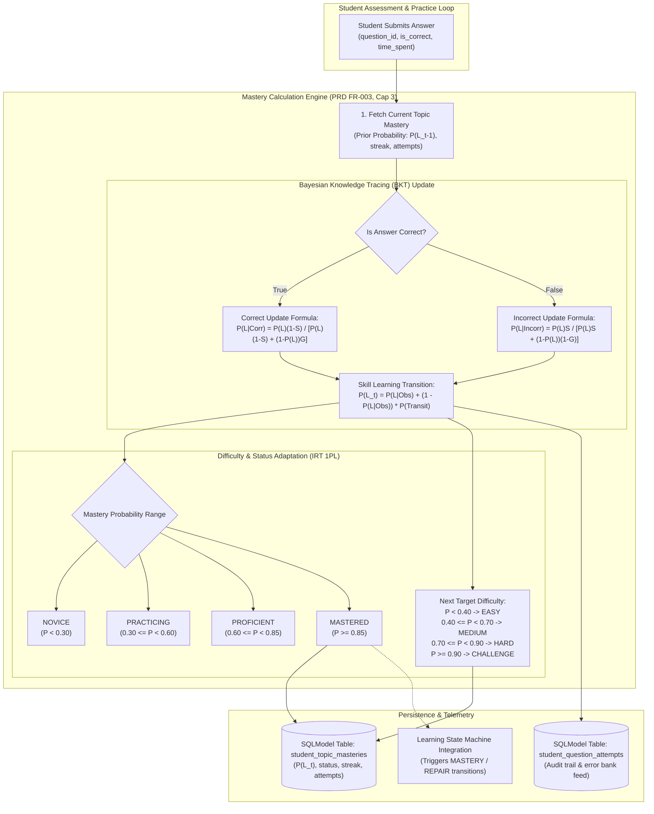
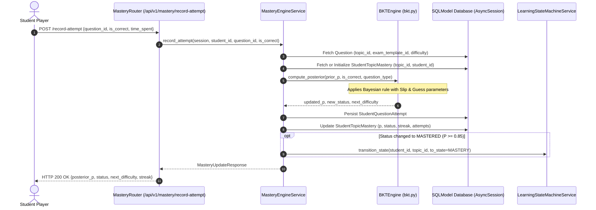

# Task 5.1: Mastery Probability & Difficulty Calibration Engine — Conceptual Understanding (Stage 1)

## 1. Visual Architecture

---

## 2. The Physical Analogy

The Mastery Calibration Engine is like an **Adaptive Driving Instructor in a Dual-Control Vehicle**:
> When a student sits in the driver's seat for the first time on "Parallel Parking" (*a specific syllabus topic*), the instructor doesn't assume they are an expert or completely hopeless; they begin with a baseline prior expectation (*$P(L_0) = 0.10$*).
> 
> If the student nails the park on their first try, the instructor knows they might have gotten lucky (*Guess parameter $P(G) = 0.20$*), so they don't immediately hand them a commercial license (*Status = MASTERED*). Instead, their confidence increases to 40% (*$P(L_1) = 0.42$*) and they upgrade the difficulty from an empty parking lot (*EASY*) to a quiet residential street (*MEDIUM*).
> 
> If the student clips a curb on the third try, the instructor considers whether their foot slipped (*Slip parameter $P(S) = 0.10$*). Only when the student executes consecutive flawless maneuvers across tight downtown streets (*HARD*) does the instructor's mathematical confidence cross the 85% threshold, officially certifying the skill as **MASTERED**.

---

## 3. Why & What

### Why Are We Doing This Task?
PRD §5.4, §13, and **FR-003 (Student Mastery Model)** require the system to maintain an authoritative, mathematical model of student competence per topic:
1. **Prevents Frustration & Boredom:** Keeps the student in the "Zone of Proximal Development" by dynamically serving questions calibrated to their live mastery.
2. **Eliminates LLM Guesswork:** Rather than letting an LLM hallucinate whether a student is "ready", the engine uses rigorous probabilistic formulas (Bayesian Knowledge Tracing & Item Response Theory).
3. **Drives Learning State Transitions:** Supplies mathematical evidence to promote students between `PRACTICING`, `DIAGNOSIS`, `REPAIR`, and `MASTERY` in the Learning State Machine (Task 1.2).

### What Is the Concept?
1. **Bayesian Knowledge Tracing (BKT):** A Hidden Markov Model estimating the latent probability $P(L_t) \in [0.0, 1.0]$ that a student has mastered a topic based on an observed sequence of correct/incorrect answers.
2. **Slip & Guess Parameters:**
   - **Guess ($P(G)$):** Probability of a correct answer despite lack of mastery (e.g. 25% on 4-choice MCQ).
   - **Slip ($P(S)$):** Probability of an incorrect answer despite true mastery (e.g. 10% due to calculation typo).
3. **Mastery Status Transitions:**
   - `NOVICE` ($P < 0.30$)
   - `PRACTICING` ($0.30 \le P < 0.60$)
   - `PROFICIENT` ($0.60 \le P < 0.85$)
   - `MASTERED` ($P \ge 0.85$)
4. **Target Difficulty Adaptation:** Dynamically computes whether the student should next be served `EASY`, `MEDIUM`, `HARD`, or `CHALLENGE` questions.

---

## 4. Abstraction Level Map

| Level | What Lives Here | Current Project Implementation |
|:---|:---|:---|
| **Product / UX** | Student Mastery Radar, Topic Progress Bars, Streak Indicators | `frontend/src/features/dashboard/` |
| **API** | `/api/v1/mastery/topics/{id}`, `/record-attempt` | `backend/app/mastery/router.py` |
| **Orchestration / Service** | `MasteryEngineService` updating beliefs and persisting attempts | `backend/app/mastery/service.py` |
| **Domain Mathematics** | BKT update formulas, slip/guess modeling, IRT difficulty mapping | `backend/app/mastery/bkt.py` |
| **Persistence** | `StudentTopicMastery` and `StudentQuestionAttempt` SQLModels | `backend/app/mastery/models.py` |
| **Database** | Relational tables (`student_topic_masteries`, `student_question_attempts`) | SQLite / PostgreSQL |

---

## 5. Mermaid Sequence Diagram

---

## 6. Data Flow Trace-Through

1. **Submission:** Student submits answer to question $Q_1$ on topic `top_kinematics`. `is_correct = True`.
2. **Prior Lookup:** Current mastery $P(L_0) = 0.10$, `streak = 0`.
3. **BKT Observation Step:**
   $$P(L_1 | \text{Correct}) = \frac{0.10 \times (1 - 0.10)}{0.10 \times (1 - 0.10) + (1 - 0.10) \times 0.20} = \frac{0.09}{0.09 + 0.18} = 0.3333$$
4. **Skill Transition Step:**
   $$P(L_1) = 0.3333 + (1 - 0.3333) \times 0.15 = 0.3333 + 0.1000 = 0.4333$$
5. **Classification:**
   - $P(L_1) = 0.4333 \implies$ Status transitions from `NOVICE` to `PRACTICING`.
   - Difficulty target transitions from `EASY` to `MEDIUM`.
   - `current_streak` increments to $1$.
6. **Telemetry Stored:** `student_question_attempts` records previous $0.10$ and posterior $0.4333$.
7. **Response:** UI receives updated mastery score $43.3\%$, badge `PRACTICING`, next suggested difficulty `MEDIUM`.

---

## 7. Cognitive Model → Code Mapping

| Cognitive Concept | Mental Model | Code Implementation | Enforcement / Guardrail |
|:---|:---|:---|:---|
| **Prior Competence** | "What did we know about the student before this question?" | `StudentTopicMastery.mastery_probability` | Initialized at $P(L_0) = 0.10$ |
| **Lucky Guess** | "Did they actually know it or just pick C?" | BKT Guess Parameter ($P(G)=0.20$) | Prevents 1 lucky answer from instantly mastering |
| **Careless Mistake** | "Did they know it but make an arithmetic slip?" | BKT Slip Parameter ($P(S)=0.10$) | Prevents 1 failure from crashing a 90% mastery |
| **Skill Learning** | "Did doing this question teach them something?" | BKT Transition Parameter ($P(T)=0.15$) | Ensures active practice increases mastery |
| **Mastery Gate** | "Has the student proven reliable proficiency?" | Threshold $P(L_t) \ge 0.85$ | Unlocks next curriculum prerequisites in Topic DAG |

---

## 8. Five Alternative Approaches Compared

| # | Approach | Pros | Cons | Why Option 1 Was Chosen |
|:---|:---|:---|:---|:---|
| **1** | **Bayesian Knowledge Tracing (BKT) + 1PL IRT Adaptation (Chosen)** | Handles guess/slip uncertainties, mathematically principled, real-time, explainable | Requires tuning 4 parameters | Industry gold-standard in intelligent tutoring systems (PRD FR-003, Cap 3) |
| **2** | Simple Percentage (Correct / Total) | Trivial to calculate | Fails to account for recency or question difficulty | Disqualified: 5 correct answers 3 weeks ago $\ne$ mastery today |
| **3** | Fixed Streak Threshold (e.g. 3 in a row) | Easy to visualize | Vulnerable to easy question exploitation | Disqualified: 3 easy questions $\ne$ mastery of hard physics |
| **4** | Pure LLM Evaluator ("Judge if student is mastered") | Zero formula code | Non-deterministic, high latency, hallucination risk | Disqualified: Violates PRD Non-Negotiable Constraint #1 |
| **5** | Multi-Dimensional Item Response Theory (MIRT) | Highly granular | High computational overhead, requires cold-start calibration | Disqualified: Overly complex for leaf topic state |

---

## 9. Production Rationale & Disaster Scenarios

### Disaster 1: The False Mastery Disaster (The Lucky Guesser)
> Without BKT guess discounting, a student guessing randomly on 4-choice questions could answer 3 consecutive items correctly ($P = (0.25)^3 = 0.015$). The system would falsely mark the topic as `MASTERED`, skip foundational teaching, and thrust the student into advanced calculus exams where they fail catastrophically. BKT prevents this by requiring consistent evidence before crossing 85%.

### Disaster 2: The Demoralizing Slip Disaster
> A top-performing student with 92% mastery accidentally clicks the wrong button due to a trackpad slip. In a naive percentage system, their score plummets. With BKT slip modeling ($P(S)=0.10$), the engine recognizes that a high-mastery student making an error is likely a slip, reducing $P(L_t)$ smoothly to $82\%$ rather than crashing to $50\%$.

---

## Workflow Checklist
- [x] Visual BKT update architecture diagram included.
- [x] Driving instructor physical analogy included.
- [x] Why/what/what-breaks explained thoroughly.
- [x] Abstraction level table filled with current project stack.
- [x] Sequence diagram for attempt recording and belief update included.
- [x] Data-flow trace-through completed with exact KaTeX formulas.
- [x] Cognitive model to code mapping table completed.
- [x] 5 alternatives compared.
- [x] 2 concrete disaster scenarios described.
