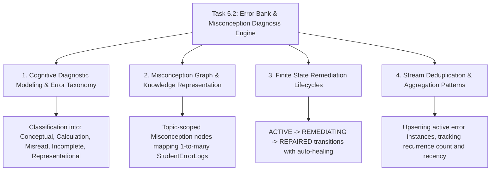

# Task 5.2: Error Bank & Misconception Diagnosis Engine — CS Domain Learning (Stage 3)

## 1. Domain Discovery Map

Task 5.2 touches four core computer science, educational knowledge representation, and cognitive diagnosis domains:



---

## 2. Domain Deep Dives

### Domain 1: Cognitive Diagnostic Modeling (CDM) & Error Taxonomy

**What Is It (Plain English):**  
Cognitive Diagnostic Modeling (CDM) is a branch of psychometrics that aims to diagnose the specific mental bugs, flawed heuristics, or missing procedural steps that cause a student to answer a question incorrectly. Rather than scoring an exam as a single numerical total ($70\%$), CDM treats learning as a multidimensional mastery vector of discrete cognitive attributes.

**Error Taxonomy Hierarchy:**
1. **`CONCEPTUAL`:** Deep misunderstanding of core scientific/mathematical definitions or physical laws (e.g. asserting that net force is required to keep an object in uniform motion, confusing Newton's 1st and 2nd laws).
2. **`CALCULATION`:** Flawed execution of arithmetic or algebraic procedures despite sound conceptual understanding (e.g. arithmetic mistake in denominator, wrong exponent operation).
3. **`MISREAD`:** Perceptual/parsing errors regarding given parameters or units (e.g. using centimeters as meters, overlooking "not" or "all except" in the stem).
4. **`INCOMPLETE`:** Premature termination of multi-step problem derivations (e.g. finding intermediate velocity $v_x$ but forgetting to compute resultant speed $\sqrt{v_x^2 + v_y^2}$).
5. **`REPRESENTATIONAL`:** Errors translating between representations (e.g. confusing velocity-time slope with position-time slope).

---

### Domain 2: Misconception Graph & Knowledge Representation (PRD §12, FR-012)

**What Is It (Plain English):**  
A misconception is a persistent, coherent, but scientifically inaccurate mental model held by a student. A single misconception (e.g. *"Heavier objects always fall faster in vacuum"*) can cause wrong answers across 20 completely different physics questions.  
By modeling `Misconception` as a distinct knowledge entity linked to topics in the curriculum DAG, we decouple the *symptom* (a wrong answer on Question #42) from the *disease* (Misconception #104).

---

### Domain 3: Finite State Remediation Lifecycles (Constraint #8)

**What Is It (Plain English):**  
In accordance with **PRD Non-Negotiable Constraint #8** (*"The system must not silently advance a student after a critical failure"*), student errors follow a rigorous finite state machine:
- **`ACTIVE`:** Error recently detected. Student has not yet addressed or practiced the remediation material.
- **`REMEDIATING`:** Student is currently engaged in Socratic tutoring, teach-back drills, or targeted review on this concept.
- **`REPAIRED`:** Student has demonstrated subsequent correct answers on questions testing the same concept or achieved topic mastery ($P(L_t) \ge 0.85$).

---

### Domain 4: Relational Deduplication & Upsert Patterns in Event Streams

**What Is It (Plain English):**  
When a student practices repeatedly and makes the same mistake three times in 10 minutes, generating three separate redundant database rows would pollute the error bank.  
Instead, the service executes an **Upsert Pattern**: It locates any existing `ACTIVE` error record for the `(student_id, question_id)` pair, increments `occurrence_count`, updates `last_occurred_at`, and preserves the historical trace.

---

## 3. Cross-Domain Connections

| Concept A | Concept B | Architectural Connection |
|:---|:---|:---|
| **`StudentErrorLog`** | **`MasteryEngineService` (Task 5.1)** | Automatically created during `record_attempt` when `is_correct == False`. |
| **`Misconception`** | **`Socratic Tutor Engine` (Epic 6)** | Injected into tutor prompt to guide Socratic dialogue toward repairing the specific flaw. |
| **`RepairStatus.ACTIVE`** | **`Spaced Repetition Engine` (Epic 7)** | Triggers high-priority retrieval cards for active unrepaired misconceptions. |
| **`ErrorCategory`** | **`Student Dashboard` (Task 5.3)** | Visualized on error taxonomy charts (e.g. 70% Calculation vs 30% Conceptual). |

---

## 4. Concept Evolution Timeline

```markdown
| Level | What You Might Think | Deeper Reality |
|:---|:---|:---|
| **Beginner** | "A wrong answer is just a score of 0." | Ignores the diagnostic signal embedded in the student's chosen distractor. |
| **Intermediate** | "Store a list of questions the student got wrong." | Fails to group related mistakes or categorize error types. |
| **Advanced** | "Classify errors into categories and link to questions." | Misses the root misconception graph and remediation lifecycle. |
| **Expert** | "Diagnostic Cognitive Modeling linking distractor rationales to topic Misconceptions with stateful repair tracking and automated healing." | Production-grade adaptive remediation system. |
```

---

## 5. Vocabulary Reference

| Term | Definition | Codebase Example |
|:---|:---|:---|
| **Distractor Rationale** | Diagnostic pedagogical explanation of why a wrong choice was selected. | `QuestionOption.distractor_rationale` |
| **Misconception** | Root conceptual error node in the curriculum knowledge graph. | `Misconception` SQLModel table |
| **Error Taxonomy** | Classification scheme for student mistakes. | `ErrorCategory` enum |
| **Repair State** | Current lifecycle status of an error ticket. | `RepairStatus` (`ACTIVE` / `REPAIRED`) |
| **Auto-Remediation** | Automatic retirement of active errors upon proving mastery. | `ErrorBankService.auto_resolve_topic_errors()` |

---

## 6. "What If" Thought Experiments

### Q1: What happens if an author didn't provide a distractor rationale for an incorrect option?
> **Answer:** `ErrorDiagnosticClassifier` inspects the question stem and topic title using heuristic pattern matching. It assigns `ErrorCategory.CONCEPTUAL` and associates a general topic-level misconception node, ensuring zero crashes or data loss.

### Q2: What if a student gets the same question wrong 4 times across different revision sessions?
> **Answer:** Rather than creating 4 duplicate rows, the system updates the existing `StudentErrorLog`, setting `occurrence_count = 4`, updating `last_occurred_at`, and flagging it as a "High Frequency Persistent Error" for Socratic intervention.

### Q3: How does the system prevent resolved errors from re-appearing?
> **Answer:** Once marked `REPAIRED`, the record is preserved in the database for historical analytics, but default dashboard queries filter by `repair_status == ACTIVE`, presenting only unresolved weaknesses to the student.

### Q4: Can an instructor inspect which misconceptions are most prevalent across all students?
> **Answer:** Yes, the relational schema enables instructors to aggregate `occurrence_count` across `misconceptions` and `student_error_logs` to identify class-wide curriculum bottlenecks.

---

## Workflow Checklist
- [x] Cognitive diagnostic concept map included.
- [x] Error taxonomy hierarchy defined in detail.
- [x] Misconception graph relationship explained.
- [x] Finite state machine repair lifecycle detailed.
- [x] Cross-domain connection matrix filled.
- [x] Concept evolution timeline documented.
- [x] Vocabulary reference table created.
- [x] 4 comprehensive "What If" scenarios analyzed.
