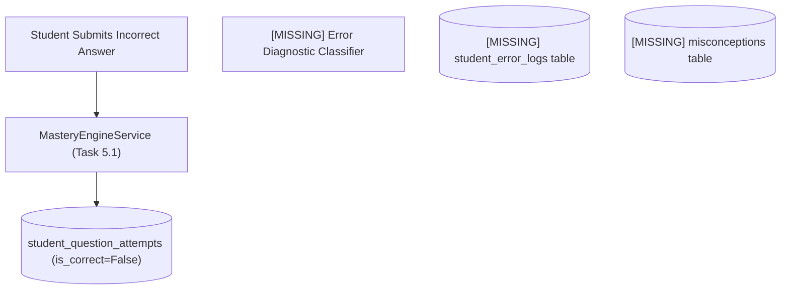
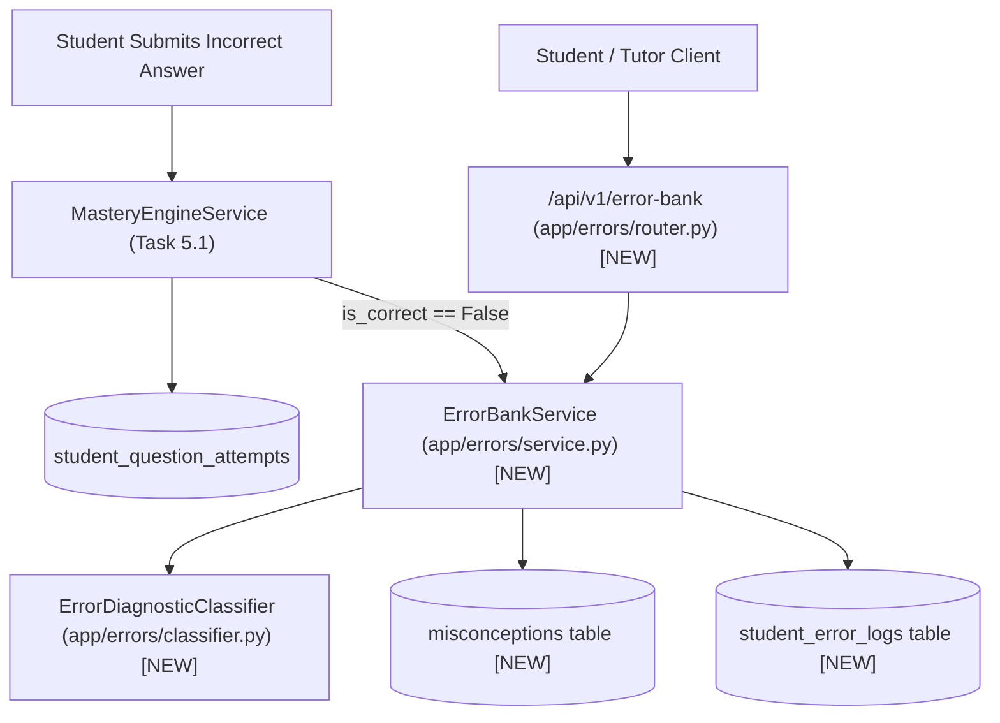
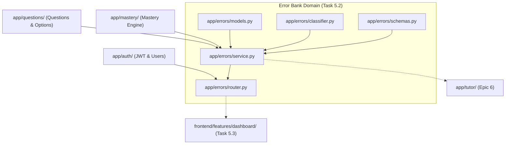

# Task 5.2: Error Bank & Misconception Diagnosis Engine — Codebase Design (Stage 2)

## 1. Current State Snapshot

Prior to Task 5.2:
- `backend/app/mastery/models.py` and `service.py` (Task 5.1) record student question attempts in `student_question_attempts` with `is_correct: bool`, but do not classify errors or capture distractor rationales.
- `backend/app/questions/models.py` (Task 4.1) stores `distractor_rationale` on `QuestionOption`, but there is no service or database table tracking active misconceptions or repair lifecycles.

### Before Architecture Diagram

---

## 2. Proposed State

Task 5.2 creates the `backend/app/errors/` domain package and integrates it with `backend/app/mastery/`:
1. `backend/app/errors/models.py`:
   - `ErrorCategory` Enum: `CONCEPTUAL`, `CALCULATION`, `MISREAD`, `INCOMPLETE`, `REPRESENTATIONAL`.
   - `RepairStatus` Enum: `ACTIVE`, `REMEDIATING`, `REPAIRED`.
   - `Misconception` SQLModel table `misconceptions`.
   - `StudentErrorLog` SQLModel table `student_error_logs`.
2. `backend/app/errors/classifier.py`:
   - `ErrorDiagnosticClassifier`: Analyzes distractor rationales and question metadata to classify the mistake into an `ErrorCategory` and extract/link a `Misconception`.
3. `backend/app/errors/schemas.py`:
   - Schemas: `StudentErrorLogResponse`, `StudentErrorDetailResponse`, `ErrorListResponse`, `MisconceptionResponse`, `RepairErrorRequest`.
4. `backend/app/errors/service.py`:
   - `ErrorBankService`: Methods for logging errors, resolving errors, querying student error history, and automatic topic-level remediation.
5. `backend/app/errors/router.py`:
   - Endpoints:
     - `GET /api/v1/error-bank`: List student errors with category, status, and topic filters.
     - `GET /api/v1/error-bank/{error_id}`: Detail view of specific error with remediation guidance.
     - `POST /api/v1/error-bank/{error_id}/repair`: Mark error as repaired.
     - `GET /api/v1/error-bank/misconceptions/topics/{topic_id}`: List known misconceptions for a topic.
6. `backend/app/mastery/service.py`:
   - Hooks into `record_attempt`: When `is_correct == False`, automatically invokes `ErrorBankService.log_error`. When topic mastery reaches $P \ge 0.85$, auto-resolves active topic errors.
7. `backend/app/api/v1/router.py`:
   - Mount `/api/v1/error-bank` router.

### After Architecture Diagram

---

## 3. File-Level Impact Analysis

### [NEW] `backend/app/errors/models.py`
- **Purpose:** SQLModels for diagnostic error tracking and misconception taxonomy.
- **Exports:**
  - `ErrorCategory` (Enum)
  - `RepairStatus` (Enum)
  - `Misconception` (SQLModel table `misconceptions`)
  - `StudentErrorLog` (SQLModel table `student_error_logs`)

### [NEW] `backend/app/errors/classifier.py`
- **Purpose:** Diagnostic classification logic for student errors and distractor rationales.
- **Exports:**
  - `ErrorDiagnosticClassifier`:
    - `classify_error(question, selected_option_key, distractor_rationale) -> Tuple[ErrorCategory, str, str]`

### [NEW] `backend/app/errors/schemas.py`
- **Purpose:** Pydantic validation schemas and API response models.
- **Exports:**
  - `StudentErrorLogResponse`
  - `StudentErrorDetailResponse`
  - `ErrorListResponse`
  - `MisconceptionResponse`
  - `RepairErrorRequest`

### [NEW] `backend/app/errors/service.py`
- **Purpose:** Error logging, querying, and remediation lifecycle service.
- **Exports:**
  - `ErrorBankService`:
    - `log_error(...) -> StudentErrorLog`
    - `resolve_error(...) -> StudentErrorLog`
    - `auto_resolve_topic_errors(...) -> int`
    - `list_student_errors(...) -> Tuple[List[StudentErrorLog], int]`
    - `get_error_detail(...) -> Optional[StudentErrorLog]`

### [NEW] `backend/app/errors/router.py`
- **Purpose:** REST API endpoints for error bank inspection and remediation.
- **Exports:**
  - `router` (`/error-bank` prefix)

### [NEW] `backend/app/errors/__init__.py`
- **Purpose:** Package exports.

### [MODIFY] `backend/app/mastery/service.py`
- **What changes:** Hook `ErrorBankService.log_error` into `record_attempt` on incorrect answers, and `ErrorBankService.auto_resolve_topic_errors` when topic is mastered.

### [MODIFY] `backend/app/api/v1/router.py`
- **What changes:** Include `errors_router` in master v1 API router.

### [NEW] `backend/tests/test_error_bank.py`
- **Purpose:** Unit and integration tests for error classification, distractor rationale extraction, recurring error aggregation, repair lifecycle, student tenant isolation, and API endpoints.

---

## 4. Dependency Graph / Blast Radius

---

## 5. Regression Risk Matrix

| Risk ID | Risk Description | Severity | Affected Area | Mitigation Strategy |
|:---|:---|:---:|:---|:---|
| **R-01** | Option has no distractor rationale | 🟢 Low | `ErrorDiagnosticClassifier` | Fallback to heuristic topic-level default misconception rather than failing. |
| **R-02** | Rapid repeated wrong answers inflate error logs | 🟡 Medium | `StudentErrorLog` | Upsert existing active error log by incrementing `occurrence_count` and updating timestamp. |
| **R-03** | Error bank query leaks other students' mistakes | 🔴 High | Multi-tenant Security | Strictly enforce `student_id == current_user.id` from JWT session on all queries. |

---

## 6. Contract Stability Check

| Contract / Endpoint | Status | Request Body | Response Shape | Breaking? |
|:---|:---:|:---:|:---|:---:|
| `GET /api/v1/error-bank` | **NEW** | None (Query params) | `ErrorListResponse` | No |
| `GET /api/v1/error-bank/{error_id}` | **NEW** | None | `StudentErrorDetailResponse` | No |
| `POST /api/v1/error-bank/{error_id}/repair` | **NEW** | `RepairErrorRequest` | `StudentErrorLogResponse` | No |
| `GET /api/v1/error-bank/misconceptions/topics/{topic_id}` | **NEW** | None | `List[MisconceptionResponse]` | No |
| Existing endpoints | Preserved | Preserved | Preserved | No |

---

## 7. Rollback Plan

### If Changes Are Uncommitted
1. `git restore backend/app/api/v1/router.py backend/app/mastery/service.py`
2. `Remove-Item -Recurse -Force backend/app/errors/ backend/tests/test_error_bank.py`

### If Changes Are Committed
1. `git revert HEAD`
2. `py -3.14 -m pytest backend/tests/`

---

## Workflow Checklist
- [x] Current-state snapshot documented.
- [x] Proposed-state description and After architecture diagram included.
- [x] Every affected file listed with impact analysis.
- [x] Blast-radius graph included.
- [x] Regression risks scored as 🔴 / 🟡 / 🟢.
- [x] Contract stability checked.
- [x] Rollback plan provided.
- [x] No code written.
