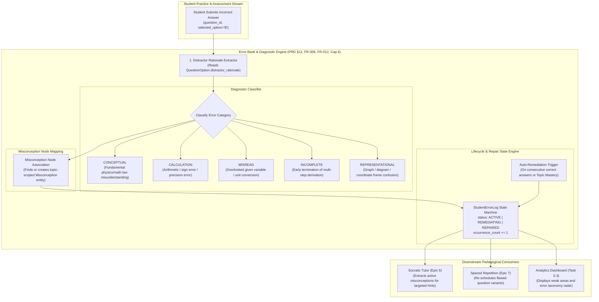
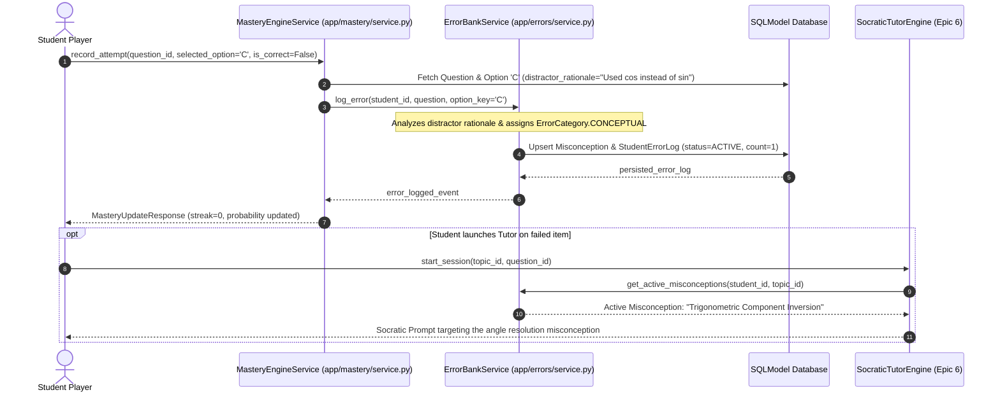

# Task 5.2: Error Bank & Misconception Diagnosis Engine — Conceptual Understanding (Stage 1)

## 1. Visual Architecture

---

## 2. The Physical Analogy

The Error Bank is like a **Formula 1 Telemetry Pit-Crew Log for a Race Driver**:
> When a racing driver spins out on Turn 4 (*submits an incorrect answer*), the telemetry engineers don't just write down "Driver failed" (*binary score = 0*).
> 
> Instead, they inspect the sensor logs (*the distractor rationale*):
> - Did the driver brake 50 meters too late (*A `CALCULATION` timing error*)?
> - Or did they fundamentally misunderstand the wet-tire grip coefficient (*A `CONCEPTUAL` misconception*)?
> - Or did they miss the yellow flag on the dash (*A `MISREAD` mistake*)?
> 
> The chief mechanic files an **Active Trouble Ticket** (*`StudentErrorLog(status=ACTIVE)`*). The race coach immediately pulls up targeted simulator drills (*Socratic Tutor & Spaced Revision*) focusing specifically on wet-tire dynamics. Once the driver nails Turn 4 cleanly across three consecutive hot laps (*demonstrates mastery*), the trouble ticket is stamped **`REPAIRED`**.

---

## 3. Why & What

### Why Are We Doing This Task?
PRD Non-Negotiable Constraint #8 states:  
> **"The system must not silently advance a student after a critical failure."** (PRD §5.4, §12, FR-006, FR-012, Cap 6).

In standard quizzing apps, mistakes are simply graded red, forgotten, and left unrepaired. In an intelligent adaptive tutor:
1. **Mistakes Are Diagnostic Assets:** An incorrect option chosen by a student reveals the exact cognitive flaw or computational misconception they possess.
2. **Eliminates Blind Practice:** Rather than practicing random problems, students remediate their verified weak spots.
3. **Feeds the Socratic Tutor (Epic 6):** Enables AI tutors to ask probing questions targeted at the student's active misconception without giving away the answer.

### What Is the Concept?
1. **Error Taxonomy Categorization:**
   - `CONCEPTUAL`: Misapplication of physical laws, definitions, or theorems.
   - `CALCULATION`: Arithmetic, algebraic manipulation, or trigonometric sign mistakes.
   - `MISREAD`: Overlooked parameters, units (e.g. km/h vs m/s), or wording.
   - `INCOMPLETE`: Stopped solving before reaching final answer.
   - `REPRESENTATIONAL`: Confusion in free-body diagrams, graphs, or vectors.
2. **Misconception Graph Integration:** Links multiple related errors across different questions to the same root cognitive misconception.
3. **Repair Lifecycle:** Tracks status (`ACTIVE` $\to$ `REMEDIATING` $\to$ `REPAIRED`) and occurrence frequency.
4. **Auto-Remediation:** Automatically retires active errors once subsequent mastery is proven.

---

## 4. Abstraction Level Map

| Level | What Lives Here | Current Project Implementation |
|:---|:---|:---|
| **Product / UX** | Student Error Bank Drawer, Misconception Tags, Remediation CTAs | `frontend/src/features/dashboard/` |
| **API** | `/api/v1/error-bank`, `/error-bank/{id}/repair` | `backend/app/errors/router.py` |
| **Orchestration / Service** | `ErrorBankService` logging mistakes & tracking repair states | `backend/app/errors/service.py` |
| **Classification Engine** | Diagnostic distractor analysis & misconception taxonomy matcher | `backend/app/errors/classifier.py` |
| **Persistence** | `StudentErrorLog` and `Misconception` SQLModels | `backend/app/errors/models.py` |
| **Database** | Relational tables (`student_error_logs`, `misconceptions`) | SQLite / PostgreSQL |

---

## 5. Mermaid Sequence Diagram

---

## 6. Data Flow Trace-Through

1. **Failure Event:** Student answers Question $Q_2$ on topic `top_projectile_motion` with Option `C`.
2. **Distractor Extraction:** Option `C` has `distractor_rationale = "Used cos(30) instead of sin(30) for vertical velocity component"`.
3. **Classification:**
   - The diagnostic classifier detects trigonometric component confusion $\implies$ `ErrorCategory.CONCEPTUAL`.
   - Maps to Misconception entity: `"Trigonometric Vector Component Resolution"`.
4. **Error Log Creation / Upsertion:**
   - If an active error for $(student, question)$ exists, `occurrence_count` increments from $1 \to 2$, `last_occurred_at` is updated.
   - Otherwise, creates new `StudentErrorLog(status=ACTIVE, occurrence_count=1)`.
5. **Auto-Remediation Trigger:**
   - When the student subsequently attempts a similar question on `top_projectile_motion` and answers correctly, or when topic mastery reaches $P \ge 0.85$, `ErrorBankService.auto_resolve_topic_errors()` marks the error as `REPAIRED`.

---

## 7. Cognitive Model → Code Mapping

| Cognitive Concept | Mental Model | Code Implementation | Enforcement / Guardrail |
|:---|:---|:---|:---|
| **Mistake Identification** | "What went wrong?" | `StudentErrorLog.distractor_rationale` | Captures diagnostic rationale from Task 4.1/4.2 |
| **Error Categorization** | "Was it a concept gap or a silly arithmetic slip?" | `ErrorCategory` enum | Differentiates conceptual bugs from careless typos |
| **Root Misconception** | "What underlying belief caused this error?" | `Misconception` SQLModel | Connects multiple mistakes to 1 root cause (FR-012) |
| **Remediation State** | "Is this flaw fixed or still active?" | `RepairStatus` (`ACTIVE` $\to$ `REPAIRED`) | Enforces PRD Constraint #8 (no silent advance) |

---

## 8. Five Alternative Approaches Compared

| # | Approach | Pros | Cons | Why Option 1 Was Chosen |
|:---|:---|:---|:---|:---|
| **1** | **Structured Distractor Taxonomy + Misconception Graph (Chosen)** | Diagnostic, zero LLM overhead during exam play, auditable, linkable to state machine | Requires authored distractor rationales | Standardized psychometric diagnostic pattern (PRD FR-006, FR-012) |
| **2** | Raw Text Log of Incorrect Attempts | Trivial storage | No structured categorization or remediation tracking | Disqualified: Lacks diagnostic depth |
| **3** | Pure LLM Mistake Analysis on Every Answer | Free-form explanations | High latency (1-2s per answer), expensive API costs | Disqualified: Degrades exam taking latency |
| **4** | Global Count of Total Wrong Answers | Simple integer | Zero pedagogical actionable insight | Disqualified: Useless for Socratic repair |
| **5** | Binary Pass/Fail Flag on Question | Minimal DB footprint | Cannot track recurring misconceptions across topics | Disqualified: Fails PRD FR-006 |

---

## 9. Production Rationale & Disaster Scenarios

### Disaster 1: The Invisible Misconception Blindspot
> A student repeatedly confuses electric field $\vec{E}$ with electric potential $V$. In an uninstrumented platform, the student gets 10 different problems wrong across 3 weeks with no pattern detected. With the Error Bank, the system clusters all 10 errors under the `Electric Field vs Potential` misconception node, alerts the student, and triggers a targeted Socratic repair session.

### Disaster 2: The Zombie Error Pollution
> A student makes an arithmetic typo on an easy problem, but practices and masters 50 advanced problems afterward. Without lifecycle auto-remediation, the student's dashboard would permanently display red warning badges for mistakes made weeks ago. The Error Bank's auto-repair engine updates the status to `REPAIRED` as soon as subsequent competence is proven.

---

## Workflow Checklist
- [x] Error Bank & diagnostic classifier visual architecture diagram included.
- [x] F1 pit-crew telemetry physical analogy included.
- [x] Why/what/what-breaks explained thoroughly.
- [x] Abstraction level table filled with current project stack.
- [x] Sequence diagram for attempt error logging and tutor integration included.
- [x] Data-flow trace-through completed step-by-step.
- [x] Cognitive model to code mapping table completed.
- [x] 5 alternatives compared.
- [x] 2 concrete disaster scenarios described.
