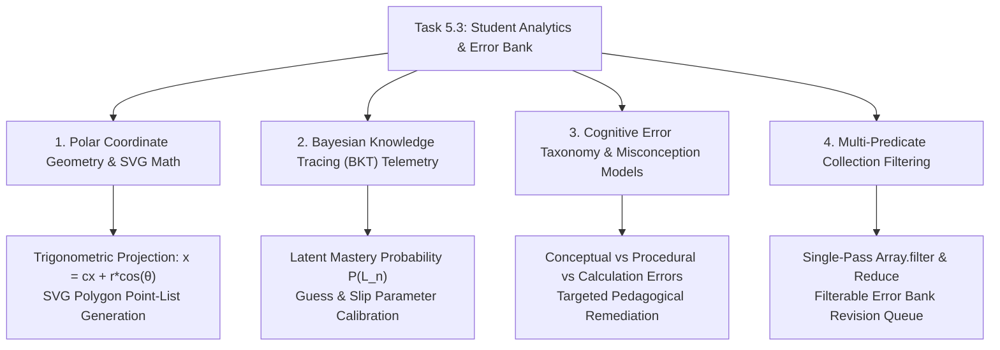

# Stage 3: CS Domain Learning Extraction
## Task 5.3: Student Analytics Dashboard, Mastery Radar & Error Bank UI `[FRONTEND]`

**Task ID:** Task 5.3  
**Track:** Frontend Track (React 18+ / TypeScript / Vite / Zustand / KaTeX / SVG Math)  
**Epic:** Epic 5 — Adaptive Mastery Engine & Knowledge Tracing  
**Accepted Decision Basis:** [ADR-008: Frontend Framework & UI Ecosystem](file:///c:/Users/Muhammad/OneDrive%20-%20Higher%20Education%20Commission/Desktop/AI%20Tutor/Feynman_tutorAI/docs/adr/ADR-008-frontend-framework-and-ui-stack.md), [DESIGN_SYSTEM_TYPOGRAPHY.md](file:///c:/Users/Muhammad/OneDrive%20-%20Higher%20Education%20Commission/Desktop/AI%20Tutor/Feynman_tutorAI/docs/frontend_design/DESIGN_SYSTEM_TYPOGRAPHY.md)

---

## 1. Domain Discovery Map



---

## 2. Domain Deep Dives

### Domain 1: Polar Coordinate Geometry & SVG Radar Math

**What Is It (Plain English):**  
A Spider/Radar chart visualizes multiple independent dimensions (e.g. 5 physics topics) radiating from a central point. To draw this natively in Scalable Vector Graphics (SVG) without bloated 3rd-party charting libraries, we convert polar coordinates \( (r, \theta) \) into 2D screen Cartesian coordinates \( (x, y) \).

**Mathematical Derivation:**
For \( N \) topic axes centered at \( (cx, cy) \) with maximum radius \( R \):
1. **Angular Step for Axis \( i \):**
   \[
   \theta_i = \frac{2\pi i}{N} - \frac{\pi}{2} \quad (\text{subtracting } \frac{\pi}{2} \text{ rotates axis 0 to the top})
   \]
2. **Radial Distance for Normalized Mastery Percentage \( m_i \in [0, 1] \):**
   \[
   r_i = R \cdot m_i
   \]
3. **Cartesian Coordinates:**
   \[
   x_i = cx + r_i \cos(\theta_i), \quad y_i = cy + r_i \sin(\theta_i)
   \]
4. **SVG Polygon String:**
   \[
   \text{points} = \text{"}x_0,y_0 \quad x_1,y_1 \quad \dots \quad x_{N-1},y_{N-1}\text{"}
   \]

**TypeScript Code Implementation:**
```typescript
export const getPolygonPoints = (
  values: number[], // 0 to 100
  cx: number,
  cy: number,
  radius: number
): string => {
  const n = values.length;
  return values
    .map((val, i) => {
      const angle = (2 * Math.PI * i) / n - Math.PI / 2;
      const r = radius * (val / 100);
      const x = cx + r * Math.cos(angle);
      const y = cy + r * Math.sin(angle);
      return `${x.toFixed(1)},${y.toFixed(1)}`;
    })
    .join(" ");
};
```

---

### Domain 2: Bayesian Knowledge Tracing (BKT)

**What Is It (Plain English):**  
Instead of simple test percentages, modern adaptive learning uses **Bayesian Knowledge Tracing (BKT)** to estimate the latent probability \( P(L_n) \) that a student has truly internalized a concept, taking into account:
- \( P(G) \) (**Guess probability**): Answering correctly by random chance.
- \( P(S) \) (**Slip probability**): Knowing the concept but making an inadvertent typo.
- \( P(T) \) (**Learn transition**): Probability of mastering the skill during the current problem.

---

### Domain 3: Cognitive Error Taxonomy

**What Is It (Plain English):**  
Not all wrong answers are equal. Grouping errors by cognitive root causes enables surgical remediation:
1. 🔴 **Conceptual Misconception:** Mental model contradiction (e.g. believing heavier objects fall faster in a vacuum).
2. 🟡 **Formula Misapplication:** Attempting to use constant-acceleration kinematics \( v = u + at \) during non-constant force motions.
3. 🔵 **Calculation Slip:** Arithmetic error while having perfect conceptual understanding.

---

## 3. Vocabulary Reference

| Term | Definition | Codebase Location |
| :--- | :--- | :--- |
| **`MasteryRadarChart`** | Native SVG component rendering multi-axis polar competency. | `frontend/src/components/analytics/MasteryRadarChart.tsx` |
| **`ErrorBankItem`** | Structured data model for an incorrect attempt and its misconception. | `frontend/src/types/analytics.ts` |
| **`BKT Probability`** | Knowledge Tracing score (\( p_k \in [0.0, 1.0] \)) indicating concept mastery. | `frontend/src/types/analytics.ts` |
