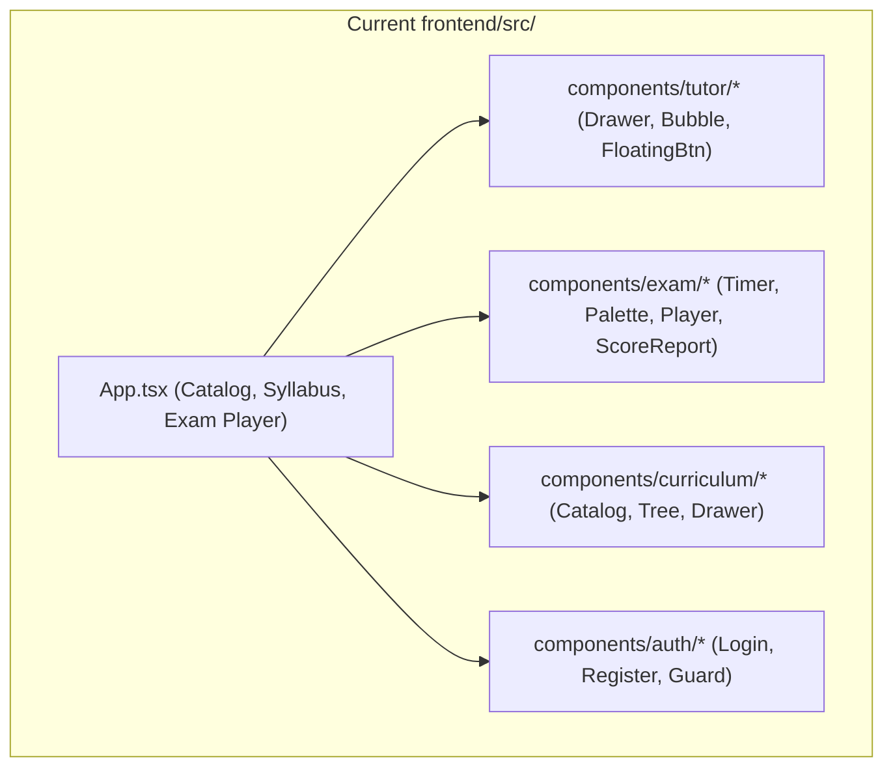
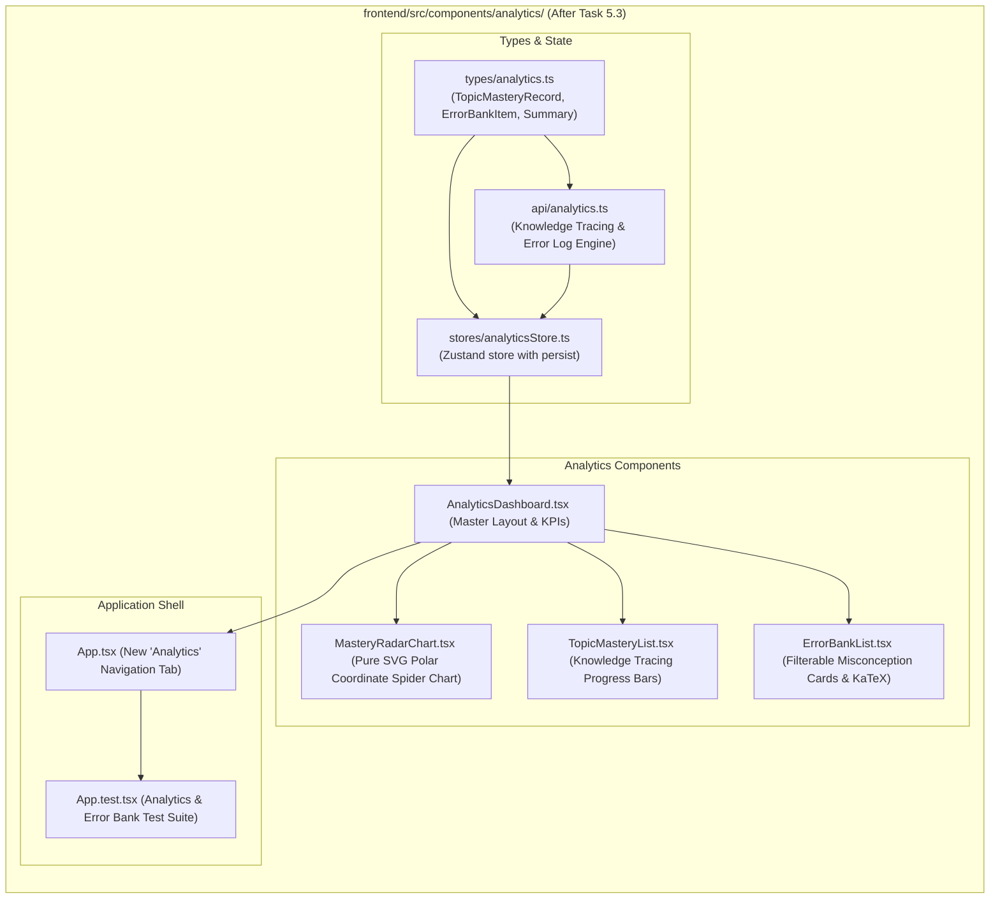

# Stage 2: Codebase Design Artifact
## Task 5.3: Student Analytics Dashboard, Mastery Radar & Error Bank UI `[FRONTEND]`

**Task ID:** Task 5.3  
**Track:** Frontend Track (React 18+ / TypeScript / Vite / Zustand / KaTeX / SVG Math)  
**Epic:** Epic 5 — Adaptive Mastery Engine & Knowledge Tracing  
**Accepted Decision Basis:** [ADR-008: Frontend Framework & UI Ecosystem](file:///c:/Users/Muhammad/OneDrive%20-%20Higher%20Education%20Commission/Desktop/AI%20Tutor/Feynman_tutorAI/docs/adr/ADR-008-frontend-framework-and-ui-stack.md), [DESIGN_SYSTEM_TYPOGRAPHY.md](file:///c:/Users/Muhammad/OneDrive%20-%20Higher%20Education%20Commission/Desktop/AI%20Tutor/Feynman_tutorAI/docs/frontend_design/DESIGN_SYSTEM_TYPOGRAPHY.md)

---

## 1. Current State Snapshot

Currently, `frontend/src/` features authentication, curriculum catalog & tree explorer, an interactive timed exam player, and the Socratic AI Tutor drawer. There is no dedicated Analytics Dashboard, multi-axis Mastery Radar chart, or centralized Error Bank with misconception tracking.



* **Verified Fact:** `frontend/` has passing Vitest suite (16 of 16 passed).
* **Verified Fact:** `frontend/` is 100% directory-isolated from `backend/`.

---

## 2. Proposed State

After Task 5.3 execution, `frontend/src/` will feature a **Student Analytics & Error Bank Subsystem** with an SVG Polar Radar chart, topic-by-topic Bayesian knowledge tracing metrics, and a categorized Error Bank with 1-click Socratic remediation triggers.



---

## 3. File-Level Impact Analysis

All files are `[NEW]` or `[MODIFY]` strictly inside `frontend/` (0 touches to `backend/`).

### 3.1 Data Structures & State Management
#### [NEW] `frontend/src/types/analytics.ts`
* **Purpose:** TypeScript types defining student mastery telemetry:
  - `ErrorCategory`: `'conceptual' | 'formula' | 'calculation'`
  - `TopicMasteryRecord`: `{ topicId, topicTitle, syllabusCode, accuracyPercentage, bktProbability, totalAttempted, masteryTier, bloomLevel }`
  - `ErrorBankItem`: `{ id, topicId, topicTitle, category, problemStemLatex, studentAnswer, correctAnswer, explanationLatex, misconceptionTag, misconceptionDetail, isResolved, dateRecorded }`
  - `StudentAnalyticsSummary`: `{ overallReadinessPercentage, estimatedGradeBand, totalSolved, overallAccuracy, streakDays, activeMisconceptionsCount }`
  - `AnalyticsState`: Zustand store interface.

#### [NEW] `frontend/src/stores/analyticsStore.ts`
* **Purpose:** Zustand store managing:
  - `summary: StudentAnalyticsSummary`
  - `topicMasteryRecords: TopicMasteryRecord[]`
  - `errorBankItems: ErrorBankItem[]`
  - `selectedCategoryFilter: string`
  - `selectedTopicFilter: string`
  - **Actions:** `setCategoryFilter()`, `setTopicFilter()`, `resolveErrorItem()`, `resetAnalytics()`.

#### [NEW] `frontend/src/api/analytics.ts`
* **Purpose:** API client providing rich dataset for Cambridge Physics & AP Calculus analytics with:
  - Topic mastery records across Mechanics, Energy, Waves, Doppler, Gravitation.
  - Categorized Error Bank items with formulas rendered in KaTeX.

---

### 3.2 UI Components
#### [NEW] `frontend/src/components/analytics/MasteryRadarChart.tsx`
* **Purpose:** Dependency-free SVG polar coordinate spider chart rendering:
  - Concentric polygon grid rings (20%, 40%, 60%, 80%, 100%).
  - Axis spokes and topic labels.
  - Filled semi-transparent emerald/indigo polygon displaying student mastery.

#### [NEW] `frontend/src/components/analytics/TopicMasteryList.tsx`
* **Purpose:** Detailed progress bars for syllabus topics showing accuracy %, Bayesian Knowledge Tracing probability (\( p_k \)), Bloom cognitive level, and mastery status badges.

#### [NEW] `frontend/src/components/analytics/ErrorBankList.tsx`
* **Purpose:** Filterable error log with category pills (*All, Conceptual Flaws, Formula Misapplications, Calculation Slips*), expandable error cards with KaTeX problem stems, wrong answer vs correct key, and "Debug with Socratic AI" triggers.

#### [NEW] `frontend/src/components/analytics/AnalyticsDashboard.tsx`
* **Purpose:** Orchestrates the top readiness gauge, KPI metric cards, split-pane radar + topic list, and the Error Bank.

---

### 3.3 Root App & Tests
#### [MODIFY] `frontend/src/App.tsx`
* **Purpose:** Add **"Analytics & Errors"** tab to desktop header switcher and mobile nav.

#### [MODIFY] `frontend/src/App.test.tsx`
* **Purpose:** Vitest test suite verifying:
  - Switching to Analytics tab.
  - Readiness score card and KPI metrics.
  - SVG Mastery Radar chart rendering with topic points.
  - Topic mastery breakdown bars.
  - Error Bank filtering by category (Conceptual vs Calculation).
  - Socratic drawer summon with pre-loaded error context.

---

## 4. Dependency Graph / Blast Radius

```mermaid
graph TD
    subgraph AnalyticsSubsystem ["frontend/src/components/analytics/ (Isolated)"]
        Types[types/analytics.ts] --> Store[stores/analyticsStore.ts]
        Types --> API[api/analytics.ts]
        Store --> Radar[MasteryRadarChart.tsx]
        Store --> TopicList[TopicMasteryList.tsx]
        Store --> ErrorBank[ErrorBankList.tsx]
        Radar --> Main[AnalyticsDashboard.tsx]
        TopicList --> Main
        ErrorBank --> Main
        Main --> App[App.tsx]
        App --> Tests[App.test.tsx]
    end

    subgraph BackendAPI ["backend/ (Directory Isolation)"]
        BackendAnalytics["/api/v1/analytics/*"]
    end

    AnalyticsSubsystem -.->|Zero Cross-Track Impact (Isolated)| BackendAPI
```

---

## 5. Regression Risk Matrix

| Risk ID | Risk Description | Severity | Affected Area | Mitigation Strategy |
| :--- | :--- | :---: | :--- | :--- |
| **R-01** | Division by zero in SVG radar if topic count is 0 | 🟢 Low | Radar Chart | Default to minimum polygon with fallback empty state if topics array is empty. |
| **R-02** | Error Bank filter showing 0 items | 🟢 Low | Error Bank UI | Render friendly empty state with "No errors found in this category!" |
| **R-03** | LocalStorage state corruption | 🟢 Low | Store Hydration | Zustand `persist` handles parse errors with fallback defaults. |

---

## 6. Rollback Plan

```powershell
git checkout -- frontend/src/
Remove-Item -Recurse -Force frontend/src/components/analytics/
Remove-Item -Force frontend/src/stores/analyticsStore.ts
Remove-Item -Force frontend/src/types/analytics.ts
Remove-Item -Force frontend/src/api/analytics.ts
```
Estimated rollback time: < 1 minute.
