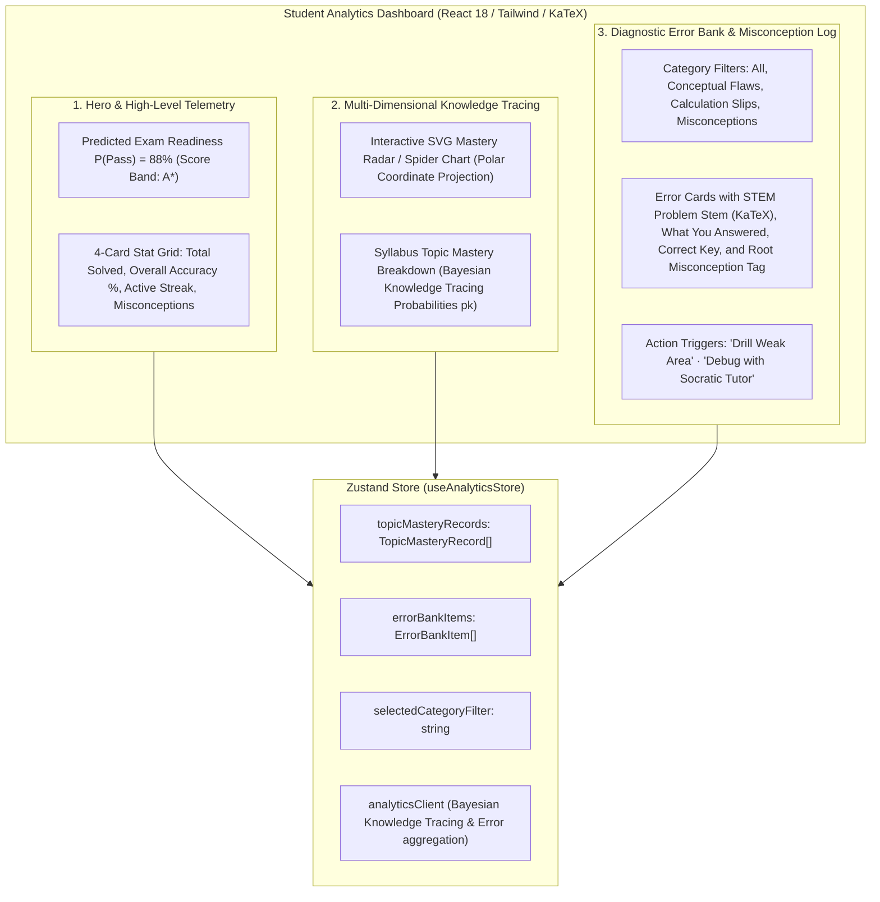
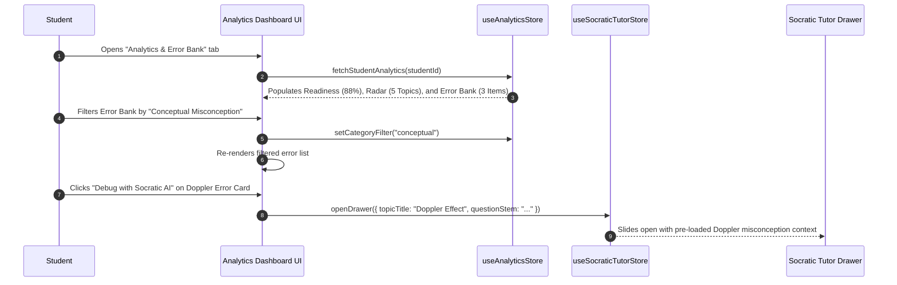

# Stage 1: Conceptual Understanding Artifact
## Task 5.3: Student Analytics Dashboard, Mastery Radar & Error Bank UI `[FRONTEND]`

**Task ID:** Task 5.3  
**Track:** Frontend Track (React 18+ / TypeScript / Vite / Zustand / KaTeX / SVG Math)  
**Epic:** Epic 5 — Adaptive Mastery Engine & Knowledge Tracing  
**Accepted Decision Basis:** [ADR-008: Frontend Framework & UI Ecosystem](file:///c:/Users/Muhammad/OneDrive%20-%20Higher%20Education%20Commission/Desktop/AI%20Tutor/Feynman_tutorAI/docs/adr/ADR-008-frontend-framework-and-ui-stack.md), [DESIGN_SYSTEM_TYPOGRAPHY.md](file:///c:/Users/Muhammad/OneDrive%20-%20Higher%20Education%20Commission/Desktop/AI%20Tutor/Feynman_tutorAI/docs/frontend_design/DESIGN_SYSTEM_TYPOGRAPHY.md)

---

## 1. Visual Architecture

---

## 2. The Physical Analogy

> Think of the **Student Analytics Dashboard & Error Bank** like an **Aviation Flight Telemetry Console & Incident Black-Box Recorder**.
> 1. In a flight simulator, the heads-up display shows your overall flight competency across all flight phases (**Mastery Radar**: Takeoff, Navigation, Stall Recovery, Crosswind Landing).
> 2. When you make an error (e.g., over-correcting rudder on a windy approach), the simulator doesn't just stamp *"Failed"*; the black-box captures the exact sensor telemetry into the **Incident Log** (**Error Bank**), explaining *why* the maneuver was unstable (Misconception: *"Conflating roll with yaw control"*).
> 3. The instructor can immediately press a button to replay the scenario with guided flight corrections (**Review with Socratic AI Tutor**).

---

## 3. Why & What

### Why are we doing this task?
1. **Targeted Mastery vs. Blind Practice (PRD Cap 5, FR-001, FR-002):** Doing 50 random practice questions is ineffective if a student already masters Kinematics but continuously fails Wave Superposition. Visual analytics focus student time on high-leverage weak areas.
2. **Transforming Mistakes into Learning Assets:** An Error Bank turns every incorrect answer from a point of frustration into a structured learning asset with root-cause misconception diagnosis.
3. **Transparent Readiness Prediction:** Students need explainable, calibrated predictions of their exam readiness (e.g. *88% probability of achieving A\** on Cambridge Physics).

### What is the concept?
An all-in-one **Student Analytics Dashboard & Error Bank** featuring:
- **SVG Mastery Radar Chart:** Lightweight, dependency-free polar coordinate polygon visualization rendering topic mastery dimensions.
- **Bayesian Knowledge Tracing Progress:** Tracks estimated mastery probability (\( p_k \)) and Bloom cognitive level per topic.
- **Categorized Error Bank:** Filterable log of incorrect answers detailing the problem stem with KaTeX, student vs. correct answer, and misconception explanation.
- **Instant Remediation:** 1-click triggers to launch targeted practice or open the Socratic Tutor for immediate debugging.

### What breaks if we skip this?
- Students have no high-level view of their strengths and weaknesses.
- Incorrect answers in practice exams are lost after submission without an auditable revision queue.
- Learning is uncalibrated and non-adaptive.

---

## 4. Abstraction Level Map

| Level | What Lives Here | Current Project Example | Touched by Task 5.3? |
| :--- | :--- | :--- | :---: |
| **Product / UX** | Analytics Dashboard Tab, Mastery Radar, Topic Progress, Error Bank Cards | New `Analytics` Tab in App shell | 🔵 **PRIMARY FOCUS** |
| **Application** | Analytics Store, Error filter reducer, Topic accuracy calculator | `src/stores/analyticsStore.ts`, `src/components/analytics/` | 🔵 **PRIMARY FOCUS** |
| **Framework** | SVG Polar Radar component, Filter tabs, KaTeX math cards | `MasteryRadarChart.tsx`, `ErrorBankList.tsx` | 🔵 **PRIMARY FOCUS** |
| **Library** | `KaTeX`, `lucide-react`, `zustand`, Tailwind CSS | `@/components/ui/card`, `LaTeXRenderer` | 🔵 Used heavily |
| **Runtime** | Trigonometric math for SVG polar coordinates (`cos`, `sin`) | Vector polygon calculation | 🔵 Precision math |
| **Infrastructure** | Backend Knowledge Tracing & Error Bank API | `/api/v1/analytics/mastery` | ⚪ Backend Contract |

---

## 5. Sequence Diagrams

### Diagram 1: Analytics Aggregation & Error Bank Remediation

---

## 6. Data Flow Trace-Through

1. **Hydration:** `useAnalyticsStore` aggregates completed exam attempts and diagnostic questions into `TopicMasteryRecord[]` and `ErrorBankItem[]`.
2. **Radar Geometry:** For \( N \) syllabus topics, polar coordinates are computed:
   \[
   \theta_i = \frac{2\pi i}{N} - \frac{\pi}{2}, \quad x_i = cx + r \cdot \left(\frac{\text{pct}_i}{100}\right) \cdot \cos(\theta_i), \quad y_i = cy + r \cdot \left(\frac{\text{pct}_i}{100}\right) \cdot \sin(\theta_i)
   \]
3. **Error Categorization:** Errors are tagged with cognitive root causes:
   - 🔴 **Conceptual Flaw:** Fundamental misunderstanding of governing physical law.
   - 🟡 **Formula Misapplication:** Correct concept, incorrect equation setup.
   - 🔵 **Calculation Slip:** Correct setup, algebraic/arithmetic arithmetic error.
4. **Remediation Trigger:** Clicking "Debug with Socratic AI" launches `useSocraticTutorStore.getState().openDrawer(...)` with the exact problem stem and misconception text.

---

## 7. Cognitive Model → Code Mapping

| Cognitive Stage | Mental Model | Code Concept in Feynman Frontend | Concrete Guardrail |
| :--- | :--- | :--- | :--- |
| **1. Macro View** | "How ready am I for the real exam?" | `ReadinessScoreCard` (\( P(\text{Pass}) \)) | Calibrated percentage & grade band |
| **2. Multi-Axis Mastery** | "Which physics domains am I strong in?" | `MasteryRadarChart` (SVG Polygon) | Polar axis per syllabus topic |
| **3. Diagnostic Drilldown** | "What exact mistakes did I make?" | `ErrorBankList` (Filterable cards) | Problem stem with KaTeX + explanations |
| **4. Corrective Action** | "Help me fix this specific mistake now" | Socratic drawer bridge | Contextual summon with 1 click |

---

## 8. Five Alternative Approaches Evaluated

| # | Approach | Pros | Cons | Verdict |
|:---|:---|:---|:---|:---|
| **1** | **Native SVG Polar Radar + Zustand + KaTeX Error Bank (Approved)** | Zero extra bundle weight (no heavy charting libs), crisp SVG scaling, full STEM math | Requires pure trigonometric math | ✅ **RECOMMENDED (ADR-008)** |
| **2** | **Heavy Charting Library (Chart.js / Highcharts)** | Pre-built animations | Adds 150KB+ bundle weight; poor SSR/KaTeX integration | ❌ Too heavy |
| **3** | **Simple Table without Visual Charts** | Simple code | Boring, fails to give students an intuitive multi-axis mental model | ❌ Low engagement |
| **4** | **Ephemeral Mistakes (Not Saved)** | Easy to implement | Students forget why they got problems wrong; no revision queue | ❌ Violates PRD |
| **5** | **Plain Text Explanations without LaTeX** | Easy to render | Physics/Math formulas look corrupted or unreadable | ❌ Incompatible with STEM |

---

## 9. Production Rationale & Disaster Scenarios

### Why This Is Standard:
Elite test prep platforms (Khan Academy Mastery, UWorld Performance, Bluebook Analytics) rely on visual radar profiles and categorised error banks to achieve rapid student score gains.
