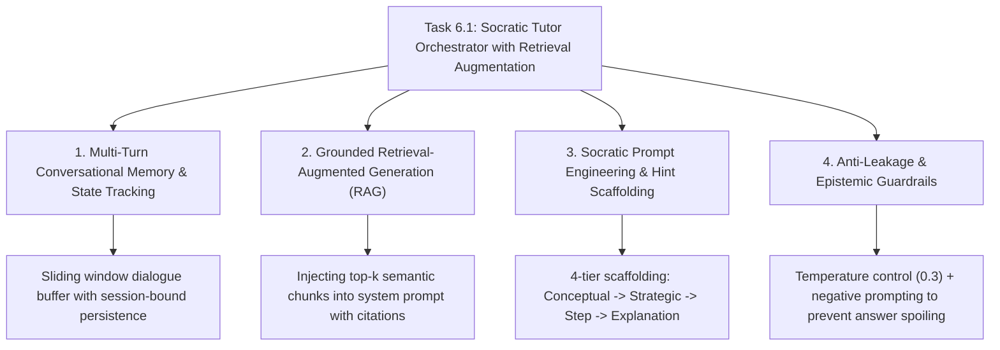

# Task 6.1: Socratic Tutor Orchestrator with Retrieval Augmentation — CS Domain Learning (Stage 3)

## 1. Domain Discovery Map

Task 6.1 connects core computer science, conversational AI, information retrieval, and educational psychology domains:



---

## 2. Domain Deep Dives

### Domain 1: Multi-Turn Conversational Memory & Sliding Window Buffers

**What Is It (Plain English):**  
Large Language Models are stateless functions: when you send a prompt, the model has zero recollection of what happened in the previous message. To create the illusion of a continuous conversation, the backend must maintain conversational history.  
However, naively appending 50 past messages would blow through token context limits and degrade prompt quality.  
We implement a **Sliding Window Buffer**: We query the latest $N$ messages (e.g. 6 turns = 3 user queries + 3 assistant responses) and serialize them chronologically into the LLM context prompt.

---

### Domain 2: Grounded Retrieval-Augmented Generation (RAG) (PRD §14.3, FR-008)

**What Is It (Plain English):**  
Standard foundation LLMs are trained on general internet data and can hallucinate fake equations or inaccurate curriculum facts. RAG solves this by retrieving exact textbook paragraphs from our vector database (`curriculum_chunks`) and placing them directly into the LLM's prompt before generation begins.  
The prompt instructs the model: *"You are an academic tutor. Use ONLY the grounded facts provided below to guide the student. Attribute every theorem to its source chunk."*

---

### Domain 3: Socratic Prompt Engineering & Hint Scaffolding

**What Is It (Plain English):**  
In classical Greek philosophy, the **Socratic Method** involves asking targeted, thought-provoking questions to help an interlocutor discover contradictions in their own logic or arrive at truth through their own reasoning.  
In educational technology, this is formalized as **Scaffolding (Zone of Proximal Development)**:
1. **Tier 1 (Conceptual Hint):** Activates background knowledge. (e.g., *"What is the definition of work done by a force?"*)
2. **Tier 2 (Strategic Hint):** Suggests the path of attack. (e.g., *"Can we use the conservation of mechanical energy here instead of kinematic equations?"*)
3. **Tier 3 (Step Hint):** Guides the immediate calculation step without giving the number. (e.g., *"Write down the equation setting initial kinetic energy equal to work done by friction."*)
4. **Tier 4 (Explanation):** Full worked solution (unlocked only in post-test analysis).

---

### Domain 4: Anti-Leakage & Epistemic Guardrails (Constraint #1, #5, #10)

**What Is It (Plain English):**  
Students will frequently ask adversarial questions: *"Just give me the answer"*, *"What is option A or B?"*, or *"Solve for x"*.  
Anti-leakage guardrails enforce that the system prompt overrides student pressure:
- System prompt rule: *"Under NO circumstances state the final numerical answer or the correct MCQ option letter directly. Always respond with a guiding Socratic question."*
- Temperature tuning: Set `temperature = 0.3` to ensure disciplined, deterministic adherence to instructions.

---

## 3. Cross-Domain Connections

| Concept A | Concept B | Architectural Connection |
|:---|:---|:---|
| **`SocraticTutorService`** | **`GroundedRetrievalService` (Task 3.3)** | Fetches top-$k$ relevant textbook chunks to ground the tutor's explanations. |
| **`SocraticTutorService`** | **`MasteryEngineService` (Task 5.1)** | Injects student mastery probability $P(L_t)$ to adapt explanation complexity. |
| **`SocraticTutorService`** | **`ErrorBankService` (Task 5.2)** | Injects active student misconceptions to directly remediate persistent cognitive traps. |
| **`TutorSession`** | **`TutorMessage`** | 1-to-many relational tables persisting dialogue turns for auditability (FR-025). |

---

## 4. Concept Evolution Timeline

```markdown
| Level | What You Might Think | Deeper Reality |
|:---|:---|:---|
| **Beginner** | "Send user prompt directly to ChatGPT API." | Leaks answers, hallucinates math, lacks history or context. |
| **Intermediate** | "Store messages in a list and append them to prompt." | Blows token limit; still lacks curriculum grounding. |
| **Advanced** | "Retrieve vector chunks and pass them to LLM." | Better, but lacks student mastery awareness or misconception targeting. |
| **Expert** | "Grounded RAG + Sliding Window Dialog Memory + Mastery & Error Bank State Injection + 4-Tier Socratic Guardrails." | Production-grade adaptive tutor engine. |
```

---

## 5. Vocabulary Reference

| Term | Definition | Codebase Example |
|:---|:---|:---|
| **Scaffolding** | Progressive assistance given to a learner to help them solve problems independently. | `HintLevel.CONCEPTUAL` |
| **Sliding Window Buffer** | Memory management retaining the latest $N$ conversational turns. | `SocraticTutorService._get_recent_history()` |
| **Grounded Prompt** | System prompt augmented with retrieved textbook chunks. | `GroundedRetrievalService.retrieve_grounded_context()` |
| **Anti-Leakage Guardrail** | System constraint preventing the LLM from outputting direct answers. | `SYSTEM_PROMPT_INVARIANTS` |
| **KaTeX Formatting** | Standard mathematical notation syntax using `$...$` for inline and `$$...$$` for block math. | `SocraticResponse.content` |

---

## 6. "What If" Thought Experiments

### Q1: What if a student explicitly types "Please just give me the answer, I'm taking a test"?
> **Answer:** The Socratic guardrail prompt detects direct answer requests and politely redirects: *"I cannot give you the final answer directly, but I can help you figure it out! Let's start with the first step: what physical principle connects force and acceleration?"*

### Q2: What if the vector store returns zero chunks for an obscure query?
> **Answer:** `GroundedRetrievalService` handles empty results gracefully; the tutor falls back to its core pedagogical reasoning while maintaining Socratic guiding rules and flagging the response as general knowledge rather than source-grounded fact.

### Q3: What if a student converses for 50 turns in a single session?
> **Answer:** The sliding window buffer pulls only the last 6 turns for LLM generation, preventing prompt token bloat while the database retains all 50 turns for student review and analytics.

### Q4: How does the tutor handle a student who has a known active misconception from the Error Bank?
> **Answer:** If the Error Bank flags `MISC_TRIG_INVERSION` (confusing $\sin$ and $\cos$), the tutor orchestrator injects: *"Student has active misconception: Confuses sin and cos on inclined planes. Ask a guiding question specifically about the angle between gravity and the slope normal."*

---

## Workflow Checklist
- [x] Socratic orchestrator concept map included.
- [x] Sliding window dialogue memory explained.
- [x] Grounded RAG integration detailed.
- [x] 4-tier Socratic scaffolding hierarchy defined.
- [x] Anti-leakage guardrails explained.
- [x] Cross-domain connection matrix filled.
- [x] Concept evolution timeline documented.
- [x] Vocabulary reference table created.
- [x] 4 comprehensive "What If" scenarios analyzed.
