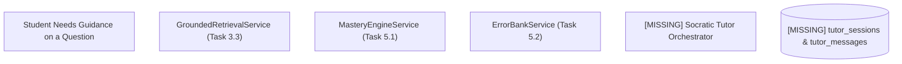
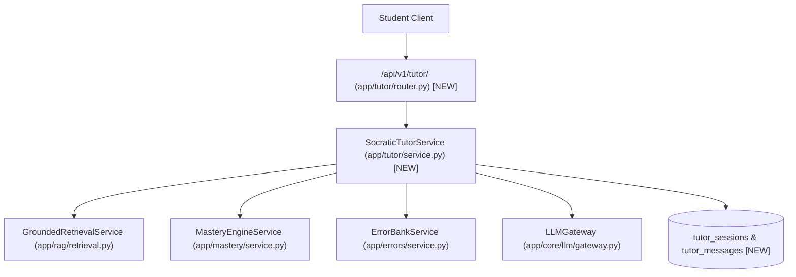
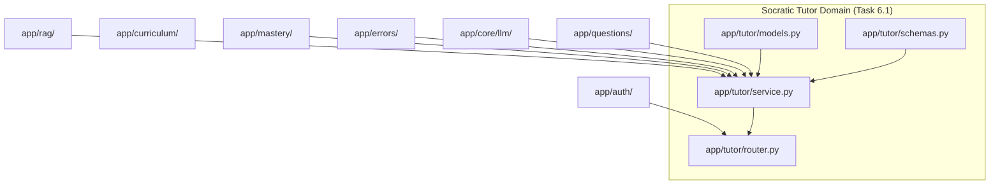

# Task 6.1: Socratic Tutor Orchestrator with Retrieval Augmentation — Codebase Design (Stage 2)

## 1. Current State Snapshot

Prior to Task 6.1:
- `backend/app/rag/retrieval.py` (Task 3.3) provides vector search and source citations via `GroundedRetrievalService`.
- `backend/app/mastery/` (Task 5.1) tracks student topic mastery probabilities $P(L_t)$.
- `backend/app/errors/` (Task 5.2) records diagnostic student mistakes and active misconceptions.
- However, there is **no conversational Socratic dialogue engine**, session persistence model, or prompt orchestrator bridging these domains to guide students.

### Before Architecture Diagram

---

## 2. Proposed State

Task 6.1 creates the `backend/app/tutor/` domain package:
1. `backend/app/tutor/models.py`:
   - `TutorRole` Enum: `USER`, `ASSISTANT`, `SYSTEM`
   - `HintLevel` Enum: `CONCEPTUAL`, `STRATEGIC`, `STEP`, `EXPLANATION`
   - `TutorSession` SQLModel table `tutor_sessions`
   - `TutorMessage` SQLModel table `tutor_messages`
2. `backend/app/tutor/schemas.py`:
   - Schemas: `TutorSessionCreate`, `TutorSessionResponse`, `TutorMessageCreate`, `TutorMessageResponse`, `TutorSessionDetailResponse`, `SocraticPromptRequest`, `SocraticResponse`
3. `backend/app/tutor/service.py`:
   - `SocraticTutorService`:
     - `create_session(...) -> TutorSession`
     - `send_message(...) -> SocraticResponse`
     - `list_sessions(...) -> List[TutorSession]`
     - `get_session_history(...) -> Optional[TutorSessionDetailResponse]`
4. `backend/app/tutor/router.py`:
   - Endpoints:
     - `POST /api/v1/tutor/sessions`: Create new session
     - `GET /api/v1/tutor/sessions`: List student sessions
     - `GET /api/v1/tutor/sessions/{session_id}`: Get session history with all dialogue turns
     - `POST /api/v1/tutor/sessions/{session_id}/message`: Send message & receive Socratic hint
5. `backend/app/tutor/__init__.py`:
   - Export models, schemas, and services
6. `backend/app/api/v1/router.py`:
   - Mount `/api/v1/tutor` routes

### After Architecture Diagram

---

## 3. File-Level Impact Analysis

### [NEW] `backend/app/tutor/models.py`
- **Purpose:** SQLModels for Socratic conversation sessions and individual message turns.
- **Exports:** `TutorRole`, `HintLevel`, `TutorSession`, `TutorMessage`.

### [NEW] `backend/app/tutor/schemas.py`
- **Purpose:** Pydantic validation models for tutor session management and conversational turns.
- **Exports:** `TutorSessionCreate`, `TutorSessionResponse`, `TutorMessageCreate`, `TutorMessageResponse`, `TutorSessionDetailResponse`, `SocraticPromptRequest`, `SocraticResponse`.

### [NEW] `backend/app/tutor/service.py`
- **Purpose:** Central orchestration engine for Socratic dialogue, RAG grounding, student state injection, LLM generation, and conversation persistence.
- **Exports:** `SocraticTutorService`.

### [NEW] `backend/app/tutor/router.py`
- **Purpose:** REST API endpoints for tutor session lifecycle and multi-turn Socratic messaging.
- **Exports:** `router` (`/tutor` prefix).

### [NEW] `backend/app/tutor/__init__.py`
- **Purpose:** Package exports.

### [MODIFY] `backend/app/api/v1/router.py`
- **What changes:** Include `tutor_router` in master v1 API router.

### [NEW] `backend/tests/test_socratic_tutor.py`
- **Purpose:** Unit and integration tests for session creation, RAG context injection, pedagogical prompt formatting, non-leakage rules, and multi-student isolation.

---

## 4. Dependency Graph / Blast Radius

---

## 5. Regression Risk Matrix

| Risk ID | Risk Description | Severity | Affected Area | Mitigation Strategy |
|:---|:---|:---:|:---|:---|
| **R-01** | LLM fails or times out during chat | 🟡 Medium | `SocraticTutorService` | Wrapped in try-catch with fallback pedagogical scaffold and retry. |
| **R-02** | LLM reveals direct answer | 🔴 High | Pedagogical Quality | System prompt explicitly forbids giving numerical answer; temperature = 0.3. |
| **R-03** | Cross-student chat session snooping | 🔴 High | Multi-tenant Security | Strictly query sessions with `student_id == current_user.id` from JWT. |
| **R-04** | Large dialogue context exceeds token limit | 🟢 Low | LLM Prompt Window | Limit multi-turn history to the last 6 turns (sliding window). |

---

## 6. Contract Stability Check

| Contract / Endpoint | Status | Request Body | Response Shape | Breaking? |
|:---|:---:|:---:|:---|:---:|
| `POST /api/v1/tutor/sessions` | **NEW** | `TutorSessionCreate` | `TutorSessionResponse` | No |
| `GET /api/v1/tutor/sessions` | **NEW** | None (Query params) | `List[TutorSessionResponse]` | No |
| `GET /api/v1/tutor/sessions/{id}` | **NEW** | None | `TutorSessionDetailResponse` | No |
| `POST /api/v1/tutor/sessions/{id}/message` | **NEW** | `SocraticPromptRequest` | `SocraticResponse` | No |
| Existing endpoints | Preserved | Preserved | Preserved | No |

---

## 7. Rollback Plan

### If Changes Are Uncommitted
1. `git restore backend/app/api/v1/router.py`
2. `Remove-Item -Recurse -Force backend/app/tutor/ backend/tests/test_socratic_tutor.py`

### If Changes Are Committed
1. `git revert HEAD`
2. `py -3.14 -m pytest backend/tests/`

---

## Workflow Checklist
- [x] Current-state snapshot documented.
- [x] Proposed-state description and After architecture diagram included.
- [x] Every affected file listed with impact analysis.
- [x] Blast-radius graph included.
- [x] Regression risks scored as 🔴 / 🟡 / 🟢.
- [x] Contract stability checked.
- [x] Rollback plan provided.
- [x] No code written.
