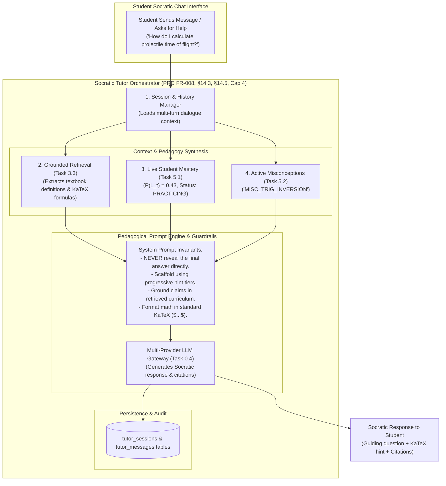
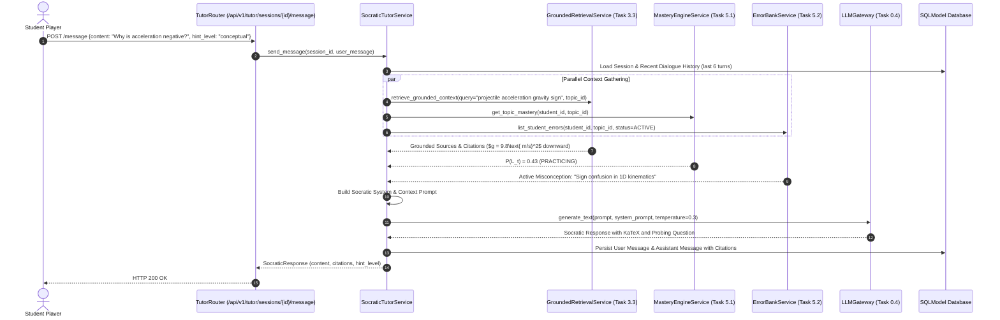

# Task 6.1: Socratic Tutor Orchestrator with Retrieval Augmentation — Conceptual Understanding (Stage 1)

## 1. Visual Architecture

---

## 2. The Physical Analogy

The Socratic Tutor is like an **Expert Oxford Math Don in a 1-on-1 Tutorial Session**:
> When a student knocks on the Don's office door holding a difficult physics problem and pleads *"Just tell me the answer to part (b)!"*, the Don does NOT grab a pen and write down the solution (*Violating pedagogical guardrails*).
> 
> Instead, the Don glances at the student's progress notebook (*Live Mastery: $43\%$*) and notices a red sticky note (*Active Misconception: "Confuses sin and cos on inclined planes"*). 
> 
> The Don reaches behind them, pulls down the standard Cambridge Mechanics textbook (*Grounded Retrieval / RAG*), opens to the chapter on vector decomposition, points to a diagram, and asks a gentle, targeted question:  
> *"Before we look at the time of flight, which velocity component acts perpendicular to gravity, and why?"*  
> 
> The student is guided to experience the "Aha!" moment of self-discovery, building genuine neural pathways rather than memorizing a passive answer.

---

## 3. Why & What

### Why Are We Doing This Task?
PRD §14.3, §14.5, and **FR-008 (Grounded / Source-Aware Tutor)** require that AI tutoring is strictly grounded, state-aware, and pedagogically sound:
1. **Prevents Answer Spoiling (No Cheating Engine):** An unconstrained LLM behaves like a homework solver, spitting out final answers and preventing student learning. The Socratic engine enforces scaffolding.
2. **Eliminates AI Hallucinations (Constraint #5):** Every explanation and formula is anchored in retrieved curriculum sources with verifiable citations.
3. **Targeted Misconception Healing (Constraint #8):** Directly injects active cognitive bugs detected in the Error Bank (Task 5.2) to repair root conceptual misunderstandings.

### What Is the Concept?
1. **Socratic Prompt Architecture:** Systematically enforces progressive scaffolding across four hint tiers:
   - **Tier 1 (Conceptual Hint):** Prompts the student to recall the core law or definition.
   - **Tier 2 (Strategic Hint):** Suggests the first mathematical step without doing the algebra.
   - **Tier 3 (Step Hint):** Sets up the initial equation with variables identified.
   - **Tier 4 (Explanation):** Full derivation only available during post-exam review.
2. **Retrieval-Augmented Generation (RAG):** Injects relevant curriculum chunks and textbook theorems into the prompt context.
3. **State & Misconception Injection:** Dynamically tailors vocabulary and depth based on $P(L_t)$ probability and active error history.
4. **Session & Dialogue Memory:** Maintains multi-turn conversation context in `tutor_sessions` and `tutor_messages`.

---

## 4. Abstraction Level Map

| Level | What Lives Here | Current Project Implementation |
|:---|:---|:---|
| **Product / UX** | Socratic Slide-over Drawer, Live KaTeX Math, Source Citations | `frontend/src/features/tutor/` |
| **API** | `POST /api/v1/tutor/sessions/{id}/message` | `backend/app/tutor/router.py` |
| **Orchestrator / Service** | `SocraticTutorService` assembling RAG, mastery, errors, and LLM calls | `backend/app/tutor/service.py` |
| **Grounded Retrieval** | Vector search over `curriculum_chunks` with provenance | `backend/app/rag/retrieval.py` |
| **LLM Gateway** | Multi-provider structured text generation with safety | `backend/app/core/llm/` |
| **Persistence** | `TutorSession` and `TutorMessage` SQLModels | `backend/app/tutor/models.py` |

---

## 5. Mermaid Sequence Diagram

---

## 6. Data Flow Trace-Through

1. **Student Query:** *"I'm stuck on this circular motion question. What equation do I use?"*
2. **Context Assembly:**
   - Topic: `top_circular_motion`
   - Retrieved Source: Textbook Chapter 4 — *"Centripetal acceleration is directed toward the center of the circle: $a_c = \frac{v^2}{r} = \omega^2 r$"*.
   - Student Mastery: $P(L_t) = 0.35$ (`PRACTICING`).
   - Active Error: `MISC_MULTIPLIED_RADIUS_INSTEAD_OF_DIVIDING`.
3. **Prompt Construction:**
   - Injects pedagogical rule: *"Do NOT state the answer $a_c = 8\text{ m/s}^2$. Ask the student to identify whether velocity or angular frequency is given."*
4. **LLM Generation:**
   - Output: *"Let's look at the given parameters! We know the linear velocity $v=4\text{ m/s}$ and the radius $r=2\text{ m}$. Recall how centripetal acceleration $a_c$ scales with linear speed $v$ and radius $r$. What happens to the required inward acceleration if the track becomes tighter (smaller $r$)?"*
5. **Telemetry & Audit:**
   - Both turns saved to `tutor_messages` with citation metadata pointing to Page 45 of Physics 9702 Syllabus.

---

## 7. Cognitive Model → Code Mapping

| Cognitive Concept | Mental Model | Code Implementation | Enforcement / Guardrail |
|:---|:---|:---|:---|
| **Socratic Guiding** | "Ask probing questions instead of giving answers" | `_build_socratic_prompt()` | System prompt instruction + temperature = 0.3 |
| **Grounded Facts** | "Base explanations on real textbooks, not guesses" | `GroundedRetrievalService` | Sources formatted in `--- BEGIN GROUNDED SOURCES ---` |
| **Tailored Vocabulary** | "Explain simply to beginners, deeply to proficient students" | `MasteryInject` | P(L) passed to prompt |
| **Misconception Healing** | "Address the specific trap the student fell into" | `MisconceptionInject` | Active error rationales passed to prompt |

---

## 8. Five Alternative Approaches Compared

| # | Approach | Pros | Cons | Why Option 1 Was Chosen |
|:---|:---|:---|:---|:---|
| **1** | **RAG-Grounded Socratic Orchestrator with Mastery & Error Injection (Chosen)** | Anti-hallucination, adaptive, fixes misconceptions, strictly preserves educational integrity | Requires multi-context prompt assembly | Direct implementation of PRD §14.3, §14.5, FR-008, Constraint #5 |
| **2** | Raw ChatGPT API Call | Simple setup | Spoils answers, hallucinates formulas, zero mastery awareness | Disqualified: Violates PRD Constraints #1 & #5 |
| **3** | Hardcoded Decision-Tree Bot | Zero LLM costs | Rigid, cannot handle natural language student queries | Disqualified: Poor conversational UX |
| **4** | Pure RAG without Socratic Steering | High factual accuracy | Dumps entire textbook pages on the student | Disqualified: Overwhelms cognitive load |
| **5** | Answer Key Extractor | Instantly gives answer | Destroys learning efficacy | Disqualified: Strictly forbidden by PRD |

---

## 9. Production Rationale & Disaster Scenarios

### Disaster 1: The Answer Leaking Disaster (The Homework Bot)
> A lazy student uploads a homework problem to an unconstrained AI tutor and types *"Give me the solution"*. The AI spits out the entire numerical derivation. The student copies it without understanding, earns 0% on the final proctored exam, and fails the course. With Socratic guardrails, the tutor replies *"Let's break this down together. What is the first law that applies here?"*, ensuring active learning.

### Disaster 2: The Hallucinated Physics Formula Disaster
> An LLM tutor confidently tells a student that kinetic energy is $E_k = m v^2$ (forgetting the $\frac{1}{2}$). The student memorizes this hallucination and fails their A-Level exam. With Grounded RAG, the tutor's prompt is strictly conditioned on textbook sources containing $E_k = \frac{1}{2}mv^2$, guaranteeing mathematical accuracy.

---

## Workflow Checklist
- [x] Socratic orchestrator visual architecture diagram included.
- [x] Oxford math don physical analogy included.
- [x] Why/what/what-breaks explained thoroughly.
- [x] Abstraction level table filled with current project stack.
- [x] Sequence diagram for multi-context gathering and LLM generation included.
- [x] Data-flow trace-through completed step-by-step.
- [x] Cognitive model to code mapping table completed.
- [x] 5 alternatives compared.
- [x] 2 concrete disaster scenarios described.
