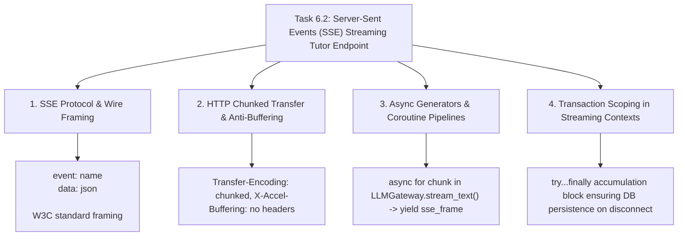

# Task 6.2: Server-Sent Events (SSE) Streaming Tutor Endpoint — CS Domain Learning (Stage 3)

## 1. Domain Discovery Map

Task 6.2 touches web networking, transport layer streaming protocols, asynchronous concurrency, and streaming database transaction boundaries:



---

## 2. Domain Deep Dives

### Domain 1: Server-Sent Events (SSE) Protocol & Wire Framing

**What Is It (Plain English):**  
Server-Sent Events (SSE) is an HTTP-based standard defined by W3C that allows a server to push real-time text updates to a web client over a single persistent HTTP connection.  
Unlike WebSockets (which require a custom binary framing protocol and bidirectional state), SSE operates entirely over standard HTTP/1.1 or HTTP/2 with `Content-Type: text/event-stream`.

**The W3C Wire Protocol Specification:**
```text
event: citations\n
data: [{"chunk_id": "c1", "title": "Newtonian Physics", "page": 12}]\n\n

event: delta\n
data: {"text": "To calculate acceleration, recall:"}\n\n

event: done\n
data: {"message_id": "msg_987", "session_id": "sess_123"}\n\n
```
*Crucial Rule:* Each event must terminate with two newline characters (`\n\n`) for the client event parser to dispatch the message event.

---

### Domain 2: HTTP Chunked Transfer Encoding & Anti-Buffering Headers

**What Is It (Plain English):**  
Normally, an HTTP server computes the entire response, sets `Content-Length: 4096`, and sends the data. In a streaming response, the server does not know in advance how many tokens the LLM will generate.  
Instead, the server sets `Transfer-Encoding: chunked`. Data is emitted in small byte chunks as soon as they become available.

**Anti-Buffering Invariants:**
- Reverse proxies like Nginx or Cloudflare will buffer responses unless instructed not to.
- We emit explicit headers:
  - `Cache-Control: no-cache`
  - `Connection: keep-alive`
  - `X-Accel-Buffering: no` (disables Nginx micro-buffering)

---

### Domain 3: Python Async Generators & Coroutine Pipelines

**What Is It (Plain English):**  
An `async generator` is a Python function containing `yield` statements inside an `async def`. When FastAPI's `StreamingResponse` consumes an async generator:
1. The generator runs until it reaches `yield`.
2. It pauses execution, allowing the event loop to flush the bytes over the TCP socket.
3. Once the socket writes, the generator resumes at the exact line of code where it yielded.

```python
async def stream_generator() -> AsyncIterator[str]:
    yield f"event: citations\ndata: {json.dumps(citations)}\n\n"
    async for chunk in llm_stream:
        yield f"event: delta\ndata: {json.dumps({'text': chunk.text})}\n\n"
    yield f"event: done\ndata: {json.dumps({'status': 'complete'})}\n\n"
```

---

### Domain 4: Transaction Scoping in Asynchronous Streaming Responses

**What Is It (Plain English):**  
In standard request-response endpoints, database transactions commit right before the endpoint returns. In a streaming generator, the HTTP response header is sent to the client *before* the generator finishes executing!  
If the database connection is closed when the route function returns, the generator would fail when trying to save the completed dialogue turn.  
We manage the database session lifecycle within the async generator's execution scope and accumulate the full assistant text in a buffer, executing a final `session.add()` and `session.flush()` inside a `try...finally` block.

---

## 3. Cross-Domain Connections

| Concept A | Concept B | Architectural Connection |
|:---|:---|:---|
| **`StreamingResponse`** | **`LLMGateway().stream_text`** | Feeds token chunks from multi-provider LLM directly into the HTTP stream. |
| **`event: citations`** | **`GroundedRetrievalService`** | Sends source metadata as the very first SSE frame before LLM generation begins. |
| **`event: delta`** | **Frontend Markdown Parser** | Enables real-time rendering of KaTeX math equations with typewriter UI. |
| **Generator `finally`** | **`TutorMessage` Table** | Ensures full conversation turn is committed to SQL database even on network abort. |

---

## 4. Concept Evolution Timeline

```markdown
| Level | What You Might Think | Deeper Reality |
|:---|:---|:---|
| **Beginner** | "Return the full LLM string after 5 seconds." | High perceived latency, poor conversational UX. |
| **Intermediate** | "Stream raw text chunks without headers." | Cannot separate citations, errors, and done events. |
| **Advanced** | "Use WebSockets for streaming text." | Unnecessary protocol complexity and handshake overhead for 1-way streaming. |
| **Expert** | "Server-Sent Events (SSE) with structured event typing, anti-buffering headers, and resilient async generator DB persistence." | Modern, production-grade streaming AI architecture. |
```

---

## 5. Vocabulary Reference

| Term | Definition | Codebase Example |
|:---|:---|:---|
| **Server-Sent Events (SSE)** | W3C HTTP-based server-push text protocol. | `media_type="text/event-stream"` |
| **Async Generator** | Asynchronous coroutine yielding items incrementally over time. | `async def stream_socratic_message()` |
| **Time To First Token (TTFT)** | Latency from request submission to the first rendered word. | Target $< 300\text{ms}$ |
| **Anti-Buffering Header** | HTTP header telling proxies not to buffer chunks. | `X-Accel-Buffering: no` |

---

## 6. "What If" Thought Experiments

### Q1: What happens if a proxy buffers the HTTP stream?
> **Answer:** Without `X-Accel-Buffering: no` and `Cache-Control: no-cache`, intermediate proxy caches (Nginx, Cloudflare) would buffer the first 4KB of tokens, defeating the entire purpose of streaming. Our headers guarantee instant byte delivery.

### Q2: What happens if the student clicks "Stop Generation" on the frontend?
> **Answer:** The client closes the TCP socket. The async generator catches `asyncio.CancelledError` or terminates in the `finally` block, saving whatever tokens were generated so far to `tutor_messages`.

### Q3: How does the client distinguish citations from text tokens?
> **Answer:** The client's EventSource listener filters by `event.type`: `event.type == 'citations'` updates the sidebar with bibliography links, while `event.type == 'delta'` appends characters to the active chat bubble.

### Q4: Can SSE work over HTTP/2 and HTTP/3?
> **Answer:** Yes! SSE operates seamlessly over HTTP/2 and HTTP/3 multiplexed streams, avoiding the old HTTP/1.1 6-connection per-domain browser limit.

---

## Workflow Checklist
- [x] SSE streaming concept map included.
- [x] W3C wire protocol specification detailed.
- [x] HTTP chunked transfer and anti-buffering headers explained.
- [x] Async generator coroutine mechanics detailed.
- [x] Streaming transaction boundaries explained.
- [x] Cross-domain connection matrix filled.
- [x] Concept evolution timeline documented.
- [x] Vocabulary reference table created.
- [x] 4 comprehensive "What If" scenarios analyzed.
