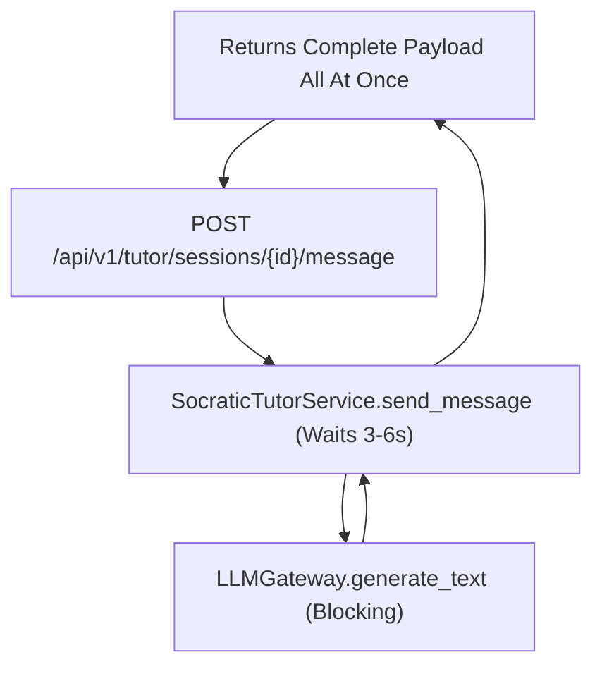
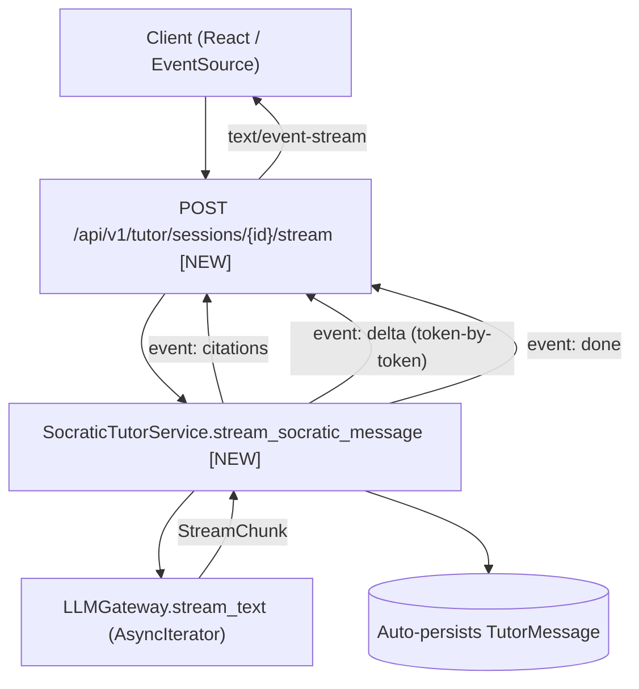
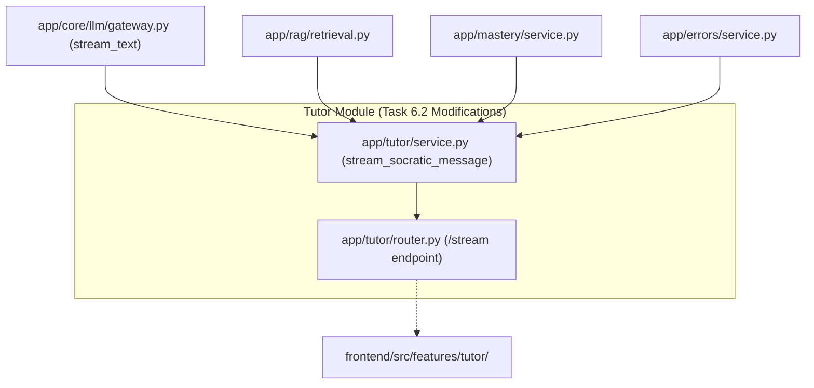

# Task 6.2: Server-Sent Events (SSE) Streaming Tutor Endpoint — Codebase Design (Stage 2)

## 1. Current State Snapshot

Prior to Task 6.2:
- `backend/app/tutor/service.py` (Task 6.1) implements synchronous/monolithic `send_message`, which waits for the complete LLM response before returning the payload.
- `backend/app/core/llm/gateway.py` (Task 0.4) already supports `stream_text(...) -> AsyncIterator[StreamChunk]`.
- There is **no SSE streaming endpoint** emitting real-time event frames (`event: citations`, `event: delta`, `event: done`).

### Before Architecture Diagram

---

## 2. Proposed State

Task 6.2 enhances `backend/app/tutor/`:
1. `backend/app/tutor/service.py`:
   - Adds `stream_socratic_message(session, student_id, session_id, message_in, mock_chunks=None) -> AsyncIterator[str]`:
     - Yields SSE frames:
       - `event: citations\ndata: <json>\n\n`
       - `event: delta\ndata: <json>\n\n`
       - `event: done\ndata: <json>\n\n`
       - `event: error\ndata: <json>\n\n`
     - Uses `LLMGateway().stream_text(...)`.
     - Automatically buffers accumulated tokens and commits `TutorMessage` to the database inside an async generator context.
2. `backend/app/tutor/router.py`:
   - Adds `POST /api/v1/tutor/sessions/{session_id}/stream`:
     - Returns `StreamingResponse(generator, media_type="text/event-stream")`.
     - Sets anti-buffering HTTP headers: `Cache-Control: no-cache`, `Connection: keep-alive`, `X-Accel-Buffering: no`.
3. `backend/tests/test_socratic_streaming.py`:
   - Dedicated test suite validating SSE frame syntax, event emission order, and DB message persistence.

### After Architecture Diagram

---

## 3. File-Level Impact Analysis

### [MODIFY] `backend/app/tutor/service.py`
- **What changes:** Add `stream_socratic_message` method yielding formatted SSE event strings while handling session validation, RAG grounding, mastery state, streaming LLM invocation, and background database persistence.

### [MODIFY] `backend/app/tutor/router.py`
- **What changes:** Add `POST /api/v1/tutor/sessions/{session_id}/stream` returning `StreamingResponse(media_type="text/event-stream")`.

### [NEW] `backend/tests/test_socratic_streaming.py`
- **Purpose:** Unit and integration tests verifying SSE frame formatting, event ordering (`citations` $\to$ `delta` $\to$ `done`), error handling, and database turn recording.

---

## 4. Dependency Graph / Blast Radius

---

## 5. Regression Risk Matrix

| Risk ID | Risk Description | Severity | Affected Area | Mitigation Strategy |
|:---|:---|:---:|:---|:---|
| **R-01** | Client disconnects mid-stream | 🟡 Medium | Database Persistence | Use `try...finally` block to commit accumulated token buffer even on early break. |
| **R-02** | Proxy or nginx buffers stream | 🟢 Low | Stream Latency | Add HTTP headers `X-Accel-Buffering: no` and `Cache-Control: no-cache`. |
| **R-03** | Malformed SSE event data syntax | 🟡 Medium | Client JSON parsing | Ensure all SSE payloads adhere to W3C specs with double newline `\n\n` delimiter. |

---

## 6. Contract Stability Check

| Contract / Endpoint | Status | Request Body | Response Shape | Breaking? |
|:---|:---:|:---:|:---|:---:|
| `POST /api/v1/tutor/sessions/{id}/stream` | **NEW** | `SocraticPromptRequest` | `text/event-stream` (SSE Events) | No |
| `POST /api/v1/tutor/sessions/{id}/message` | Preserved | `SocraticPromptRequest` | `SocraticResponse` (JSON) | No |
| Existing endpoints | Preserved | Preserved | Preserved | No |

---

## 7. Rollback Plan

### If Changes Are Uncommitted
1. `git restore backend/app/tutor/service.py backend/app/tutor/router.py`
2. `Remove-Item -Force backend/tests/test_socratic_streaming.py`

### If Changes Are Committed
1. `git revert HEAD`
2. `py -3.14 -m pytest backend/tests/`

---

## Workflow Checklist
- [x] Current-state snapshot documented.
- [x] Proposed-state description and After architecture diagram included.
- [x] Every affected file listed with impact analysis.
- [x] Blast-radius graph included.
- [x] Regression risks scored as 🔴 / 🟡 / 🟢.
- [x] Contract stability checked.
- [x] Rollback plan provided.
- [x] No code written.
