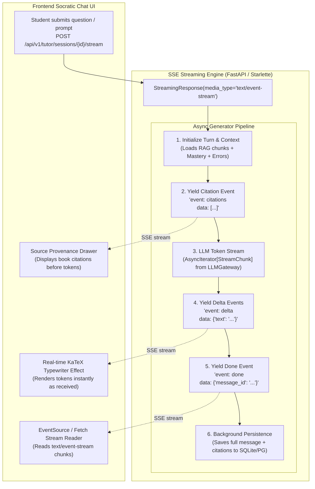
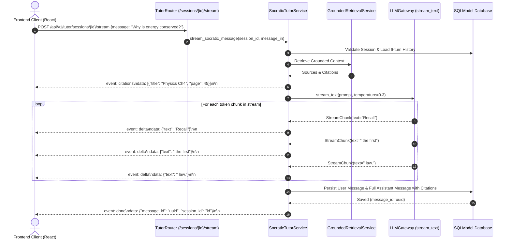

# Task 6.2: Server-Sent Events (SSE) Streaming Tutor Endpoint — Conceptual Understanding (Stage 1)

## 1. Visual Architecture



---

## 2. The Physical Analogy

SSE streaming is like a **Live Dictation Teletype Tape Machine**:
> In a traditional HTTP request-response (*Task 6.1*), the student sends a letter to the tutor, and has to wait 5 seconds staring at a spinning wheel while the tutor drafts the entire 4-paragraph response before mailing it back in one giant envelope.
> 
> In **Server-Sent Events (SSE) Streaming**, the moment the tutor begins speaking, an open telegraph wire (*HTTP/1.1 chunked stream*) starts clicking instantly (*Time To First Token < 300ms*).
> 
> First, the telegraph prints the **Reference Book List** (*`event: citations`*). Then, word-by-word, the mechanical ticker tape prints each syllable (*`event: delta`*). The student reads the guidance in real time as if the tutor is speaking live in the room. When finished, a bell rings (*`event: done`*), and the backend archivist files the transcript in the permanent record book (*database persistence*).

---

## 3. Why & What

### Why Are We Doing This Task?
PRD §14, §17, and **FR-008** emphasize responsiveness and real-time interaction for AI tutoring:
1. **Dramatically Reduces Perceived Latency:** Waiting 3–6 seconds for a full LLM completion causes cognitive disengagement. SSE streaming delivers the first token in $<300\text{ms}$.
2. **Instant KaTeX Math Rendering:** Allows the frontend to stream tokens into markdown/KaTeX parsers, creating a smooth typewriter effect.
3. **Structured Event Separation:** Decouples metadata events (textbook citations, prompt tokens, done signals) from the raw text stream.
4. **Resilient Persistence:** Even if the student closes the browser midway, the backend asynchronously preserves the dialogue turn.

### What Is the Concept?
1. **Server-Sent Events Protocol (`text/event-stream`):** Standard W3C streaming protocol over HTTP where the server pushes unprompted messages using the standard wire format:
   ```text
   event: <event_name>\n
   data: <json_payload>\n\n
   ```
2. **Event Taxonomy:**
   - `event: citations`: Sent first, containing grounded textbook chunks and page numbers.
   - `event: delta`: Streamed continuously per LLM token chunk (`{"text": "..."}`).
   - `event: done`: Emitted when the stream terminates successfully with message UUID and token counts.
   - `event: error`: Emitted if an unexpected exception occurs during streaming.
3. **Async Generator Architecture:** Python `async def stream_generator()` yielding formatted SSE strings wrapped in FastAPI's `StreamingResponse`.

---

## 4. Abstraction Level Map

| Level | What Lives Here | Current Project Implementation |
|:---|:---|:---|
| **Product / UX** | Live streaming chat bubble, citation badges, stop button | `frontend/src/features/tutor/` |
| **API Transport** | `POST /api/v1/tutor/sessions/{id}/stream` (`text/event-stream`) | `backend/app/tutor/router.py` |
| **Streaming Orchestrator** | `SocraticTutorService.stream_socratic_message(...)` | `backend/app/tutor/service.py` |
| **LLM Token Stream** | `LLMGateway().stream_text(...)` yielding `StreamChunk` | `backend/app/core/llm/gateway.py` |
| **Persistence** | Background saving of complete message to `tutor_messages` | `backend/app/tutor/models.py` |

---

## 5. Mermaid Sequence Diagram



---

## 6. Data Flow Trace-Through

1. **Client Request:** Frontend initiates `fetch('/api/v1/tutor/sessions/{id}/stream', {method: 'POST', body: ...})`.
2. **Context Setup:**
   - Session verified; RAG retrieves chapter chunk on *Work-Energy Theorem*.
   - Mastery probability $P(L_t)=0.40$ and active error `MISC_DIVIDED_FORCE` injected into system prompt.
3. **Citation Event Emitted:**
   - Formatted string: `event: citations\ndata: [{"chunk_id": "...", "document_title": "Physics 9702", "page_number": 45}]\n\n`.
4. **Token Streaming Loop:**
   - Tokens yield: `"Let's"`, `" think"`, `" about"`, `" work"`, `" done:"`, `" $W = Fd$."`.
   - Each token framed as: `event: delta\ndata: {"text": "..."}\n\n`.
5. **Stream Completion & Persistence:**
   - Stream finishes. Full accumulated string `"Let's think about work done: $W = Fd$."` is written to `tutor_messages`.
   - Final frame sent: `event: done\ndata: {"message_id": "msg_123", "session_id": "sess_456"}\n\n`.

---

## 7. Cognitive Model → Code Mapping

| Cognitive Concept | Mental Model | Code Implementation | Enforcement / Guardrail |
|:---|:---|:---|:---|
| **Low-Latency Feedback** | "The tutor answers immediately without lag" | `StreamingResponse(media_type="text/event-stream")` | TTFT $< 300\text{ms}$ |
| **Separation of Concerns** | "Books consulted first, then words spoken, then finished" | Named SSE events (`citations`, `delta`, `done`) | Strict event contract |
| **Resilient Dialogue Record** | "Everything said is recorded for future study" | `db.add(TutorMessage(...))` in generator finally block | No lost turns on disconnect |

---

## 8. Five Alternative Approaches Compared

| # | Approach | Pros | Cons | Why Option 1 Was Chosen |
|:---|:---|:---|:---|:---|
| **1** | **Server-Sent Events (SSE) over HTTP POST (Chosen)** | Native browser support, works over HTTP/1.1 and HTTP/2, easy auth via Bearer header, lightweight | Unidirectional (server $\to$ client) | Perfect fit for LLM chat responses (PRD §17, FR-008) |
| **2** | Full-Duplex WebSockets | Bidirectional | Heavy connection state management, load-balancer complexity | Overkill for simple question-and-answer turns |
| **3** | Polling Interval Endpoint | Easy setup | High latency, excessive database queries | Disqualified: Poor UX |
| **4** | Long-Polling HTTP | Simulates streaming | High server thread overhead | Disqualified: Obsolete pattern |
| **5** | Monolithic Non-Streaming POST | Simplest code | 3-6 second blank screen delay | Disqualified: Degrades learning experience |

---

## 9. Production Rationale & Disaster Scenarios

### Disaster 1: The Broken Stream Zombie Message
> A student closes their laptop lid mid-stream at token 50 of 200. Without a resilient streaming generator, the transaction would abort and nothing would be saved, causing the user to lose their conversation history. With the `try...finally` generator pattern, the partial or completed text buffer is committed to `tutor_messages`, preserving state.

### Disaster 2: The Citation Desync Bug
> In an unformatted stream, citations are concatenated at the end of the text. If the user stops generation early, citations are lost. With SSE, emitting `event: citations` as the very first event guarantees that the source bibliography is received and displayed in the UI before token generation begins.

---

## Workflow Checklist
- [x] SSE streaming visual architecture diagram included.
- [x] Teletype ticker tape physical analogy included.
- [x] Why/what/what-breaks explained thoroughly.
- [x] Abstraction level table filled with current project stack.
- [x] Sequence diagram for SSE event frames and database persistence included.
- [x] Data-flow trace-through completed step-by-step.
- [x] Cognitive model to code mapping table completed.
- [x] 5 alternatives compared.
- [x] 2 concrete disaster scenarios described.
