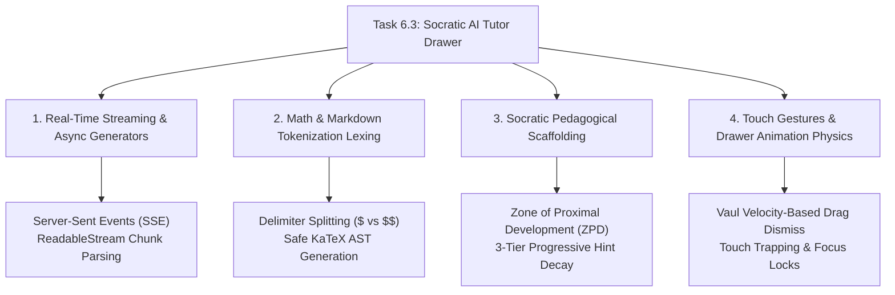

# Stage 3: CS Domain Learning Extraction
## Task 6.3: Socratic AI Tutor Slide-over Drawer with Live Math & Streaming `[FRONTEND]`

**Task ID:** Task 6.3  
**Track:** Frontend Track (React 18+ / TypeScript / Vite / Zustand / KaTeX / Vaul)  
**Epic:** Epic 6 — Grounded Socratic Dialogue & Real-Time Multimodal Tutor  
**Accepted Decision Basis:** [ADR-008: Frontend Framework & UI Ecosystem](file:///c:/Users/Muhammad/OneDrive%20-%20Higher%20Education%20Commission/Desktop/AI%20Tutor/Feynman_tutorAI/docs/adr/ADR-008-frontend-framework-and-ui-stack.md), [DESIGN_SYSTEM_TYPOGRAPHY.md](file:///c:/Users/Muhammad/OneDrive%20-%20Higher%20Education%20Commission/Desktop/AI%20Tutor/Feynman_tutorAI/docs/frontend_design/DESIGN_SYSTEM_TYPOGRAPHY.md)

---

## 1. Domain Discovery Map



---

## 2. Domain Deep Dives

### Domain 1: Real-Time Streaming & Async Generators

**What Is It (Plain English):**  
In conversational AI, waiting 4–6 seconds for a complete paragraph to generate produces high perceived latency and frustration. **Streaming** delivers tokens one by one as they are computed by the model. On the frontend, an **Async Generator function (`for await (const chunk of stream)`)** continuously consumes incoming byte chunks, appending them to the active message state in real-time, resulting in an instantaneous (< 200ms Time-to-First-Token) responsive feel.

**Physical Analogy:**  
> Non-streaming is like a chef cooking an entire 7-course meal before bringing all dishes to the table at once (you sit starving for 45 minutes). Streaming is like **Dim Sum or Conveyor-Belt Sushi**, where hot plates arrive at your table the instant they are prepared.

**TypeScript Stream Implementation Pattern:**
```typescript
async function* simulateTokenStream(fullText: string, delayMs = 25): AsyncGenerator<string> {
  const words = fullText.split(" ");
  for (const word of words) {
    await new Promise((resolve) => setTimeout(resolve, delayMs));
    yield word + " ";
  }
}
```

---

### Domain 2: Math & Markdown Tokenization Lexing

**What Is It (Plain English):**  
When the AI tutor outputs a response like: *"Recall Newton's Law $F = ma$, therefore the acceleration $a = \frac{F}{m}$ is proportional to force."*, the frontend cannot treat the string as pure text (which would look ugly like raw code) nor as raw HTML (which exposes the app to Cross-Site Scripting / XSS). The string is passed through a **Lexer** that splits standard prose from LaTeX delimiters (`$...$` for inline math, `$$...$$` for display blocks) and pipes each formula into **KaTeX**.

**Where It Manifests in This Codebase:**
- [`frontend/src/components/tutor/ChatMessageBubble.tsx`](file:///c:/Users/Muhammad/OneDrive%20-%20Higher%20Education%20Commission/Desktop/AI%20Tutor/Feynman_tutorAI/frontend/src/components/tutor/ChatMessageBubble.tsx) — Markdown and LaTeX parsing.

---

### Domain 3: Socratic Scaffolding & Progressive Hints

**What Is It (Plain English):**  
In educational psychology, **Scaffolding** (based on Vygotsky's *Zone of Proximal Development*) is the temporary support given to students to achieve deeper understanding. When a student requests help, our system uses a **3-Tier Progressive Hint Architecture**:
1. **Tier 1 (Conceptual Anchor):** Identifies the governing physical law without equations (e.g. *"Think about whether mechanical energy is conserved in this closed system."*).
2. **Tier 2 (Formula Setup):** Provides the specific equation with variables defined (\( \Delta U + \Delta K = 0 \)).
3. **Tier 3 (Worked Step):** Demonstrates the initial algebraic rearrangement, leaving only the final arithmetic for the student.

---

### Domain 4: Drawer Physics & Focus Management (Vaul)

**What Is It (Plain English):**  
Slide-over drawers must handle velocity-based dragging on touch screens, background dimming, and proper focus containment for screen readers (`role="dialog"`). When dismissed, focus must return seamlessly to the button that summoned it.

**Where It Manifests in This Codebase:**
- [`frontend/src/components/tutor/SocraticTutorDrawer.tsx`](file:///c:/Users/Muhammad/OneDrive%20-%20Higher%20Education%20Commission/Desktop/AI%20Tutor/Feynman_tutorAI/frontend/src/components/tutor/SocraticTutorDrawer.tsx).

---

## 3. Vocabulary Reference

| Term | Definition | Codebase Location |
| :--- | :--- | :--- |
| **`PedagogicalMode`** | Mode configuration (`socratic`, `hints`, `teach_back`, `adversarial`). | `frontend/src/types/tutor.ts` |
| **`SourceCitation`** | Verified syllabus textbook reference with chapter and page metadata. | `frontend/src/types/tutor.ts` |
| **`useSocraticTutorStore`** | Global Zustand store for chat history and streaming states. | `frontend/src/stores/socraticTutorStore.ts` |
| **`AsyncGenerator`** | JavaScript iterator yielding values asynchronously over time. | `frontend/src/api/tutor.ts` |
