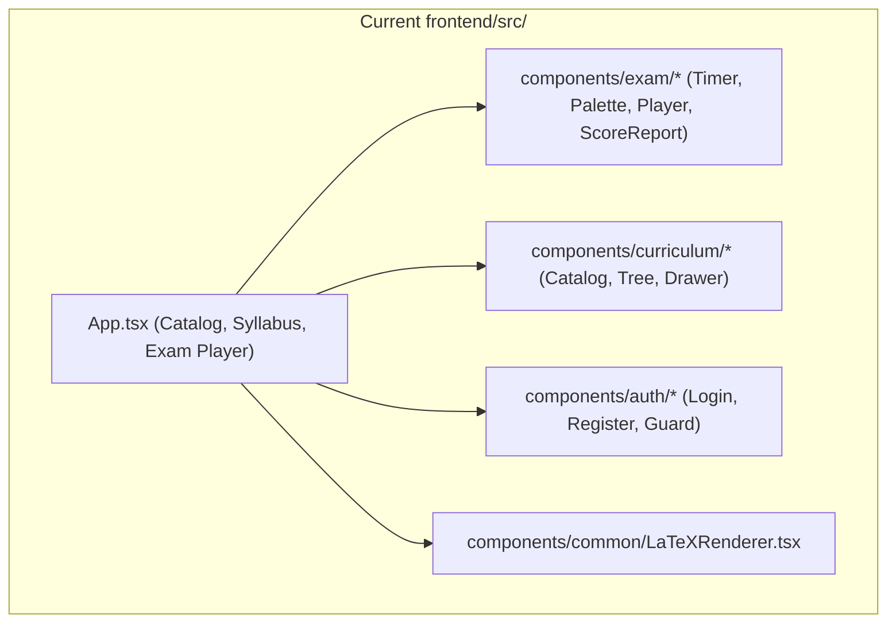
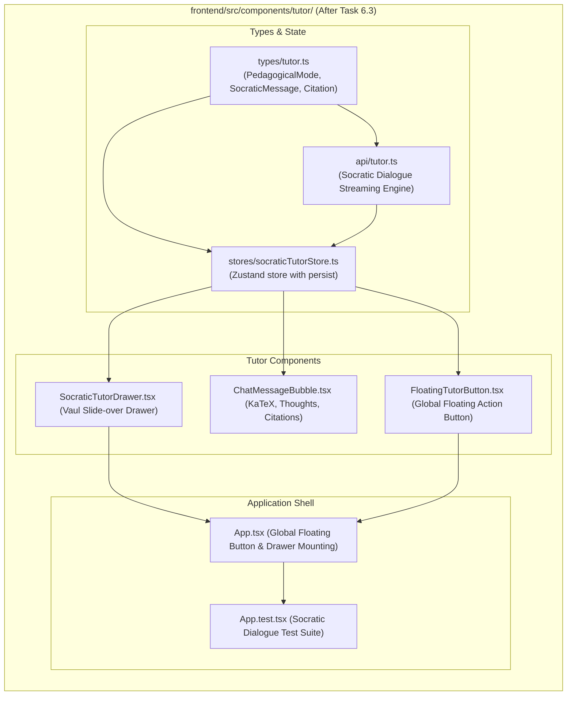

# Stage 2: Codebase Design Artifact
## Task 6.3: Socratic AI Tutor Slide-over Drawer with Live Math & Streaming `[FRONTEND]`

**Task ID:** Task 6.3  
**Track:** Frontend Track (React 18+ / TypeScript / Vite / Zustand / KaTeX / Vaul)  
**Epic:** Epic 6 — Grounded Socratic Dialogue & Real-Time Multimodal Tutor  
**Accepted Decision Basis:** [ADR-008: Frontend Framework & UI Ecosystem](file:///c:/Users/Muhammad/OneDrive%20-%20Higher%20Education%20Commission/Desktop/AI%20Tutor/Feynman_tutorAI/docs/adr/ADR-008-frontend-framework-and-ui-stack.md), [DESIGN_SYSTEM_TYPOGRAPHY.md](file:///c:/Users/Muhammad/OneDrive%20-%20Higher%20Education%20Commission/Desktop/AI%20Tutor/Feynman_tutorAI/docs/frontend_design/DESIGN_SYSTEM_TYPOGRAPHY.md)

---

## 1. Current State Snapshot

Currently, `frontend/src/` has core UI primitives, authentication store/forms, route guards, curriculum catalog/tree, and an interactive timed exam player. There is only a static drawer showcase inside `App.tsx`; no interactive multi-turn streaming Socratic dialogue, pedagogical mode controller, citation pill component, or floating summon button exists.



* **Verified Fact:** `frontend/` has passing Vitest suite (13 of 13 passed).
* **Verified Fact:** `frontend/` has `vaul@^0.9.1` installed and functioning in `package.json`.

---

## 2. Proposed State

After Task 6.3 execution, `frontend/src/` will feature an intelligent **Socratic AI Tutor Drawer Subsystem** with multi-turn streaming, progressive hint scaffolding, clickable syllabus citations, and global summon triggers.



---

## 3. File-Level Impact Analysis

All files are `[NEW]` or `[MODIFY]` strictly inside `frontend/` (0 touches to `backend/`).

### 3.1 Data Structures & State Management
#### [NEW] `frontend/src/types/tutor.ts`
* **Purpose:** TypeScript types defining Socratic dialogue models:
  - `PedagogicalMode`: `'socratic' | 'hints' | 'teach_back' | 'adversarial'`
  - `SourceCitation`: `{ title: string; syllabusCode: string; pageNumber?: number; snippet: string }`
  - `SocraticMessage`: `{ id: string; role: 'user' | 'tutor' | 'system'; text: string; thoughts?: string; citations?: SourceCitation[]; timestamp: string }`
  - `TutorSessionContext`: `{ topicId?: string; topicTitle: string; questionStem?: string; studentAnswer?: string }`
  - `SocraticTutorState`: Store state interface with actions.

#### [NEW] `frontend/src/stores/socraticTutorStore.ts`
* **Purpose:** Zustand store managing:
  - `isOpen: boolean`
  - `activeContext: TutorSessionContext | null`
  - `mode: PedagogicalMode`
  - `messages: SocraticMessage[]`
  - `isStreaming: boolean`
  - `hintLevel: number` (1..3)
  - **Actions:** `openDrawer(context?)`, `closeDrawer()`, `setMode(mode)`, `sendMessage(text)`, `requestNextHint()`, `clearHistory()`.

#### [NEW] `frontend/src/api/tutor.ts`
* **Purpose:** API client featuring streaming generator with rich grounded responses for:
  - Socratic dialogue on Physics and Calculus topics.
  - 3-tier progressive hint escalation (*Hint 1: Conceptual Law, Hint 2: Formula Setup, Hint 3: Worked Step*).
  - Source citations from Cambridge International Physics & AP Calculus syllabi.

---

### 3.2 UI Components
#### [NEW] `frontend/src/components/tutor/ChatMessageBubble.tsx`
* **Purpose:** Renders chat bubbles with:
  - Role avatars (Student initials vs. Socratic AI Sparkles).
  - Collapsible **"Thinking Process"** reasoning preview.
  - Inline and display **KaTeX STEM formula rendering**.
  - Interactive **Source Citation Pills** (`[Cambridge Physics §4.2, p. 118]`).

#### [NEW] `frontend/src/components/tutor/SocraticTutorDrawer.tsx`
* **Purpose:** Slide-over drawer built on Vaul:
  - Mode selector pills (Socratic, Hints, Teach-Back, Adversarial).
  - Active topic context header pill.
  - Auto-scrolling chat history stream.
  - Quick action prompt chips.
  - Auto-resizing message input with Send action.

#### [NEW] `frontend/src/components/tutor/FloatingTutorButton.tsx`
* **Purpose:** Fixed floating button in bottom-right corner allowing 1-click summon from anywhere in the app.

---

### 3.3 Root App & Tests
#### [MODIFY] `frontend/src/App.tsx`
* **Purpose:** Mount `FloatingTutorButton` and `SocraticTutorDrawer` globally. Connect the "Review with Socratic AI" button in `ExamScoreReport` directly to the Socratic drawer.

#### [MODIFY] `frontend/src/App.test.tsx`
* **Purpose:** Vitest test suite verifying:
  - Summoning drawer via floating button and score report.
  - Sending student prompt and receiving streaming response.
  - Requesting progressive hints (Hint 1, 2, 3).
  - Pedagogical mode switching.

---

## 4. Dependency Graph / Blast Radius

```mermaid
graph TD
    subgraph TutorSubsystem ["frontend/src/components/tutor/ (Isolated)"]
        Types[types/tutor.ts] --> Store[stores/socraticTutorStore.ts]
        Types --> API[api/tutor.ts]
        Store --> Bubble[ChatMessageBubble.tsx]
        Store --> Drawer[SocraticTutorDrawer.tsx]
        Store --> FloatBtn[FloatingTutorButton.tsx]
        Drawer --> App[App.tsx]
        FloatBtn --> App
        App --> Tests[App.test.tsx]
    end

    subgraph BackendAPI ["backend/ (Directory Isolation)"]
        BackendTutor["/api/v1/tutor/*"]
    end

    TutorSubsystem -.->|Zero Cross-Track Impact (Isolated)| BackendAPI
```

---

## 5. Regression Risk Matrix

| Risk ID | Risk Description | Severity | Affected Area | Mitigation Strategy |
| :--- | :--- | :---: | :--- | :--- |
| **R-01** | Stream rendering causing text jitter or cursor jump | 🟡 Medium | Chat Bubble | Buffer tokens in store state; only re-render the active message bubble. |
| **R-02** | Formula markdown unescaped in chat text | 🟡 Medium | KaTeX Parser | Sanitize and parse math delimiters (`$...$` and `$$...$$`) via `LaTeXRenderer`. |
| **R-03** | Drawer blocking modal dialogs | 🟢 Low | Vaul Z-Index | Set explicit z-index (`z-50`) to layer gracefully with existing Dialogs. |

---

## 6. Rollback Plan

```powershell
git checkout -- frontend/src/
Remove-Item -Recurse -Force frontend/src/components/tutor/
Remove-Item -Force frontend/src/stores/socraticTutorStore.ts
Remove-Item -Force frontend/src/types/tutor.ts
Remove-Item -Force frontend/src/api/tutor.ts
```
Estimated rollback time: < 1 minute.
