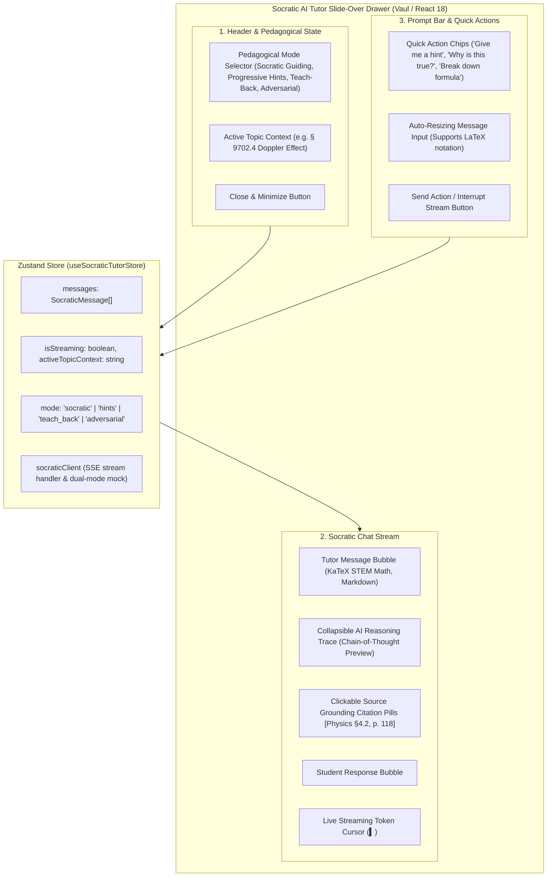
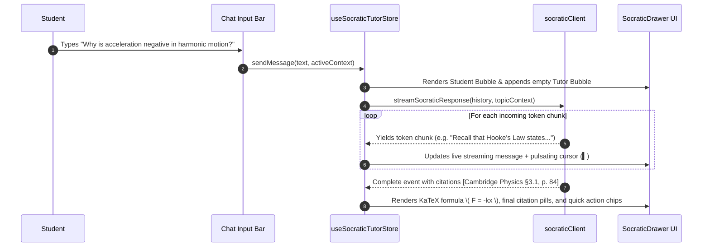

# Stage 1: Conceptual Understanding Artifact
## Task 6.3: Socratic AI Tutor Slide-over Drawer with Live Math & Streaming `[FRONTEND]`

**Task ID:** Task 6.3  
**Track:** Frontend Track (React 18+ / TypeScript / Vite / Zustand / KaTeX / Vaul)  
**Epic:** Epic 6 — Grounded Socratic Dialogue & Real-Time Multimodal Tutor  
**Accepted Decision Basis:** [ADR-008: Frontend Framework & UI Ecosystem](file:///c:/Users/Muhammad/OneDrive%20-%20Higher%20Education%20Commission/Desktop/AI%20Tutor/Feynman_tutorAI/docs/adr/ADR-008-frontend-framework-and-ui-stack.md), [DESIGN_SYSTEM_TYPOGRAPHY.md](file:///c:/Users/Muhammad/OneDrive%20-%20Higher%20Education%20Commission/Desktop/AI%20Tutor/Feynman_tutorAI/docs/frontend_design/DESIGN_SYSTEM_TYPOGRAPHY.md)

---

## 1. Visual Architecture

---

## 2. The Physical Analogy

> Think of the **Socratic AI Tutor Drawer** like an **Expert STEM Teaching Assistant sitting beside you in the University Study Lounge**. 
> When you get stuck on a difficult physics question, a good TA doesn't simply grab your pen and write down the final formula (which produces the *illusion of competence* without real learning). Instead:
> 1. The TA leans over, asks a probing question (**Socratic Guiding**: *"What happens to the wave crests when the siren moves toward you?"*).
> 2. They open your physical textbook to the exact chapter, pointing at a diagram (**Textbook Citation Pills**).
> 3. If you remain stuck, they provide a gentle progressive nudge (**Progressive Hints** 1, 2, 3) rather than spoiling the whole solution.
> 4. The assistant remains easily accessible in a slide-over panel, ready whenever you need guidance during practice, exams, or syllabus exploration.

---

## 3. Why & What

### Why are we doing this task?
1. **Grounded Socratic Learning (PRD Cap 6, FR-008, FR-023):** Active learning through dialogue yields 2x higher retention than passive reading. The tutor must guide students toward deriving concepts themselves.
2. **Textbook Grounding & Provenance:** Prevents AI hallucinations by anchoring every explanation in verified syllabus standards with clickable citation badges.
3. **Anywhere Accessibility:** Students must be able to summon the Socratic tutor from anywhere in the app (from the Exam Player score report, the Syllabus Tree, or floating action button) without losing their place.

### What is the concept?
A sleek **Slide-Over Drawer** built with **Vaul** and **KaTeX** providing:
- Token-by-token **Real-Time Streaming** response rendering.
- **Pedagogical Mode Switching:** Socratic Dialogue, Progressive 3-Tier Hints, Teach-Back Evaluation, and Adversarial "Why You Are Wrong" mode.
- **Collapsible Reasoning Traces:** Shows the AI tutor's internal pedagogical strategy without cluttering the chat.
- **Clickable Source Citation Pills:** Links explanations to syllabus textbook sections.

### What breaks if we skip this?
- Students who make mistakes on diagnostic exams have no interactive way to debug their mental models.
- The platform lacks conversational guidance and feels like a static quiz website.
- Explanations lack source grounding and verifiable formulas.

---

## 4. Abstraction Level Map

| Level | What Lives Here | Current Project Example | Touched by Task 6.3? |
| :--- | :--- | :--- | :---: |
| **Product / UX** | Socratic Chat Drawer, Citation Pills, Mode Switcher, Quick Action Chips | Global drawer, Chat bubbles | 🔵 **PRIMARY FOCUS** |
| **Application** | Socratic Tutor Store, Streaming dispatcher, Message reducer | `src/stores/socraticTutorStore.ts`, `src/components/tutor/` | 🔵 **PRIMARY FOCUS** |
| **Framework** | Vaul Slide-over Drawer, Markdown/LaTeX message parser | `SocraticTutorDrawer.tsx`, `ChatMessageBubble.tsx` | 🔵 **PRIMARY FOCUS** |
| **Library** | `Vaul`, `KaTeX`, `lucide-react`, `zustand` | `@/components/ui/drawer`, `LaTeXRenderer` | 🔵 Used heavily |
| **Runtime** | Async token streaming loop / Server-Sent Events (SSE) | `ReadableStream` & async generator | 🔵 Stream simulation |
| **Infrastructure** | Backend Socratic Orchestrator & RAG Retriever | `/api/v1/tutor/chat` | ⚪ Backend Contract |

---

## 5. Sequence Diagrams

### Diagram 1: Socratic Hint Progression & Streaming Token Flow

---

## 6. Data Flow Trace-Through

1. **Summoning Drawer:** Student clicks "Review with Socratic AI" on an exam question or topic card; `useSocraticTutorStore.getState().openDrawerWithContext(topicTitle, stemText)` initializes dialogue context.
2. **Pedagogical Mode:** Student can select modes:
   - 🧠 **Socratic Questioning:** Guides student with probing questions.
   - 💡 **Progressive Hints:** Reveals Hint 1 (Concept), Hint 2 (Formula), Hint 3 (Worked Step).
   - 🎓 **Teach-Back Mode:** Prompts student to explain the topic in their own words.
   - ⚡ **Adversarial Debugger:** Highlights subtle pitfalls and common misconceptions.
3. **Message Streaming:** `socraticClient.streamResponse()` streams text chunks in real-time. Formulas wrapped in `$...$` or `$$...$$` are dynamically parsed and rendered with KaTeX.
4. **Source Citations:** Verified citations are rendered as interactive pills at the bottom of tutor messages.

---

## 7. Cognitive Model → Code Mapping

| Cognitive Stage | Mental Model | Code Concept in Feynman Frontend | Concrete Guardrail |
| :--- | :--- | :--- | :--- |
| **1. Probing Question** | "Lead me to the answer without telling me" | `PedagogicalMode = 'socratic'` | Never gives raw answer directly |
| **2. Scaffolding** | "Give me a slight hint to unblock me" | `PedagogicalMode = 'hints'` | 3-tier progressive hint escalation |
| **3. Grounded Source** | "Show me where this is in the syllabus" | `SourceCitation` pill | Direct textbook reference tag |
| **4. Deep Formulation** | "Show the exact mathematical physics" | `LaTeXRenderer` in chat bubble | Clean KaTeX display mode |

---

## 8. Five Alternative Approaches Evaluated

| # | Approach | Pros | Cons | Verdict |
|:---|:---|:---|:---|:---|
| **1** | **Vaul Slide-Over Drawer + Streaming + KaTeX (Approved)** | Smooth mobile/desktop gesture drawer, distraction-free, rich STEM math | Requires stream management | ✅ **RECOMMENDED (ADR-008)** |
| **2** | **Full Page Separate Chat View** | Simple layout | Forces student to leave their exam/syllabus context completely | ❌ Destroys flow |
| **3** | **Small Popover Tooltip Chat** | Compact | Too small to display multi-step physics derivations and formulas | ❌ Unusable for STEM |
| **4** | **Unstreamed Raw JSON Response** | Simple fetch | Long 4-5s delay before student sees anything; feels slow and unresponsive | ❌ Poor UX |
| **5** | **Plain Text Only without LaTeX** | Easy to render | Cannot render fractions, integrals, matrices, or physics formulas cleanly | ❌ Non-viable for STEM |

---

## 9. Production Rationale & Disaster Scenarios

### Why This Is Standard:
Premier educational AI assistants (Khanmigo, Duolingo Max, MIT AI Tutor) rely on Socratic drawers that overlay the student's active work surface without taking them away from their problem solving context.
