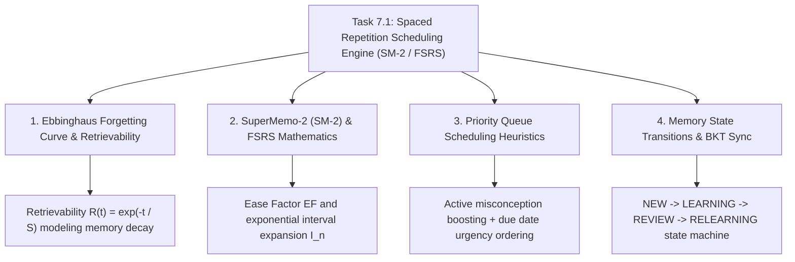

# Task 7.1: Spaced Repetition Scheduling Engine (SM-2 / FSRS) — CS Domain Learning (Stage 3)

## 1. Domain Discovery Map

Task 7.1 bridges cognitive psychology, mathematical algorithms, scheduling queue heuristics, and educational telemetry:



---

## 2. Domain Deep Dives

### Domain 1: Psychometrics of Human Memory & The Ebbinghaus Forgetting Curve

**What Is It (Plain English):**  
In 1885, German psychologist Hermann Ebbinghaus discovered that human memory decays exponentially over time after learning new information:
$$R(t) = e^{-\frac{t}{S}}$$
where:
- $R(t)$ is the **Probability of Successful Recall (Retrievability)** at time $t$.
- $S$ is **Memory Stability** (the number of days it takes for retrievability to drop to $90\%$).
- $t$ is the elapsed time since the last active retrieval practice.

Every time a student actively retrieves a memory from their brain (*Active Recall*), memory stability $S$ increases exponentially ($S' > S$).

---

### Domain 2: SuperMemo-2 (SM-2) & FSRS Mathematics (PRD FR-007)

**What Is It (Plain English):**  
Developed by Piotr Woźniak in 1987, SM-2 is the world's most widely adopted spaced repetition algorithm (powering Anki and modern medical licensing study tools).

**The Mathematical Equations:**
1. **Ease Factor ($EF$) Adjustment:**
   $$EF' = \max\left(1.30, EF + \left(0.1 - (5 - q) \cdot (0.08 + (5 - q) \cdot 0.02)\right)\right)$$
   where $q \in \{1, 2, 3, 4, 5\}$ is the student's rating.
   - For $q = 3$ (`GOOD`): $EF' = EF + (0.1 - 2 \cdot (0.08 + 0.04)) = EF - 0.14 \approx EF$.
   - For $q = 4$ (`EASY`): $EF' = EF + (0.1 - 1 \cdot (0.08 + 0.02)) = EF + 0.00$ (with interval bonus).
   - For $q = 1$ (`AGAIN`): $EF' = EF - 0.54$.

2. **Interval Calculation ($I_n$ in days):**
   $$I_n = \begin{cases} 
      1 & \text{if } n = 1 \\
      6 & \text{if } n = 2 \\
      \text{round}(I_{n-1} \cdot EF') & \text{if } n > 2 
   \end{cases}$$
   *Relapse Rule:* If $q = 1$ (`AGAIN`), $n \to 0$, $I \to 1\text{ day}$, and state transitions to `RELEARNING`.

---

### Domain 3: Priority Queue Scheduling & Starvation Avoidance

**What Is It (Plain English):**  
When generating a daily revision deck, the scheduler cannot simply return random cards. It constructs a **Multi-Tier Priority Queue**:
1. **Priority 1 (Active Error Boost):** Cards associated with active misconceptions in the Error Bank (Task 5.2).
2. **Priority 2 (Critical Overdue Cards):** Cards where $R(t) < 0.70$ (highest risk of permanent forgetting).
3. **Priority 3 (Standard Due Cards):** Cards where `due_at <= now()`.
4. **Priority 4 (New Learning Cards):** Fresh unreviewed cards, capped at $10$ per day to prevent backlog overwhelm.

---

### Domain 4: Feedback Loops with Bayesian Knowledge Tracing (Task 5.1)

**What Is It (Plain English):**  
Spaced repetition is not an isolated silo. When a student successfully completes a spaced retrieval card for a topic with rating `GOOD` or `EASY`:
- The event proves retained knowledge, boosting Bayesian Knowledge Tracing prior $P(L_t)$ in `MasteryEngineService`.
- If the card was previously flagged as an error, a correct review advances its repair state in `ErrorBankService`.

---

## 3. Cross-Domain Connections

| Concept A | Concept B | Architectural Connection |
|:---|:---|:---|
| **`SpacedReviewCard`** | **`Question` (Task 4.1)** | Flashcards encapsulate a question prompt and explanation for active recall. |
| **`SpacedRepetitionService`** | **`ErrorBankService` (Task 5.2)** | Queries active error logs to boost flawed questions to the top of the revision queue. |
| **`SpacedRepetitionService`** | **`MasteryEngineService` (Task 5.1)** | Successful spaced reviews feed back into topic mastery belief updates. |
| **`ReviewLog`** | **`LearningStateAuditLog` (Task 1.2)** | Records immutable review telemetry for retention analytics (FR-009). |

---

## 4. Concept Evolution Timeline

```markdown
| Level | What You Might Think | Deeper Reality |
|:---|:---|:---|
| **Beginner** | "Review notes the night before the exam." | Cramming produces rapid decay; 80% forgotten within a week. |
| **Intermediate** | "Review every question once a week." | Over-practices easy items and under-practices difficult items. |
| **Advanced** | "Standard SM-2 algorithm with fixed intervals." | Ignores active misconceptions and individual student mastery state. |
| **Expert** | "Adaptive SM-2 + FSRS Retrievability with Error Bank Priority Boosting and BKT Feedback Loops." | Production-grade metacognitive revision engine. |
```

---

## 5. Vocabulary Reference

| Term | Definition | Codebase Example |
|:---|:---|:---|
| **Retrievability $R(t)$** | Probability that a student will successfully recall a memory at time $t$. | `SM2Engine.calculate_retrievability()` |
| **Memory Stability $S$** | Time required for retrievability to drop from 100% to 90%. | `SpacedReviewCard.stability` |
| **Ease Factor ($EF$)** | Multiplier determining the rate of interval expansion for a card. | `SpacedReviewCard.ease_factor` (clamped $[1.3, 2.8]$) |
| **Ease Hell** | Pathological state where ease factor drops too low, trapping card in endless daily reviews. | Prevented by $EF \ge 1.30$ floor |

---

## 6. "What If" Thought Experiments

### Q1: What happens if a student skips studying for 2 weeks?
> **Answer:** The scheduler prioritizes cards with the lowest estimated retrievability $R(t)$, ensuring the most decayed memories are reinforced first, while capping daily reviews to prevent burnout.

### Q2: Why does an incorrect answer reset the repetition count to 0?
> **Answer:** In psychometrics, a retrieval failure indicates that the memory trace has faded below the usable threshold. The concept must re-enter the acquisition phase (`RELEARNING`) before interval expansion can resume.

### Q3: How does the scheduler handle a card that the student rates "EASY" on day 1?
> **Answer:** The algorithm applies an easy bonus multiplier ($1.3\times$), scheduling the next review in $3$ or $4$ days instead of $1$ day, respecting the student's existing competence.

### Q4: Can an instructor seed flashcards for an entire syllabus?
> **Answer:** Yes! The `POST /api/v1/revision/cards/seed` endpoint allows bulk initialization of review cards across all validated questions in an exam template.

---

## Workflow Checklist
- [x] Spaced repetition concept map included.
- [x] Ebbinghaus forgetting curve formula detailed.
- [x] SM-2 mathematical equations with ease factor bounds explained.
- [x] Multi-tier priority queue heuristics detailed.
- [x] Cross-domain connection matrix filled.
- [x] Concept evolution timeline documented.
- [x] Vocabulary reference table created.
- [x] 4 comprehensive "What If" scenarios analyzed.
