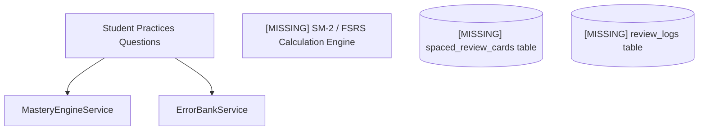
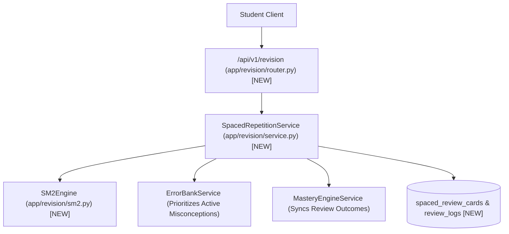
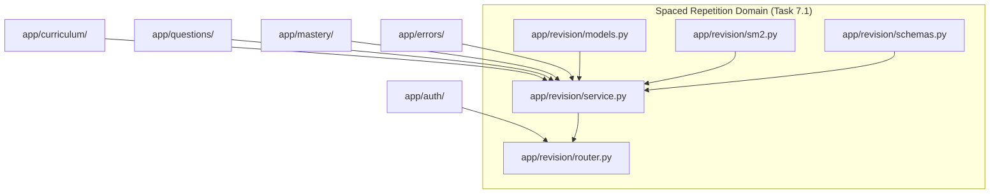

# Task 7.1: Spaced Repetition Scheduling Engine (SM-2 / FSRS) — Codebase Design (Stage 2)

## 1. Current State Snapshot

Prior to Task 7.1:
- `backend/app/mastery/` (Task 5.1) tracks live topic mastery probabilities $P(L_t)$.
- `backend/app/errors/` (Task 5.2) tracks active misconceptions and mistakes.
- However, there is **no memory retention scheduling engine**, flashcard review model, or due queue calculation system.

### Before Architecture Diagram

---

## 2. Proposed State

Task 7.1 creates the `backend/app/revision/` domain package:
1. `backend/app/revision/models.py`:
   - `ReviewRating` Enum: `AGAIN` (1), `HARD` (2), `GOOD` (3), `EASY` (4)
   - `CardState` Enum: `NEW`, `LEARNING`, `REVIEW`, `RELEARNING`
   - `SpacedReviewCard` SQLModel table `spaced_review_cards`
   - `ReviewLog` SQLModel table `review_logs`
2. `backend/app/revision/sm2.py`:
   - `SM2Engine`: Pure mathematical implementation of SM-2 interval expansion, ease factor clamping $[1.3, 2.8]$, and retrievability calculations.
3. `backend/app/revision/schemas.py`:
   - `ReviewCardResponse`, `ReviewCardDetailResponse`, `ReviewSubmitRequest`, `ReviewSubmitResponse`, `DueCardsListResponse`, `RevisionMetricsResponse`, `CardSeedRequest`
4. `backend/app/revision/service.py`:
   - `SpacedRepetitionService`:
     - `get_or_create_card(...) -> SpacedReviewCard`
     - `submit_review(...) -> ReviewSubmitResponse`
     - `get_due_cards(...) -> DueCardsListResponse`
     - `get_revision_metrics(...) -> RevisionMetricsResponse`
     - `seed_cards_for_topic(...) -> int`
5. `backend/app/revision/router.py`:
   - Endpoints:
     - `GET /api/v1/revision/due`: List due cards ordered by error priority and due date
     - `POST /api/v1/revision/review`: Submit review rating
     - `GET /api/v1/revision/metrics`: Summary statistics
     - `POST /api/v1/revision/cards/seed`: Seed flashcards for a topic
6. `backend/app/revision/__init__.py`: Package exports.
7. `backend/app/api/v1/router.py`: Mount `/api/v1/revision` router.

### After Architecture Diagram

---

## 3. File-Level Impact Analysis

### [NEW] `backend/app/revision/models.py`
- **Purpose:** SQLModels for spaced review flashcards, states, and historical review logs.
- **Exports:** `ReviewRating`, `CardState`, `SpacedReviewCard`, `ReviewLog`.

### [NEW] `backend/app/revision/sm2.py`
- **Purpose:** Pure mathematical SM-2 and retrievability calculation engine.
- **Exports:** `SM2Engine`.

### [NEW] `backend/app/revision/schemas.py`
- **Purpose:** Pydantic request/response schemas for card review and due queue metrics.
- **Exports:** `ReviewCardResponse`, `ReviewCardDetailResponse`, `ReviewSubmitRequest`, `ReviewSubmitResponse`, `DueCardsListResponse`, `RevisionMetricsResponse`, `CardSeedRequest`.

### [NEW] `backend/app/revision/service.py`
- **Purpose:** Orchestration service for card creation, rating submissions, due queue priority ordering, and analytics.
- **Exports:** `SpacedRepetitionService`.

### [NEW] `backend/app/revision/router.py`
- **Purpose:** REST API endpoints for revision queues, reviews, and metrics.
- **Exports:** `router` (`/revision` prefix).

### [NEW] `backend/app/revision/__init__.py`
- **Purpose:** Package exports.

### [MODIFY] `backend/app/api/v1/router.py`
- **What changes:** Include `revision_router` in master v1 router.

### [NEW] `backend/tests/test_spaced_repetition.py`
- **Purpose:** Unit and integration tests for SM-2 mathematical formulas, ease factor bounds, card state transitions, queue priority ordering, and multi-tenant student isolation.

---

## 4. Dependency Graph / Blast Radius

---

## 5. Regression Risk Matrix

| Risk ID | Risk Description | Severity | Affected Area | Mitigation Strategy |
|:---|:---|:---:|:---|:---|
| **R-01** | Ease factor falls below 1.30 ("Ease Hell") | 🟡 Medium | `SM2Engine` | Enforce explicit clamping `max(1.30, new_ef)`. |
| **R-02** | Zero due cards when student has active items | 🟢 Low | Due Queue Query | Check timezone offset `due_at <= datetime.now(timezone.utc)`. |
| **R-03** | Cross-student review queue leakage | 🔴 High | Multi-tenant Security | Filter all card queries strictly by `student_id == current_user.id` from verified JWT. |

---

## 6. Contract Stability Check

| Contract / Endpoint | Status | Request Body | Response Shape | Breaking? |
|:---|:---|:---:|:---|:---:|
| `GET /api/v1/revision/due` | **NEW** | None (Query params) | `DueCardsListResponse` | No |
| `POST /api/v1/revision/review` | **NEW** | `ReviewSubmitRequest` | `ReviewSubmitResponse` | No |
| `GET /api/v1/revision/metrics` | **NEW** | None (Query params) | `RevisionMetricsResponse` | No |
| `POST /api/v1/revision/cards/seed` | **NEW** | `CardSeedRequest` | `{"seeded_count": int}` | No |
| Existing endpoints | Preserved | Preserved | Preserved | No |

---

## 7. Rollback Plan

### If Changes Are Uncommitted
1. `git restore backend/app/api/v1/router.py`
2. `Remove-Item -Recurse -Force backend/app/revision/ backend/tests/test_spaced_repetition.py`

### If Changes Are Committed
1. `git revert HEAD`
2. `py -3.14 -m pytest backend/tests/`

---

## Workflow Checklist
- [x] Current-state snapshot documented.
- [x] Proposed-state description and After architecture diagram included.
- [x] Every affected file listed with impact analysis.
- [x] Blast-radius graph included.
- [x] Regression risks scored as 🔴 / 🟡 / 🟢.
- [x] Contract stability checked.
- [x] Rollback plan provided.
- [x] No code written.
