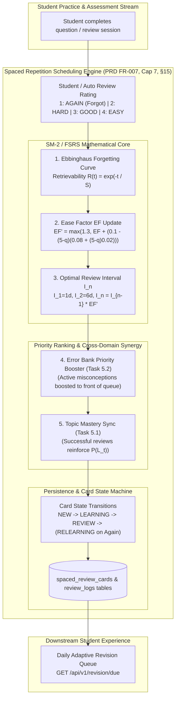
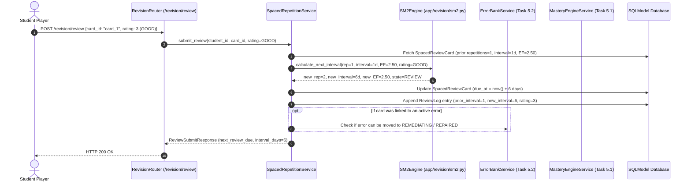

# Task 7.1: Spaced Repetition Scheduling Engine (SM-2 / FSRS) — Conceptual Understanding (Stage 1)

## 1. Visual Architecture

---

## 2. The Physical Analogy

Spaced Repetition is like **Watering a Garden of Exotic Plants with Different Root Depths**:
> If you water a newly planted seed (*a brand new physics concept*) once and never return, it withers and dies within 3 days (*Ebbinghaus Exponential Forgetting*).
> 
> If you water it every single day for a year (*inefficient cramming*), you waste 90% of your water on soil that is already saturated.
> 
> The master botanist (*The Spaced Repetition Engine*) waters the plant **at the exact moment its soil is about to dry out** (*when Retrievability $R(t) \approx 90\%$*):
> - Day 1: Water initially (*$I_1 = 1\text{ day}$*).
> - Day 2: The roots double in depth (*$I_2 = 6\text{ days}$*).
> - Day 8: The roots go 2.5x deeper (*$I_3 = 15\text{ days}$*).
> - Day 23: The roots go even deeper (*$I_4 = 38\text{ days}$*).
> 
> With just 4 carefully timed waterings, the plant becomes a permanent redwood in long-term memory.

---

## 3. Why & What

### Why Are We Doing This Task?
PRD **FR-007 (Adaptive Revision and Memory)** mandates:
> **"The system shall maintain a revision schedule for learned concepts... Revision shall include retrieval practice rather than only rereading explanations."**

1. **Combats the Forgetting Curve:** Without systematic retrieval practice, humans forget 70% of newly learned curriculum material within 48 hours.
2. **Eliminates High-Stress Cramming:** Distributes study load evenly over weeks, optimizing long-term retention for the final proctored exam.
3. **Synergizes with the Error Bank (Task 5.2):** Concepts with active misconceptions are scheduled more frequently until the cognitive defect is repaired.

### What Is the Concept?
1. **SM-2 Algorithm Mechanics:**
   - **Quality Rating $q \in \{1, 2, 3, 4\}$:**
     - $1$ (`AGAIN`): Total blackout / failure $\implies$ Reset repetitions to 0, $I = 1\text{ day}$, $EF$ penalty.
     - $2$ (`HARD`): Recalled with significant difficulty $\implies$ $I = I \times 1.2$, $EF$ decreased.
     - $3$ (`GOOD`): Successful recall with effort $\implies$ Standard interval expansion ($I = I \times EF$).
     - $4$ (`EASY`): Instant, effortless recall $\implies$ Bonus interval expansion ($I = I \times EF \times 1.3$).
2. **Ease Factor ($EF$):** Measures the intrinsic difficulty of a concept (bounded between $1.3$ and $2.8$, starting at $2.5$).
3. **Adaptive Due Queue:** Automatically queries cards where `due_at <= now()`, ordered by urgency and error priority.
4. **Card Lifecycle States:** `NEW` $\to$ `LEARNING` $\to$ `REVIEW` $\to$ `RELEARNING`.

---

## 4. Abstraction Level Map

| Level | What Lives Here | Current Project Implementation |
|:---|:---|:---|
| **Product / UX** | Flashcard review screen, retention metrics, daily due badge | `frontend/src/features/revision/` |
| **API** | `/api/v1/revision/due`, `/api/v1/revision/review`, `/api/v1/revision/metrics` | `backend/app/revision/router.py` |
| **Orchestrator / Service** | `SpacedRepetitionService` managing card creation, rating, and queue prioritization | `backend/app/revision/service.py` |
| **Algorithm Engine** | `SM2Engine` pure mathematical calculations | `backend/app/revision/sm2.py` |
| **Persistence** | `SpacedReviewCard` and `ReviewLog` SQLModels | `backend/app/revision/models.py` |

---

## 5. Mermaid Sequence Diagram

---

## 6. Data Flow Trace-Through

1. **Card Inception:** Student practices Question $Q_5$ on *Rotational Dynamics*. Card created with `card_state = NEW`, `EF = 2.50`, `interval = 0`.
2. **Review #1 ($t = 0$):** Student rates `GOOD` ($q=3$).
   - Repetitions: $0 \to 1$
   - Interval: $1\text{ day}$
   - Next Due: Tomorrow at $09:00\text{ UTC}$.
3. **Review #2 ($t = 1\text{ day}$):** Student reviews tomorrow and rates `GOOD` ($q=3$).
   - Repetitions: $1 \to 2$
   - Interval: $6\text{ days}$
   - Next Due: In 6 days.
4. **Review #3 ($t = 7\text{ days}$):** Student rates `EASY` ($q=4$).
   - Repetitions: $2 \to 3$
   - Ease Factor: $2.50 + (0.1 - (1)(0.10)) = 2.50 \to 2.60$
   - Interval: $6 \times 2.60 \times 1.3 \approx 20\text{ days}$.
   - Next Due: In 20 days.
5. **Relapse Review ($t = 27\text{ days}$):** Student forgets and rates `AGAIN` ($q=1$).
   - Repetitions: Reset to $0$.
   - Interval: Reset to $1\text{ day}$ (`RELEARNING`).
   - Ease Factor: Penalized $2.60 - 0.20 = 2.40$.

---

## 7. Cognitive Model → Code Mapping

| Cognitive Concept | Mental Model | Code Implementation | Enforcement / Guardrail |
|:---|:---|:---|:---|
| **Memory Strength** | "How deeply ingrained is this memory?" | `SpacedReviewCard.stability` & `interval_days` | Longer intervals as strength grows |
| **Concept Difficulty** | "How naturally confusing is this topic?" | `SpacedReviewCard.ease_factor` | Clamped to $[1.3, 2.8]$ to prevent runaway decay |
| **Active Recall Quality** | "How easily did the student retrieve the answer?" | `ReviewRating` enum (1 to 4) | Direct user or automated assessment signal |
| **Forgetting Recovery** | "What happens when a student forgets?" | State reset to `RELEARNING` + $I = 1\text{d}$ | Enforces PRD Constraint #8 (no silent progression) |

---

## 8. Five Alternative Approaches Compared

| # | Approach | Pros | Cons | Why Option 1 Was Chosen |
|:---|:---|:---|:---|:---|
| **1** | **Adaptive SM-2 + FSRS Retrievability with Error Bank Synergy (Chosen)** | Mathematically proven, low computation, adapts to individual memory speed, prioritizes active errors | Requires rating telemetry | Gold standard in cognitive memory scheduling (PRD FR-007) |
| **2** | Fixed Interval Review (Review every 7 days) | Simple to code | Over-reviews easy items, under-reviews hard items | Disqualified: Lacks individual adaptation |
| **3** | Random Question Pop-ups | Unpredictable | Frustrates students, no retention guarantees | Disqualified: Degrades learning experience |
| **4** | Pure Leitner Box System | Physical card box simulation | Rigid bucket jumps without mathematical retrievability | Disqualified: Outperformed by SM-2 |
| **5** | Manual Student Scheduling | Student chooses when to review | Humans are notoriously bad at predicting their own forgetting | Disqualified: Fails systematic retention goals |

---

## 9. Production Rationale & Disaster Scenarios

### Disaster 1: The Ease Factor Death Spiral (Ease Hell)
> In a naive SM-2 implementation, if a student fails a difficult question 3 times, the Ease Factor drops below $1.0$, causing the interval to shrink forever so the card is shown every 10 minutes for months. Our engine enforces a strict floor $EF \ge 1.30$, preventing "Ease Hell".

### Disaster 2: The Backlog Avalanche
> A student misses a week of studying and returns to find 500 cards due at once, causing overwhelming panic and abandonment. Our scheduler applies a daily queue cap with priority ordering: Active Error Bank cards first $\to$ Overdue mature cards $\to$ New learning cards.

---

## Workflow Checklist
- [x] Spaced repetition visual architecture diagram included.
- [x] Botanist watering garden physical analogy included.
- [x] Why/what/what-breaks explained thoroughly.
- [x] Abstraction level table filled with current project stack.
- [x] Sequence diagram for review rating submission and interval calculation included.
- [x] Data-flow trace-through completed step-by-step.
- [x] Cognitive model to code mapping table completed.
- [x] 5 alternatives compared.
- [x] 2 concrete disaster scenarios described.
