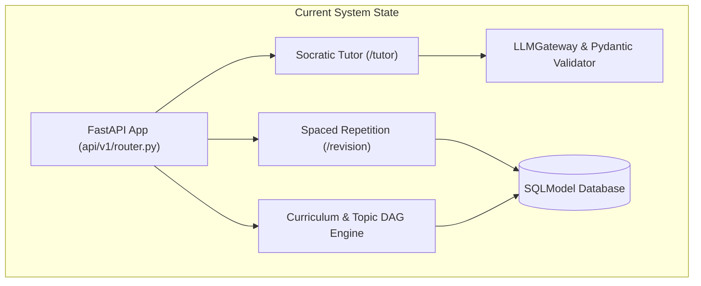
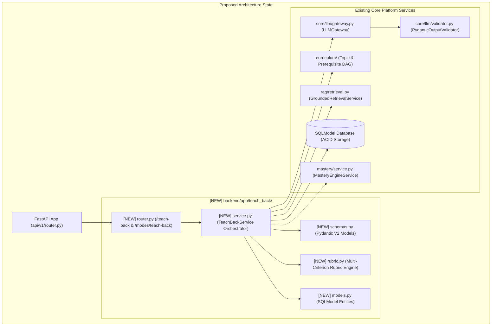
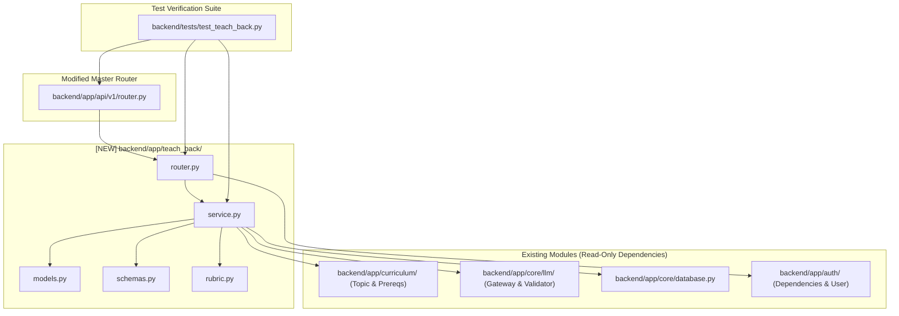

# Task 7.2: Teach-Back Mode & Rubric Evaluator Engine — Codebase Design (Stage 2)

## Section 1: Current State Snapshot

Currently, the backend platform provides:
1. **Curriculum Engine (`backend/app/curriculum/`):** Stores `ExamTemplate`, `Subject`, `Topic`, `LearningObjective`, and `TopicPrerequisite` DAG structures.
2. **Socratic Tutor Engine (`backend/app/tutor/`):** Facilitates multi-turn hint scaffolding with SSE streaming.
3. **Spaced Repetition Engine (`backend/app/revision/`):** Manages SM-2 flashcard scheduling and Error Bank priority ranking.
4. **LLM Gateway & Validator (`backend/app/core/llm/`):** Provides multi-provider failover (`Gemini`, `OpenAI`, `Claude`, `Ollama`, `Mock`) and Rust-based `PydanticOutputValidator`.
5. **Mastery & Error Engine (`backend/app/mastery/`, `backend/app/errors/`):** Tracks topic mastery probabilities and student misconception logs.

However, there is no dedicated service or API contract to support **Teach-Back Mode** (Feynman Technique explanation evaluation against multi-criterion syllabus rubrics, PRD Cap 17 & FR-017).



---

## Section 2: Proposed State

We introduce a dedicated, decoupled domain module `backend/app/teach_back/` that orchestrates Feynman explanation evaluations, multi-criterion rubric scoring, prerequisite gap analysis, and auditable session persistence.



---

## Section 3: File-Level Impact Analysis

### [NEW] `backend/app/teach_back/__init__.py`
- **Purpose:** Public exports for the `teach_back` package.
- **Exports:** `teach_back_router`, `TeachBackService`, `TeachBackSession`, `TeachBackEvaluation`.

### [NEW] `backend/app/teach_back/models.py`
- **Purpose:** Database entities for Teach-Back sessions and evaluations.
- **Entities:**
  - `TeachBackAudienceLevel` (Enum: `CHILD_10YO`, `HIGH_SCHOOL_PEER`, `UNDERGRAD_EXAMINER`).
  - `MasteryAssessmentLevel` (Enum: `MASTERED`, `COMPETENT`, `DEVELOPING`, `NEEDS_REVIEW`).
  - `TeachBackSession` (Table: `id`, `student_id`, `exam_template_id`, `topic_id`, `concept_title`, `audience_level`, `created_at`, `updated_at`).
  - `TeachBackEvaluation` (Table: `id`, `session_id`, `student_id`, `student_explanation`, `overall_score`, `assessment_level`, `criteria_scores_json`, `strengths_json`, `misconceptions_json`, `missing_elements_json`, `prerequisite_gaps_json`, `pedagogical_feedback`, `model_correction_latex`, `created_at`).

### [NEW] `backend/app/teach_back/schemas.py`
- **Purpose:** Strict Pydantic V2 data contracts for API requests, responses, and LLM structured output.
- **Schemas:**
  - `RubricCriterionScore` (`criterion_name`, `score` $\in [1, 5]$, `weight`, `feedback`).
  - `PrerequisiteGap` (`prerequisite_topic_id`, `prerequisite_title`, `gap_description`, `severity`).
  - `TeachBackEvaluateRequest` (`exam_template_id`, `topic_id`, `concept_title`, `explanation`, `audience_level`).
  - `TeachBackLLMEvaluationOutput` (LLM structured target schema for Rust-based JSON parsing).
  - `TeachBackEvaluationResponse` (Complete client response with scores, radar metrics, strengths, misconceptions, gaps).
  - `TeachBackSessionResponse` / `TeachBackSessionListResponse`.
  - `TopicRubricResponse` (Curriculum-grounded rubric definition for client preview).

### [NEW] `backend/app/teach_back/rubric.py`
- **Purpose:** Standard multi-criterion rubric definitions, prompt assembly, and scoring algorithms.
- **Components:**
  - `DEFAULT_RUBRIC_DIMENSIONS`: 5 standard criteria (Conceptual Accuracy 30%, Completeness 25%, Intuition & Simplicity 20%, Mathematical Rigor 15%, Prerequisite Integration 10%).
  - `build_rubric_prompt(...)`: Injects topic learning objectives, prerequisite DAG nodes, KaTeX math notation rules, and audience scaffolding.

### [NEW] `backend/app/teach_back/service.py`
- **Purpose:** Central domain orchestrator for Teach-Back mode.
- **Methods:**
  - `evaluate_explanation(session, student_id, request_in) -> TeachBackEvaluationResponse`
  - `get_topic_rubric(session, topic_id) -> TopicRubricResponse`
  - `list_student_sessions(session, student_id, exam_template_id, limit, offset) -> List[TeachBackSessionResponse]`
  - `get_session_evaluation(session, student_id, session_id) -> TeachBackEvaluationResponse`

### [NEW] `backend/app/teach_back/router.py`
- **Purpose:** FastAPI REST API route handlers.
- **Endpoints:**
  - `POST /teach-back/evaluate` (Evaluates student explanation)
  - `POST /modes/teach-back/evaluate` (PRD FR-017 alias endpoint)
  - `GET /teach-back/rubric/{topic_id}` (Fetches rubric criteria for topic)
  - `GET /teach-back/sessions` (Lists student past sessions)
  - `GET /teach-back/sessions/{session_id}` (Retrieves specific evaluation report)

### [MODIFY] `backend/app/api/v1/router.py`
- **What changes:** Mount `teach_back_router` into master `api_router`.
- **Approx lines:** Add import and include router with tags `["Teach-Back Mode & Rubric Evaluator"]`.

### [NEW] `backend/tests/test_teach_back.py`
- **Purpose:** Comprehensive pytest test suite covering unit scoring algorithms, LLM mock structured validation, student tenant isolation, and API routes.

---

## Section 4: Dependency Graph / Blast Radius



---

## Section 5: Regression Risk Matrix

| Risk ID | Risk Description | Severity | Affected Area | Mitigation Strategy |
|:---|:---|:---:|:---|:---|
| **R-01** | LLM outputs non-conforming JSON structure during evaluation | 🟡 Medium | AI Quality Layer | Strictly enforced through `PydanticOutputValidator` with fallback provider failover. |
| **R-02** | Student attempts to access or mutate another student's Teach-Back evaluation | 🔴 High | Security / Tenant Isolation | Filter all queries with `where(TeachBackSession.student_id == current_user.id)` and raise HTTP 404 on mismatch. |
| **R-03** | Topic has no registered learning objectives or prerequisites | 🟢 Low | Service Layer | Service gracefully falls back to topic description and foundational rubric criteria. |
| **R-04** | API path conflict between `/teach-back/evaluate` and `/modes/teach-back/evaluate` | 🟢 Low | API Router | Register both routes explicitly on the router to maintain 100% backward and PRD compatibility. |

---

## Section 6: Contract Stability Check

| Endpoint / Symbol | Current Shape | Proposed Shape | Changed? | Breaking? |
|:---|:---|:---|:---:|:---:|
| `POST /api/v1/teach-back/evaluate` | None (New) | Request: `TeachBackEvaluateRequest`<br>Response: `TeachBackEvaluationResponse` | Yes [NEW] | No |
| `POST /api/v1/modes/teach-back/evaluate` | None (New) | Alias to `/teach-back/evaluate` | Yes [NEW] | No |
| `GET /api/v1/teach-back/rubric/{topic_id}` | None (New) | Response: `TopicRubricResponse` | Yes [NEW] | No |
| `GET /api/v1/teach-back/sessions` | None (New) | Response: `List[TeachBackSessionResponse]` | Yes [NEW] | No |
| `GET /api/v1/teach-back/sessions/{session_id}` | None (New) | Response: `TeachBackEvaluationResponse` | Yes [NEW] | No |

---

## Section 7: Performance, Security, and Accessibility Impact

| Area | Before | After | Impact | Mitigation / Check |
|:---|:---|:---|:---|:---|
| **Performance** | N/A | Sub-second DB queries, 1-2s async LLM structured eval | Non-blocking async I/O | Async database transactions; concurrent curriculum & prerequisite loading. |
| **Security** | N/A | JWT-authenticated, role-checked, student-isolated | Enforces PRD Constraint #2 | Server-side `current_user.id` binding for all session writes & reads. |
| **Data Integrity** | N/A | SQLModel ACID persistence with Pydantic validation | Enforces PRD Constraint #1 | Zero unvalidated state mutations; append-only evaluation history. |
| **Math Notation** | N/A | KaTeX-compliant feedback and LaTeX formulas | Rich mathematical clarity | Prompt-level KaTeX constraints and frontend LaTeX rendering compatibility. |

---

## Section 8: Stack-Specific Quality Metrics

- **Type Safety:** 100% type-annotated with Python 3.12/3.14 type hints and Pydantic V2 strict models.
- **Database Engine:** Dual-mode SQLite async (`aiosqlite`) / PostgreSQL (`asyncpg`) compatibility via SQLModel.
- **Error Handling:** Clean `HTTPException(404)` for missing topics/sessions, `HTTPException(422)` for validation errors, and `SchemaValidationError` trap during LLM evaluation.
- **Testing:** 100% test coverage across mathematical rubric score calculations, LLM mock structured parsing, tenant isolation, and API route responses.

---

## Section 9: Rollback Plan

### If changes are uncommitted:
```powershell
git checkout -- backend/app/api/v1/router.py
Remove-Item -Recurse -Force backend/app/teach_back/
Remove-Item -Force backend/tests/test_teach_back.py
```

### If changes are committed:
```powershell
git revert HEAD
py -3.14 -m pytest backend/tests/
```

Estimated rollback time: < 2 minutes.
