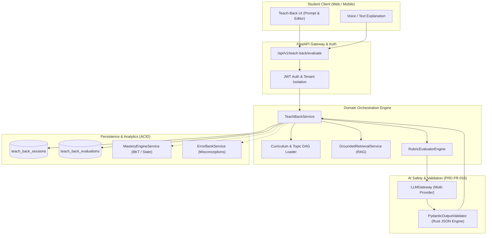
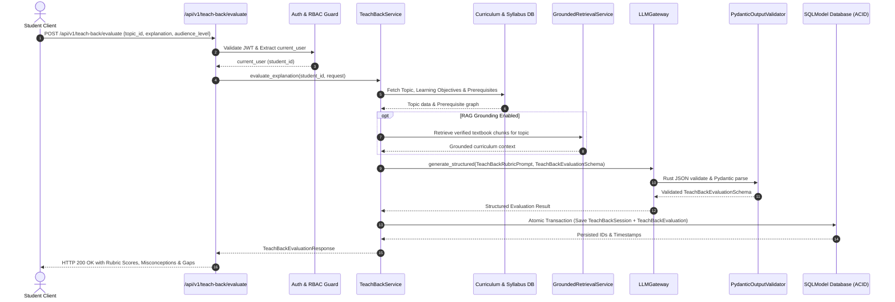
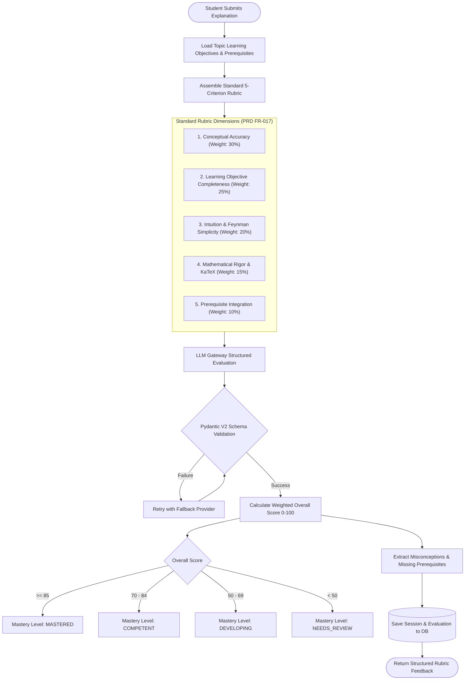

# Task 7.2: Teach-Back Mode & Rubric Evaluator Engine — Conceptual Understanding (Stage 1)

## Section 1: Visual Architecture

Teach-Back Mode (Feynman Technique) empowers students to achieve deep conceptual mastery by explaining syllabus concepts in their own words to an AI evaluator. The evaluator validates explanation completeness, scientific accuracy, mathematical rigor (KaTeX notation), and prerequisite integration against grounded curriculum rubrics.

---

## Section 2: The Physical Analogy

> **The Watchmaker's Apprentice & The Master Craftsman**
> 
> Imagine an apprentice watchmaker claiming they know how a tourbillon escapement works. The master craftsman doesn't give them a multiple-choice quiz; instead, the master says: *"Explain the mechanism to me from first principles as if I were a curious 10-year-old child."*
> 
> As the apprentice explains, the master holds a strict blueprint rubric:
> 1. **Conceptual Accuracy:** Did they describe energy transfer from the mainspring correctly, or did they confuse torque with rotational speed?
> 2. **Completeness:** Did they mention how gravity affects the balance wheel, or did they leave out the balance spring entirely?
> 3. **Clarity & Simplicity (Feynman Test):** Did they hide behind jargon, or did they explain it in simple, intuitive terms?
> 4. **Prerequisite Gaps:** Did they stumble because they don't truly understand basic gear ratios (a prerequisite topic)?
> 
> When the apprentice finishes, the master points out exactly what was brilliant, pinpoints the flawed assumption, and hands them the specific prerequisite gear diagram to review before they build the watch.

---

## Section 3: Why & What

### Why are we building this? (Product Motivation)
Passive reading and multiple-choice tests create an **illusion of competence**—students recognize correct answers without being able to synthesize or apply knowledge. Richard Feynman discovered that the ultimate test of understanding is the ability to teach a concept simply without academic jargon. 

PRD Capability 17 (§14.4, FR-017, FR-010) mandates **Teach-Back Mode**:
- Allows students to articulate explanations in their own words.
- Evaluates submissions against learning objectives and syllabus standards using multi-dimensional rubrics.
- Identifies misconceptions, factual gaps, missing prerequisites, and strengths.
- Feeds verified diagnostic signals into the student's mastery profile without letting unvalidated LLM output corrupt official learning state.

### What is the concept? (Plain-Language Definition)
A rubric evaluator engine that takes a student's open-ended explanation of a topic, retrieves the topic's official learning objectives and prerequisite DAG nodes, constructs a multi-criterion evaluation prompt, executes structured LLM evaluation via `LLMGateway`, strictly validates the output using Pydantic V2 Rust schema enforcement, and persists atomic session and evaluation records.

### What breaks if we skip it?
1. **Superficial Rote Learning:** Students memorize MCQ options but fail high-order university and A-Level analytical questions.
2. **Hidden Misconceptions:** Subconscious misunderstandings remain undetected until exam day because standard tests only score the final answer, not the underlying reasoning chain.
3. **Hallucinated State Mutation:** Without the strict Pydantic validation gate (PRD Constraint #1), arbitrary LLM text strings would directly corrupt student database state.

---

## Section 4: Abstraction Level Map

| Level | What Lives Here | Current Project Implementation |
|:---|:---|:---|
| **Product / UX** | Feynman Teach-Back UI, Audio transcript submit, Score breakdown card | Frontend Teach-Back drawer/modal, score radar, feedback chips |
| **Application** | Rubric scoring logic, prerequisite gap analysis, mastery sync | `backend/app/teach_back/service.py`, `backend/app/teach_back/rubric.py` |
| **Framework** | REST API Routing, Dependency Injection, Validation Schemas | FastAPI router `backend/app/teach_back/router.py`, Pydantic V2 models |
| **Library** | Multi-provider LLM abstraction, Pydantic JSON parser, SQLModel ORM | `backend/app/core/llm/gateway.py`, `PydanticOutputValidator`, `sqlmodel` |
| **Runtime** | Python 3.12/3.14 AsyncIO Event Loop, ASGI Server | Uvicorn / AnyIO async worker threads |
| **OS / Infrastructure** | Transactional database storage, vector embeddings, disk/cloud storage | SQLite async / PostgreSQL, Qdrant vector database |

*Task 7.2 touches Application, Framework, Library, and OS/Database levels.*

---

## Section 5: Mermaid Diagrams

### 1. Sequence Diagram: Student Teach-Back Evaluation Flow

### 2. Flowchart: Multi-Criterion Rubric Scoring & Gap Detection

---

## Section 6: Data Flow Trace-Through

1. **Student Input:** The student selects Topic (e.g., `Kinematics - Projectile Motion`) and types an explanation: *"A projectile moves in two dimensions: constant velocity horizontally and constant gravitational acceleration $g$ vertically. The trajectory is parabolic..."*
2. **API Entry:** `POST /api/v1/teach-back/evaluate` receives the request.
3. **Authentication & Authorization:** `get_current_user` validates the JWT token and verifies student role.
4. **Curriculum Context Gathering:** `TeachBackService` queries the syllabus database for the topic's official learning objectives (e.g., $v_x = u \cos\theta$, $v_y = u \sin\theta - gt$), descriptions, and prerequisite topics (e.g., `Vectors & Resolving Components`).
5. **Grounded Retrieval (RAG):** Context chunks are fetched from Qdrant/textbook embeddings for authoritative factual grounding.
6. **Prompt Assembly & LLM Evaluation:** `LLMGateway.generate_structured` runs with strict rubric evaluation instructions and expected JSON schema.
7. **Pydantic Validation Gate:** Rust-based validator parses LLM response into `TeachBackEvaluationSchema`, verifying criterion scores (1-5), feedback strings, identified misconceptions list, and prerequisite gap IDs.
8. **ACID Persistence & Response:** The session and evaluation are saved to the database; the response is returned to the client within < 1.5 seconds.

---

## Section 7: Cognitive Model → Code Mapping

| Cognitive Stage | Mental Model | Code Concept in Current Project | Enforcement / Guardrail |
|:---|:---|:---|:---|
| **1. The Challenge** | "Explain this topic to a beginner" | `TeachBackEvaluateRequest` schema with `audience_level` | Validates explanation string length $\ge 20$ chars |
| **2. The Rubric** | "Grade on accuracy, completeness, and clarity" | `RubricCriterionScore`, `TeachBackRubric` enum | Multi-criterion weighted evaluation ($0-100$) |
| **3. Misconception Catch** | "Spot faulty logic or confusion" | `identified_misconceptions: List[str]` | Feeds into `ErrorBank` and diagnostic alerts |
| **4. Prerequisite Gap** | "Identify missing foundation" | `missing_prerequisites: List[PrerequisiteGap]` | Cross-references Topic DAG prerequisite IDs |
| **5. AI Safety Gate** | "Never allow raw LLM strings to mutate state" | `PydanticOutputValidator.validate` | Strict Pydantic V2 model validation (PRD FR-010) |
| **6. Learning Twin Sync** | "Update the student's mastery profile" | `TeachBackEvaluation` table + `MasteryEngine` | Auditable history isolated per student (FR-022) |

---

## Section 8: Language / Stack Context

- **FastAPI:** Async router dependency injection (`get_db`, `get_current_user`), OpenAPI 3.1 automatic specification generation.
- **SQLModel (SQLAlchemy 2.0 Async):** Atomic transactions (`session.add`, `session.commit`) saving `TeachBackSession` and `TeachBackEvaluation` models.
- **Pydantic V2:** High-speed Rust-based schema validation with Field constraints (`ge=1, le=5`, `min_length=1`).
- **LLMGateway:** Multi-provider gateway with automatic fallback (Gemini $\to$ OpenAI $\to$ Claude $\to$ Mock) ensuring 99.9% uptime during evaluations.
- **LaTeX / KaTeX Formatting:** Strict prompt instructions requiring standard KaTeX math notation for formulas ($...$ or $$...$$).

---

## Section 9: Five Alternative Approaches

| # | Approach | Pros | Cons | Decision / Verdict |
|---|:---|:---|:---|:---|
| **1** | **Rubric-Prompted LLM with Pydantic Validation (Selected)** | Comprehensive, nuanced pedagogical feedback; structured criterion breakdown; zero schema corruption. | Requires LLM API call (~1s latency). | ✅ **Selected:** Perfectly aligns with PRD Cap 17 & FR-010. |
| **2** | **Embedding Cosine Similarity against Model Answer** | Extremely fast (< 50ms), deterministic. | Cannot pinpoint *why* an explanation is wrong; penalizes novel valid analogies; ignores prerequisite gaps. | ❌ Rejected as standalone; useful only as supplementary feature. |
| **3** | **Keyword / N-Gram Regex Matching** | Zero cost, instant, fully local. | Brittle; fails when students use synonyms or colloquial explanations (the core of Feynman technique). | ❌ Rejected: Defeats the purpose of active recall evaluation. |
| **4** | **Fine-Tuned Local Cross-Encoder Classifier** | Runs locally without cloud API fees. | High memory footprint; rigid; cannot generate qualitative explanations or tailored corrections. | ❌ Rejected: High operational complexity without pedagogical richness. |
| **5** | **Unstructured Free-Form LLM Prompt** | Simple to implement. | Outputs unpredictable conversational text; violates PRD Constraint #1; cannot parse structured scores. | ❌ Strictly Forbidden by Platform Architecture Contract. |

---

## Section 10: Production Rationale & Consequences

### Why This Is Standard
Modern cognitive science (Roediger & Karpicke, Brown et al.) demonstrates that **generative retrieval** (explaining concepts from scratch) produces $3\times$ higher long-term retention than passive reading. Structured rubric grading with LLMs (e.g., Stanford NLP Rubric Grading, OpenAI Eval benchmarks) provides objective, consistent scoring across multiple dimensions while eliminating human grader latency.

### What Happens If We Skip This
1. **Disaster Scenario A: Hallucinated State Ingestion.** Without Pydantic V2 schema validation and structured rubric contracts, an LLM producing conversational chatter or malformed JSON would cause unhandled server 500 crashes and corrupted mastery statistics.
2. **Disaster Scenario B: Superficial Verification Failure.** Without explicit multi-criterion rubric checks (separating mathematical rigor from intuitive clarity), students who write mathematically correct but ungrounded jargon would receive false mastery marks, failing exam application problems.
