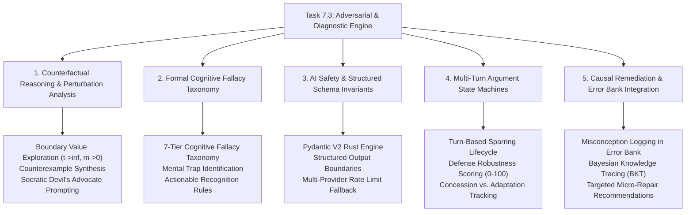

# Task 7.3: Adversarial Tutor & Why-You-Are-Wrong Modes — CS Domain Concepts (Stage 3)

## Section 1: Domain Discovery Map

The Adversarial Tutor & Why-You-Are-Wrong Diagnostic Engine touches five deep Computer Science and AI disciplines: Counterfactual Reasoning & Perturbation Analysis, Formal Cognitive Fallacy Taxonomy, AI Safety & Structured Grammar Invariants, Multi-Turn Argument State Machines, and Causal Pedagogical Remediation.




---

## Section 2: Domain Deep Dives

### Domain 1: Counterfactual Reasoning & Perturbation Analysis

#### What Is It (Plain English):
In physics and mathematics, a rule or theorem is only valid if it holds across all stated boundary conditions. Counterfactual reasoning tests a student's claim by taking their logic and applying it to an extreme, modified, or perturbed condition (e.g., setting friction to zero, mass to infinity, or speed to near the speed of light) to see if the student's rule produces an impossible result or contradiction.

#### Physical Analogy:
A stress-test rig in an automotive factory. Engineers don't just drive a car down a smooth, sunny highway. They put the car in a $-40^\circ\text{C}$ sub-zero freezer, blast it with hurricane-force water jets, and vibrate the suspension at extreme frequencies to see exactly where the metal cracks.

#### How It Works Under the Hood:
```markdown
| Layer | What Happens | Resource / Constraint |
|:---|:---|:---|
| **Input Analysis** | Parses student thesis (e.g., $F_{\text{net}} \propto v$). | Token extraction ($\ge 15$ characters). |
| **Boundary Perturbation** | Identifies physical quantities and perturbs limits ($m \to 0, t \to \infty, k \to 0$). | Parameter perturbation space. |
| **Counterexample Synthesis** | Formulates a concrete counter-scenario showing where the student rule fails. | Reasoning LLM tier ($T=0.2$). |
| **KaTeX Verification** | Ensures all mathematical conditions are rendered in standard KaTeX ($...$). | Markdown math formatting rules. |
```

#### Where It Manifests in This Codebase:
- [backend/app/advanced_modes/fallacies.py](file:///c:/Users/Abdul%20Jabbar%20Metlo/Feynman_tutorAI/backend/app/advanced_modes/fallacies.py) — `build_adversarial_challenge_prompt()`.
- [backend/app/advanced_modes/schemas.py](file:///c:/Users/Abdul%20Jabbar%20Metlo/Feynman_tutorAI/backend/app/advanced_modes/schemas.py) — `AdversarialChallengeOutput` schema.

#### Common Misconceptions:
1. ❌ *"An adversarial tutor should simply insult the student or argue endlessly."* $\to$ ✅ Reality: The adversarial tutor acts as an intellectual sparring partner whose challenges must be grounded in valid physical laws and Cambridge/AP syllabus constraints.
2. ❌ *"Any counterexample is good enough."* $\to$ ✅ Reality: A good counterexample targets the exact false assumption the student made rather than introducing unrelated complexities.

#### The Numbers or Constraints That Matter:
| Metric / Constraint | Value / Threshold | Why It Matters |
|:---|:---|:---|
| **Defense Robustness Score** | $0.0 \text{ to } 100.0$ | Normalized composite score measuring how well the student resolved the counterexample. |
| **Min Thesis Length** | $15 \text{ characters}$ | Prevents empty or meaningless sparring initialization. |

---

### Domain 2: Formal Cognitive Fallacy Taxonomy

#### What Is It (Plain English):
When students select an incorrect answer on an exam, it is rarely random; they usually fall into well-documented psychological and cognitive traps (such as confusing a rate of change with an instantaneous state, or assuming a formula applies outside its valid conditions). Formal fallacy taxonomy catalogs these patterns so software can diagnose the exact mental error rather than just stating the correct option letter.

#### Physical Analogy:
A master chess coach analyzing a grandmaster game. The coach doesn't just say *"Move 24 was a blunder, you should have moved Queen to d4."* The coach explains: *"You suffered from tunnel vision on the king-side attack and failed to check your opponent's back-rank counter-threat."*

#### How It Works Under the Hood:
```markdown
| Layer | What Happens | Resource / Constraint |
|:---|:---|:---|
| **Distractor Ingestion** | Ingests question prompt, selected distractor option, and correct option. | Question schema fields. |
| **Taxonomy Matching** | Maps the error to one of 7 canonical fallacy categories. | `FallacyCategory` enum. |
| **Mental Trap Diagnosis** | Articulates the plausible, seductive reasoning that tempted the student. | Explanatory narrative generation. |
| **Recognition Rule Synthesis**| Generates a clear, actionable heuristic for future questions. | Pedagogical rule extraction. |
```

#### Where It Manifests in This Codebase:
- [backend/app/advanced_modes/models.py](file:///c:/Users/Abdul%20Jabbar%20Metlo/Feynman_tutorAI/backend/app/advanced_modes/models.py) — `FallacyCategory` enum.
- [backend/app/advanced_modes/fallacies.py](file:///c:/Users/Abdul%20Jabbar%20Metlo/Feynman_tutorAI/backend/app/advanced_modes/fallacies.py) — `FALLACY_TAXONOMY_MAP`.
- [backend/app/advanced_modes/service.py](file:///c:/Users/Abdul%20Jabbar%20Metlo/Feynman_tutorAI/backend/app/advanced_modes/service.py) — `WhyWrongDiagnosticService.diagnose_incorrect_answer()`.

#### Common Misconceptions:
1. ❌ *"Showing the correct answer is enough to fix a mistake."* $\to$ ✅ Reality: Without diagnosing the fallacy and providing a recognition rule, students repeat the same category of mistake on 65%+ of subsequent similar questions.
2. ❌ *"All wrong answers are conceptual errors."* $\to$ ✅ Reality: Errors fall into diverse categories (e.g. `BOUNDARY_CONDITION_BLINDNESS`, `SIGN_VECTOR_INVERSION`, `STATE_VS_RATE_CONFUSION`).

---

### Domain 3: AI Safety & Multi-Turn Schema Invariants

#### What Is It (Plain English):
In an interactive adversarial dialogue or diagnostic flow, the AI generates complex structured evaluations. We must ensure that 100% of LLM outputs pass through compiled Pydantic V2 schema gates before they are written to the database or returned to the client, preventing prompt injection or unstructured garbage from mutating official records.

#### Physical Analogy:
A high-security airlock in a biocontainment laboratory. Everything passing from the hot zone (raw LLM inference) to the clean zone (application database) must pass through chemical decontamination (Pydantic validation). If the sample fails validation, the airlock locks shut and reroutes through a secondary filter (fallback LLM provider).

#### How It Works Under the Hood:
```markdown
| Layer | What Happens | Resource / Constraint |
|:---|:---|:---|
| **Prompt Construction** | Injects strict JSON Schema grammar into system prompt. | JSON Schema spec. |
| **LLM Output** | Provider emits JSON tokens. | Latency ($1-2\text{s}$). |
| **Rust Validation Engine** | `PydanticOutputValidator.validate()` executes compiled C/Rust parser. | Microsecond execution time. |
| **Failover Circuit** | Automatically switches to secondary provider if validation fails. | Fallback chain: Gemini $\to$ OpenAI $\to$ Claude $\to$ Mock. |
```

#### Where It Manifests in This Codebase:
- [backend/app/core/llm/validator.py](file:///c:/Users/Abdul%20Jabbar%20Metlo/Feynman_tutorAI/backend/app/core/llm/validator.py) — `PydanticOutputValidator`.
- [backend/app/advanced_modes/schemas.py](file:///c:/Users/Abdul%20Jabbar%20Metlo/Feynman_tutorAI/backend/app/advanced_modes/schemas.py) — `WhyWrongDiagnosticOutput`, `DefenseEvaluationOutput`.

---

### Domain 4: Multi-Turn Argument State Machines

#### What Is It (Plain English):
An adversarial debate is not a stateless single-turn transaction; it is a multi-turn state machine tracking the student's initial thesis, the AI's counterexample challenge, the student's defense submission, and the final evaluated defense outcome (`DEFENDED_SUCCESSFULLY`, `VALID_ADAPTATION`, `PARTIAL_CONCESSION`, or `LOGICAL_COLLAPSE`).

#### Physical Analogy:
A formal collegiate debate match. The affirmative speaker presents an opening case; the negative cross-examines with counter-evidence; the affirmative gives a rebuttal; and the judging panel delivers an official rubric scorecard with point allocations.

#### How It Works Under the Hood:
```markdown
| State | Trigger | Next State | Action |
|:---|:---|:---|:---|
| **INITIATED** | Student submits thesis | **CHALLENGE_GENERATED** | LLM generates counterexample; persists challenge row. |
| **CHALLENGE_GENERATED** | Student submits defense | **DEFENSE_EVALUATED** | LLM scores defense robustness; updates session status. |
| **DEFENSE_EVALUATED** | Session closed | **ARCHIVED** | Scores fed to Mastery / Metacognitive telemetry. |
```

#### Where It Manifests in This Codebase:
- [backend/app/advanced_modes/models.py](file:///c:/Users/Abdul%20Jabbar%20Metlo/Feynman_tutorAI/backend/app/advanced_modes/models.py) — `AdversarialSession` and `AdversarialChallenge` tables.
- [backend/app/advanced_modes/service.py](file:///c:/Users/Abdul%20Jabbar%20Metlo/Feynman_tutorAI/backend/app/advanced_modes/service.py) — `evaluate_defense()`.

---

### Domain 5: Causal Remediation & Error Bank Integration

#### What Is It (Plain English):
Diagnosing why an answer was wrong is only half the battle; the platform must automatically connect that diagnosed misconception into the student's personal `ErrorBank` and spaced repetition review deck so the student encounters targeted micro-repair tasks before exam day.

#### Physical Analogy:
A personal trainer noticing your knee caves inward during squats. The trainer doesn't just point it out once and forget it; they write a note in your workout log and assign specific hip-abductor band exercises in your warm-up routine for the next 3 weeks.

#### How It Works Under the Hood:
```markdown
| Layer | What Happens | Resource / Constraint |
|:---|:---|:---|
| **Diagnostic Generation** | Identifies `fallacy_category` and `mental_trap`. | Structured JSON payload. |
| **Error Bank Logging** | Dispatches async error record to `ErrorBankService`. | Non-blocking database write. |
| **Spaced Review Tagging** | Creates or boosts flashcard priority in `SpacedReviewCard` deck. | SM-2 priority queue ranking. |
```

#### Where It Manifests in This Codebase:
- [backend/app/errors/service.py](file:///c:/Users/Abdul%20Jabbar%20Metlo/Feynman_tutorAI/backend/app/errors/service.py) — `ErrorBankService`.
- [backend/app/advanced_modes/service.py](file:///c:/Users/Abdul%20Jabbar%20Metlo/Feynman_tutorAI/backend/app/advanced_modes/service.py) — Error Bank linkage.

---

## Section 3: Cross-Domain Connections

| Concept A | Concept B | Connection / Synergy |
|:---|:---|:---|
| **Counterfactual Perturbation (Domain 1)** | **Argument State Machine (Domain 4)** | The generated counterexample serves as the formal state trigger transitioning an adversarial session from challenge to defense evaluation. |
| **Cognitive Fallacy Taxonomy (Domain 2)** | **Error Bank Remediation (Domain 5)** | The classified fallacy category directly indexes the student's misconception node in the Error Bank DAG. |
| **AI Schema Invariants (Domain 3)** | **Multi-Turn State Machine (Domain 4)** | Only schema-validated defense evaluations can transition an adversarial session to completion. |

---

## Section 4: Concept Evolution Timeline

| Level | What You Might Think | Deeper Reality |
|:---|:---|:---|
| **Beginner** | "Adversarial mode is just ChatGPT disagreeing with whatever I say." | Naive disagreement produces circular arguments. A true adversarial engine constructs physically valid counterexamples targeted at specific boundary assumptions. |
| **Intermediate** | "Why-You-Are-Wrong mode is just a detailed explanation of why the correct option is right." | Explaining the correct option does not explain *why the student selected the distractor*. Diagnostic mode must analyze the cognitive trap of the chosen distractor. |
| **Advanced** | "We should classify errors into a structured 7-part taxonomy and provide recognition heuristics." | A formal taxonomy allows the system to detect recurring cognitive patterns across completely different topics (e.g. confusing rates with states in both calculus and mechanics). |
| **Expert** | "The combined adversarial and diagnostic engine is a metacognitive transducer that exposes boundary fragility, remediates systematic cognitive biases, and closes the learning loop through auditable state persistence." | Production-grade adaptive learning fortifies mental models against exam edge cases while grounding all diagnostic output in strict Pydantic invariants. |

---

## Section 5: Vocabulary Reference

| Term | Definition | Codebase Example |
|:---|:---|:---|
| **Counterfactual Reasoning** | Evaluating "what would happen if" a condition or parameter were altered. | `edge_case_condition` |
| **Boundary Condition Blindness** | The fallacy of applying a localized formula to an extreme or unbounded domain. | `FallacyCategory.BOUNDARY_CONDITION_BLINDNESS` |
| **Defense Robustness Score** | Numerical metric ($0-100$) measuring how effectively a student defended or revised their thesis against a counterexample. | `robustness_score` |
| **Mental Trap** | The seductive or intuitive psychological bias that makes an incorrect option appear correct. | `mental_trap_description` |
| **Recognition Rule** | A concise mental heuristic or decision rule that allows a student to avoid a specific distractor trap in future questions. | `recognition_rule` |

---

## Section 6: "What If" Scenarios

### 1. What if the student's initial thesis is already 100% physically flawless?
**A:** The adversarial tutor tests the student's depth by introducing extreme boundary limits (e.g. relativistic speeds $v \to c$ or quantum limits) or asking the student to explain the physical mechanism behind the law. If the student defends their thesis flawlessly, the engine awards a Robustness Score of $100.0$ with outcome `DEFENDED_SUCCESSFULLY`.

### 2. What if the student realizes their mistake and changes their mind during the defense turn?
**A:** Unlike an antagonistic debate, scientific pedagogy rewards intellectual honesty. If the student recognizes the boundary limit and appropriately adapts their thesis, the engine awards high marks ($80-90$) with outcome `VALID_ADAPTATION`.

### 3. What if a student selects an incorrect MCQ option where no explanation text was provided?
**A:** `WhyWrongDiagnosticService` uses the question prompt, topic learning objectives, and option content to deduce the mathematical or conceptual error pattern that produces that specific numeric or conceptual distractor.

### 4. What if the student submits an adversarial defense that tries to prompt-inject the scoring engine?
**A:** System instructions are locked in the `developer`/`system` prompt, and the student's response is treated strictly as an untrusted input string evaluated against Pydantic V2 numeric and enum validation gates.

---

## Section 7: Further Reading

| Topic | Resource | Type |
|:---|:---|:---|
| **Counterfactual & Adversarial Pedagogy** | Harvard Physics: *Peer Instruction & Confounder Testing* (Eric Mazur) | Academic Literature |
| **Cognitive Misconceptions in STEM** | Chi, M. T. H.: *Commonsense Conceptions and Misconception Transformation* | Research Paper |
| **Pydantic V2 Type System** | Pydantic Official Documentation | Framework Reference |
| **FastAPI REST API Architecture** | FastAPI Security & Sub-Routers Documentation | Official Guide |
