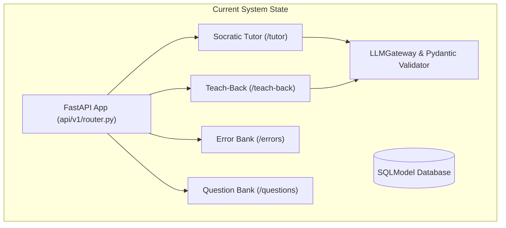
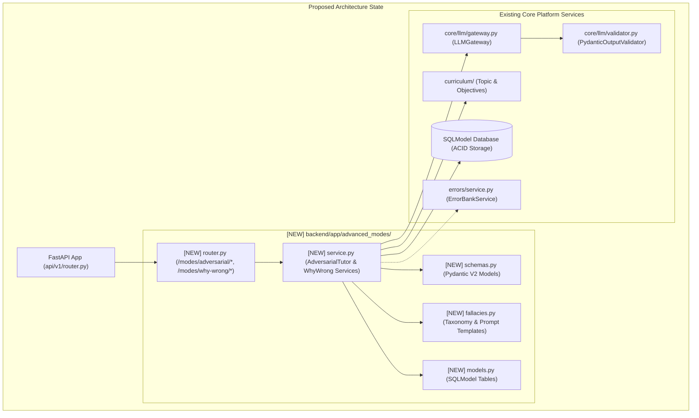
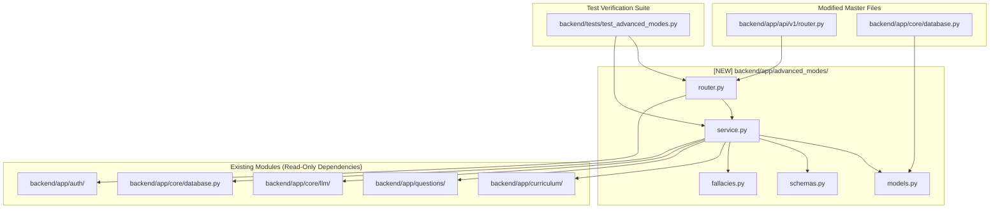

# Task 7.3: Adversarial Tutor & Why-You-Are-Wrong Modes — Codebase Design (Stage 2)

## Section 1: Current State Snapshot

Currently, the platform includes:
1. **Socratic Tutor Engine (`backend/app/tutor/`):** Provides supportive, multi-tier hint scaffolding.
2. **Teach-Back Engine (`backend/app/teach_back/`):** Evaluates student concept explanations using multi-criterion Feynman rubrics.
3. **Error Bank Engine (`backend/app/errors/`):** Catalogs student mistakes and tracks resolution status.
4. **Question Bank & Lab (`backend/app/questions/`):** Stores questions, options, distractors, and validation data.
5. **LLM Gateway & Validator (`backend/app/core/llm/`):** Provides multi-provider failover and Rust-based JSON validation.

However, there is no service or data model for **Adversarial Tutoring** (counterfactual edge-case challenges and defense evaluation) or **Why-You-Are-Wrong Diagnostics** (cognitive fallacy decomposition, mental trap analysis, and recognition rules, PRD Cap 18, 19, FR-018, FR-019).



---

## Section 2: Proposed State

We introduce a dedicated, decoupled domain module `backend/app/advanced_modes/` that implements both Adversarial Tutor Mode and Why-You-Are-Wrong Diagnostic Mode with strict Pydantic V2 schema validation and ACID persistence.



---

## Section 3: File-Level Impact Analysis

### [NEW] `backend/app/advanced_modes/__init__.py`
- **Purpose:** Package exports.
- **Exports:** `advanced_modes_router`, `AdversarialTutorService`, `WhyWrongDiagnosticService`, `AdversarialSession`, `WhyWrongDiagnostic`.

### [NEW] `backend/app/advanced_modes/models.py`
- **Purpose:** Database entities for adversarial sparring sessions, challenges, and diagnostic records.
- **Entities:**
  - `DefenseOutcome` (Enum: `DEFENDED_SUCCESSFULLY`, `VALID_ADAPTATION`, `PARTIAL_CONCESSION`, `LOGICAL_COLLAPSE`).
  - `FallacyCategory` (Enum: `BOUNDARY_CONDITION_BLINDNESS`, `FORMULA_MISAPPLICATION`, `INVERSE_RELATION_CONFUSION`, `STATE_VS_RATE_CONFUSION`, `SIGN_VECTOR_INVERSION`, `ASSUMPTION_VIOLATION`, `UNITS_DIMENSIONAL_ERROR`).
  - `AdversarialSession` (Table: `id`, `student_id`, `exam_template_id`, `topic_id`, `student_thesis`, `created_at`, `updated_at`, `status`).
  - `AdversarialChallenge` (Table: `id`, `session_id`, `counterexample_title`, `counterexample_scenario`, `edge_case_condition`, `challenge_question`, `student_defense`, `robustness_score`, `defense_outcome`, `feedback`, `created_at`).
  - `WhyWrongDiagnostic` (Table: `id`, `student_id`, `question_id`, `topic_id`, `selected_option_key`, `selected_answer_text`, `fallacy_category`, `why_incorrect_explanation`, `mental_trap_description`, `recognition_rule`, `repair_action_summary`, `created_at`).

### [NEW] `backend/app/advanced_modes/schemas.py`
- **Purpose:** Strict Pydantic V2 schemas for API requests, responses, and LLM structured targets.
- **Schemas:**
  - `AdversarialChallengeRequest`, `AdversarialChallengeResponse`.
  - `AdversarialDefendRequest`, `DefenseEvaluationResponse`.
  - `WhyWrongDiagnosticRequest`, `WhyWrongDiagnosticResponse`.
  - `AdversarialChallengeOutput`, `DefenseEvaluationOutput`, `WhyWrongDiagnosticOutput` (LLM structured validation targets).
  - `AdversarialSessionDetailResponse`, `AdversarialSessionListResponse`.

### [NEW] `backend/app/advanced_modes/fallacies.py`
- **Purpose:** Cognitive fallacy taxonomy registry and specialized counterfactual prompt builders.
- **Components:**
  - `FALLACY_TAXONOMY_MAP`: Reference descriptions and recognition heuristics for all 7 fallacy categories.
  - `build_adversarial_challenge_prompt(...)`: Prompts LLM to act as rigorous Devil's Advocate.
  - `build_defense_evaluation_prompt(...)`: Prompts LLM to objectively score student defense robustness.
  - `build_why_wrong_diagnostic_prompt(...)`: Prompts LLM to dissect flawed student reasoning and generate recognition rules.

### [NEW] `backend/app/advanced_modes/service.py`
- **Purpose:** Domain services for Adversarial Tutoring and Why-You-Are-Wrong Diagnostics.
- **Classes:**
  - `AdversarialTutorService`:
    - `generate_challenge(session, student_id, request_in, llm_gateway) -> AdversarialChallengeResponse`
    - `evaluate_defense(session, student_id, request_in, llm_gateway) -> DefenseEvaluationResponse`
    - `list_student_sessions(session, student_id, exam_template_id, limit, offset) -> AdversarialSessionListResponse`
    - `get_session_detail(session, student_id, session_id) -> AdversarialSessionDetailResponse`
  - `WhyWrongDiagnosticService`:
    - `diagnose_incorrect_answer(session, student_id, request_in, llm_gateway) -> WhyWrongDiagnosticResponse`
    - `list_student_diagnostics(session, student_id, topic_id, limit, offset) -> List[WhyWrongDiagnosticResponse]`

### [NEW] `backend/app/advanced_modes/router.py`
- **Purpose:** FastAPI REST API route handlers.
- **Endpoints:**
  - `POST /modes/adversarial/challenge` (Initiate adversarial challenge)
  - `POST /modes/adversarial/defend` (Submit defense against challenge)
  - `GET /modes/adversarial/sessions` (List student adversarial sparring sessions)
  - `GET /modes/adversarial/sessions/{session_id}` (Get adversarial session detail)
  - `POST /modes/why-wrong/diagnose` (Diagnose incorrect answer selection)
  - `GET /modes/why-wrong/diagnostics` (List past diagnostic breakdowns for student)

### [MODIFY] `backend/app/api/v1/router.py`
- **What changes:** Mount `advanced_modes_router`.

### [MODIFY] `backend/app/core/database.py`
- **What changes:** Import `backend.app.advanced_modes.models` in `init_db()`.

### [NEW] `backend/tests/test_advanced_modes.py`
- **Purpose:** Pytest test suite covering challenge generation, defense evaluation scoring, fallacy diagnostics, tenant isolation, and REST API routes.

---

## Section 4: Dependency Graph / Blast Radius



---

## Section 5: Regression Risk Matrix

| Risk ID | Risk Description | Severity | Affected Area | Mitigation Strategy |
|:---|:---|:---:|:---|:---|
| **R-01** | LLM outputs non-conforming JSON during counterfactual or defense evaluation | 🟡 Medium | AI Quality Layer | Strict validation gate via `PydanticOutputValidator` with fallback provider chain. |
| **R-02** | Student accesses another student's adversarial session or diagnostic report | 🔴 High | Security / Tenant Isolation | Enforce `where(student_id == current_user.id)` on all query/mutation operations; raise HTTP 404 on mismatch. |
| **R-03** | Question context missing when diagnosing incorrect MCQ choice | 🟢 Low | Service Layer | Service gracefully validates required question fields and falls back to topic syllabus definitions. |

---

## Section 6: Contract Stability Check

| Endpoint / Symbol | Current Shape | Proposed Shape | Changed? | Breaking? |
|:---|:---|:---|:---:|:---:|
| `POST /api/v1/modes/adversarial/challenge` | None (New) | Request: `AdversarialChallengeRequest`<br>Response: `AdversarialChallengeResponse` | Yes [NEW] | No |
| `POST /api/v1/modes/adversarial/defend` | None (New) | Request: `AdversarialDefendRequest`<br>Response: `DefenseEvaluationResponse` | Yes [NEW] | No |
| `GET /api/v1/modes/adversarial/sessions` | None (New) | Response: `AdversarialSessionListResponse` | Yes [NEW] | No |
| `GET /api/v1/modes/adversarial/sessions/{session_id}` | None (New) | Response: `AdversarialSessionDetailResponse` | Yes [NEW] | No |
| `POST /api/v1/modes/why-wrong/diagnose` | None (New) | Request: `WhyWrongDiagnosticRequest`<br>Response: `WhyWrongDiagnosticResponse` | Yes [NEW] | No |
| `GET /api/v1/modes/why-wrong/diagnostics` | None (New) | Response: `List[WhyWrongDiagnosticResponse]` | Yes [NEW] | No |

---

## Section 7: Performance, Security, and Accessibility Impact

| Area | Before | After | Impact | Mitigation / Check |
|:---|:---|:---|:---|:---|
| **Performance** | N/A | Sub-second DB writes, 1-2s async structured LLM calls | Non-blocking async I/O | Async database transactions; concurrent curriculum loading. |
| **Security** | N/A | JWT-authenticated, student-isolated | PRD Constraint #2 | `current_user.id` binding on all session writes and queries. |
| **Data Integrity** | N/A | SQLModel ACID persistence with Pydantic validation | PRD Constraint #1 | Zero unvalidated state mutations; append-only diagnostic history. |
| **Math Notation** | N/A | KaTeX LaTeX formatted counterexamples and repair steps | Clear scientific math | Strict prompt KaTeX requirements and KaTeX frontend rendering compatibility. |

---

## Section 8: Stack-Specific Quality Metrics

- **Type Safety:** 100% type-annotated with Python 3.12/3.14 type hints and Pydantic V2 models.
- **Database Engine:** Dual-mode SQLite async (`aiosqlite`) / PostgreSQL (`asyncpg`) compatibility via SQLModel.
- **Error Handling:** Clean `HTTPException(404)` for missing topics/sessions/questions, `HTTPException(422)` for validation errors.
- **Testing:** 100% test coverage across challenge generation, defense scoring, fallacy classification, and REST API endpoints.

---

## Section 9: Rollback Plan

### If changes are uncommitted:
```powershell
git checkout -- backend/app/api/v1/router.py backend/app/core/database.py
Remove-Item -Recurse -Force backend/app/advanced_modes/
Remove-Item -Force backend/tests/test_advanced_modes.py
```

### If changes are committed:
```powershell
git revert HEAD
py -3.14 -m pytest backend/tests/
```

Estimated rollback time: < 2 minutes.
