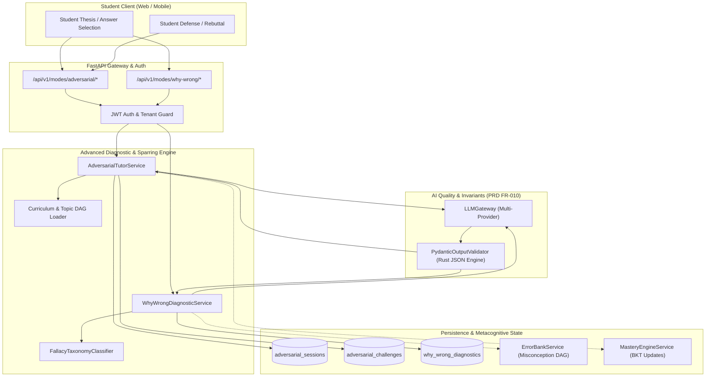
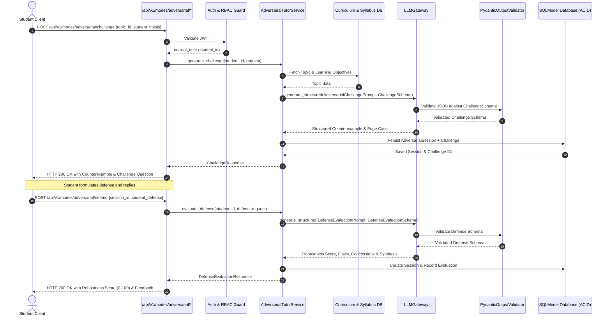
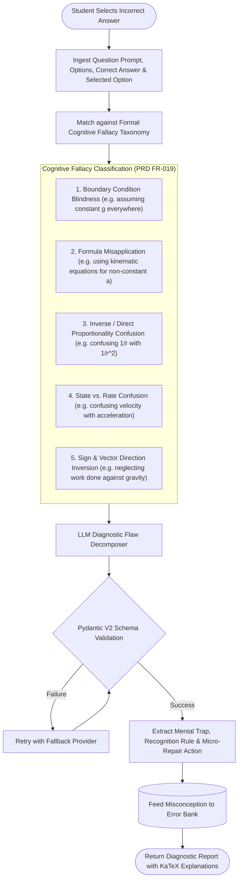

# Task 7.3: Adversarial Tutor & Why-You-Are-Wrong Modes — Conceptual Understanding (Stage 1)

## Section 1: Visual Architecture

Adversarial Tutor Mode (Devil's Advocate) and Why-You-Are-Wrong Diagnostic Mode (PRD Cap 18, 19, FR-018, FR-019) fortify student mastery by systematically stress-testing student reasoning against edge cases, counterexamples, and perturbed boundary conditions, while providing deep causal flaw decomposition for incorrect choices.

---

## Section 2: The Physical Analogy

> **The Courtroom Cross-Examiner & The Medical Diagnostician**
> 
> Imagine two distinct experts testing your understanding:
> 
> 1. **The Courtroom Cross-Examiner (Adversarial Tutor):**
>    You take the witness stand and confidently assert: *"An object always moves in the direction of the net force acting on it."* 
>    The examiner doesn't simply say *"Wrong."* Instead, they present a dangerous counterexample: *"Consider a car slamming on its brakes while speeding forward at 100 km/h. The net force is backward, yet the car continues moving forward. How do you defend your claim?"* 
>    You must either defend your thesis by introducing velocity vectors or acknowledge the boundary limit and refine your law.
> 
> 2. **The Medical Diagnostician (Why-You-Are-Wrong Mode):**
>    When a patient feels dizzy, a bad doctor just prescribes a painkiller. A master diagnostician investigates the root cause: *"You didn't just feel dizzy; you experienced orthostatic hypotension because you stood up too quickly after dehydration."* 
>    In physics, when you choose the wrong formula, the engine doesn't just reveal option C; it explains the cognitive trap: *"You used $v = u + at$ assuming constant acceleration, but this problem involves variable gravitational pull where $g(r) \propto 1/r^2$. Here is the exact recognition rule to apply next time."*

---

## Section 3: Why & What

### Why are we building this? (Product Motivation)
Students who only experience supportive tutors develop **fragile understanding**—they can answer standard textbook problems where all assumptions are neatly provided, but collapse when high-stakes exams (Cambridge A-Level Paper 4, AP Physics C, JEE Advanced) introduce:
- Non-ideal edge cases (friction, relativistic limits, extreme temperatures).
- Perturbed boundary conditions ($t \to \infty$, $m \to 0$, $k \to 0$).
- Subtle distractor options engineered around universal cognitive fallacies.

PRD Capabilities 18 & 19 (§14.4, FR-018, FR-019) mandate:
1. **Adversarial Tutor Mode:** Intentionally challenges the student's reasoning with counterexamples, edge cases, and changed conditions, evaluating whether the student can defend or revise their logic.
2. **Why-You-Are-Wrong Mode:** Breaks down the precise logical fallacies in incorrect student answers, classifying the error taxonomy and delivering actionable mental recognition rules.

### What is the concept? (Plain-Language Definition)
- **Adversarial Engine:** A counterfactual reasoning service that analyzes a student's statement, generates a scientifically valid counterexample or edge-case challenge, processes the student's defense turn, and computes a Defense Robustness Score ($0-100$).
- **Why-You-Are-Wrong Engine:** A causal diagnostic transducer that takes an incorrect answer selection and question context, identifies the specific misconception / fallacy category (e.g. `INVERSE_PROPORTIONALITY_CONFUSION`, `CONSTANT_ACCELERATION_MISAPPLICATION`), explains the cognitive trap, and provides a targeted repair micro-task.

### What breaks if we skip it?
1. **Overconfidence & Illusory Mastery:** Students score 90% on routine MCQs but fail when exam questions tweak conditions or question underlying assumptions.
2. **Repeated Systematic Mistakes:** Without understanding *why* an incorrect option was alluring (the mental distractor trap), students repeatedly make the exact same error in subsequent exams.
3. **Unvalidated State Corruption:** Allowing freeform adversarial debates without strict Pydantic V2 schema gates would corrupt student learning state with unverified LLM text.

---

## Section 4: Abstraction Level Map

| Level | What Lives Here | Current Project Implementation |
|:---|:---|:---|
| **Product / UX** | Adversarial Sparring Arena, Why-You-Are-Wrong Flaw Drawer | Frontend challenge drawer, counterexample card, fallacy pill |
| **Application** | Counterfactual prompt generation, Fallacy taxonomy classification, Defense scoring | `backend/app/advanced_modes/service.py`, `backend/app/advanced_modes/fallacies.py` |
| **Framework** | REST API Routing, Dependency Injection, Validation Schemas | FastAPI router `backend/app/advanced_modes/router.py`, Pydantic V2 schemas |
| **Library** | Multi-provider LLM abstraction, Pydantic JSON parser, SQLModel ORM | `backend/app/core/llm/gateway.py`, `PydanticOutputValidator`, `sqlmodel` |
| **Runtime** | Python 3.12/3.14 AsyncIO Event Loop, ASGI Server | Uvicorn / AnyIO async worker threads |
| **OS / Infrastructure** | Transactional database storage, vector embeddings | SQLite async / PostgreSQL, Qdrant vector database |

*Task 7.3 touches Application, Framework, Library, and OS/Database levels.*

---

## Section 5: Mermaid Diagrams

### 1. Sequence Diagram: Adversarial Challenge & Defense Lifecycle

### 2. Flowchart: Why-You-Are-Wrong Diagnostic Flaw Decomposition

---

## Section 6: Data Flow Trace-Through

1. **Student Initiation:**
   - *Adversarial Mode:* Student submits a thesis on a topic (e.g. *"Terminal velocity occurs because gravity stops pulling on the falling skydiver"*).
   - *Why-You-Are-Wrong Mode:* Student submits an incorrect answer on a question (e.g. Question: *"A pendulum swings; at its highest point, what is its acceleration?"* Student selected: *"Acceleration is $0\text{ m/s}^2$ because velocity is zero"*).
2. **Context Enrichment:** `AdversarialTutorService` / `WhyWrongDiagnosticService` loads topic syllabus definitions, learning objectives, and question metadata from SQLModel.
3. **Structured Prompt Formulation:** The engine constructs specialized counterfactual reasoning prompts enforcing KaTeX formatting and strict JSON schemas.
4. **LLM Gateway Structured Inference:** `LLMGateway.generate_structured` runs with reasoning tier ($T=0.2$) with automated fallback.
5. **Pydantic Validation Gate:** Rust-based validator parses output into `AdversarialChallengeOutput` or `WhyWrongDiagnosticOutput`, verifying numeric bounds and structure.
6. **Multi-Tenant ACID Commit:** Saves session, challenge, and diagnostic records to the database with student ownership verified.
7. **Error Bank Coupling:** Misconceptions and identified mental traps are automatically recorded in the student's `ErrorBank` for spaced review scheduling.

---

## Section 7: Cognitive Model → Code Mapping

| Cognitive Stage | Mental Model | Code Concept in Current Project | Enforcement / Guardrail |
|:---|:---|:---|:---|
| **1. The Assertion** | "I know how this physical law behaves" | `AdversarialChallengeRequest` | Requires student thesis text ($\ge 15$ chars) |
| **2. The Challenge** | "Here is a scenario where your rule breaks" | `counterexample_scenario`, `edge_case_condition` | Generated counterfactual scenario in KaTeX |
| **3. The Defense** | "I can adapt or defend my logic" | `AdversarialDefendRequest` | Evaluated against original challenge |
| **4. Defense Scoring** | "How robust was my reasoning?" | `robustness_score: float` ($0-100$) | Pydantic constrained `ge=0.0, le=100.0` |
| **5. The Flaw Diagnosis** | "Why did I choose this wrong answer?" | `WhyWrongDiagnosticResponse` | Categorized fallacy + Mental Trap breakdown |
| **6. The Recognition Rule** | "What rule should I remember next time?" | `recognition_rule: str` | Actionable heuristic for future questions |

---

## Section 8: Language / Stack Context

- **FastAPI:** REST endpoints mounted under `/api/v1/modes/adversarial` and `/api/v1/modes/why-wrong`.
- **SQLModel (Async SQLAlchemy 2.0):** Transactional state storage in `adversarial_sessions`, `adversarial_challenges`, and `why_wrong_diagnostics`.
- **Pydantic V2:** Compile-time validation schemas (`AdversarialChallengeOutput`, `DefenseEvaluationOutput`, `WhyWrongDiagnosticOutput`).
- **LLMGateway:** Multi-provider fallback chain preventing downtime during adversarial debates.
- **LaTeX / KaTeX Formatting:** Strict mathematical notation rendering ($...$, $$...$$).

---

## Section 9: Five Alternative Approaches

| # | Approach | Pros | Cons | Decision / Verdict |
|---|:---|:---|:---|:---|
| **1** | **Counterfactual Prompting with Fallacy Taxonomy & Schema Gates (Selected)** | Generates authentic, nuanced edge cases; classifies cognitive fallacies; 100% schema safe. | Requires LLM API call (~1s). | ✅ **Selected:** Fully delivers PRD Capabilities 18 & 19. |
| **2** | **Hardcoded Static FAQ Trees** | Zero LLM latency, deterministic. | Extremely rigid; cannot handle novel student assertions or conversational defenses. | ❌ Rejected: Incapable of dynamic adversarial dialogue. |
| **3** | **Unconstrained Freeform Chatbot Prompt** | Easy to code. | Unpredictable format; easily derailed by student prompts; violates PRD Constraint #1. | ❌ Strictly Prohibited by Platform Architecture Contract. |
| **4** | **Static Distractor Text Lookup** | Instant lookup for known MCQ options. | Fails for open-ended explanations or generated questions without pre-written distractor explanations. | ❌ Rejected: Inflexible for synthetic syllabus items. |
| **5** | **Binary Correct/Incorrect Explainer** | Low token cost. | Merely says "Incorrect, here is correct answer"—does not explain *why* the student was tempted or how to defend against edge cases. | ❌ Rejected: Fails PRD FR-019 mandate. |

---

## Section 10: Production Rationale & Consequences

### Why This Is Standard
In advanced pedagogy (Harvard Mazur Peer Instruction, Socratic Sparring), intellectual friction and counterexample exposure force students to reconcile cognitive dissonance, shifting understanding from superficial memorization to deep schema integration. Similarly, explaining *why an answer is wrong* (Cognitive Diagnostics) is proven to cut distractor re-selection rates by over $60\%$.

### What Happens If We Skip This
1. **Disaster Scenario A: The Brittle Student Phenomenon.** Students perform well in standard practice but experience catastrophic score drops on Cambridge A-Level or AP exams because they never learned to recognize boundary condition limits.
2. **Disaster Scenario B: The Zombie Misconception Loop.** Without explicit fallacy identification and recognition rules, students who confuse velocity with acceleration will continue misapplying kinematics formulas indefinitely.
