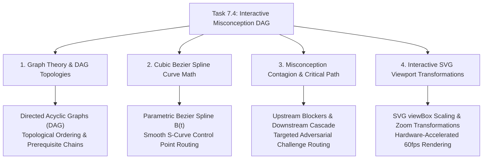

# Stage 3: CS Domain Learning Extraction
## Task 7.4: Interactive Misconception DAG Visualizer `[FRONTEND]`

**Task ID:** Task 7.4  
**Track:** Frontend Track (React 18+ / TypeScript / Vite / Zustand / KaTeX / SVG Canvas)  
**Epic:** Epic 7 — Diagnostic Misconception Reasoning & Adversarial Challenge  
**Accepted Decision Basis:** [ADR-008: Frontend Framework & UI Ecosystem](file:///c:/Users/Muhammad/OneDrive%20-%20Higher%20Education%20Commission/Desktop/AI%20Tutor/Feynman_tutorAI/docs/adr/ADR-008-frontend-framework-and-ui-stack.md), [DESIGN_SYSTEM_TYPOGRAPHY.md](file:///c:/Users/Muhammad/OneDrive%20-%20Higher%20Education%20Commission/Desktop/AI%20Tutor/Feynman_tutorAI/docs/frontend_design/DESIGN_SYSTEM_TYPOGRAPHY.md)

---

## 1. Domain Discovery Map



---

## 2. Domain Deep Dives

### Domain 1: Graph Theory & Directed Acyclic Graphs (DAG)

**What Is It (Plain English):**  
A curriculum is fundamentally a **Directed Acyclic Graph (DAG)**:
- **Vertices (\( V \)):** Syllabus topics (e.g. *Kinematics, Dynamics, Energy, Waves*).
- **Directed Edges (\( E \)):** Prerequisite dependencies (e.g. *Kinematics \( \rightarrow \) Dynamics \( \rightarrow \) Gravitation*).
- **Acyclic Constraint:** There can be no circular dependencies (*you cannot require Gravitation to learn Kinematics if Kinematics is required for Gravitation*).

**Mathematical Formalism:**
A graph \( G = (V, E) \) is a DAG if and only if there exists a **Topological Sort** — a linear ordering of vertices such that for every directed edge \( (u, v) \in E \), vertex \( u \) comes before \( v \) in the ordering.

---

### Domain 2: Cubic Bezier Spline Curve Routing in SVG

**What Is It (Plain English):**  
Straight lines between graph nodes look rigid and overlap messily. To create beautiful, organic connection arrows that flow naturally from the right side of a parent node to the left side of a child node, we calculate **Cubic Bezier Spline Curves**.

**Mathematical Formulation:**
A cubic Bezier curve is defined by 4 points: start point \( P_0 \), two control points \( P_1, P_2 \), and end point \( P_3 \):
\[
B(t) = (1-t)^3 P_0 + 3(1-t)^2 t P_1 + 3(1-t) t^2 P_2 + t^3 P_3, \quad t \in [0, 1]
\]
To create a natural horizontal S-curve:
- \( P_0 = (x_0, y_0) \) (Parent output port)
- \( P_1 = (x_0 + \Delta x \cdot 0.5, y_0) \) (Control handle pulling right)
- \( P_2 = (x_1 - \Delta x \cdot 0.5, y_1) \) (Control handle pulling left)
- \( P_3 = (x_1, y_1) \) (Child input port)

**TypeScript SVG Path Generator:**
```typescript
export const getCubicBezierPath = (
  x0: number,
  y0: number,
  x1: number,
  y1: number
): string => {
  const dx = Math.abs(x1 - x0) * 0.5;
  return `M ${x0} ${y0} C ${x0 + dx} ${y0}, ${x1 - dx} ${y1}, ${x1} ${y1}`;
};
```

---

### Domain 3: Misconception Contagion & Remediation

**What Is It (Plain English):**  
If a student holds a misconception at node \( u \) (e.g. *confusing frequency with wavelength*), that flaw causes failure in all downstream descendants \( \text{Descendants}(u) \). Remediating the root-cause node \( u \) unblocks the entire downstream sub-tree.

---

## 3. Vocabulary Reference

| Term | Definition | Codebase Location |
| :--- | :--- | :--- |
| **`DAGNode`** | Structured topic vertex with Cartesian coordinates and mastery status. | `frontend/src/types/dag.ts` |
| **`DAGEdge`** | Directed dependency relationship from prerequisite to dependent topic. | `frontend/src/types/dag.ts` |
| **`Cubic Bezier Spline`** | Smooth parametric curved path connecting nodes. | `frontend/src/components/dag/MisconceptionDAGCanvas.tsx` |
| **`Adversarial Challenge`** | Targeted pedagogical mode disproving a diagnosed misconception. | `frontend/src/stores/socraticTutorStore.ts` |
