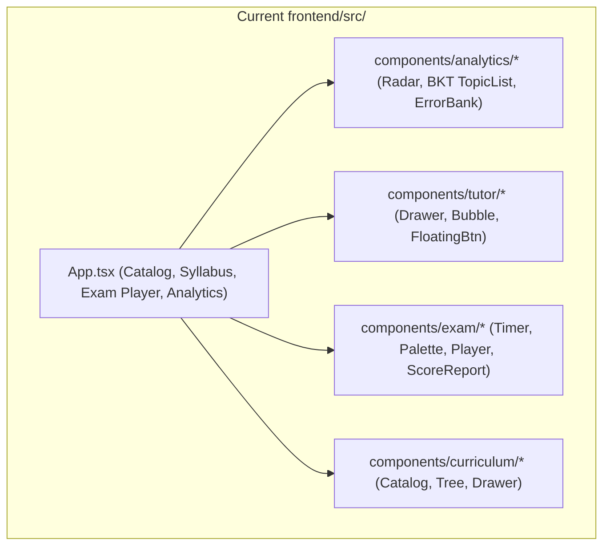
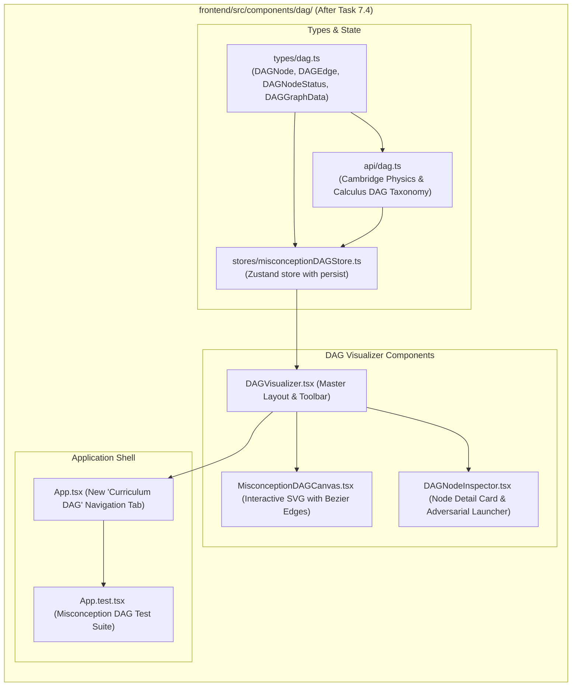

# Stage 2: Codebase Design Artifact
## Task 7.4: Interactive Misconception DAG Visualizer `[FRONTEND]`

**Task ID:** Task 7.4  
**Track:** Frontend Track (React 18+ / TypeScript / Vite / Zustand / KaTeX / SVG Canvas)  
**Epic:** Epic 7 — Diagnostic Misconception Reasoning & Adversarial Challenge  
**Accepted Decision Basis:** [ADR-008: Frontend Framework & UI Ecosystem](file:///c:/Users/Muhammad/OneDrive%20-%20Higher%20Education%20Commission/Desktop/AI%20Tutor/Feynman_tutorAI/docs/adr/ADR-008-frontend-framework-and-ui-stack.md), [DESIGN_SYSTEM_TYPOGRAPHY.md](file:///c:/Users/Muhammad/OneDrive%20-%20Higher%20Education%20Commission/Desktop/AI%20Tutor/Feynman_tutorAI/docs/frontend_design/DESIGN_SYSTEM_TYPOGRAPHY.md)

---

## 1. Current State Snapshot

Currently, `frontend/src/` features authentication, curriculum catalog/tree, an interactive timed exam player, the Socratic tutor drawer, and the student analytics dashboard. There is no interactive node-link DAG visualizer showing concept prerequisite relationships, unlocked/locked topics, or adversarial misconception debugging pathways.



* **Verified Fact:** `frontend/` has passing Vitest suite (18 of 18 passed).
* **Verified Fact:** `frontend/` is 100% directory-isolated from `backend/`.

---

## 2. Proposed State

After Task 7.4 execution, `frontend/src/` will feature an **Interactive Misconception DAG Subsystem** with an SVG directed acyclic graph canvas, cubic Bezier curve edge connectors, node selection inspector, and adversarial misconception debugging triggers.



---

## 3. File-Level Impact Analysis

All files are `[NEW]` or `[MODIFY]` strictly inside `frontend/` (0 touches to `backend/`).

### 3.1 Data Structures & State Management
#### [NEW] `frontend/src/types/dag.ts`
* **Purpose:** TypeScript types defining curriculum DAG models:
  - `DAGNodeStatus`: `'mastered' | 'developing' | 'misconception' | 'locked'`
  - `DAGNode`: `{ id, topicTitle, syllabusCode, x, y, accuracyPercentage, bktProbability, status, bloomLevel, description, prerequisites, unlocks, misconception? }`
  - `DAGEdge`: `{ id, source, target, label? }`
  - `DAGGraphData`: `{ examTemplateId, title, nodes, edges }`
  - `DAGState`: Zustand store interface.

#### [NEW] `frontend/src/stores/misconceptionDAGStore.ts`
* **Purpose:** Zustand store managing:
  - `nodes: DAGNode[]`
  - `edges: DAGEdge[]`
  - `selectedNodeId: string | null`
  - `zoomLevel: number` (0.6 to 1.6)
  - `filterMode: string` ("all" | "misconceptions" | "critical_path")
  - **Actions:** `selectNode()`, `setZoomLevel()`, `setFilterMode()`, `resetView()`, `unlockNode()`.

#### [NEW] `frontend/src/api/dag.ts`
* **Purpose:** API client providing full DAG topology for Cambridge Physics 9702:
  - 6 Connected nodes arranged in hierarchical dependency layers.
  - Directed prerequisite edges connecting foundational kinematics to advanced waves and gravitation.
  - Diagnosed misconception profiles with KaTeX LaTeX formulas.

---

### 3.2 UI Components
#### [NEW] `frontend/src/components/dag/MisconceptionDAGCanvas.tsx`
* **Purpose:** Hardware-accelerated SVG directed graph canvas:
  - Cubic Bezier spline edge arrows (`d="M x0 y0 C cx1 cy1, cx2 cy2, x1 y1"`).
  - Glowing node cards with mastery status badges (*Mastered, Developing, Misconception Alert, Locked*).
  - Smooth zoom controls (+, -, reset) and click-to-inspect handlers.

#### [NEW] `frontend/src/components/dag/DAGNodeInspector.tsx`
* **Purpose:** Side inspection panel displaying topic syllabus codes, accuracy %, Bloom level, prerequisite dependencies, diagnosed misconception card with KaTeX, and **"Launch Adversarial Challenge"** triggers.

#### [NEW] `frontend/src/components/dag/DAGVisualizer.tsx`
* **Purpose:** Master layout coordinating the navigation toolbar, legend status pills, SVG graph canvas, and node inspector card.

---

### 3.3 Root App & Tests
#### [MODIFY] `frontend/src/App.tsx`
* **Purpose:** Add **"Knowledge Graph"** tab to desktop header switcher and mobile nav.

#### [MODIFY] `frontend/src/App.test.tsx`
* **Purpose:** Vitest test suite verifying:
  - Knowledge Graph tab navigation.
  - SVG DAG canvas rendering with nodes and Bezier arrows.
  - Clicking a node opens `DAGNodeInspector`.
  - Filter mode switching (All vs Misconceptions only).
  - Launching Adversarial Challenge opens the Socratic Tutor drawer with topic context.

---

## 4. Dependency Graph / Blast Radius

```mermaid
graph TD
    subgraph DAGSubsystem ["frontend/src/components/dag/ (Isolated)"]
        Types[types/dag.ts] --> Store[stores/misconceptionDAGStore.ts]
        Types --> API[api/dag.ts]
        Store --> Canvas[MisconceptionDAGCanvas.tsx]
        Store --> Inspector[DAGNodeInspector.tsx]
        Canvas --> Main[DAGVisualizer.tsx]
        Inspector --> Main
        Main --> App[App.tsx]
        App --> Tests[App.test.tsx]
    end

    subgraph BackendAPI ["backend/ (Directory Isolation)"]
        BackendDAG["/api/v1/curriculum/dag"]
    end

    DAGSubsystem -.->|Zero Cross-Track Impact (Isolated)| BackendAPI
```

---

## 5. Regression Risk Matrix

| Risk ID | Risk Description | Severity | Affected Area | Mitigation Strategy |
| :--- | :--- | :---: | :--- | :--- |
| **R-01** | Bezier spline calculation NaN if node missing | 🟢 Low | DAG Canvas | Safely look up source and target nodes with null checks before computing cubic curves. |
| **R-02** | Zoom level exceeding viewport bounds | 🟢 Low | Toolbar | Clamp zoom level strictly between 0.6x and 1.6x. |
| **R-03** | LocalStorage state corruption | 🟢 Low | Store Hydration | Zustand `persist` handles JSON parse errors with default fallback state. |

---

## 6. Rollback Plan

```powershell
git checkout -- frontend/src/
Remove-Item -Recurse -Force frontend/src/components/dag/
Remove-Item -Force frontend/src/stores/misconceptionDAGStore.ts
Remove-Item -Force frontend/src/types/dag.ts
Remove-Item -Force frontend/src/api/dag.ts
```
Estimated rollback time: < 1 minute.
