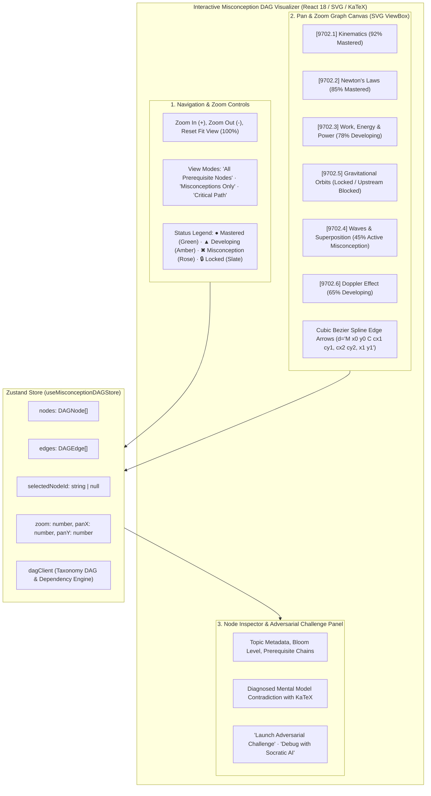
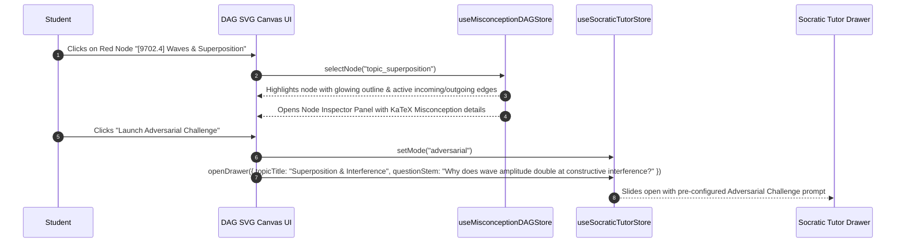

# Stage 1: Conceptual Understanding Artifact
## Task 7.4: Interactive Misconception DAG Visualizer `[FRONTEND]`

**Task ID:** Task 7.4  
**Track:** Frontend Track (React 18+ / TypeScript / Vite / Zustand / KaTeX / SVG Canvas)  
**Epic:** Epic 7 — Diagnostic Misconception Reasoning & Adversarial Challenge  
**Accepted Decision Basis:** [ADR-008: Frontend Framework & UI Ecosystem](file:///c:/Users/Muhammad/OneDrive%20-%20Higher%20Education%20Commission/Desktop/AI%20Tutor/Feynman_tutorAI/docs/adr/ADR-008-frontend-framework-and-ui-stack.md), [DESIGN_SYSTEM_TYPOGRAPHY.md](file:///c:/Users/Muhammad/OneDrive%20-%20Higher%20Education%20Commission/Desktop/AI%20Tutor/Feynman_tutorAI/docs/frontend_design/DESIGN_SYSTEM_TYPOGRAPHY.md)

---

## 1. Visual Architecture

---

## 2. The Physical Analogy

> Think of the **Misconception DAG Visualizer** like an **Electrical Circuit Breadboard & Power Flow Telemetry Grid**.
> 1. Knowledge is not a loose pile of random facts; it is an interconnected electrical power grid where electrical current cannot reach high-voltage components (**Advanced Orbital Gravitation**) if an upstream resistor (**1D Kinematics & Force Vectors**) is burnt out (**Active Misconception**).
> 2. The visual DAG breadboard illuminates your entire syllabus wiring: mastered wires glow emerald green, active misconceptions flash rose red, and downstream components without power show a lock symbol.
> 3. Clicking any red circuit node allows you to inspect the damaged wire and run an instant **Adversarial Resistance Test** (**Socratic Debugger**) to fix the circuit before moving forward.

---

## 3. Why & What

### Why are we doing this task?
1. **Prerequisite Dependency Graphs (PRD Cap 7, FR-001, FR-002):** In STEM subjects (Physics & Calculus), mastering advanced concepts without foundational prerequisites is impossible. A visual Directed Acyclic Graph (DAG) clearly illustrates why a student is blocked on advanced topics.
2. **Misconception Contagion Tracking:** When a student has a misconception in wave fundamentals, it propagates downstream into both physical optics (diffraction) and acoustics (Doppler effect). Visualizing this propagation motivates foundational remediation.
3. **Adversarial Challenge Launchpad:** Students can click any weak node to test their mental model against edge cases designed to disprove false assumptions.

### What is the concept?
A hardware-accelerated **Interactive DAG Visualizer** featuring:
- **Interactive SVG Canvas:** Smooth pan and zoom controls, cubic Bezier curve edge connectors with animated direction arrows.
- **Color-Coded Mastery States:** Green (Mastered ≥ 80%), Amber (Developing 50–79%), Pulsing Red (Misconception < 50%), Slate (Locked prerequisite).
- **Node Detail Inspector:** Displays upstream prerequisites, downstream unlocked concepts, diagnosed misconception explanations with KaTeX LaTeX, and 1-click **"Launch Adversarial Challenge"** triggers.

### What breaks if we skip this?
- Students cannot see how topics connect hierarchically.
- Students attempt advanced exams while having undetected foundational gaps.
- The platform lacks structural graph-based learning pathways.

---

## 4. Abstraction Level Map

| Level | What Lives Here | Current Project Example | Touched by Task 7.4? |
| :--- | :--- | :--- | :---: |
| **Product / UX** | Interactive DAG Visualizer Tab, Zoom Toolbar, Node Detail Inspector | New `Curriculum DAG` Tab in App shell | 🔵 **PRIMARY FOCUS** |
| **Application** | DAG Store, Node selection reducer, Pan/Zoom matrix transformer | `src/stores/misconceptionDAGStore.ts`, `src/components/dag/` | 🔵 **PRIMARY FOCUS** |
| **Framework** | SVG Cubic Bezier Curve Generator, ViewBox zoom/pan math | `MisconceptionDAGCanvas.tsx`, `DAGNodeCard.tsx` | 🔵 **PRIMARY FOCUS** |
| **Library** | `KaTeX`, `lucide-react`, `zustand`, Tailwind CSS | `@/components/ui/card`, `LaTeXRenderer` | 🔵 Used heavily |
| **Runtime** | SVG mouse drag events & wheel zoom delta scaling | 2D Transformation matrix | 🔵 Native performance |
| **Infrastructure** | Backend Syllabus DAG & Prerequisite Engine | `/api/v1/curriculum/dag` | ⚪ Backend Contract |

---

## 5. Sequence Diagrams

### Diagram 1: DAG Node Inspection & Adversarial Challenge Flow

---

## 6. Data Flow Trace-Through

1. **Topology Loading:** `useMisconceptionDAGStore` loads the curriculum DAG structure:
   - **Nodes:** Position `(x, y)`, topic title, syllabus code, accuracy %, BKT score, and status (`mastered`, `developing`, `misconception`, `locked`).
   - **Edges:** `(source, target)` defining prerequisite dependencies.
2. **Cubic Bezier Routing:** Each edge connecting `(x1, y1)` to `(x2, y2)` computes a smooth Bezier spline:
   \[
   dx = (x2 - x1) \cdot 0.5, \quad \text{path} = \text{"}M\ x1,y1 \quad C\ x1+dx,y1 \quad x2-dx,y2 \quad x2,y2\text{"}
   \]
3. **Interactive Inspection:** Selecting a node highlights its entire upstream prerequisite lineage and downstream dependents.
4. **Adversarial Remediation:** Launches the Socratic Tutor in `adversarial` mode to challenge the student's specific misconception.

---

## 7. Cognitive Model → Code Mapping

| Cognitive Stage | Mental Model | Code Concept in Feynman Frontend | Concrete Guardrail |
| :--- | :--- | :--- | :--- |
| **1. Prerequisite Sequence** | "What do I need to learn first before this?" | `DAGEdge (source -> target)` | Enforces prerequisite order |
| **2. Bottleneck Detection** | "Why is my advanced score stuck?" | Node Status `misconception` (Red) | Flags foundational blocker |
| **3. Deep Scrutiny** | "What is wrong with my current understanding?" | `DAGNodeInspector` with KaTeX | Diagnoses specific equation error |
| **4. Adversarial Test** | "Challenge my assumption with an edge case" | Socratic mode `adversarial` | Proves why false logic fails |

---

## 8. Five Alternative Approaches Evaluated

| # | Approach | Pros | Cons | Verdict |
|:---|:---|:---|:---|:---|
| **1** | **Native SVG Hardware-Accelerated DAG + Zustand + KaTeX (Approved)** | 0KB extra bundle weight, ultra-fast 60fps rendering, custom STEM styling | Requires custom Bezier curve routing | ✅ **RECOMMENDED (ADR-008)** |
| **2** | **Heavy External DAG Library (@xyflow/react)** | Pre-built drag handles | Adds 200KB+ bundle weight; overkill for fixed DAG layout | ❌ Too heavy |
| **3** | **Linear List / Table Only** | Easy to render | Fails to show parallel branches and prerequisite dependencies | ❌ Violates mental model |
| **4** | **Static Non-Interactive PNG Image** | Simple export | Zero interactivity, no zoom, no Socratic remediation triggers | ❌ Unusable |
| **5** | **Canvas 2D Bitmaps** | Fast for 10,000 nodes | Cannot render accessible text or crisp KaTeX formulas | ❌ Poor STEM typography |

---

## 9. Production Rationale & Disaster Scenarios

### Why This Is Standard:
Premier STEM adaptive platforms (Brilliant.org, Duolingo Tree, MIT OpenCourseWare Path) rely on visual prerequisite DAGs so students understand the logical dependency chain of mathematics and physical sciences.
