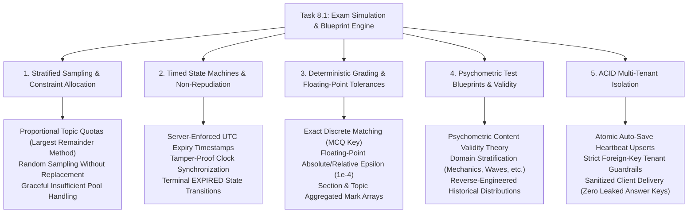

# Task 8.1: Full Exam Simulation & Blueprint Weighting Engine — CS Domain Concepts (Stage 3)

## Section 1: Domain Discovery Map

The Exam Simulation & Blueprint Weighting Engine touches five foundational Computer Science and Psychometrics domains: Stratified Random Sampling & Multi-Constraint Allocation, High-Precision Timed State Machines & Non-Repudiation, Deterministic Auto-Grading & Numerical Epsilon Tolerances, Psychometric Test Blueprints & Content Validity, and ACID Multi-Tenant Isolation.




---

## Section 2: Domain Deep Dives

### Domain 1: Stratified Random Sampling & Multi-Constraint Allocation

#### What Is It (Plain English):
When generating a mock exam of 40 questions, you cannot pick 40 questions at random across the entire bank because you might end up with 35 questions from one topic and none from another. Stratified sampling divides the population into distinct strata (topics) and samples exact integer quotas from each stratum according to blueprint target weights (e.g. 30% Mechanics = 12 questions).

#### Physical Analogy:
Packing a balanced survival food kit for an expedition. You don't blindly grab 40 random items from a grocery warehouse (which might end up being 40 bags of sugar). You follow a nutritional blueprint: exactly 15 proteins, 15 carbohydrates, and 10 vitamins.

#### How It Works Under the Hood:
```markdown
| Layer | What Happens | Resource / Constraint |
|:---|:---|:---|
| **Weight Resolution** | Calculates target question count $q_i = \text{round}(N_{\text{total}} \times w_i)$. | Weights sum to $1.0$. |
| **Integer Balancing** | Uses Largest Remainder / Hamilton-Hare method to ensure $\sum q_i = N_{\text{total}}$. | Exact integer constraint. |
| **Candidate Query** | Fetches validated question IDs for each topic ($T_i$). | Indexed SQL query (`status == VALIDATED`). |
| **Random Sampling** | Uses Fisher-Yates shuffle / `random.sample()` without replacement. | Zero duplicate questions in paper. |
```

#### Where It Manifests in This Codebase:
- [backend/app/simulation/assembler.py](file:///c:/Users/Abdul%20Jabbar%20Metlo/Feynman_tutorAI/backend/app/simulation/assembler.py) — `StratifiedBlueprintAssembler.assemble_paper()`.
- [backend/app/simulation/models.py](file:///c:/Users/Abdul%20Jabbar%20Metlo/Feynman_tutorAI/backend/app/simulation/models.py) — `BlueprintTopicDistribution`.

#### Common Misconceptions:
1. ❌ *"Uniform random sampling is fine if the database is big enough."* $\to$ ✅ Reality: Probability theory shows that uniform random sampling produces standard deviations that cause unacceptable variance (e.g. $10\%\pm 8\%$) across topics.
2. ❌ *"Rounding fractional quotas always sums to the total questions."* $\to$ ✅ Reality: Simple rounding can produce $N+1$ or $N-1$ items; the allocator must dynamically distribute fractional remainders.

---

### Domain 2: High-Precision Timed State Machines & Non-Repudiation

#### What Is It (Plain English):
High-stakes exams require strict time limits. In distributed client-server systems, the client device (browser/phone) is inherently untrusted. The server must establish an authoritative start time and expiry timestamp in UTC, and reject any answer submitted after the expiry deadline regardless of what the client clock claims.

#### Physical Analogy:
A bank vault with a physical time-lock mechanism. Once the time-lock triggers at 5:00 PM, the vault door physically locks. An employee outside banging on the door claiming their wristwatch says 4:58 PM cannot open the vault.

#### How It Works Under the Hood:
```markdown
| State | Trigger | Condition | Next State |
|:---|:---|:---|:---|
| **NOT_STARTED** | POST `/simulations/start` | Valid student & blueprint | **IN_PROGRESS** (Set $T_{\text{exp}} = T_{\text{now}} + \Delta t$) |
| **IN_PROGRESS** | POST `save-answer` | $T_{\text{now}} \le T_{\text{exp}}$ | **IN_PROGRESS** (Upsert answer) |
| **IN_PROGRESS** | POST `save-answer` | $T_{\text{now}} > T_{\text{exp}}$ | **EXPIRED** (Reject answer, raise HTTP 400) |
| **IN_PROGRESS** | POST `submit` | $T_{\text{now}} \le T_{\text{exp}} + \epsilon_{\text{grace}}$ | **SUBMITTED** $\to$ **GRADED** |
```

#### Where It Manifests in This Codebase:
- [backend/app/simulation/models.py](file:///c:/Users/Abdul%20Jabbar%20Metlo/Feynman_tutorAI/backend/app/simulation/models.py) — `SimulationSession.expires_at`.
- [backend/app/simulation/service.py](file:///c:/Users/Abdul%20Jabbar%20Metlo/Feynman_tutorAI/backend/app/simulation/service.py) — `save_answer()` and `submit_simulation()`.

---

### Domain 3: Deterministic Auto-Grading & Numerical Epsilon Tolerances

#### What Is It (Plain English):
Grading simulated exams must be 100% deterministic and instantaneous. For discrete MCQ items, it matches the selected option key against the correct option key. For numerical questions (e.g. calculating velocity $v = 9.81\text{ m/s}$), it evaluates whether the submitted floating-point number falls within an acceptable physical tolerance window ($|v_{\text{sub}} - v_{\text{true}}| \le \delta$).

#### Physical Analogy:
A high-speed optical coin-sorting machine. Coins rolling down the chute pass through precision optical calipers. If a 25-cent coin's diameter is within $24.26\text{ mm} \pm 0.05\text{ mm}$, it drops into the acceptance slot; otherwise, it is rejected.

#### How It Works Under the Hood:
```markdown
| Question Type | Evaluation Algorithm | Mark Logic |
|:---|:---|:---|
| **MCQ_SINGLE** | `selected_option_id == correct_option.id` | $1.0\text{ mark}$ if True, else $0.0$ |
| **NUMERICAL** | $\|v_{\text{student}} - v_{\text{correct}}\| \le \max(\delta_{\text{abs}}, \delta_{\text{rel}} \times \|v_{\text{correct}}\|)$ | $1.0\text{ mark}$ if True, else $0.0$ |
| **FREE_RESPONSE** | Keyword / Key-concept checklist matching or Rubric Gateway | Fractional marks ($0.0 \text{ to } M$) |
```

#### Where It Manifests in This Codebase:
- [backend/app/simulation/grader.py](file:///c:/Users/Abdul%20Jabbar%20Metlo/Feynman_tutorAI/backend/app/simulation/grader.py) — `AutoGradingService.grade_session()`.

---

### Domain 4: Psychometric Test Blueprints & Content Validity

#### What Is It (Plain English):
Content validity is the psychometric principle that a test accurately samples the domain it claims to measure. An Exam Blueprint represents the operational definition of an exam's curriculum (e.g. Cambridge Assessment or CollegeBoard AP Physics syllabus), codifying topic proportions, cognitive depth, and passing thresholds.

#### Physical Analogy:
A civil engineering blueprint for a suspension bridge. The blueprint specifies the exact load-bearing steel thickness, cable tension, and pillar depth. Constructing the bridge without the blueprint produces a structure that may collapse under real-world traffic.

#### Where It Manifests in This Codebase:
- [backend/app/simulation/models.py](file:///c:/Users/Abdul%20Jabbar%20Metlo/Feynman_tutorAI/backend/app/simulation/models.py) — `ExamBlueprint`.
- [backend/app/simulation/schemas.py](file:///c:/Users/Abdul%20Jabbar%20Metlo/Feynman_tutorAI/backend/app/simulation/schemas.py) — `TopicPerformanceSummary`.

---

### Domain 5: ACID Multi-Tenant Persistence & Session Data Isolation

#### What Is It (Plain English):
An exam session contains confidential student performance data and unsubmitted answers. The system must guarantee:
1. **Zero Leaked Answer Keys:** When delivering questions to the client, correct answers and distractor explanations are completely stripped out.
2. **Tenant Boundary:** Student B can never query, inspect, or submit answers for Student A's exam session.
3. **Atomic Writes:** Answer auto-saves use atomic database transactions to prevent partial corruption during network hiccups.

#### Physical Analogy:
Individual exam testing cubicles in a physical testing hall with soundproof glass walls and personal proctors. Student A cannot look at Student B's desk, and the test booklet handed to the student has the answer key detached and locked in the proctor's safe.

#### Where It Manifests in This Codebase:
- [backend/app/simulation/schemas.py](file:///c:/Users/Abdul%20Jabbar%20Metlo/Feynman_tutorAI/backend/app/simulation/schemas.py) — `SanitizedQuestion` (projection omitting `is_correct`).
- [backend/app/simulation/router.py](file:///c:/Users/Abdul%20Jabbar%20Metlo/Feynman_tutorAI/backend/app/simulation/router.py) — `current_user.id` dependency enforcement.

---

## Section 3: Cross-Domain Connections

| Concept A | Concept B | Connection / Synergy |
|:---|:---|:---|
| **Stratified Sampling (Domain 1)** | **Psychometric Blueprints (Domain 4)** | Stratified sampling translates abstract psychometric blueprint percentages into concrete integer question allocations. |
| **Timed State Machines (Domain 2)** | **Deterministic Auto-Grading (Domain 3)** | Expiry events trigger automated auto-grading pipelines to grade whatever answers were saved before the cutoff. |
| **Sanitized Delivery (Domain 5)** | **Deterministic Auto-Grading (Domain 3)** | Stripping answer keys on paper delivery preserves exam security while full keys remain server-side for deterministic grading on submission. |

---

## Section 4: Concept Evolution Timeline

| Level | What You Might Think | Deeper Reality |
|:---|:---|:---|
| **Beginner** | "A mock exam is just a random list of questions shown in a quiz UI." | Random questions without blueprint weighting produce statistically invalid tests with wild difficulty swings. |
| **Intermediate** | "We should use client-side timers in JavaScript and send all answers at the end." | Client timers are easily manipulated and prone to total data loss if the browser tab closes. Server timers and auto-save heartbeats are mandatory. |
| **Advanced** | "We need stratified quota allocation with Largest Remainder integer math, server-side UTC timestamps, and sanitized schema projections." | Industrial assessment platforms separate question delivery from grading keys and isolate tenant state at the database engine level. |
| **Expert** | "The simulation engine is a psychometrically calibrated state machine that couples blueprint reverse-engineering with deterministic scoring and telemetry for explainable readiness modeling." | Complete adaptive exam systems turn raw practice into predictive, high-fidelity mock exam simulations with zero integrity loopholes. |

---

## Section 5: Vocabulary Reference

| Term | Definition | Codebase Example |
|:---|:---|:---|
| **Exam Blueprint** | A formal specification defining total marks, duration, passing score, and topic distributions. | `ExamBlueprint` |
| **Stratified Sampling** | Selecting items from distinct subgroups (topics) according to predetermined quotas. | `StratifiedBlueprintAssembler` |
| **Server-Side Expiry** | UTC timestamp calculated at session start after which answer mutations are blocked. | `expires_at` |
| **Sanitized Paper** | A question paper payload from which correct answers and distractor explanations are stripped before client delivery. | `SanitizedQuestion` |
| **Auto-Grading Report** | A deterministic breakdown of total score, percentage, and topic-by-topic performance. | `SimulationReport` |

---

## Section 6: "What If" Scenarios

### 1. What if a student experiences a sudden internet disconnection during an exam?
**A:** Because every answer selection is auto-saved via `POST /simulations/{id}/save-answer` heartbeats, all previously answered questions are safely stored in `simulation_answers`. When the student reconnects, they can reload the paper and continue without losing work, as long as `now() <= expires_at`.

### 2. What if a student's timer expires while they are writing?
**A:** Any subsequent answer save attempts are rejected with `HTTP 400 (Exam session expired)`. When `POST /simulations/{id}/submit` is called (or on auto-close), the auto-grader evaluates all answers that were saved prior to the deadline.

### 3. What if the question bank has fewer questions in a topic than the blueprint demands?
**A:** The `StratifiedBlueprintAssembler` samples all available validated questions for that topic and gracefully logs a warning without crashing or halting the exam generation.

### 4. What if a malicious student inspects network payloads or localStorage to find the correct answers?
**A:** The paper delivery endpoint projects questions into `SanitizedQuestion` models, where `is_correct`, `correct_answer_value`, and `distractor_explanation` are completely omitted from the JSON payload. The correct answer keys exist solely in the server database.

---

## Section 7: Further Reading

| Topic | Resource | Type |
|:---|:---|:---|
| **Stratified Sampling & Quota Allocation** | *Sampling Techniques* (William G. Cochran) | Standard Reference |
| **Psychometric Test Construction** | *Educational Measurement* (Robert L. Brennan / NCME) | Authoritative Text |
| **Distributed Timed State Machines** | *Designing Data-Intensive Applications* (Martin Kleppmann) | Systems Engineering Book |
| **FastAPI Async Transaction Management** | SQLAlchemy 2.0 Async Session Documentation | Official Guide |
