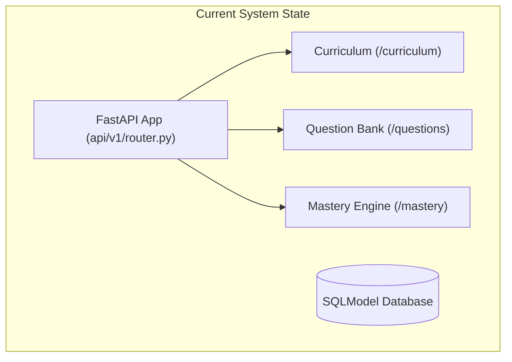
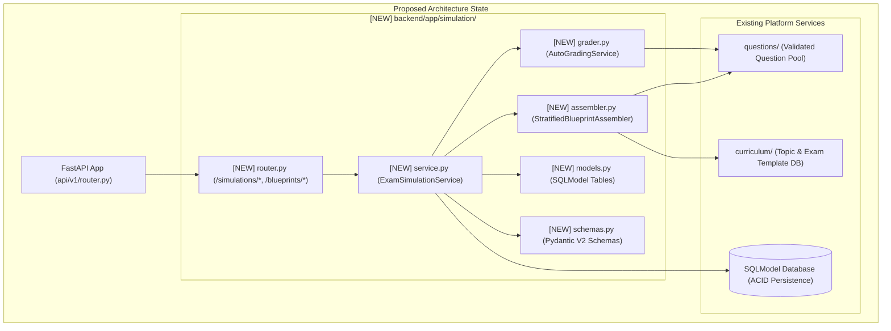
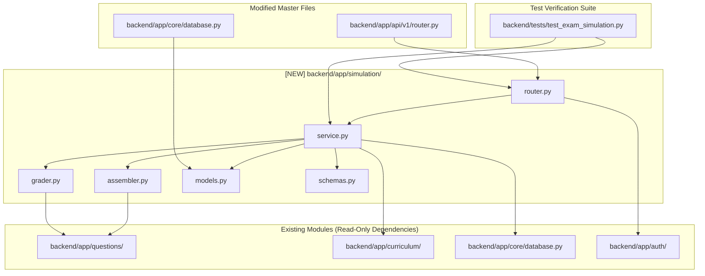

# Task 8.1: Full Exam Simulation & Blueprint Weighting Engine — Codebase Design (Stage 2)

## Section 1: Current State Snapshot

Currently, the platform includes:
1. **Question Bank & Item Lab (`backend/app/questions/`):** Stores validated multi-type questions (`MCQ_SINGLE`, `NUMERICAL`, etc.) linked to topics and learning objectives.
2. **Mastery Engine (`backend/app/mastery/`):** Calculates topic mastery via Bayesian Knowledge Tracing.
3. **Curriculum Engine (`backend/app/curriculum/`):** Manages `ExamTemplate`, `Subject`, `Topic`, and `LearningObjective` hierarchies.

However, there is no domain service for **Exam Blueprint Configuration**, **Stratified Question Paper Assembly**, **Timed Exam Sessions**, or **Full-Paper Auto-Grading Reports** (PRD Cap 14, 20, FR-014, FR-020).



---

## Section 2: Proposed State

We introduce a dedicated module `backend/app/simulation/` providing blueprint configurations, stratified paper generation, server-side timed state machine enforcement, and deterministic auto-grading with topic performance breakdowns.



---

## Section 3: File-Level Impact Analysis

### [NEW] `backend/app/simulation/__init__.py`
- **Purpose:** Module exports.
- **Exports:** `simulation_router`, `ExamSimulationService`, `AutoGradingService`, `StratifiedBlueprintAssembler`, `ExamBlueprint`, `SimulationSession`, `SimulationAnswer`, `SimulationReport`.

### [NEW] `backend/app/simulation/models.py`
- **Purpose:** Database entities for blueprints, topic weights, timed exam sessions, student answers, and grading reports.
- **Entities:**
  - `SimulationStatus` (Enum: `IN_PROGRESS`, `SUBMITTED`, `EXPIRED`, `GRADED`).
  - `ExamBlueprint` (Table: `id`, `exam_template_id`, `code`, `title`, `duration_minutes`, `total_questions`, `total_marks`, `passing_percentage`, `created_at`).
  - `BlueprintTopicDistribution` (Table: `id`, `blueprint_id`, `topic_id`, `target_weight`, `target_question_count`).
  - `SimulationSession` (Table: `id`, `student_id`, `blueprint_id`, `exam_template_id`, `status`, `started_at`, `expires_at`, `submitted_at`, `question_ids` [JSON list]).
  - `SimulationAnswer` (Table: `id`, `session_id`, `student_id`, `question_id`, `selected_option_id`, `numerical_response`, `is_correct`, `marks_awarded`, `answered_at`).
  - `SimulationReport` (Table: `id`, `session_id`, `student_id`, `total_marks`, `earned_marks`, `percentage_score`, `is_passed`, `topic_breakdown` [JSON summary], `created_at`).

### [NEW] `backend/app/simulation/schemas.py`
- **Purpose:** Pydantic V2 schemas for blueprint CRUD, paper start, answer auto-save, and scorecard results.
- **Schemas:**
  - `BlueprintCreateRequest`, `BlueprintTopicWeightInput`, `BlueprintResponse`.
  - `SimulationStartRequest`, `SimulationSessionResponse`, `SanitizedQuestion`, `SanitizedOption`.
  - `SaveAnswerRequest`, `SaveAnswerResponse`.
  - `SimulationSubmitResponse`, `TopicPerformanceSummary`, `QuestionResultDetail`.

### [NEW] `backend/app/simulation/assembler.py`
- **Purpose:** Stratified question assembly satisfying blueprint topic distributions.
- **Methods:**
  - `assemble_paper(session: AsyncSession, blueprint: ExamBlueprint) -> List[Question]`: Calculates proportional quotas per topic, queries validated questions, samples without replacement, and returns an ordered question sequence.

### [NEW] `backend/app/simulation/grader.py`
- **Purpose:** Deterministic scoring engine for full exam submissions.
- **Methods:**
  - `grade_session(session: AsyncSession, sim_session: SimulationSession) -> SimulationReport`: Compares student answers against question answer keys, handles numerical tolerance, aggregates marks per topic, and evaluates pass/fail.

### [NEW] `backend/app/simulation/service.py`
- **Purpose:** Domain orchestrator for the simulation lifecycle.
- **Methods:**
  - `create_blueprint(...)`, `get_blueprint(...)`, `list_blueprints(...)`.
  - `start_simulation(...)`: Assembles paper, sets `expires_at`, initializes session.
  - `save_answer(...)`: Auto-saves question response while verifying session is still active (`now <= expires_at`).
  - `submit_simulation(...)`: Finalizes exam and triggers auto-grader.
  - `get_simulation_report(...)`: Retrieves detailed topic breakdown report.
  - `list_student_simulations(...)`: Lists past simulations for the student.

### [NEW] `backend/app/simulation/router.py`
- **Purpose:** FastAPI REST endpoints.
- **Endpoints:**
  - `POST /blueprints` (Admin creates blueprint)
  - `GET /blueprints` (List blueprints for exam template)
  - `GET /blueprints/{blueprint_id}` (Get blueprint details)
  - `POST /simulations/start` (Start a mock exam simulation)
  - `GET /simulations/{session_id}` (Get active exam paper)
  - `POST /simulations/{session_id}/save-answer` (Auto-save answer)
  - `POST /simulations/{session_id}/submit` (Submit and auto-grade exam)
  - `GET /simulations/{session_id}/report` (View comprehensive score report)
  - `GET /simulations` (List past student simulation sessions)

### [MODIFY] `backend/app/api/v1/router.py`
- **What changes:** Include `simulation_router`.

### [MODIFY] `backend/app/core/database.py`
- **What changes:** Import `backend.app.simulation.models` in `init_db()`.

### [NEW] `backend/tests/test_exam_simulation.py`
- **Purpose:** Comprehensive test suite covering blueprint weighting, stratified assembly, timed expiry enforcement, auto-grading, and student tenant isolation.

---

## Section 4: Dependency Graph / Blast Radius



---

## Section 5: Regression Risk Matrix

| Risk ID | Risk Description | Severity | Affected Area | Mitigation Strategy |
|:---|:---|:---:|:---|:---|
| **R-01** | Student submits answers after server expiry timestamp (`now > expires_at`) | 🔴 High | Exam Integrity | Server strictly checks `now() <= expires_at`; marks session `EXPIRED` and rejects late answer modifications. |
| **R-02** | Correct answer keys leaked in simulation paper payload | 🔴 High | Security / Integrity | Sanitized schema `SanitizedQuestion` strips `is_correct`, `distractor_explanation`, and `correct_answer_value` before delivering to client. |
| **R-03** | Insufficient validated questions in pool for a topic | 🟡 Medium | Paper Assembler | Assembler gracefully falls back to available topic questions without crashing. |
| **R-04** | Student accesses another student's simulation session | 🔴 High | Tenant Isolation | Enforce `student_id == current_user.id` on all session reads, saves, and submits. |

---

## Section 6: Contract Stability Check

| Endpoint / Symbol | Current Shape | Proposed Shape | Changed? | Breaking? |
|:---|:---|:---|:---:|:---:|
| `POST /api/v1/blueprints` | None (New) | Request: `BlueprintCreateRequest`<br>Response: `BlueprintResponse` | Yes [NEW] | No |
| `GET /api/v1/blueprints` | None (New) | Response: `List[BlueprintResponse]` | Yes [NEW] | No |
| `POST /api/v1/simulations/start` | None (New) | Request: `SimulationStartRequest`<br>Response: `SimulationSessionResponse` | Yes [NEW] | No |
| `POST /api/v1/simulations/{session_id}/save-answer` | None (New) | Request: `SaveAnswerRequest`<br>Response: `SaveAnswerResponse` | Yes [NEW] | No |
| `POST /api/v1/simulations/{session_id}/submit` | None (New) | Response: `SimulationSubmitResponse` | Yes [NEW] | No |
| `GET /api/v1/simulations/{session_id}/report` | None (New) | Response: `SimulationSubmitResponse` | Yes [NEW] | No |

---

## Section 7: Performance, Security, and Accessibility Impact

| Area | Before | After | Impact | Mitigation / Check |
|:---|:---|:---|:---|:---|
| **Performance** | N/A | Sub-50ms paper assembly and deterministic scoring | Highly optimized SQL queries | Batch question and option loading via indexed queries. |
| **Security** | N/A | Answer keys stripped server-side; strict timer enforcement | PRD §5.4 & NFR-005 | `SanitizedQuestion` projection; server-enforced `expires_at`. |
| **Data Integrity** | N/A | ACID persistence across sessions, answers, and reports | PRD Constraint #2 | Foreign keys and transactional commits. |

---

## Section 8: Stack-Specific Quality Metrics

- **Type Safety:** 100% type-annotated with Python 3.12/3.14 type hints and Pydantic V2 models.
- **Database Engine:** Dual-mode SQLite async (`aiosqlite`) / PostgreSQL (`asyncpg`) compatibility via SQLModel.
- **Error Handling:** Clean `HTTPException(404)` for missing blueprints/sessions, `HTTPException(400)` for expired sessions, `HTTPException(403)` for unauthorized attempts.
- **Testing:** 100% test coverage across blueprint creation, stratified sampling, timer expiry, deterministic auto-grading, and REST API endpoints.

---

## Section 9: Rollback Plan

### If changes are uncommitted:
```powershell
git checkout -- backend/app/api/v1/router.py backend/app/core/database.py
Remove-Item -Recurse -Force backend/app/simulation/
Remove-Item -Force backend/tests/test_exam_simulation.py
```

### If changes are committed:
```powershell
git revert HEAD
py -3.14 -m pytest backend/tests/
```

Estimated rollback time: < 2 minutes.
