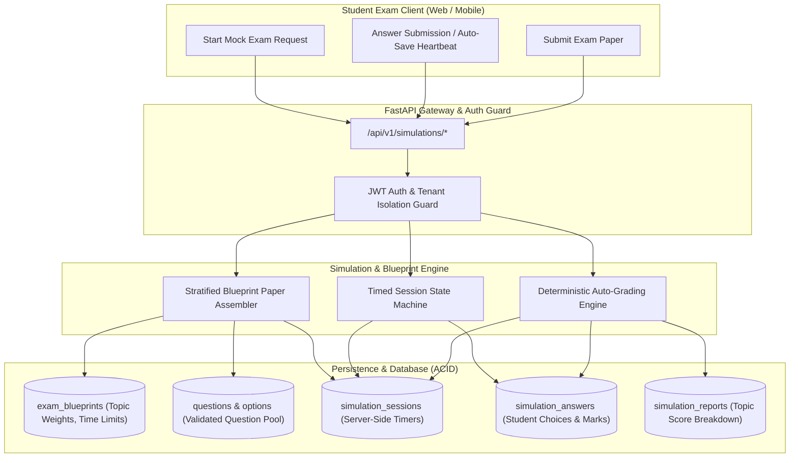
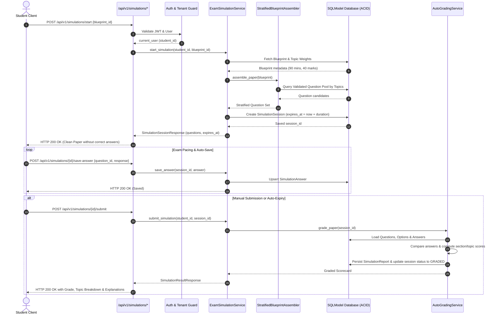
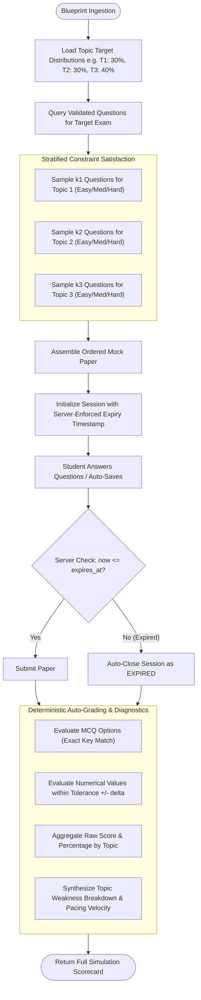

# Task 8.1: Full Exam Simulation & Blueprint Weighting Engine — Conceptual Understanding (Stage 1)

## Section 1: Visual Architecture

The Full Exam Simulation & Blueprint Weighting Engine (PRD Cap 9, 14, 20, FR-014, FR-020) transforms modular practice into an authentic, high-stakes examination experience. It uses stratified constraint-satisfaction algorithms to assemble balanced papers reflecting historical exam blueprints, enforces server-side time boundaries, and deterministically auto-grades student responses.

---

## Section 2: The Physical Analogy

> **The Commercial Airline Flight Simulator & The Official Flight Checkride**
> 
> Practicing individual physics or calculus problems is like an aspiring pilot practicing takeoff in a parking lot on a sunny afternoon: you can take all the time you want, look up the answers in the manual, and retry as many times as you like.
> 
> An **Exam Simulation** is the full Level-D Flight Simulator checkride:
> 1. **The Official Flight Plan (Exam Blueprint):** The FAA doesn't test 100% engine fires. The checkride follows a strict proportion: 30% navigation, 25% crosswind landing, 25% instrument flight, 20% emergency procedures.
> 2. **The Cockpit Chronometer (Server-Enforced Timer):** The flight has a strict 90-minute fuel load. If the pilot fails to land before the fuel runs out, the flight terminates immediately—the timer cannot be paused or manipulated from the client.
> 3. **The Flight Data Recorder (Deterministic Auto-Grader):** Every rudder input and altitude deviation is recorded and scored against exact engineering standards, producing an auditable debrief report highlighting strong maneuvers and critical mistakes.

---

## Section 3: Why & What

### Why are we building this? (Product Motivation)
Students frequently experience a massive "Mock Shock"—scoring 85% on untimed homework practice, but scoring 55% on the actual Cambridge A-Level or AP exam. The primary root causes are:
1. **Pacing & Time Pressure Collapse:** Running out of time on Section B because too much time was spent on early questions.
2. **Topic Skewness:** Practicing only favorite topics while neglecting high-weighted blueprint domains.
3. **Context Switching Fatigue:** High-stakes exams require rapid mental shifting across 10+ syllabus topics within a single 90-minute sitting.

PRD Capabilities 14 & 20 (§5.4, §15, FR-014, FR-020) mandate:
1. **Exam Blueprint Reverse Engineering:** Formalizing syllabus distributions (topic weights, question types, time limits, section rules).
2. **Full-Length Exam Simulation:** Assembling randomized, stratified mock papers conforming to blueprint weights with server-side time enforcement and comprehensive auto-grading.

### What is the concept? (Plain-Language Definition)
- **Exam Blueprint:** A formal specification defining total marks, duration (e.g. 90 mins), passing score, and topic distributions (e.g. Mechanics 30%, Thermodynamics 20%, Waves 25%, Electricity 25%).
- **Stratified Paper Assembler:** An algorithm that queries the validated Question Bank, groups questions by topic and difficulty, and selects a balanced set satisfying all blueprint target weights.
- **Timed Session State Machine:** A lifecycle tracker (`NOT_STARTED` $\to$ `IN_PROGRESS` $\to$ `SUBMITTED` / `EXPIRED` $\to$ `GRADED`) where expiry timestamps are strictly calculated and enforced on the server.
- **Deterministic Auto-Grader:** A grading orchestrator that compares submitted student answers against correct options and numerical tolerance bounds, calculates section marks, percentage scores, and generates topic-level mastery reports.

### What breaks if we skip it?
1. **Client-Side Timer Tampering:** If timers run solely on the client, students can pause or edit JavaScript timers, invalidating readiness metrics.
2. **Unbalanced Mock Exams:** Pure random question selection could produce papers with 80% Mechanics and 0% Electromagnetism, misrepresenting real exam difficulty.
3. **Missing Pacing Analytics:** Without tracking time spent per question and section completion velocity, students cannot identify time-management bottlenecks.

---

## Section 4: Abstraction Level Map

| Level | What Lives Here | Current Project Implementation |
|:---|:---|:---|
| **Product / UX** | Mock Exam Kiosk Interface, Pacing Timer, Post-Exam Scorecard | Full-screen timed exam canvas, live countdown, radar breakdown |
| **Application** | Stratified Sampling Engine, Timed State Machine, Auto-Grader | `backend/app/simulation/service.py`, `backend/app/simulation/grader.py` |
| **Framework** | REST Endpoints, Dependency Injection, Validation Schemas | FastAPI router `backend/app/simulation/router.py`, Pydantic V2 schemas |
| **Library** | SQLModel ORM, Asyncpg/Aiosqlite, Python Datetime UTC | `sqlmodel`, `datetime.now(timezone.utc)` |
| **Runtime** | Python 3.12/3.14 AsyncIO Event Loop, ASGI Server | Uvicorn / AnyIO async worker threads |
| **OS / Infrastructure** | Transactional database tables with multi-tenant isolation | PostgreSQL / SQLite tables (`simulation_sessions`, `simulation_answers`) |

---

## Section 5: Mermaid Diagrams

### 1. Sequence Diagram: Full Exam Simulation Lifecycle

### 2. Flowchart: Stratified Sampling & Auto-Grading Pipeline

---

## Section 6: Data Flow Trace-Through

1. **Blueprint Definition:** Admin or syllabus ingestion defines `ExamBlueprint` (e.g. Cambridge 9702 Paper 1: 40 MCQs, 75 minutes, 40 marks, topic distribution).
2. **Simulation Launch:** Student initiates a mock exam via `POST /api/v1/simulations/start`.
3. **Stratified Selection:** `StratifiedBlueprintAssembler` allocates question quotas per topic ($\text{quota}_i = \text{round}(\text{total\_questions} \times \text{weight}_i)$) and randomly samples validated questions from `questions`.
4. **Session Instantiation:** The server creates `SimulationSession` with `status = IN_PROGRESS`, `started_at = utcnow()`, and `expires_at = started_at + duration_minutes`.
5. **Sanitized Delivery:** The client receives the assembled question paper with `correct_answer` stripped out.
6. **Live Auto-Saving:** As the student answers questions, `POST /api/v1/simulations/{id}/save-answer` persists choices to `simulation_answers`.
7. **Submission & Grading:** On submission (or when `now() > expires_at`), `AutoGradingService` evaluates each answer:
   - For `MCQ_SINGLE`: $1\text{ mark}$ if selected option matches correct option, else $0$.
   - For `NUMERICAL`: $1\text{ mark}$ if $|v_{\text{submitted}} - v_{\text{correct}}| \le \text{tolerance}$.
8. **Scorecard Persistence:** Calculates total score, percentage, topic mastery breakdown, and marks session `GRADED`.

---

## Section 7: Cognitive Model → Code Mapping

| Cognitive Stage | Mental Model | Code Concept in Current Project | Enforcement / Guardrail |
|:---|:---|:---|:---|
| **1. The Blueprint** | "What does the official exam look like?" | `ExamBlueprint`, `BlueprintTopicDistribution` | Total weights must sum to $1.0$ ($100\%$) |
| **2. The Paper Assembly** | "Give me a balanced exam matching the syllabus" | `StratifiedBlueprintAssembler.assemble()` | Stratified random selection without duplicates |
| **3. The Clock** | "I have exactly 90 minutes to finish" | `expires_at = started_at + timedelta(minutes=duration)` | Server-side validation; rejects late answers |
| **4. The Exam Taking** | "I can answer, skip, and review questions" | `SimulationAnswer` upsert endpoint | Auto-save heartbeat prevents lost work |
| **5. The Grading** | "How did I perform on each topic?" | `AutoGradingService.grade_session()` | Deterministic scoring with topic breakdown |

---

## Section 8: Language / Stack Context

- **FastAPI:** REST endpoints mounted under `/api/v1/simulations`.
- **SQLModel (Async SQLAlchemy 2.0):** Database tables `exam_blueprints`, `blueprint_topic_distributions`, `simulation_sessions`, `simulation_answers`, `simulation_reports`.
- **Pydantic V2:** Schemas for blueprint configurations, sanitized paper delivery, and scorecards.
- **Python Datetime (UTC):** Strict `datetime.now(timezone.utc)` arithmetic for tamper-proof countdown calculation.

---

## Section 9: Five Alternative Approaches

| # | Approach | Pros | Cons | Decision / Verdict |
|---|:---|:---|:---|:---|
| **1** | **Stratified Constraint-Satisfaction + Server-Side Timed State Machine (Selected)** | Authentic blueprint fidelity; immune to client-side timer manipulation; deterministic grading. | Requires server session state. | ✅ **Selected:** Fully satisfies PRD Cap 14 & 20. |
| **2** | **Client-Side Only JavaScript Timer** | Zero server state for timers. | Easily bypassed by pausing JavaScript execution or modifying local clock. | ❌ Rejected: Violates exam integrity (PRD §5.4). |
| **3** | **Pure Uniform Random Sampling** | Trivial to implement. | Produces wildly skewed papers (e.g. 90% topic A, 0% topic B). | ❌ Rejected: Fails blueprint weighting mandate. |
| **4** | **Static Hardcoded Past Papers** | Authentic historical papers. | Students memorize static questions; zero replayability or dynamic variant generation. | ❌ Rejected: Lacks adaptive versatility. |
| **5** | **LLM Prompt-Generated Full Papers on the Fly** | Generates novel questions. | Slow (60s+ latency), risk of invalid questions slipping to students without pre-validation. | ❌ Strictly Prohibited by PRD Constraint #4. |

---

## Section 10: Production Rationale & Consequences

### Why This Is Standard
In professional assessment platforms (Prometric, Pearson VUE, USMLE, SAT), exam blueprints govern the psychometric validity of the test. A test is only valid if its content distribution matches the domain blueprint and timing conditions are strictly enforced.

### What Happens If We Skip This
1. **Disaster Scenario A: The False Confidence Trap.** A student practices unweighted mock exams where their strongest topic happened to appear 10 times, giving them a false 90% score, only to fail the real exam where blueprint weights are strictly distributed.
2. **Disaster Scenario B: The Time-Collapse Exam.** A student with high theoretical knowledge fails because they never practiced under realistic, server-enforced countdown pressure.
