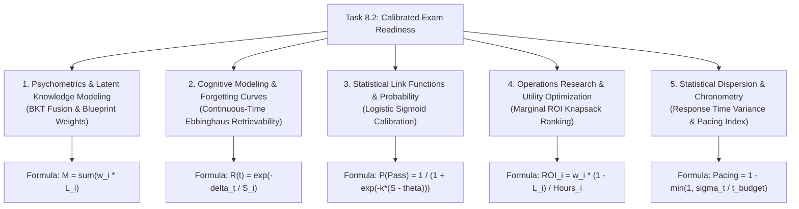

# Stage 3 CS Domain Extraction: Task 8.2 — Calibrated Exam Readiness Score Engine

**Task ID:** Task 8.2  
**Epic:** Epic 8 — Exam Readiness Simulator & Predictive Analytics  
**Track:** `[BACKEND]`  
**Feature:** Calibrated Exam Readiness Score Engine (PRD Cap 9, 14, 20, FR-014, FR-020, FR-025)  

---

## 1. Domain Discovery Map

---

## 2. Domain Deep Dives

### Domain 1: Psychometrics & Latent Knowledge Modeling (BKT Fusion)

**What Is It (Plain English):**
Students possess invisible (latent) levels of knowledge for each syllabus topic. We cannot observe this knowledge directly, but we estimate it through Bayesian Knowledge Tracing ($L_k \in [0, 1]$). In exam preparation, topics do not have equal importance; the official exam blueprint dictates that some topics represent 30% of total marks while others represent only 5%.

**Mathematical Formulation:**
Given $n$ syllabus topics with blueprint weights $w_i \in [0, 1]$ such that $\sum_{i=1}^n w_i = 1.0$, and student BKT posterior mastery probabilities $L_i \in [0, 1]$:
\[
W_m = 100 \times \sum_{i=1}^{n} w_i L_i
\]

**Physical Analogy:**
Like calculating a student's Grade Point Average (GPA). An "A" in a 4-credit Core Physics course contributes significantly more to the final GPA than an "A" in a 0.5-credit elective seminar.

**Codebase Manifestation:**
- [`backend/app/mastery/bkt.py`](file:///c:/Users/Abdul%20Jabbar%20Metlo/Feynman_tutorAI/backend/app/mastery/bkt.py) — BKT updates.
- [`backend/app/simulation/models.py`](file:///c:/Users/Abdul%20Jabbar%20Metlo/Feynman_tutorAI/backend/app/simulation/models.py) — `BlueprintTopicDistribution.target_weight`.

---

### Domain 2: Cognitive Modeling & Continuous-Time Ebbinghaus Retrievability

**What Is It (Plain English):**
Human memory degrades exponentially without review. A topic mastered two months ago has lower retrievability on exam day than a topic practiced yesterday. The readiness engine models this retention decay continuously using the elapsed days since last practice and the item's memory stability.

**Mathematical Formulation:**
For topic $i$, given elapsed time $\Delta t_i$ in days and SM-2 memory stability $S_i$:
\[
R_i(\Delta t_i) = \exp\left(-\frac{\Delta t_i}{S_i}\right)
\]
The composite retention score across the syllabus is:
\[
W_r = 100 \times \sum_{i=1}^{n} w_i R_i(\Delta t_i)
\]

**Physical Analogy:**
Like a heated iron plate cooling down over time. Without periodic reheating (spaced repetition practice sessions), the plate's thermal energy (memory retrievability) decays towards room temperature.

**Codebase Manifestation:**
- [`backend/app/revision/sm2.py`](file:///c:/Users/Abdul%20Jabbar%20Metlo/Feynman_tutorAI/backend/app/revision/sm2.py) — `SpacedRepetitionScheduler.calculate_retrievability()`.
- [`backend/app/revision/models.py`](file:///c:/Users/Abdul%20Jabbar%20Metlo/Feynman_tutorAI/backend/app/revision/models.py) — `SpacedRepetitionItem.stability_days`.

---

### Domain 3: Statistical Link Functions & Logistic Probability Calibration

**What Is It (Plain English):**
A raw readiness score (e.g. 72%) is informative, but students need to know: *"What is my actual probability of passing the official exam on test day?"* We map the multi-factor composite score through a logistic link function (sigmoid curve) centered at the exam's passing score threshold.

**Mathematical Formulation:**
Let $S_{\text{readiness}} \in [0, 100]$ be the composite readiness score and $\theta_{\text{pass}}$ be the passing threshold (e.g. 60%). The calibrated pass probability $P(\text{Pass})$ is given by:
\[
P(\text{Pass}) = \frac{1}{1 + \exp\left(-k \cdot (S_{\text{readiness}} - \theta_{\text{pass}})\right)}
\]
where $k \approx 0.10$ determines the transition steepness:
- If $S_{\text{readiness}} = \theta_{\text{pass}}$, $P(\text{Pass}) = 50\%$.
- If $S_{\text{readiness}} = \theta_{\text{pass}} + 20\%$, $P(\text{Pass}) \approx 88\%$.
- If $S_{\text{readiness}} = \theta_{\text{pass}} - 20\%$, $P(\text{Pass}) \approx 12\%$.

**Physical Analogy:**
Like the S-curve of a water dam spillway. Below the spillway height ($\theta_{\text{pass}}$), water passage is minimal; as water rises above the crest, discharge probability rapidly saturates towards 100%.

---

### Domain 4: Operations Research & Marginal ROI Topic Prioritization

**What Is It (Plain English):**
With limited study time remaining before test day, a student needs to know where their next hour of study will yield the largest increase in overall exam score. We compute the **Marginal Utility Gain ($\text{ROI}_i$)** by multiplying topic exam weight by current mastery deficit.

**Mathematical Formulation:**
For each topic $i$:
\[
\text{Deficit}_i = 1.0 - \min(L_i, R_i)
\]
\[
\text{ROI}_i = \frac{w_i \times \text{Deficit}_i}{\max(1.0, \text{Estimated Study Hours}_i)}
\]
Topics are ranked descending by $\text{ROI}_i$ to generate the **Top 3 High-Impact Focus Areas**.

**Physical Analogy:**
Like an investment portfolio manager allocating capital. You invest in high-yield, undervalued stocks (high-weight, low-mastery topics) rather than buying more shares of a stock that is already at peak valuation (99% mastered topic).

---

### Domain 5: Mental Chronometry & Response Pacing Consistency

**What Is It (Plain English):**
In timed standardized exams, time management is critical. High variance in time-per-question indicates guessing, panic, or uncalibrated reading speed. The engine evaluates student response time standard deviation relative to question time budgets to penalize erratic pacing.

**Mathematical Formulation:**
Let $\bar{t}$ be mean response latency, $t_{\text{budget}}$ be expected benchmark latency, and $\sigma_t$ be the standard deviation of response latencies:
\[
W_p = 100 \times \max\left(0.0, 1.0 - \frac{\sigma_t}{2 \cdot t_{\text{budget}}}\right)
\]

---

## 3. Multi-Factor Psychometric Composite Fusion

The overall **Calibrated Exam Readiness Score ($S_{\text{readiness}}$)** combines all 4 pillars with tuned psychometric weights:
\[
S_{\text{readiness}} = 0.40 \cdot W_m + 0.20 \cdot W_r + 0.25 \cdot W_s + 0.15 \cdot W_p
\]

| Pillar | Weight | Description | Primary Telemetry Source |
|---|---|---|---|
| **$W_m$ (Mastery)** | 40% | Blueprint-Weighted BKT Knowledge Tracing | `StudentMastery.p_mastery` |
| **$W_r$ (Retention)** | 20% | Continuous Ebbinghaus Memory Retrievability | `SpacedRepetitionItem.retrievability` |
| **$W_s$ (Simulation)** | 25% | Timed Full-Length Mock Exam Average | `SimulationReport.percentage_score` |
| **$W_p$ (Pacing)** | 15% | Response Time Consistency & Pacing Index | `SimulationAnswer.time_spent_seconds` |

---

## 4. Concept Evolution Timeline

| Level | Mental Model | Advanced Reality |
|---|---|---|
| **Beginner** | "Readiness is just average test scores." | Simple averages ignore topic importance weights and test timer pressure. |
| **Intermediate** | "Readiness should weight by syllabus percentages." | Static weighting ignores memory forgetting over time since last study session. |
| **Advanced** | "Readiness combines weighted mastery + forgetting curve decay." | Neglects real-time exam stamina, pacing reliability, and full simulation stress. |
| **Expert** | "Multi-factor psychometric fusion with calibrated logistic pass projection." | Synthesizes BKT, continuous Ebbinghaus retrievability, mock simulation history, and response latency into an explainable, calibrated pass probability. |

---

## 5. "What If" Scenarios

1. **Q: What if a student has never taken a full-length mock simulation?**  
   *A:* The engine gracefully redistributes the 25% simulation weight proportionally across BKT Mastery (55%), Retention (30%), and Pacing (15%), ensuring new students receive an accurate estimate without failing or crashing.

2. **Q: What if an exam template has no official Blueprint configured?**  
   *A:* The engine calculates equal uniform weights $w_i = 1 / N_{\text{topics}}$ across all syllabus topics.

3. **Q: What if a student answered a question in 1 second?**  
   *A:* Anomalously low response latency is flagged as rapid guessing, preventing inflated mastery updates and lowering the pacing consistency index.

4. **Q: What if a student hasn't reviewed a topic in 90 days?**  
   *A:* Ebbinghaus decay drives $R(90) \to 0$, pulling down the composite readiness score and placing that topic at the top of the High-ROI Focus Recommendations.
