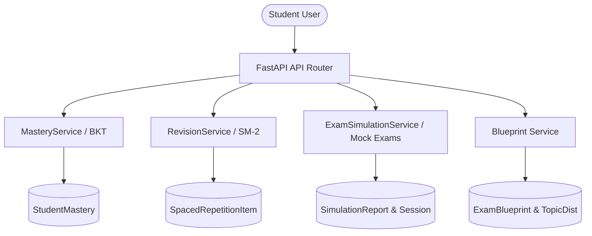
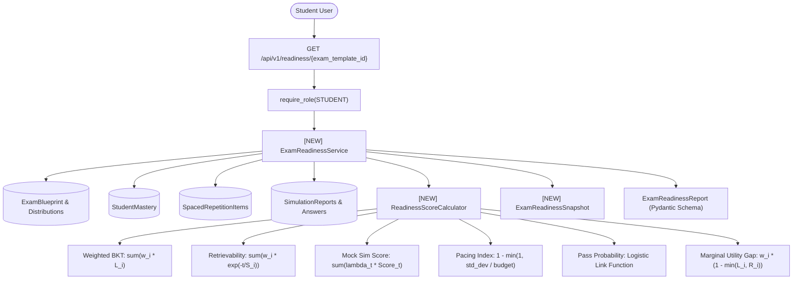
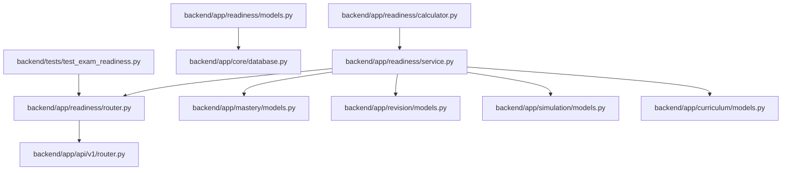

# Stage 2 Codebase Design: Task 8.2 — Calibrated Exam Readiness Score Engine

**Task ID:** Task 8.2  
**Epic:** Epic 8 — Exam Readiness Simulator & Predictive Analytics  
**Track:** `[BACKEND]`  
**Status:** DESIGNED (Awaiting User Review & Approval)  

---

## 1. Current State Snapshot



Currently, the platform tracks individual data streams:
- `StudentMastery` tracks latent concept knowledge via Bayesian Knowledge Tracing.
- `SpacedRepetitionItem` tracks flashcard review intervals and Ebbinghaus stability.
- `SimulationReport` tracks full-length mock simulation scores and timing.
- `ExamBlueprint` stores official topic weights and question distributions.

However, there is **no unified predictive fusion engine** that aggregates these disparate streams into a singular, calibrated Exam Readiness Score ($0-100\%$) and Pass Probability projection.

---

## 2. Proposed State



---

## 3. File-Level Impact Analysis

### [NEW] `backend/app/readiness/models.py`
- **Purpose:** SQLModel table definitions for storing historical readiness snapshots.
- **Exports:** `ExamReadinessSnapshot`.
- **Consumers:** `ExamReadinessService`, `database.py:init_db()`.

### [NEW] `backend/app/readiness/schemas.py`
- **Purpose:** Pydantic V2 schemas for readiness calculations, component breakdowns, topic ROI rankings, and progression curves.
- **Exports:** `TopicReadinessDetail`, `ReadinessComponentBreakdown`, `HighRoiTopicRecommendation`, `ExamReadinessReport`, `ReadinessHistoryResponse`.
- **Consumers:** `router.py`, `service.py`.

### [NEW] `backend/app/readiness/calculator.py`
- **Purpose:** Pure mathematical calculation engine for psychometric multi-factor fusion, logistic pass probability, and marginal ROI knapsack prioritization.
- **Exports:** `ReadinessScoreCalculator`.
- **Consumers:** `service.py`.

### [NEW] `backend/app/readiness/service.py`
- **Purpose:** Domain orchestrator for data aggregation across multiple modules, executing psychometric calculations, persisting snapshots, and assembling reports.
- **Exports:** `ExamReadinessService`.
- **Consumers:** `router.py`.

### [NEW] `backend/app/readiness/router.py`
- **Purpose:** FastAPI route definitions for readiness calculations and history retrieval.
- **Exports:** `router` (mounted as `readiness_router`).
- **Consumers:** `backend/app/api/v1/router.py`.

### [NEW] `backend/app/readiness/__init__.py`
- **Purpose:** Package exports.

### [MODIFY] `backend/app/api/v1/router.py`
- **What changes:** Include and mount `readiness_router` under `/readiness`.
- **Why:** Expose readiness endpoints to the API gateway.

### [MODIFY] `backend/app/core/database.py`
- **What changes:** Register `import backend.app.readiness.models` in `init_db()`.
- **Why:** Ensure SQLModel metadata creates the `exam_readiness_snapshots` table.

### [NEW] `backend/tests/test_exam_readiness.py`
- **Purpose:** Unit and integration test suite covering math formulas, multi-factor fusion, timer/decay dynamics, tenant isolation, and REST endpoints.

---

## 4. Dependency Graph / Blast Radius



---

## 5. Regression Risk Matrix

| Risk ID | Risk Description | Severity | Affected Area | Mitigation Strategy |
|---|---|---|---|---|
| R-01 | Missing Blueprint or Simulation Data for New Student | 🟡 Medium | Calculation Engine | Provide robust default fallbacks (e.g. uniform weights if blueprint missing; neutral prior for unattempted mock exams) |
| R-02 | Cross-Student State Leakage (PRD Constraint #2) | 🔴 High | Multi-Tenant Data | Enforce `student_id == current_user.id` filter on all queries |
| R-03 | Division by Zero in Pacing / Retention Math | 🟡 Medium | Math Calculator | Guard against zero time budgets, zero stability values, and zero total questions |
| R-04 | Timezone Inconsistencies in Recency Decay | 🟢 Low | Datetime Arithmetic | Strictly normalize all datetimes to UTC before computing elapsed time |

---

## 6. Contract Stability Check

| Contract | Path / Entity | Type | Status | Breaking? |
|---|---|---|---|---|
| `GET /api/v1/readiness/{exam_template_id}` | Calculate Readiness | Endpoint | NEW | No |
| `GET /api/v1/readiness/{exam_template_id}/history` | Historical Progress | Endpoint | NEW | No |
| `ExamReadinessSnapshot` | Database Table | Table | NEW | No |

---

## 7. Performance & Security Impact

- **Query Optimization:** Single round-trip batch queries for `StudentMastery`, `SpacedRepetitionItem`, and `SimulationReport` per exam template.
- **Pure Vectorized Python Math:** Zero heavy third-party dependencies; pure standard library `math` for sub-millisecond execution.
- **Server-Side RBAC & Tenant Isolation:** Enforced via `get_current_user` dependency.

---

## 8. Rollback Strategy

1. **Uncommitted Changes:**
   ```powershell
   git checkout -- .
   ```
2. **Committed Changes:**
   ```powershell
   git revert HEAD
   ```
   Estimated rollback time: ~1 minute.
