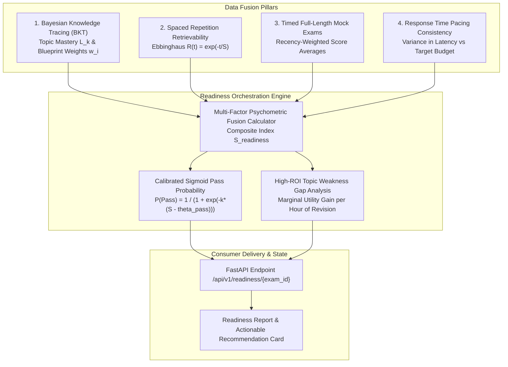
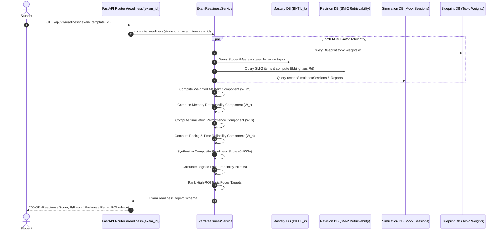
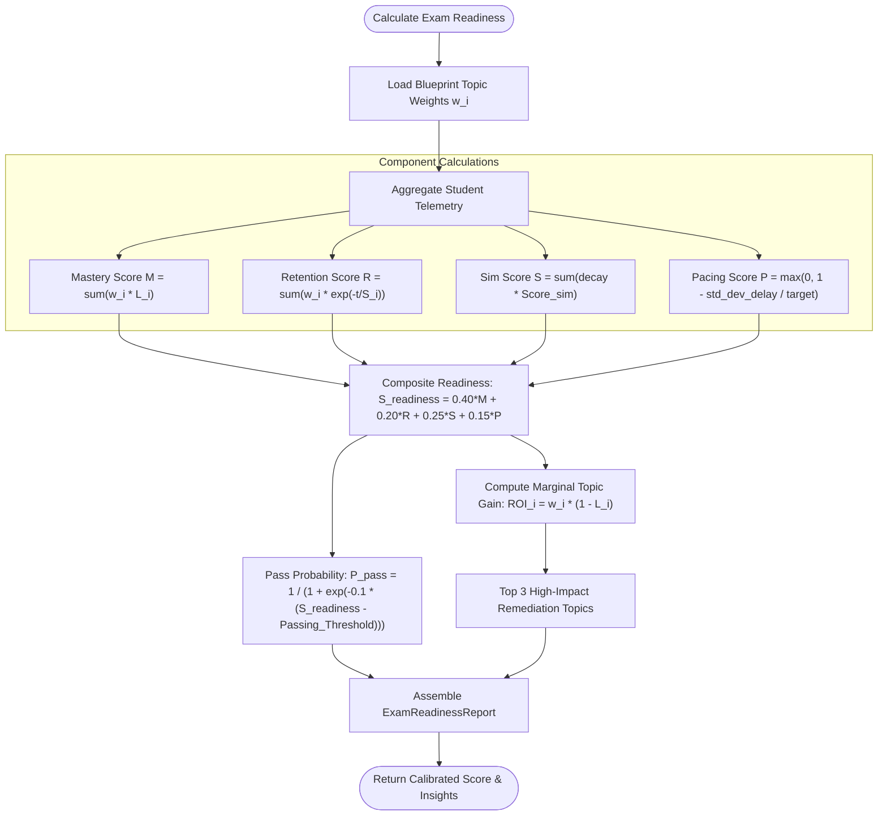

# Stage 1 Conceptual Understanding: Task 8.2 — Calibrated Exam Readiness Score Engine

**Task ID:** Task 8.2  
**Epic:** Epic 8 — Exam Readiness Simulator & Predictive Analytics  
**Track:** `[BACKEND]`  
**Feature:** Calibrated Exam Readiness Score Engine (PRD Cap 9, 14, 20, FR-014, FR-020, FR-025)  

---

## 1. Visual Architecture

---

## 2. The Physical Analogy: The Aviation Pre-Flight Airworthiness Certificate

Imagine a commercial airline pilot preparing an airliner for a transatlantic crossing. A pilot doesn't determine flight readiness by simply checking if the aircraft's fuel tank is full. True flight readiness requires a multi-sensor cross-check:
1. **Instrument Engine Checks (BKT Mastery):** Have all turbine components passed recent thrust and compression tests?
2. **Maintenance Freshness (Memory Retention Decay):** Was the avionics firmware updated yesterday, or has it sat idle in a hangar for three months without recalibration?
3. **Flight Simulator Stress Run (Mock Exam Performance):** How did the flight crew perform under simulated turbulent windshear in real-time?
4. **Throttle Response Precision (Response Time Pacing):** Did the crew react to emergency alarms within standard reaction budgets or did they hesitate?

Only when all four telemetry streams are synthesized does the aviation inspector stamp the **Airworthiness Certification** and forecast a **99.9% probability of a safe, on-time landing**. In the Feynman Tutor platform, the **Calibrated Exam Readiness Engine** acts as this flight inspector, synthesizing topic mastery, memory decay, simulation pressure, and pacing into a definitive, reliable exam readiness score ($0 - 100\%$) and pass projection.

---

## 3. Why & What

### Why are we doing this task?
Students preparing for high-stakes exams (MCAT, JEE, USMLE, AP, SAT) frequently experience the **"Illusion of Competence"**—they score high on isolated flashcards or practice questions immediately after reading a chapter and believe they are 100% prepared. However, on official exam day under strict time pressure and cross-topic cognitive loads, scores plummet due to:
- Topic weighting ignorance (spending 80% of study time on a topic that represents only 5% of exam marks).
- Forgetting curve decay on topics studied weeks earlier.
- Inability to sustain pacing across full-length timed sessions.

### What is the concept?
The **Calibrated Exam Readiness Score Engine** is a psychometrically grounded data fusion pipeline that aggregates:
1. **Blueprint-Weighted BKT Mastery ($W_m \approx 40\%$):** Calculates student topic mastery $L_k \in [0, 1]$ weighted by official exam blueprint distribution weights $w_i$.
2. **Ebbinghaus Memory Retrievability ($W_r \approx 20\%$):** Evaluates exponential retention decay $R(t) = e^{-\Delta t / S_i}$ across all tested learning objectives.
3. **Full Simulation Performance ($W_s \approx 25\%$):** Evaluates recent full-length mock simulation results under timed conditions with recency weighting.
4. **Time Pacing & Consistency Factor ($W_p \approx 15\%$):** Analyzes question response latencies against benchmark time budgets.
5. **Calibrated Pass Probability ($P_{\text{pass}}$):** Maps composite readiness through a logistic link function calibrated to the blueprint passing threshold.
6. **High-ROI Actionable Topic Gaps:** Evaluates marginal readiness gain $\Delta \text{Readiness} = w_i \times (1 - L_i)$ to recommend exact topics yielding maximum score boost per hour.

### What breaks if we skip it?
- **False Confidence:** Students enter real exams unprepared and fail because the platform reported "90% mastery" based only on isolated, unweighted flashcards.
- **Unexplainable Learning Decisions (Violates PRD NFR-008 & FR-025):** The system cannot justify why a student is recommended to revise Topic A over Topic B.
- **Uncalibrated Predictions:** Unweighted averages treat a 1-point minor topic identically to a 30-point core exam section.

---

## 4. Abstraction Level Map

| Level | What Lives Here | Current Project Example |
|---|---|---|
| **Product / UX** | Student Readiness Gauge, Pass Probability Card, High-ROI Focus Areas | `ReadinessScorecard`, `TopicGapRadar` |
| **Application** | Readiness calculation service, blueprint aggregation, pacing analysis | `ExamReadinessService.calculate_readiness()` |
| **Framework** | FastAPI route handlers, dependency injection, role guards | `backend/app/readiness/router.py` |
| **Library** | SQLModel ORM, Pydantic V2 schemas, math / statistics modules | `math.exp`, `scipy`/`numpy` or pure Python math formulas |
| **Runtime** | Python 3.14 async runtime, SQLite / Postgres query engine | `AsyncSession`, `select(StudentMastery)` |
| **Data / Storage** | Readiness snapshots, historical trend metrics, blueprint distributions | `ExamReadinessReport`, `ReadinessHistory` |

---

## 5. Mermaid Diagrams

### 5.1 Request Sequence Diagram

### 5.2 Decision & Calculation Flowchart

---

## 6. Data Flow Trace-Through

1. **User Action:** Student navigates to the Readiness Dashboard or requests readiness projection for an Exam Template.
2. **FastAPI Route Interception:** `GET /api/v1/readiness/{exam_template_id}` authenticates the user via JWT bearer token.
3. **Multi-Source Data Aggregation:**
   - Queries `ExamBlueprint` to retrieve official topic distributions $w_i$.
   - Queries `StudentMastery` to retrieve BKT posterior probabilities $L_k$.
   - Queries `SpacedRepetitionItem` to evaluate elapsed days $\Delta t$ and stability $S$ for current retrievability $R = e^{-\Delta t / S}$.
   - Queries `SimulationReport` to extract mean percentage score and time-per-question metrics from completed mock exams.
4. **Mathematical Psychometric Fusion:**
   - Applies linear weighting formula: $S_{\text{readiness}} = 0.40 \cdot W_m + 0.20 \cdot W_r + 0.25 \cdot W_s + 0.15 \cdot W_p$.
   - Calculates logistic pass probability: $P(\text{Pass}) = \frac{1}{1 + e^{-0.10 \cdot (S_{\text{readiness}} - \theta_{\text{pass}})}}$.
5. **Marginal Utility Optimization:** Computes $\text{ROI}_i = w_i \times (1 - \min(L_i, R_i))$ for each syllabus topic and sorts descending.
6. **Persistence & Return:** Saves snapshot to `ExamReadinessSnapshot` for historical progress tracking and returns JSON payload to client.

---

## 7. Cognitive Model → Code Mapping

| Cognitive Concept | Mental Model | Code Concept in This Project | Enforcement / Guardrail |
|---|---|---|---|
| **Blueprint Alignment** | "Topics with 30% weight matter 6x more than 5% topics." | `BlueprintTopicDistribution.target_weight` | Weighted linear combination $\sum w_i L_i$ |
| **Forgetting Guard** | "I knew this 2 months ago, but have I forgotten?" | Ebbinghaus Retrievability $R = e^{-\Delta t / S}$ | Penalizes inactive topics without recent review |
| **Exam Pressure Reality** | "Flashcard scores don't equal 3-hour exam endurance." | `SimulationReport.percentage_score` | Timed mock exam weighting in composite score |
| **Pacing Discipline** | "Running out of time causes rushed guessing on the final 20%." | Pacing Variance Factor $\Delta t_{\text{actual}} / \Delta t_{\text{budget}}$ | Penalizes extreme latency variance |
| **Explainable Advice** | "What should I study tonight to maximize my score increase?" | Marginal Topic Gain $\text{ROI}_i = w_i (1 - L_i)$ | Top 3 high-impact focus topic recommendations |

---

## 8. Language / Stack Context (FastAPI + SQLModel + Python 3.14)

- **Pure Python Vectorized Math:** Python 3.14 `math` library for exponential decay and logistic sigmoid transformations without heavyweight native dependencies.
- **SQLModel Async Aggregations:** Batch queries across `topics`, `student_mastery`, `spaced_repetition_items`, and `simulation_reports` via `select(...).where(...)`.
- **Pydantic V2 Schema Validation:** Strict serialization of readiness breakdowns, topic gap radar points, and historical progression trajectories.

---

## 9. Five Alternative Approaches

| # | Approach | Pros | Cons | Recommendation |
|---|---|---|---|---|
| 1 | **Simple Unweighted Arithmetic Average** | Trivial to implement | Ignores blueprint weights and forgetting; severely misleads students | ❌ Reject (Inaccurate) |
| 2 | **Simulation-Only Score** | Directly measures mock exam results | Extremely sparse data (students take 1-3 mocks total) | ❌ Reject (Data Starvation) |
| 3 | **Static Rule-Based If-Else Heuristic** | Easy to explain | Brittle; doesn't scale across diverse exam syllabi | ❌ Reject (Unscalable) |
| 4 | **Deep Machine Learning Classifier** | Can learn complex non-linear interactions | Black-box; impossible to explain why a student is unready (violates NFR-008) | ❌ Reject (Violates NFR-008) |
| 5 | **Multi-Factor Calibrated Psychometric Fusion (Selected)** | Explainable, blueprint-grounded, accounts for memory decay and pacing, robust with sparse mock data | Requires careful weight tuning | ✅ **Chosen Pattern** |

---

## 10. Production Rationale & Consequences

### Why This Is Standard
Modern professional assessment engines (such as ETS, Khan Academy, and medical board preparation platforms) fuse item-level mastery with latency, forgetting dynamics, and exam blueprint weightings. Providing an explainable readiness breakdown builds student trust and directs study hours where they have the highest marginal impact.

### What Happens If We Skip This
1. **Student Exam Disaster:** A student scores 95% on 20 questions in a minor 5% topic, believes they are ready, but fails the real exam because they ignored a 40% blueprint domain.
2. **Platform Churn & Distrust:** When uncalibrated platforms tell students "You are ready" and students subsequently fail official certification exams, platform credibility is permanently destroyed.
