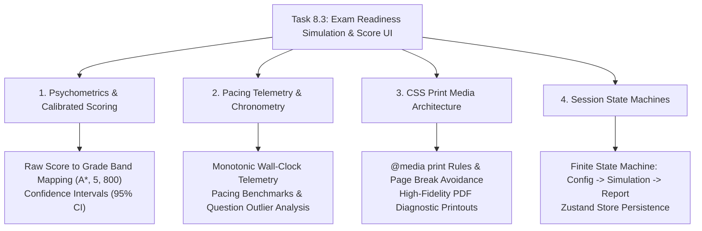

# Stage 3: CS Domain Learning Extraction
## Task 8.3: Exam Readiness Simulation & Score Report UI `[FRONTEND]`

**Task ID:** Task 8.3  
**Track:** Frontend Track (React 18+ / TypeScript / Vite / Zustand / KaTeX / Printable Diagnostic Report)  
**Epic:** Epic 8 — Full-Length Exam Simulation & Predictive Scoring  
**Accepted Decision Basis:** [ADR-008: Frontend Framework & UI Ecosystem](file:///c:/Users/Muhammad/OneDrive%20-%20Higher%20Education%20Commission/Desktop/AI%20Tutor/Feynman_tutorAI/docs/adr/ADR-008-frontend-framework-and-ui-stack.md), [DESIGN_SYSTEM_TYPOGRAPHY.md](file:///c:/Users/Muhammad/OneDrive%20-%20Higher%20Education%20Commission/Desktop/AI%20Tutor/Feynman_tutorAI/docs/frontend_design/DESIGN_SYSTEM_TYPOGRAPHY.md)

---

## 1. Domain Discovery Map

---

## 2. Domain Deep Dives

### Domain 1: Psychometrics & Calibrated Predictive Scoring

**What Is It (Plain English):**  
Standardized exams do not just assign raw percentages; they convert raw scores to official **Grade Bands**:
- **Cambridge International A-Level (9702):** Raw Score $\ge 85\% \rightarrow \mathbf{A^*}$, $\ge 75\% \rightarrow \mathbf{A}$, $\ge 65\% \rightarrow \mathbf{B}$.
- **AP Calculus BC:** Raw Score $\ge 68\% \rightarrow \mathbf{5}$, $\ge 56\% \rightarrow \mathbf{4}$, $\ge 44\% \rightarrow \mathbf{3}$.
- **Digital SAT Math:** Scaled Score $\in [200, 800]$.

**Confidence Interval Calculation:**
Given observed accuracy $\hat{p}$ across $n$ questions, the 95% Wilson confidence interval is:
\[
\text{CI}_{95\%} = \frac{\hat{p} + \frac{z^2}{2n} \pm z \sqrt{\frac{\hat{p}(1-\hat{p})}{n} + \frac{z^2}{4n^2}}}{1 + \frac{z^2}{n}}, \quad \text{where } z = 1.96
\]

---

### Domain 2: Pacing Telemetry & Chronometry

**What Is It (Plain English):**  
Standardized testing is as much a test of **time management** as subject mastery. In Cambridge Paper 1 (40 questions in 60 minutes), students have an exact target of **90 seconds per question**. The simulation tracks:
1. **Average Time Per Question:** $T_{\text{avg}} = \frac{T_{\text{total}}}{N}$.
2. **Pacing Status:**
   - $T_{\text{avg}} \le 75\text{s}$: *Optimal Pace (Buffer for review)*
   - $75\text{s} < T_{\text{avg}} \le 90\text{s}$: *On Target*
   - $T_{\text{avg}} > 90\text{s}$: *Pacing Risk (Unfinished exam danger)*

---

### Domain 3: CSS Print Media Architecture (`@media print`)

**What Is It (Plain English):**  
When a user clicks "Export / Print Report", browsers invoke `window.print()`. To make the PDF look like an official, publication-quality certification document rather than a website screenshot:
1. **Hide Interactive UI:** `nav, header, button, .no-print { display: none !important; }`
2. **Page Breaks:** `page-break-inside: avoid;` on topic cards prevents ugly cuts across formulas.
3. **High Contrast:** Black text on pure white background, disabling dark-mode shadows.

---

## 3. Vocabulary Reference

| Term | Definition | Codebase Location |
| :--- | :--- | :--- |
| **`ExamBlueprint`** | Official exam specification including duration, topic weights, and question count. | `frontend/src/types/simulation.ts` |
| **`CalibratedScoreReport`** | Psychometrically mapped performance report with predicted grade band. | `frontend/src/types/simulation.ts` |
| **`PacingMetrics`** | Time-spent telemetric analytics per question and overall speed classification. | `frontend/src/types/simulation.ts` |
| **`@media print`** | CSS rules formatting the report for instant physical printing or PDF export. | `frontend/src/components/simulation/SimulationScoreReport.tsx` |
