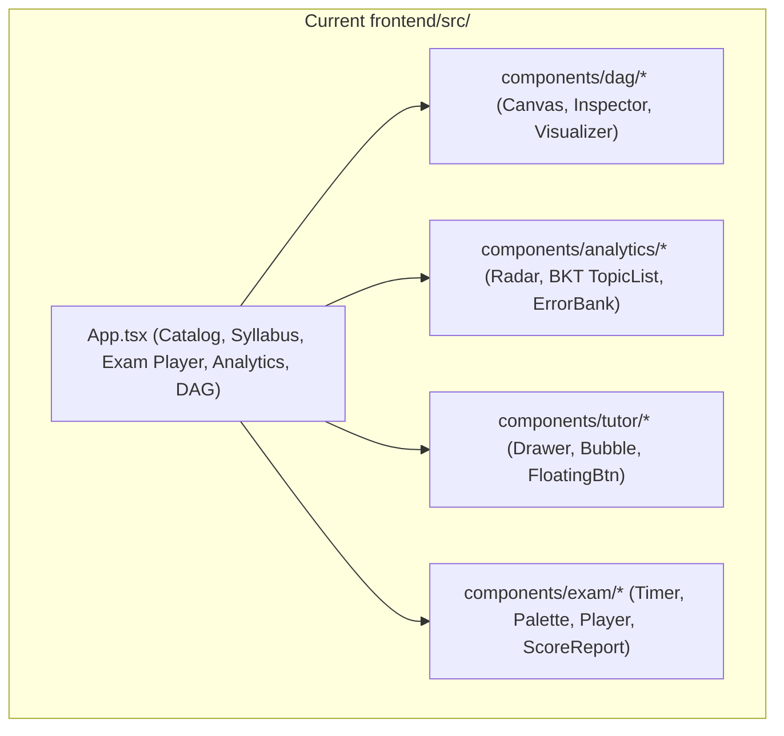
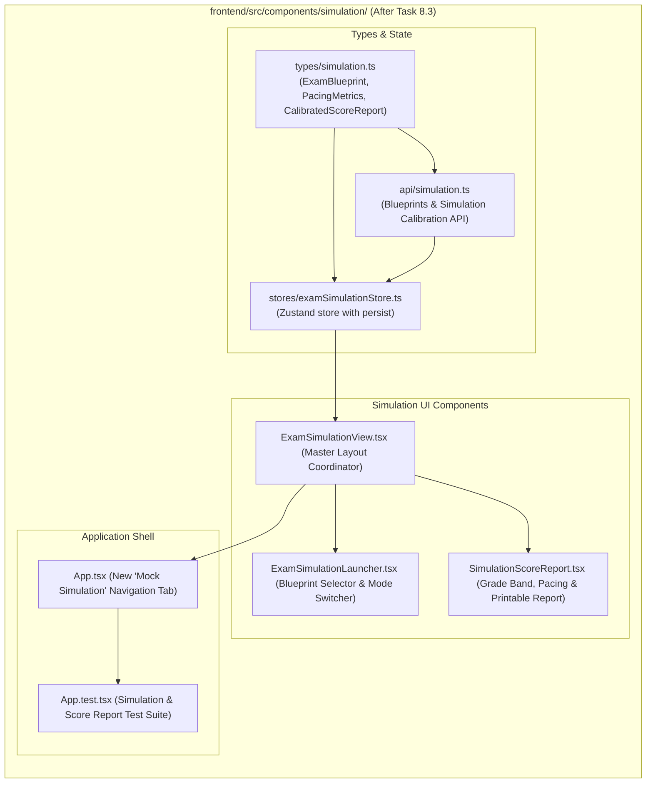

# Stage 2: Codebase Design Artifact
## Task 8.3: Exam Readiness Simulation & Score Report UI `[FRONTEND]`

**Task ID:** Task 8.3  
**Track:** Frontend Track (React 18+ / TypeScript / Vite / Zustand / KaTeX / Printable Diagnostic View)  
**Epic:** Epic 8 — Full-Length Exam Simulation & Predictive Scoring  
**Accepted Decision Basis:** [ADR-008: Frontend Framework & UI Ecosystem](file:///c:/Users/Muhammad/OneDrive%20-%20Higher%20Education%20Commission/Desktop/AI%20Tutor/Feynman_tutorAI/docs/adr/ADR-008-frontend-framework-and-ui-stack.md), [DESIGN_SYSTEM_TYPOGRAPHY.md](file:///c:/Users/Muhammad/OneDrive%20-%20Higher%20Education%20Commission/Desktop/AI%20Tutor/Feynman_tutorAI/docs/frontend_design/DESIGN_SYSTEM_TYPOGRAPHY.md)

---

## 1. Current State Snapshot

Currently, `frontend/src/` features curriculum catalog/tree, live exam taking player (`ExamPlayer.tsx`), analytics dashboard (`AnalyticsDashboard.tsx`), Socratic drawer (`SocraticTutorDrawer.tsx`), and the interactive DAG visualizer (`DAGVisualizer.tsx`). There is no dedicated Full-Length Mock Exam Simulation Launcher or comprehensive Calibrated Readiness Score Report with pacing analytics and printable diagnostic export.



* **Verified Fact:** `frontend/` has passing Vitest suite (20 of 20 passed).
* **Verified Fact:** `frontend/` is 100% directory-isolated from `backend/`.

---

## 2. Proposed State

After Task 8.3 execution, `frontend/src/` will feature an **Exam Simulation & Predictive Score Subsystem** with a blueprint launcher, mode switcher, pacing telemetry, predictive grade band banner, and printable diagnostic score report.



---

## 3. File-Level Impact Analysis

All files are `[NEW]` or `[MODIFY]` strictly inside `frontend/` (0 touches to `backend/`).

### 3.1 Data Structures & State Management
#### [NEW] `frontend/src/types/simulation.ts`
* **Purpose:** TypeScript types defining exam simulation models:
  - `ExamBlueprint`: `{ id, title, examBoard, durationMinutes, totalQuestions, passingTarget, topicWeights: { topic, weightPercentage }[] }`
  - `SimulationMode`: `'proctored' | 'guided'`
  - `PacingMetrics`: `{ averageSecondsPerQuestion, targetSecondsPerQuestion, fastestQuestionSeconds, slowestQuestionSeconds, pacingStatus }`
  - `CalibratedScoreReport`: `{ id, examTitle, examBoard, rawScore, totalQuestions, percentage, predictedGradeBand, confidenceInterval, pacing, topicBreakdown, completionDate }`
  - `SimulationState`: Zustand store interface.

#### [NEW] `frontend/src/stores/examSimulationStore.ts`
* **Purpose:** Zustand store managing:
  - `activeBlueprint: ExamBlueprint`
  - `simulationMode: SimulationMode`
  - `activeScoreReport: CalibratedScoreReport | null`
  - `simulationHistory: CalibratedScoreReport[]`
  - **Actions:** `setBlueprint()`, `setSimulationMode()`, `setScoreReport()`, `resetSimulation()`.

#### [NEW] `frontend/src/api/simulation.ts`
* **Purpose:** API client providing official exam blueprint metadata:
  - Cambridge International A-Level Physics (9702 Paper 1: 40 MCQs, 60 mins, Mechanics 40%, Waves 30%, Electricity 30%).
  - AP Calculus BC (45 MCQs, 105 mins, Derivatives 35%, Integrals 35%, Series 30%).
  - Digital SAT Mathematics (44 Questions, 70 mins, Algebra 35%, Advanced Math 35%, Geometry/Trig 30%).
  - Calibrated diagnostic score report generator.

---

### 3.2 UI Components
#### [NEW] `frontend/src/components/simulation/ExamSimulationLauncher.tsx`
* **Purpose:** Blueprint selection cards, simulation mode toggle (*Strict Proctored Mock vs Adaptive Guided Mode*), topic weighting progress bars, and past simulation attempts summary.

#### [NEW] `frontend/src/components/simulation/SimulationScoreReport.tsx`
* **Purpose:** High-fidelity score report:
  - Predicted Grade Band Banner (**A\*** / **5**) with confidence intervals.
  - Pacing Telemetry Card (Average time/question vs benchmark).
  - Topic Competency breakdown bars with KaTeX derivations.
  - Print / Export PDF button invoking `window.print()` with `@media print` styling.

#### [NEW] `frontend/src/components/simulation/ExamSimulationView.tsx`
* **Purpose:** Master coordinator rendering either the launcher or the diagnostic score report.

---

### 3.3 Root App & Tests
#### [MODIFY] `frontend/src/App.tsx`
* **Purpose:** Add **"Mock Simulation"** tab to desktop header switcher and mobile nav.

#### [MODIFY] `frontend/src/App.test.tsx`
* **Purpose:** Vitest test suite verifying:
  - Mock Simulation tab navigation.
  - Selecting an exam blueprint.
  - Viewing simulation score report with grade band and pacing analytics.
  - Triggering print export.

---

## 4. Dependency Graph / Blast Radius

```mermaid
graph TD
    subgraph SimulationSubsystem ["frontend/src/components/simulation/ (Isolated)"]
        Types[types/simulation.ts] --> Store[stores/examSimulationStore.ts]
        Types --> API[api/simulation.ts]
        Store --> Launcher[ExamSimulationLauncher.tsx]
        Store --> Report[SimulationScoreReport.tsx]
        Launcher --> View[ExamSimulationView.tsx]
        Report --> View
        View --> App[App.tsx]
        App --> Tests[App.test.tsx]
    end

    subgraph BackendAPI ["backend/ (Directory Isolation)"]
        BackendSim["/api/v1/exams/simulate"]
    end

    SimulationSubsystem -.->|Zero Cross-Track Impact (Isolated)| BackendAPI
```

---

## 5. Regression Risk Matrix

| Risk ID | Risk Description | Severity | Affected Area | Mitigation Strategy |
| :--- | :--- | :---: | :--- | :--- |
| **R-01** | `window.print()` crashing in test environments | 🟢 Low | Score Report | Guard `window.print` with optional check before calling in JSDOM. |
| **R-02** | LocalStorage state corruption | 🟢 Low | Store Hydration | Zustand `persist` middleware with fallback defaults. |

---

## 6. Rollback Plan

```powershell
git checkout -- frontend/src/
Remove-Item -Recurse -Force frontend/src/components/simulation/
Remove-Item -Force frontend/src/stores/examSimulationStore.ts
Remove-Item -Force frontend/src/types/simulation.ts
Remove-Item -Force frontend/src/api/simulation.ts
```
Estimated rollback time: < 1 minute.
