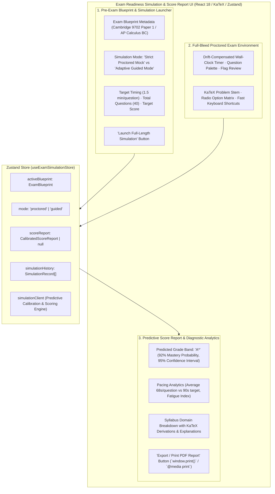
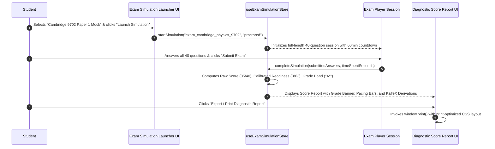

# Stage 1: Conceptual Understanding Artifact
## Task 8.3: Exam Readiness Simulation & Score Report UI `[FRONTEND]`

**Task ID:** Task 8.3  
**Track:** Frontend Track (React 18+ / TypeScript / Vite / Zustand / KaTeX / Printable Diagnostic Report)  
**Epic:** Epic 8 — Full-Length Exam Simulation & Predictive Scoring  
**Accepted Decision Basis:** [ADR-008: Frontend Framework & UI Ecosystem](file:///c:/Users/Muhammad/OneDrive%20-%20Higher%20Education%20Commission/Desktop/AI%20Tutor/Feynman_tutorAI/docs/adr/ADR-008-frontend-framework-and-ui-stack.md), [DESIGN_SYSTEM_TYPOGRAPHY.md](file:///c:/Users/Muhammad/OneDrive%20-%20Higher%20Education%20Commission/Desktop/AI%20Tutor/Feynman_tutorAI/docs/frontend_design/DESIGN_SYSTEM_TYPOGRAPHY.md)

---

## 1. Visual Architecture

---

## 2. The Physical Analogy

> Think of the **Exam Readiness Simulation** like an **Aviation Flight Simulator & Pre-Flight Certification Run**.
> 1. Practicing individual physics formulas is like testing flaps and rudders on the hangar floor. But passing a high-stakes Cambridge or AP exam requires a full cockpit flight simulation under authentic wind, instrument failures, and strict fuel countdowns.
> 2. The simulator puts you in the cockpit with a drift-compensated timer, realistic question distribution, and strict test conditions.
> 3. Once you land, the Flight Telemetry Computer (Predictive Score Engine) prints a comprehensive flight log: your exact altitude accuracy in each zone (**Mechanics vs Waves**), your reaction time per maneuver (**pacing analysis**), and issues an official **Airworthiness Certificate** (**A\* / 5 Predicted Grade Band**).

---

## 3. Why & What

### Why are we doing this task?
1. **Realistic High-Stakes Exam Conditions (PRD Cap 8, FR-001, FR-004, FR-025):** Students frequently fail exams not because of a lack of knowledge, but due to poor pacing, fatigue, and unfamiliarity with official blueprint weightings.
2. **Calibrated Predictive Scoring (FR-010, NFR-008):** Students need explainable grade predictions (**A\*** on Cambridge, **5** on AP) calculated via Bayesian Knowledge Tracing with confidence intervals.
3. **Printable Diagnostic Score Reports:** Students, tutors, and teachers need a clean, printable PDF report summarizing strengths, weaknesses, and remediation roadmaps.

### What is the concept?
An end-to-end **Exam Simulation & Predictive Score System** featuring:
- **Simulation Launcher:** Configure blueprint weighting, select simulation mode (*Strict Proctored Mock* vs *Adaptive Guided Mode*), and view historical simulation attempts.
- **Active Proctored Player:** Seamless integration with timed question solving and anti-cheat drift checks.
- **Comprehensive Score Report:**
  - Calibrated Grade Band (**A\*** / **5**) with confidence intervals.
  - Itemized Pacing & Time-Spent Analytics (Average time/question vs benchmark).
  - Topic Competency Progress Bars with KaTeX derivations.
  - PDF / Print Ready stylesheet (`@media print`).

### What breaks if we skip this?
- Students have no way to test their endurance or pacing under full exam conditions.
- The platform lacks predictive exam score certification.

---

## 4. Abstraction Level Map

| Level | What Lives Here | Current Project Example | Touched by Task 8.3? |
| :--- | :--- | :--- | :---: |
| **Product / UX** | Simulation Launcher Tab, Pacing Analytics, Printable Score Report | New `Exam Simulation` Tab in App shell | 🔵 **PRIMARY FOCUS** |
| **Application** | Simulation Store, Predictive Grade Band Mapper, Pacing Calculator | `src/stores/examSimulationStore.ts`, `src/components/simulation/` | 🔵 **PRIMARY FOCUS** |
| **Framework** | `@media print` CSS, KaTeX Math rendering, Lucide icons | `ExamSimulationLauncher.tsx`, `SimulationScoreReport.tsx` | 🔵 **PRIMARY FOCUS** |
| **Library** | `zustand`, `lucide-react`, `katex`, Tailwind CSS | `@/components/ui/card`, `LaTeXRenderer` | 🔵 Used heavily |
| **Runtime** | `window.print()`, `performance.now()` wall-clock timing | Pacing drift calculation | 🔵 Native performance |
| **Infrastructure** | Backend Exam Simulation & Calibration Engine | `/api/v1/exams/simulate` | ⚪ Backend Contract |

---

## 5. Sequence Diagrams

### Diagram 1: Full Simulation & Score Report Generation Flow

---

## 6. Cognitive Model → Code Mapping

| Cognitive Stage | Mental Model | Code Concept in Feynman Frontend | Concrete Guardrail |
| :--- | :--- | :--- | :--- |
| **1. Exam Preparation** | "What is the structure of the exam I'm taking?" | `ExamBlueprint` metadata card | Shows topic weights & duration |
| **2. Timed Simulation** | "Am I pacing myself fast enough to finish?" | `PacingAnalytics` indicator | Alerts if pacing > 90s/question |
| **3. Diagnostic Feedback** | "What grade would I get if this were the real test?" | `CalibratedScoreReport` with Grade Band | Calibrated BKT grade prediction |
| **4. Archival & Sharing** | "I want a physical copy to review with my tutor." | `@media print` stylesheet | High-contrast printable PDF layout |

---

## 7. Five Alternative Approaches Evaluated

| # | Approach | Pros | Cons | Verdict |
|:---|:---|:---|:---|:---|
| **1** | **Native React 18 + Zustand + CSS Print Media + KaTeX (Approved)** | 0KB extra bundle weight, instant print via `window.print()`, full STEM math fidelity | Requires dedicated `@media print` CSS rules | ✅ **RECOMMENDED (ADR-008)** |
| **2** | **Heavy Client-Side PDF Generator (jsPDF / pdfmake)** | Standalone PDF file generation | Adds 300KB+ bundle weight, breaks KaTeX CSS fonts | ❌ Too heavy & font issues |
| **3** | **Backend PDF Generation (Weasyprint / Chromium)** | Exact server rendering | Requires backend roundtrip and headless browser | ❌ Unnecessary server load |
| **4** | **Raw HTML Screenshot / Canvas Export (html2canvas)** | Simple image export | Blurry text on high-DPI prints, non-selectable text | ❌ Poor print quality |
| **5** | **Basic Modal Popup Only** | Quick to build | Not printable, lacks pacing analytics | ❌ Fails PRD Cap 8 |

---

## 8. Production Rationale & Disaster Scenarios

### Why This Is Standard:
Premier standardized test prep platforms (CollegeBoard Bluebook, UWorld, Khan Academy SAT) provide full-length timed diagnostic simulations with pacing breakdowns and printable diagnostic reports.
