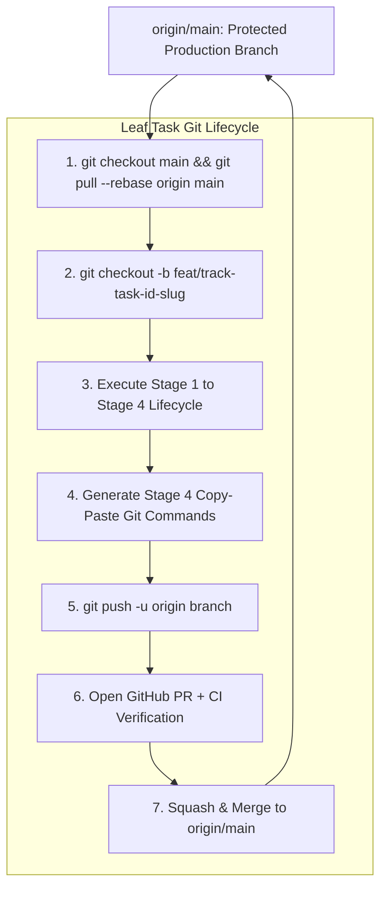
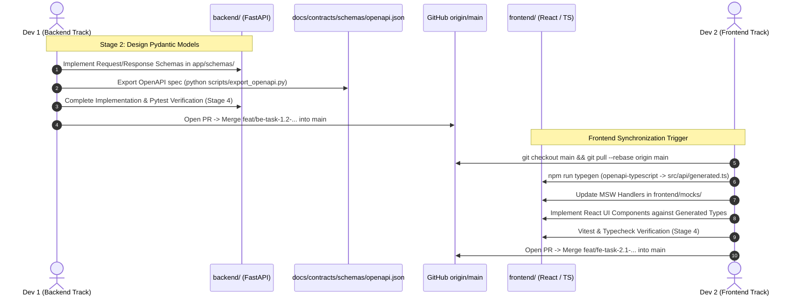

# Rule 06: Git and GitHub Collaboration Protocol

This rule governs all version control and GitHub collaboration operations for the AI-Powered Adaptive Exam Learning Platform. It ensures seamless, collision-free synchronization between **Developer 1 (Backend Track - FastAPI/Python)** and **Developer 2 (Frontend Track - React/TypeScript)**, enforcing branch isolation, task traceability, contract-first synchronization, and zero-defect git hygiene.

---

## 1. Non-Negotiable Git Rules

Every AI agent and human engineer working on this repository MUST strictly adhere to the following six non-negotiable Git rules. Any violation immediately invalidates the active task stage and triggers the Incident Protocol.



### Rule 1: Never Commit Directly to `main`
- The `main` branch is strictly protected and represents deployable, verified production state.
- Direct pushes and direct commits to `main` are technically forbidden.
- All code changes MUST originate from a dedicated task branch and merge to `main` strictly via an approved GitHub Pull Request.

### Rule 2: Branch per WBS Leaf Task
- Every Git branch must map 1:1 to an active leaf task in `.agents/state/roadmap_wbs.md`.
- Branches are short-lived by design (target lifetime: 30 to 90 minutes of active development).
- Do NOT create "mega-branches", "epic branches", or multi-task branches. One task = One branch = One Pull Request.

### Rule 3: Always Rebase Before Starting Work
- Before branching off `main`, the developer must ensure local `main` is up-to-date:
  ```bash
  git checkout main
  git pull --rebase origin main
  ```
- If upstream `main` has advanced while working on a feature branch, rebase the feature branch onto `origin/main` before opening or updating a Pull Request:
  ```bash
  git fetch origin main
  git rebase origin/main
  ```

### Rule 4: Strict Directory and Track Isolation
- The repository is a monorepo partitioned into distinct ownership domains:
  - **Backend Track (`[BACKEND]`):** Modifies files exclusively within `backend/`, and updates task-specific state in `.agents/state/current_task.md` and `.agents/state/roadmap_wbs.md`. If creating/updating an API contract, exports schema to `docs/contracts/schemas/openapi.json`.
  - **Frontend Track (`[FRONTEND]`):** Modifies files exclusively within `frontend/`, and updates task-specific state in `.agents/state/current_task.md` and `.agents/state/roadmap_wbs.md`.
  - **Shared / Architecture Track (`[SHARED]`):** Modifies files in `docs/adr/`, `docs/*_design/`, `docs/contracts/`, and `.agents/state/decisions.md`.
- A feature branch for a backend task must NEVER contain modifications to `frontend/` source code, and a frontend feature branch must NEVER touch `backend/` source code.

### Rule 5: Mandatory Stage 4 Git Command Output
- At the conclusion of Stage 4 (Testing, Verification & Code Audit), the AI agent MUST output an exact, copy-pasteable bash/powershell code block containing all necessary Git commands to stage modified files, commit using the Conventional Commit format with task ID, and push the branch to GitHub.

### Rule 6: Clean Working Tree and Zero Committed Garbage
- The working tree must be clean before creating a branch.
- Never commit virtual environments (`.venv/`, `env/`), `node_modules/`, Python bytecode (`__pycache__/`, `*.pyc`), OS metadata (`.DS_Store`, `Thumbs.db`), IDE scratch folders (`.idea/`, `.vscode/`), `.env` secrets, or temporary logs.
- Avoid blind `git add .`. Always stage specific, targeted paths.

---

## 2. Branch Naming Standards

All branch names must be lowercase, kebab-case, and strictly adhere to the following naming conventions:

| Branch Type | Prefix Pattern | Naming Format | Example Branch Name | Scope / Track |
| :--- | :--- | :--- | :--- | :--- |
| **Backend Feature** | `feat/be-` | `feat/be-<task-id>-<short-slug>` | `feat/be-task-1.2-session-start-endpoint` | Backend API, Models, DB Services |
| **Frontend Feature** | `feat/fe-` | `feat/fe-<task-id>-<short-slug>` | `feat/fe-task-2.1-socratic-chat-ui` | React UI, Components, TanStack Query |
| **Shared Feature** | `feat/shared-` | `feat/shared-<task-id>-<short-slug>` | `feat/shared-task-0.3-auth-jwt-spec` | Cross-cutting features, Shared contracts |
| **Bugfix (Backend)** | `fix/be-` | `fix/be-<issue-id>-<short-slug>` | `fix/be-issue-004-jwt-scope-validation` | Backend defect identified in `issues.md` |
| **Bugfix (Frontend)** | `fix/fe-` | `fix/fe-<issue-id>-<short-slug>` | `fix/fe-issue-007-latex-rerender-loop` | Frontend defect identified in `issues.md` |
| **ADR / Architecture** | `docs/adr-` | `docs/adr-<number>-<short-slug>` | `docs/adr-001-primary-db-selection` | Formal Architecture Decision Records |
| **Documentation** | `docs/` | `docs/<track>-<task-id>-<short-slug>` | `docs/be-task-1.1-api-routing-spec` | Pure documentation updates |
| **Refactor / Chores** | `chore/` or `refactor/` | `<type>/<track>-<task-id>-<short-slug>` | `refactor/be-task-3.4-irt-math-optimizer` | Code refactoring without behavior change |

### Branch Naming Validation Rules
1. **Task ID Matching:** The `<task-id>` must match the leaf task ID from `.agents/state/roadmap_wbs.md` exactly (e.g., `task-1.2`, `task-0.4`).
2. **Issue ID Matching:** The `<issue-id>` must match the issue ID from `.agents/state/issues.md` exactly (e.g., `issue-004`).
3. **Slug Clarity:** The `<short-slug>` must be 2 to 5 words, kebab-case, describing the precise domain capability (e.g., `session-start-endpoint`, `misconception-graph-builder`).
4. **No Special Characters:** No underscores (`_`), slashes beyond prefix delimiters, uppercase letters, or punctuation.

---

## 3. Task-Based Commit Message Standards

Commit messages must follow the **Conventional Commits 1.0.0** specification, augmented with explicit **WBS Task ID** or **Issue ID** tagging in the header.

### Commit Message Structure

```text
<type>(<scope>): [Task-X.Y] <imperative short summary (under 72 chars)>

[Optional detailed body explaining:]
- WHY this change was necessary (business / architectural driver)
- WHAT was implemented (components, models, endpoints, schemas)
- PRD requirements addressed (e.g. PRD §13, FR-001, NFR-005)
- Non-negotiable constraints verified (e.g. isolated student state)

Verification:
- <exact test command executed> (e.g. pytest tests/unit/test_session.py -> 14 passed)
- <typecheck / lint command> (e.g. ruff check app/ && mypy app/ -> 0 errors)

PRD Ref: PRD §<section>, <FR-XXX>
```

### Commit Types and Allowed Scopes

- **Types:**
  - `feat`: A new feature or endpoint implementation.
  - `fix`: A bug fix (associated with an entry in `.agents/state/issues.md`).
  - `test`: Adding or updating test suites, fixtures, or benchmarks.
  - `docs`: Documentation, ADRs, DDRs, FDRs, AIDRs, SDRs, or README updates.
  - `refactor`: Code restructuring without functional or contract changes.
  - `chore`: Tooling, build scripts, linters, typegen, or dependency updates.
- **Backend Scopes:** `(api)`, `(models)`, `(services)`, `(db)`, `(workers)`, `(auth)`, `(rag)`, `(irt)`, `(state-machine)`.
- **Frontend Scopes:** `(ui)`, `(components)`, `(features)`, `(hooks)`, `(api-client)`, `(store)`, `(styles)`, `(mocks)`.
- **Shared Scopes:** `(contract)`, `(adr)`, `(wbs)`, `(config)`, `(deps)`.

### Concrete Commit Message Examples

#### Example 1: Backend Feature Implementation
```text
feat(api): [Task-1.2] implement session start endpoint with IRT state initialization

Add POST /api/v1/sessions/start route in FastAPI to initialize adaptive learning sessions.
Validates student exam enrollment, isolates student state per PRD Constraint 2,
and initializes baseline theta proficiency parameter via IRT engine.

Verification:
- pytest tests/unit/test_session_service.py tests/api/v1/test_sessions.py (18 passed in 0.42s)
- mypy app/api/v1/endpoints/sessions.py app/services/session_service.py (Success: no issues found)
- exported openapi.json to docs/contracts/schemas/openapi.json

PRD Ref: PRD §13, FR-001, FR-022, NFR-002
```

#### Example 2: Frontend Feature Implementation
```text
feat(ui): [Task-2.1] add Socratic Chat message stream component with KaTeX support

Implement SocraticChatView component consuming generated SessionStartResponse types.
Integrates TanStack Query hook `useStartSession` with MSW mock handlers for isolated
development without live backend dependency. Renders math formulas using KaTeX.

Verification:
- npm run test -- src/features/socratic-chat/SocraticChatView.test.tsx (8 passed)
- tsc --noEmit (0 errors)
- npm run lint (0 warnings)

PRD Ref: PRD §14, FR-002, FR-003, NFR-008
```

#### Example 3: Bugfix with Pluto RCA Resolution
```text
fix(auth): [Issue-004] enforce server-side RBAC scope validation on blueprint routes

Halt unauthorized access to exam blueprint generation routes by adding Depends(require_role('admin'))
dependency to POST /api/v1/exams/{id}/blueprints. Fixes vulnerability where client role claim
was trusted without cryptographic signature verification (PRD Constraint 6).

Verification:
- pytest tests/api/v1/test_blueprints_rbac.py (6 passed)
- verified 403 Forbidden returned for student token attempts

PRD Ref: PRD FR-021, NFR-005; Resolved Issue: ISSUE-004
```

#### Example 4: Architecture Decision Record (ADR)
```text
docs(adr): [ADR-001] adopt PostgreSQL and SQLModel for core relational learning state

Document decision to adopt PostgreSQL 16 with SQLModel (SQLAlchemy 2.0 core) as the
primary relational database. Outlines evaluation against SQLite and MongoDB, migration
strategy via Alembic, and multi-tenant schema isolation for student exam states.

Verification:
- Validated ADR format against docs/adr/ADR-PROMPT-TEMPLATE.md
- Updated docs/adr/ADR-INDEX.md status to ACCEPTED
- Updated .agents/state/decisions.md

PRD Ref: PRD §27.1, DDR-INDEX
```

---

## 4. Contract-First Synchronization Flow

The Contract-First synchronization protocol is the cornerstone of cross-track independence between Developer 1 (Backend) and Developer 2 (Frontend).



### Protocol Steps:
1. **Backend Schema Design (Stage 2):** Backend developer defines Pydantic V2 models for requests, responses, and error envelopes.
2. **Schema Export:** Backend runs `python scripts/export_openapi.py` to generate `docs/contracts/schemas/openapi.json`.
3. **Backend Merge:** Backend completes Stage 4 testing, opens PR, passes CI, and merges into `origin/main`.
4. **Frontend Pull & Typegen:** Frontend pulls updated `main` and executes `npm run typegen`. TypeScript interfaces are generated automatically into `frontend/src/api/generated.ts`.
5. **Zero-Blocking Mocking:** Frontend builds UI against MSW mocks conforming to the generated types without waiting for backend staging deployment.
6. **Live Integration Verification:** Once both branches merge, integration tests verify end-to-end compatibility against live local server.

---

## 5. Stage 4 Completion Output Format

At the end of **Stage 4 (Testing & Verification)**, the AI agent is **MANDATED** to output a dedicated, copy-pasteable terminal block. The human developer copies and runs this block directly in PowerShell / Bash.

### Format Template:

```markdown
### 🚀 Stage 4 Verification Complete — Ready for Git Commit

All tests, type checks, and quality audits have passed. Execute the following commands to commit and push your changes:

```powershell
# 1. Verify working directory status
git status

# 2. Stage modified files explicitly (Directory Isolation)
git add <path/to/source_file_1> <path/to/source_file_2>
git add <path/to/test_file_1>
git add .agents/state/current_task.md .agents/state/roadmap_wbs.md
# (If backend contract updated): git add docs/contracts/schemas/openapi.json

# 3. Commit with Conventional Commit format and WBS Task ID
git commit -m "<type>(<scope>): [<TASK-ID>] <concise summary>" -m "<detailed description of changes and constraints satisfied>" -m "Verification: <test command executed> -> PASS" -m "PRD Ref: PRD §<section>, <FR-ID>"

# 4. Push feature branch to GitHub
git push -u origin <branch-name>
```

> **Next Step:** Open a Pull Request on GitHub from `<branch-name>` targeting `main`. Ensure all automated CI checks pass before requesting squash & merge.
```

---

## 6. Anti-Patterns and Prohibited Actions

The following anti-patterns represent severe violations of project protocol:

| Anti-Pattern | Description | Why It Is Prohibited | Correct Remediation |
| :--- | :--- | :--- | :--- |
| **Direct Push to `main`** | Pushing commits directly to `main` branch. | Bypasses CI, peer review, and breaks production stability. | Revert commit, branch off main, open PR. |
| **Silent Contract Mutation** | Modifying FastAPI endpoint schema without exporting `openapi.json`. | Silently breaks frontend typegen and causes runtime type crashes. | Run export script, update `docs/contracts/`, notify Frontend track. |
| **Mega-Branching** | Bundling multiple WBS leaf tasks into one long-lived branch. | High merge conflict risk, unreviewable PRs, stalled velocity. | Split into short-lived atomic branches (1 task = 1 branch). |
| **Committing Secrets / Junk** | Adding `.env`, API keys, `__pycache__`, or `node_modules`. | Security vulnerability, repository bloat, CI failures. | Check `.gitignore`, revoke leaked keys immediately, clean git cache. |
| **Cross-Track File Contamination** | Backend branch modifying frontend UI or vice versa. | Destroys track isolation and triggers massive git merge conflicts. | Keep modifications strictly within track directory (`backend/` or `frontend/`). |
| **Commit Without Verification** | Staging code before running pytest / tsc / linters in Stage 4. | Introduces broken code and triggers Terminal Error Lock. | Run full test suite; stage only after 100% green verification. |
| **Bypassing Terminal Error Lock** | Attempting git commit while an active error exists in `issues.md`. | Violates Rule 05; leaves latent bugs in production code. | Resolve bug via Narrsistic Pluto RCA before committing. |
