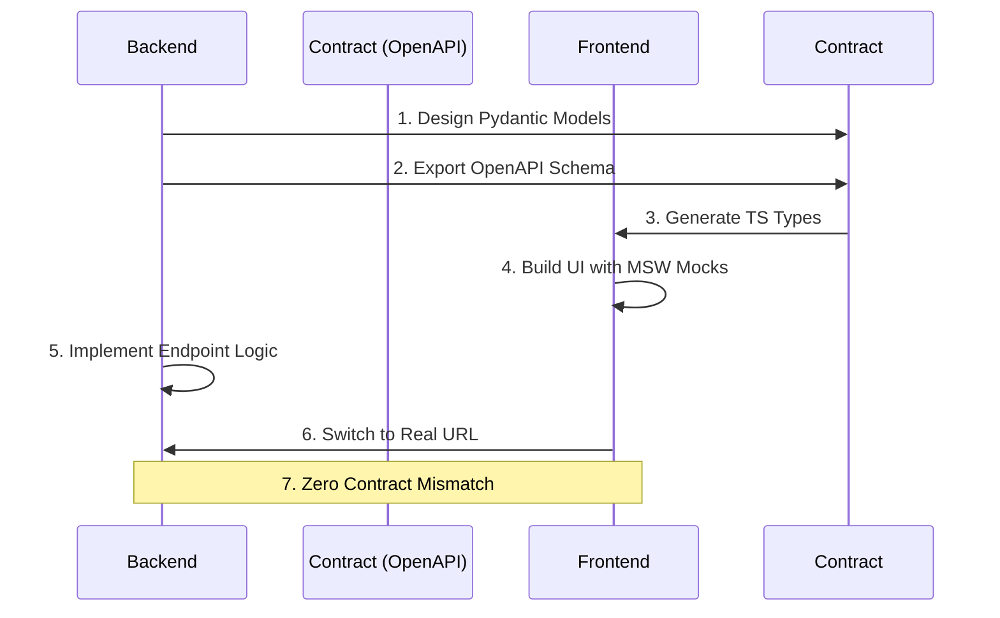

# Contract-First Development Protocol
## AI Adaptive Exam Learning Platform

This document outlines the Contract-First Development Protocol, the central mechanism by which the Backend and Frontend tracks stay synchronized in this 2-person team environment.

### 1. What is Contract-First Development?
Contract-First Development is an architectural methodology where the API contract (in our case, the OpenAPI specification) is designed, agreed upon, and generated *before* any functional code is implemented on either the backend or the frontend. The contract serves as the ultimate source of truth.

### 2. Why it Matters for a 2-Person Team
In a two-person team where one developer focuses on the backend and another on the frontend, blocking dependencies are the primary bottleneck.
- If the frontend developer waits for the backend developer to finish an endpoint before starting the UI, time is wasted.
- If the backend developer builds an endpoint without frontend input, the UI might need different data shapes.
Contract-First development eliminates these blocking dependencies. Once the contract is written, both developers can work in parallel. The frontend developer mocks the contract, and the backend developer implements the contract. 

### 3. The Contract-First Flow

The standard flow for any new feature requiring client-server communication is as follows:

1. **Backend designs API endpoint in Stage 2 (Pydantic models)**: The backend developer creates the Pydantic models for the request and response payloads.
2. **Backend publishes OpenAPI schema**: FastAPI automatically generates an OpenAPI JSON/YAML schema from the Pydantic models. This schema is exported to `docs/contracts/schemas/`.
3. **Frontend generates TypeScript types**: The frontend developer uses a tool like `openapi-typescript` to generate strict TypeScript interfaces from the published OpenAPI schema.
4. **Frontend builds UI against generated types + mock data**: The frontend developer sets up Mock Service Worker (MSW) or static JSON fixtures that adhere *strictly* to the generated TypeScript types.
5. **Backend implements endpoint**: The backend developer implements the actual logic, DB queries, and LLM calls.
6. **Integration**: When the backend endpoint is deployed/live locally, the frontend developer simply switches off the MSW mock and hits the real URL.
7. **Zero Mismatch**: Because both sides are bound by the same OpenAPI schema (FastAPI via Pydantic on the backend, TypeScript types on the frontend), there is zero contract mismatch.

### 4. Mermaid Diagram of the Flow



### 5. Contract Change Protocol

Contracts are not set in stone, but changing them requires discipline.

#### The Golden Rule
**Backend MUST NOT silently change request/response shapes after publishing a contract.**

#### Handling Breaking Changes
If a breaking change is required (e.g., renaming a field, changing a type, removing a property):
1. **Notification**: The backend developer must explicitly notify the frontend developer of the impending change.
2. **Stage 2 Update**: The backend developer must update the Pydantic models and the OpenAPI schema in `docs/contracts/schemas/`.
3. **Type Regeneration**: The frontend developer must regenerate the TypeScript types and fix any type errors that arise in the UI code.
4. **Mock Update**: The frontend developer must update the MSW mocks or JSON fixtures to reflect the new contract.

### 6. Shared Locations and Tooling

#### Shared Schemas Location
All authoritative API contracts must be stored in:
`docs/contracts/schemas/`

#### Mock Data Fixtures Location
All frontend mock data and MSW handlers must be stored in:
`frontend/mocks/`

#### Type Generation Commands
The frontend developer should use the following command (or similar) to generate types:

```bash
# Generate types from a local OpenAPI schema
npx openapi-typescript ../docs/contracts/schemas/openapi.json -o src/api/types/generated.ts
```

```bash
# Generate types from a live local FastAPI server
npx openapi-typescript http://localhost:8000/openapi.json -o src/api/types/generated.ts
```

### 7. Testing the Contract

To ensure contracts are honored:
- **Backend**: FastAPI automatically validates request and response payloads against the Pydantic models. Invalid requests return 422 Unprocessable Entity.
- **Frontend**: TypeScript compilation fails if the code does not match the generated types. MSW intercepts network requests and can validate payloads in development.

### 8. Handling Websockets and SSE
For real-time features (like LLM token streaming), the contract might not be standard OpenAPI. In these cases:
- Define the event payloads (e.g., `TokenDeltaEvent`, `StreamCompleteEvent`) in a shared schema file or standard JSON Schema format.
- Both sides must still strictly adhere to these definitions.

### 9. Versioning
When the platform is in production, any breaking changes must be versioned (e.g., `/api/v1/` vs `/api/v2/`). During development (Stage 0-2), breaking changes can be made in place as long as the change protocol is followed.

### 10. Conclusion
Adhering to this protocol is non-negotiable. It is the primary defense against integration bugs, which are the most time-consuming bugs to fix in a distributed system.
