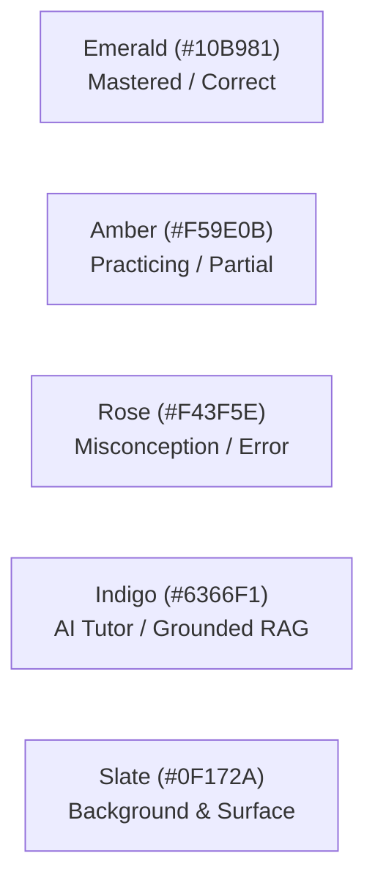

# Frontend Design System & Typography Specification
## AI-Powered Adaptive Exam Learning Platform

**Document Version:** 1.0  
**Target Audience:** Frontend Developers, UI/UX Engineers, Full-Stack Contributors  
**Benchmarks:** Brilliant.org (interactive problem-solving), Khan Academy (mastery indicators & pedagogical clarity), Quizlet (spaced repetition cards)

---

## 1. Design Philosophy: "Invisible Interface for Deep Focus"

An adaptive exam learning platform is a cognitive workspace. Unlike social media or e-commerce apps, the interface must minimize extraneous cognitive load so the student's working memory is 100% focused on understanding concepts and solving problems.

### Core Principles
1. **Pedagogical Hierarchy:** Typography, whitespace, and color must guide the student's eyes from question stem → diagrams/equations → input/options → pedagogical feedback.
2. **Distraction-Free Focus:** High-stakes exam modes hide extraneous navigation, sidebars, and notifications.
3. **Mastery-Aware Color Coding:** Color is never purely decorative; it communicates cognitive state (Mastered, In Progress, Misconception Identified, Prerequisite Needed).
4. **First-Class Mathematics & Code:** Formulas and code snippets are first-class typography elements, rendered crisply with LaTeX (KaTeX) and monospace syntax highlighting.

---

## 2. Typography System

| Role | Font Family | Fallbacks | Weight / Style | Purpose / Usage |
| :--- | :--- | :--- | :--- | :--- |
| **Primary UI & Headings** | **Geist Sans** or **Inter** | `system-ui, -apple-system, sans-serif` | 400 (Regular), 500 (Medium), 600 (SemiBold), 700 (Bold) | Clean, geometric sans-serif for dashboard, buttons, headings, navigation, and feedback. |
| **Question Body & Explanations** | **Inter** or **Plus Jakarta Sans** | `sans-serif` | 400 (Regular), Line-height: 1.65 | Optimized for long-form reading, high legibility across mobile & desktop. |
| **Math & Physics Formulas** | **KaTeX / Computer Modern** | `Times New Roman, serif` | Normal / Italic equations | Strict rendering of LaTeX mathematical notation, calculus, chemical formulas, and matrices. |
| **Code & Technical Notation** | **JetBrains Mono** or **Geist Mono** | `Consolas, Menlo, monospace` | 400 (Regular), 600 (Bold) | Programming syntax, variable names, algorithmic code blocks. |

### Type Scale & Rhythm (Tailwind CSS Tokens)

```css
/* Typography Scale */
--text-xs:    0.75rem;  /* 12px - Badges, metadata, timestamp */
--text-sm:    0.875rem; /* 14px - Secondary text, tooltips, option letters */
--text-base:  1.00rem;  /* 16px - Standard UI, input fields, button labels */
--text-lg:    1.125rem; /* 18px - Question stems, core reading body */
--text-xl:    1.25rem;  /* 20px - Sub-section headings, card titles */
--text-2xl:   1.50rem;  /* 24px - Topic headers, modal titles */
--text-3xl:   1.875rem; /* 30px - Page titles, score displays */
--text-4xl:   2.25rem;  /* 36px - Exam completion heroes, mastery badges */
```

* **Line Length Constraint:** Reading containers for explanations and tutor responses are capped at `max-w-prose` (65–75 characters) to prevent eye fatigue.
* **Line Spacing (Leading):** Body text uses `leading-relaxed` (1.625) for high legibility during intensive problem solving.

---

## 3. Color Palette & Semantic Tokens

Our color system enforces strict semantic clarity across dark and light modes:



| Token | Light Mode | Dark Mode | Semantic Meaning |
| :--- | :--- | :--- | :--- |
| `mastery-high` | `#059669` (Emerald 600) | `#34D399` (Emerald 400) | Score ≥ 85%, Topic Mastered, Verified Correct |
| `mastery-medium` | `#D97706` (Amber 600) | `#FBBF24` (Amber 400) | Score 60–84%, Developing, Review Scheduled |
| `mastery-low` | `#E11D48` (Rose 600) | `#FB7185` (Rose 400) | Score < 60%, Misconception Identified, Prerequisite Gap |
| `tutor-accent` | `#4F46E5` (Indigo 600) | `#818CF8` (Indigo 400) | Socratic Tutor prompt, RAG source citations, active dialogue |
| `surface-canvas` | `#F8FAFC` (Slate 50) | `#0B0F17` (Deep Dark) | App background |
| `surface-card` | `#FFFFFF` (White) | `#131B2A` (Elevated Navy) | Question card, interactive drawer, dialog |
| `border-subtle` | `#E2E8F0` (Slate 200) | `#1E293B` (Slate 800) | Card borders, dividers, option outlines |

---

## 4. Key UI Screen Paradigms

### Screen 1: The Distraction-Free Exam Player
* **Top Navigation:** Minimalist header with Exam Name, Live Countdown Timer (color changes to Amber at 5m, Red at 1m), Question Grid Drawer toggle, and "Submit Exam" button.
* **Split-Pane Layout (Desktop):**
  * **Left Pane (60%):** Question Stem (formatted with rich markdown + KaTeX equations + responsive diagram zoom).
  * **Right Pane (40%):** Interactive Answer Selector (Multi-choice radio cards with keyboard shortcuts `1-4` or `A-D`, Numerical inputs, or Multi-select checkboxes), Scratchpad toggle, and "Flag for Review" button.
* **Bottom Bar:** Previous / Next question navigation with progress indicator (`Question 14 of 45`).

### Screen 2: Socratic Tutor & Grounded Explanation Drawer
* **Slide-over Right Drawer:** Opens without leaving the current exam or topic view.
* **Streaming Dialogue:** Real-time token streaming via Server-Sent Events (SSE).
* **Collapsible Thought / Reasoning Section:** Shows why the tutor chose this pedagogical question.
* **Grounding Citations:** Clickable badges linking to authoritative textbook excerpts and syllabus objectives (`[Source: Cambridge Physics §4.2, p. 112]`).

### Screen 3: Interactive Knowledge Map & Misconception Graph
* **Canvas Component:** Built with **React Flow (`@xyflow/react`)**.
* **Node Visualization:** Nodes represent topics/concepts colored by mastery percentage. Directed edges show prerequisites.
* **Misconception Highlights:** Pulsing nodes indicate active errors requiring remediation before unlocking subsequent topics.

---

## 5. Component Library & Tooling Stack

* **UI Base:** [Shadcn UI](https://ui.shadcn.com/) (Radix UI unstyled primitives + Tailwind CSS).
* **Icons:** [Lucide React](https://lucide.dev/) (consistent stroke width, clean geometric lines).
* **Math Equations:** `katex` + `react-katex` (zero layout shift, pre-rendered math HTML).
* **Code Highlighting:** `shiki` or `prismjs` for syntax highlighting in computer science questions.
* **Graphs & Maps:** `@xyflow/react` (React Flow) for interactive graph rendering.
* **Animations:** `framer-motion` for subtle, physics-based modal and drawer transitions (respecting `prefers-reduced-motion`).
