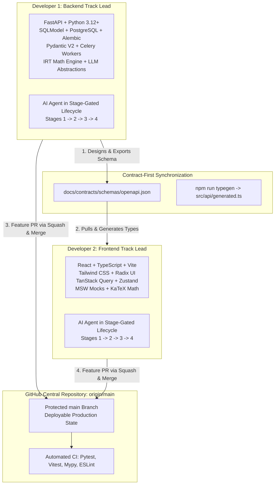
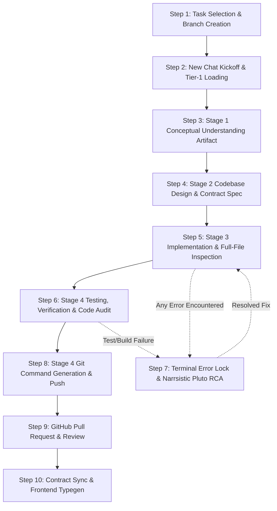
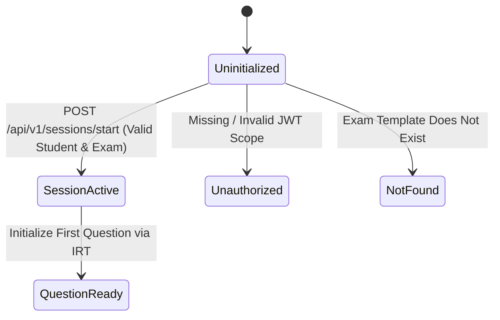

# The Master Agentic GitHub Workflow Guide
## AI-Powered Adaptive Exam Learning Platform

This document is the definitive end-to-end operational guide uniting the **Agentic Development Lifecycle (Stages 0–4 & Narrsistic Pluto)** with **Git and GitHub Collaboration** for the 2-developer team.

---

## 1. Architecture Overview: The 2-Developer Agentic Harmony

The AI-Powered Adaptive Exam Learning Platform is engineered by a dedicated two-developer team working in parallel tracks within a single unified monorepo.



### Team Division of Responsibilities

| Role / Track | Developer | Primary Technology Stack | Domain Boundaries & Ownership |
| :--- | :--- | :--- | :--- |
| **Backend Lead** | Developer 1 | FastAPI, Python 3.12+, SQLModel, PostgreSQL, Alembic, Pydantic V2, Celery, RAG & IRT pipelines | `backend/`, `docs/contracts/schemas/`, `docs/data_design/`, `docs/ai_design/`, `docs/system_design/` |
| **Frontend Lead** | Developer 2 | React, TypeScript, Vite, Tailwind CSS, TanStack Query, Zustand, MSW, KaTeX, Lucide Icons | `frontend/`, `docs/frontend_design/`, mock fixtures, client UI state machines |
| **Shared Collaboration** | Both Devs | Markdown, Mermaid, Git, GitHub Actions, ADR Registry | `.agents/`, `docs/adr/`, `docs/team/`, `AI_Adaptive_Exam_Learning_Platform_PRD_SRS.md` |

### Core Tenets of the Harmony
1. **Contract-First Independence:** Backend developers design and export OpenAPI schemas first. Frontend developers generate TypeScript types and build against Mock Service Worker (MSW) handlers without blocking on backend completion.
2. **Stage-Gated Agent Discipline:** Neither developer writes raw code ad-hoc. All work proceeds through Stage 1 (Understanding), Stage 2 (Design), Stage 3 (Implementation), and Stage 4 (Verification).
3. **Protected Main Branch:** All integration occurs via GitHub Pull Requests with strict automated CI gates. Direct commits to `main` are prohibited.

---

## 2. The Complete 10-Step End-to-End Flow from Task to Merged PR

Every WBS leaf task follows this exact 10-step lifecycle from inception to merged production code:



---

### Step 1: Task Selection & Branch Creation
1. Consult `.agents/state/roadmap_wbs.md` to identify the next unblocked leaf task assigned to your track (`[BACKEND]` or `[FRONTEND]`).
2. Update local `main` branch:
   ```bash
   git checkout main
   git pull --rebase origin main
   ```
3. Create a dedicated task branch using Rule 06 naming conventions:
   ```bash
   # For Backend:
   git checkout -b feat/be-task-1.2-session-start-endpoint
   # For Frontend:
   git checkout -b feat/fe-task-2.1-socratic-chat-ui
   ```
4. Update `.agents/state/current_task.md` with the active Task ID, Epic, and Status (`IN_PROGRESS`).

---

### Step 2: New Chat Kickoff
1. Open a **brand new chat session** in your AI agent environment.
2. Paste the role-specific Kickoff Prompt from `docs/team/SESSION-KICKOFF-PROMPTS.md` (Prompt 1 for Backend, Prompt 2 for Frontend).
3. The prompt automatically initializes **Tier 1 Context**:
   - `AGENTS.md` and `GEMINI.md`
   - `.agents/rules/01-non-negotiable-constraints.md`
   - `.agents/state/current_task.md`
   - `.agents/state/decisions.md`

---

### Step 3: Stage 1 Conceptual Understanding Artifact
1. The agent loads the Stage 1 skill (`.agents/skills/conceptual-understanding/SKILL.md`).
2. The agent generates the Stage 1 artifact: `task_<task_id>_understanding.md`.
3. The artifact articulates:
   - The core mental model and physical analogy.
   - Complete state transition diagrams (Mermaid).
   - PRD constraint alignment (e.g. Constraint 2: Student state isolation per PRD §5.2).
   - Edge case analysis and security boundaries.
4. **Gate Review:** The developer reviews and approves the Stage 1 artifact before moving forward.

---

### Step 4: Stage 2 Codebase Design & Contract Specification
1. The agent loads the Stage 2 skill (`.agents/skills/codebase-design/SKILL.md`).
2. The agent analyzes existing code and generates the Stage 2 artifact: `task_<task_id>_design.md`.
3. The artifact details:
   - File-by-file impact analysis (`[NEW]`, `[MODIFY]`, `[DELETE]`).
   - Exact Pydantic V2 models for requests, responses, and error envelopes.
   - Database schema changes and draft Alembic migration steps (if backend).
   - Component hierarchy, props interfaces, and MSW mock structures (if frontend).
   - **Contract Export (Backend):** The backend agent exports updated OpenAPI schemas to `docs/contracts/schemas/openapi.json`.
4. **Gate Review:** The developer reviews and approves the Stage 2 design. **No application code is written until Stage 2 is approved.**

---

### Step 5: Stage 3 Implementation & Full-File Inspection
1. The agent writes application code strictly conforming to the approved Stage 2 design.
2. **Full-File Inspection Mandate:** Before editing any existing file, the agent reads the complete file from disk using `view_file` to understand imports, types, and scope.
3. **Zero Silent Dependencies:** The agent is strictly forbidden from adding any new `pip` or `npm` package without an accepted ADR in `docs/adr/`.
4. **Provider Abstraction:** Any LLM, vector search, or database logic is isolated behind service abstractions (PRD Constraint 10).

---

### Step 6: Stage 4 Testing, Verification & Code Audit
1. The agent loads the Stage 4 skill (`.agents/skills/testing-verification/SKILL.md`).
2. The agent writes comprehensive automated tests:
   - **Backend:** Pytest unit and integration tests (`tests/unit/`, `tests/api/v1/`) testing success, validation failures, and authorization boundaries.
   - **Frontend:** Vitest component tests, MSW mock integration tests, accessibility checks.
3. The agent executes verification commands in the terminal:
   - Backend: `pytest --cov=app tests/` and `mypy app/` and `ruff check app/`
   - Frontend: `npm run test` and `npm run build` and `tsc --noEmit`
4. The agent generates the Stage 4 artifact: `task_<task_id>_testing.md` documenting executed commands, outputs, and proof of 100% green verification.

---

### Step 7: Terminal Error Lock & Pluto RCA (Incident Protocol)
If **ANY error** occurs at any point during Steps 5 or 6 (build error, test failure, lint failure, import error, type mismatch):
1. **Immediate Halt:** The agent IMMEDIATELY stops all feature implementation.
2. **Trigger Narrsistic Pluto:** Paste Prompt 4 (Bug/Incident Investigation) into the session.
3. **Execute 5-Whys RCA:** Identify the root cause mechanism, blast radius, and 3 viable fix patterns.
4. **Log Issue:** Create a formal issue entry in `.agents/state/issues.md`.
5. **Implement Fix & Re-Verify:** Apply the targeted fix, run regression tests, mark issue `RESOLVED`, and return to the lifecycle.

---

### Step 8: Stage 4 Git Command Generation & Push
Upon 100% green Stage 4 verification, the agent outputs the exact copy-pasteable Git command block:

```powershell
# Verify working tree
git status

# Explicitly stage modified files
git add backend/app/schemas/session.py backend/app/api/v1/endpoints/sessions.py
git add backend/app/services/session_service.py backend/tests/api/v1/test_sessions.py
git add docs/contracts/schemas/openapi.json
git add .agents/state/current_task.md .agents/state/roadmap_wbs.md

# Commit using Conventional Commit format with Task ID
git commit -m "feat(api): [Task-1.2] implement session start endpoint with IRT state initialization" -m "Adds POST /api/v1/sessions/start route in FastAPI with student state sandboxing." -m "Verification: pytest tests/api/v1/test_sessions.py (18 passed)" -m "PRD Ref: PRD §13, FR-001, FR-022"

# Push branch to GitHub
git push -u origin feat/be-task-1.2-session-start-endpoint
```

---

### Step 9: GitHub Pull Request & Review
1. Navigate to GitHub and open a Pull Request from `feat/be-task-1.2-...` into `main`.
2. Fill out the Pull Request description using the PR template:
   - **WBS Task:** `Task-1.2`
   - **PRD Section:** PRD §13, FR-001, FR-022
   - **Stage 4 Artifact:** `docs/artifacts/task_1_2_testing.md`
   - **Summary of Changes:** Concise bullet points of what was built.
   - **Verification Proof:** Pytest output log.
3. Automated GitHub Actions CI executes build, lint, and test suites.
4. Peer review approval is obtained (Developer 2 reviews Developer 1 or vice-versa).
5. **Squash and Merge** the PR into `main`, deleting the feature branch.

---

### Step 10: Contract Synchronization & Typegen (Frontend Kickoff)
1. Once Backend merges to `main`, Developer 2 (Frontend) pulls updated `main`:
   ```bash
   git checkout main
   git pull --rebase origin main
   ```
2. Frontend runs the type generation script:
   ```bash
   cd frontend
   npm run typegen
   ```
3. TypeScript definitions in `frontend/src/api/generated.ts` are automatically refreshed.
4. Frontend creates task branch `feat/fe-task-2.1-socratic-chat-ui` and builds UI against the new contract using MSW mocks.

---

## 3. Step-by-Step Scenario Walkthroughs

### Scenario A: Backend Builds `/api/v1/sessions/start` Endpoint

#### 1. Task Identification
- **WBS Task:** `Task-1.2`
- **Track:** `[BACKEND]`
- **PRD Reference:** PRD §13 (Adaptive Engine State Machine), FR-001, FR-022 (Student State Sandboxing), NFR-002.

#### 2. Branch & Prompt
Developer 1 runs `git checkout -b feat/be-task-1.2-session-start-endpoint` and pastes Prompt 1 into a fresh chat.

#### 3. Stage 1 Understanding Excerpt (`task_1_2_understanding.md`)
```markdown
## State Transition Model: Session Initialization

- **Constraint 2 Enforcement:** Database query filters strictly on `(student_id, exam_id)` compound index.
- **Constraint 3 Enforcement:** Session status transition is enforced by `SessionStatus` Enum FSM.
```

#### 4. Stage 2 Design & Schema Specification (`task_1_2_design.md`)
```python
# backend/app/schemas/session.py
from pydantic import BaseModel, Field
from uuid import UUID
from datetime import datetime
from enum import Enum

class SessionMode(str, Enum):
    ADAPTIVE_PRACTICE = "ADAPTIVE_PRACTICE"
    EXAM_SIMULATION = "EXAM_SIMULATION"
    SOCRATIC_TUTOR = "SOCRATIC_TUTOR"

class SessionStartRequest(BaseModel):
    exam_id: UUID = Field(..., description="Target exam template ID")
    mode: SessionMode = Field(default=SessionMode.ADAPTIVE_PRACTICE)

class SessionStartResponse(BaseModel):
    session_id: UUID
    student_id: UUID
    exam_id: UUID
    mode: SessionMode
    current_topic_id: UUID
    initial_theta: float = Field(..., description="Baseline IRT proficiency score")
    created_at: datetime
```
*Backend exports `docs/contracts/schemas/openapi.json`.*

#### 5. Stage 3 & 4 Implementation and Verification
- Backend implements `app/services/session_service.py` and `app/api/v1/endpoints/sessions.py`.
- Backend runs verification:
  ```bash
  pytest tests/api/v1/test_sessions.py -v
  # 18 passed in 0.42s
  mypy app/api/v1/endpoints/sessions.py
  # Success: no issues found in 1 source file
  ```
- Backend commits, opens PR, and merges to `origin/main`.

---

### Scenario B: Frontend Builds Socratic Chat UI Using Generated Types

#### 1. Synchronization Trigger
Developer 2 pulls latest `main` containing the new `openapi.json` contract and runs `npm run typegen`.

#### 2. Generated Types (`frontend/src/api/generated.ts`)
```typescript
export interface SessionStartResponse {
  session_id: string;
  student_id: string;
  exam_id: string;
  mode: "ADAPTIVE_PRACTICE" | "EXAM_SIMULATION" | "SOCRATIC_TUTOR";
  current_topic_id: string;
  initial_theta: number;
  created_at: string;
}
```

#### 3. MSW Mock Handler (`frontend/mocks/handlers/session.ts`)
```typescript
import { http, HttpResponse } from 'msw';
import { SessionStartResponse } from '../../src/api/generated';

export const sessionHandlers = [
  http.post('/api/v1/sessions/start', async () => {
    const mockResponse: SessionStartResponse = {
      session_id: '123e4567-e89b-12d3-a456-426614174000',
      student_id: '987fcdeb-51a2-43f7-9abc-def012345678',
      exam_id: '456e7890-e12b-34c5-d678-901234567890',
      mode: 'SOCRATIC_TUTOR',
      current_topic_id: 'topic-algebra-01',
      initial_theta: 0.0,
      created_at: new Date().toISOString()
    };
    return HttpResponse.json(mockResponse, { status: 201 });
  })
];
```

#### 4. UI Implementation (`frontend/src/features/socratic-chat/SocraticChatView.tsx`)
Developer 2 builds the interactive chat view utilizing TanStack Query, rendering KaTeX math formulas, handling streaming tokens, and verifying keyboard navigation.

#### 5. Verification & PR
- Developer 2 executes `npm run test` and `tsc --noEmit`.
- Commit, open PR, automated CI passes, squash & merge to `main`.

---

## 4. Git Conflict Prevention Matrix

| Repository Path | Primary Track Owner | Secondary Track Access | Synchronization Trigger | Conflict Prevention Protocol |
| :--- | :--- | :--- | :--- | :--- |
| `backend/` | **Backend Lead** | Read-Only | PR Merge to `main` | Frontend branches must NEVER modify files in `backend/`. |
| `frontend/` | **Frontend Lead** | Read-Only | PR Merge to `main` | Backend branches must NEVER modify files in `frontend/`. |
| `docs/contracts/schemas/` | **Backend Lead** | Frontend Lead (Consumer) | Backend Stage 2 Schema Export | Backend is the producer. Frontend consumes via `npm run typegen`. |
| `.agents/state/current_task.md` | Active Developer | Active Developer | Task Start / Finish | Overwritten per task branch; resolved automatically on squash-merge. |
| `.agents/state/roadmap_wbs.md` | Shared (Both) | Shared (Both) | Task Completion | Edit only your specific leaf task line (`[x]`); rebase on `main` before commit. |
| `.agents/state/decisions.md` | Shared (Both) | Shared (Both) | ADR Acceptance | Append-only. Never modify historical entries. Rebase before commit. |
| `.agents/state/issues.md` | Shared (Both) | Shared (Both) | Pluto RCA Trigger | Append-only. Each issue gets unique ID (`ISSUE-XXXX`). |
| `docs/adr/` | Shared (Both) | Shared (Both) | Architectural Decision | Numbered monotonically (`ADR-001`, `ADR-002`). Coordinate numbers in sync. |

---

## 5. FAQ & Troubleshooting for the 2-Person Team

### Q1: What if the backend needs to change an API response shape after the frontend started building?
**Protocol:**
1. Backend notifies Frontend immediately via team communication.
2. Backend updates Pydantic schema in Stage 2, exports `openapi.json`, and commits to branch.
3. Backend merges PR into `main`.
4. Frontend runs `git pull --rebase origin main` and `npm run typegen`.
5. TypeScript compiler (`tsc --noEmit`) immediately flags exact line numbers in Frontend code that need adjustment.
6. Frontend updates MSW mocks and UI to match new types. Zero silent runtime breakages.

### Q2: What if I hit a git merge conflict in `roadmap_wbs.md` or `decisions.md`?
**Protocol:**
1. Fetch latest main: `git fetch origin main`.
2. Run interactive rebase: `git rebase origin/main`.
3. For `roadmap_wbs.md`: Keep both completed task markings (`[x]`).
4. For `decisions.md`: Keep both appended decision entries.
5. Stage the resolved file: `git add .agents/state/roadmap_wbs.md` and continue: `git rebase --continue`.

### Q3: What if a test passes locally on Windows PowerShell but fails in GitHub Actions CI?
**Protocol:**
1. This is an immediate **Terminal Error Lock** incident.
2. Check for common cross-platform disparities:
   - Path separator issues (`\` vs `/` — always use `pathlib.Path` in Python).
   - Case sensitivity in file imports (Windows is case-insensitive, Linux CI is case-sensitive).
   - Line ending differences (CRLF vs LF — ensure `.gitattributes` enforces LF).
   - Timezone assumptions in datetime parsing (always use UTC ISO-8601 strings).
3. Apply Pluto RCA, fix the cross-platform discrepancy, verify locally, and push update.

### Q4: When should we create an ADR vs an FDR, DDR, AIDR, or SDR?
- **ADR (`docs/adr/`):** Foundational architectural decisions affecting the entire platform (e.g., Primary DB, Framework, Deployment platform).
- **DDR (`docs/data_design/`):** Relational schema designs, isolation models, vector indexing schemas, migrations.
- **FDR (`docs/frontend_design/`):** Frontend component architecture, UI state management, rendering pipelines.
- **AIDR (`docs/ai_design/`):** LLM prompt engineering architectures, evaluation pipelines, structured output validation.
- **SDR (`docs/system_design/`):** Core algorithmic services (IRT calibration, mastery FSM, past paper parser).

### Q5: How do we handle an urgent production hotfix outside the normal WBS flow?
**Protocol:**
1. Create a formal issue entry in `.agents/state/issues.md` (`ISSUE-XXXX`).
2. Create branch `fix/<track>-<issue-id>-<slug>` off `main`.
3. Execute Narrsistic Pluto RCA to identify root cause and blast radius.
4. Implement targeted fix, write regression test, verify Stage 4.
5. Open PR tagged with `[Hotfix][Issue-XXXX]`, peer-review, and merge into `main`.

### Q6: How do we prevent token exhaustion and context pollution across multi-day tasks?
**Protocol:**
1. Close your chat session at the end of each completed WBS leaf task.
2. Start the next task in a brand new chat session with a fresh context window.
3. Trust the state files (`current_task.md`, `decisions.md`, `issues.md`) and artifacts to carry historical memory across sessions.
